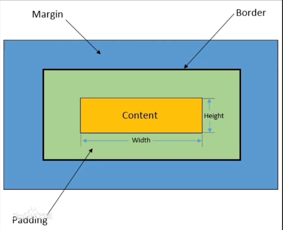
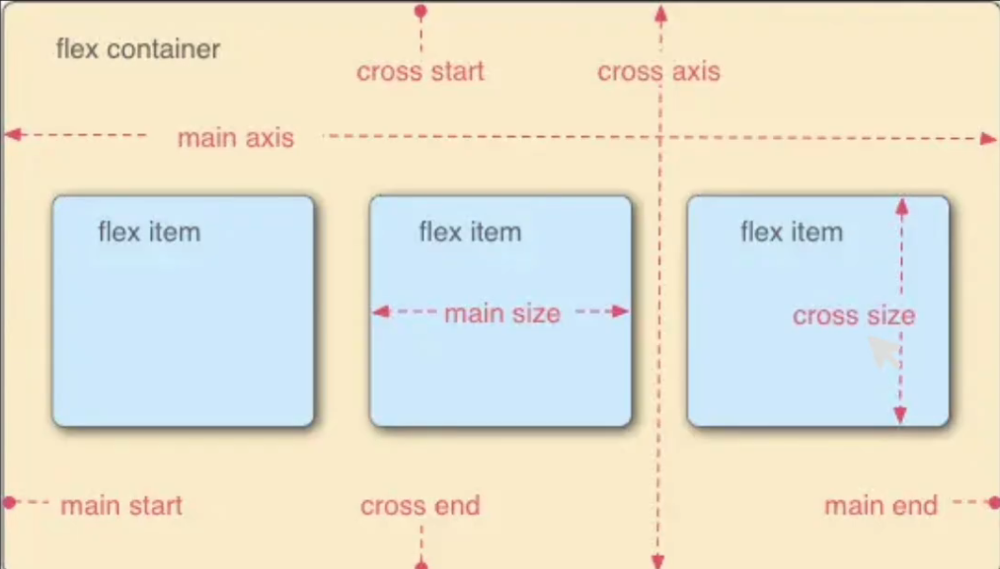

# CSS

## 1. CSS 简介

什么是 CSS？

CSS 全名是 `Cascading Style Sheets`，中文名 `层叠样式表`。

用于定义网页样式和布局的样式表语言。

通过 CSS，你可以指定页面中各个元素的颜色、字体、大小、间距、边框、背景等样式，从而实现更精确的页面设计。

---

## 2. CSS 语法

> CSS 通常由选择器、属性和属性值组成，多个规则可以组合在一起，以便同时应用多个样式

```css
选择器 {
    属性1: 属性值1;
    属性2: 属性值2;
}
```

1. 选择器的声明中可以写无数条属性
2. 声明的每一行属性，都需要以英文分号结尾
3. 声明中的所有属性和值都是以键值对这种形式出现的

示例：

```css
/*这是一个 p 标签选择器 */
p {
  color: blue;
  font-size: 16px;
}
```

---

## 3. CSS 三种导入方式

> 下面是三种常见的 CSS 导入方式：

1. `内联样式（Inline Styles）`
2. `内部样式表（Internal Stylesheet）`
3. `外部样式表（External Stylesheet）`

三种导入方式的优先级：`内联样式` > `内部样式表` > `外部样式表`

---

### 3.1 CSS导入方式示例

- **HTML文件**

```html
<!DOCTYPE html>
<html lang="en">
<head>
  <meta charset="UTF-8">
  <meta name="viewport" content="width=device-width, initial-scale=1.0">
  <title>CSS导入方式</title>
  <link rel="stylesheet" href="./CSS/style.css">

  <!-- 内部样式表 -->
  <style>
    p {
      color: blue;
      font-size: 20px;
    }
    h2 {
      color: orange;
    }

  </style>

</head>
<body>
  <p>这是一个应用了css样式的文本段落</p>

  <h1 style="color: red;">这是一个一级标题标签,使用了内联样式</h1>
  <h2>这是一个二级标题标签,使用了内部样式</h2>
  <h3>这是一个三级标题,应用外部样式</h3>

</body>
</html>
```

- **CSS文件**

```css
h3 {
  color: chartreuse;
}
```

---

## 4. 选择器

选择器是 CSS中 的关键部分，它允许你针对特定元素或一组元素定义样式

- 元素选择器
- 类选择器
- ID 选择器
- 通用选择器
- 子元素选择器
- 后代选择器（包含选择器）
- 并集选择器（兄弟选择器）
- 伪类选择器

---

### 4.1 选择器示例

```html
<!DOCTYPE html>
<html lang="en">
<head>
  <meta charset="UTF-8">
  <meta name="viewport" content="width=device-width, initial-scale=1.0">
  <title>CSS选择器练习</title>

  <style>
    /* 元素选择器 */
    h2 {
      color: aqua;
    }
    /* 类选择器 */
    .highlight {
      background-color: yellow;
    }
    /* ID选择器 */
    #header {
      color: blue;
    }
    /* 通用选择器 */
    * {
      font-family: "KaiTi";
      font-weight: 600;
    }
    /* 子元素选择器(id > 类 > 标签名) */
    .father > .son {
      color: blueviolet;
    }
    /* 后代选择器(后代包含子代) */ 
    .father p {
      color: brown;
    }
    /* 相邻元素选择器 */
    /* 选择同一级别下紧跟选中元素h3后的第一个p标签 */
    h3 + p {
      color: crimson;
    }
    /* 伪类选择器 */
    #element:hover {
      background-color: blueviolet;
    }

    /* 伪元素选择器
      ::after
      ::before
    */

  </style>

</head>
<body>
  <h1>不同类型的 CSS 选择器</h1>

  <h2>这是一个元素选择器示例</h2>

  <h3 class="highlight">这是一个类选择器示例</h3>

  <h4 id="header">这是一个ID选择器示例</h4>

  <div class="father">
    <!-- (id > 类 > 标签名) -->
    <p class="son">这是一个子元素选择器</p>
    <div>
      <p class="grandson">这是一个后代选择器示例</p>
    </div>
  </div>
  <br><hr>
  
  <p>这是一个普通的 p 标签</p>
  <h3>这是一个相邻兄弟选择器示例</h3>
  <p>这是另一个 p 标签</p> 

  <p id="element">这是一个伪类选择器示例</p>
</body>
</html>
```

---

## 5. CSS常用属性

### 5.1 CSS常用属性示例

```html
<!DOCTYPE html>
<html lang="en">
<head>
  <meta charset="UTF-8">
  <meta name="viewport" content="width=device-width, initial-scale=1.0">
  <title>CSS常用属性练习</title>

  <style>
    .block {
      background-color: aqua;
      width: 150px;
      height: 100px;
    }
    /* 行内元素是无法设置宽和高的 */
    .inline {
      background-color: brown;
    }
    .inline-block {
      width: 200px;
    }
    .div2inline {
      display: inline;
      background-color: blueviolet;
    }
    .span2inline-block {
      display: inline-block;
      background-color: blanchedalmond;
      width: 150px;
      height: 100px;
    }
  </style>

</head>
<body>
  <h1 style="font: bolder 40px 'KaiTi';">这是一个font复合属性示例</h1>
  <p style="line-height: 40px;">这是一段长文本这是一段长文本这是一段长文本这是一段长文本这是一段长文本这是一段长文本这是一段长文本这是一段长文本这是一段长文本这是一段长文本这是一段长文本这是一段长文本这是一段长文本这是一段长文本</p>

  <div class="block">这是一个块级元素</div>
  <span class="inline">这是一个行内元素</span><br>
  

  <h2>display</h2>

  <div class="div2inline">这是一个被转换为行内元素的div标签</div>

  <span class="span2inline-block">这是一个被转为行内块元素的span标签</span>

</body>
</html>
```

---

## 6. 盒子模型



---

### 6.1 盒子模型相关属性

| 属性名 | 说明 |
| --- | --- |
| `内容（Content）` | 盒子包含的实际内容，比如文本、图片等。 |
| `内边距（Padding）` | 围绕在内容的内部，是内容与边框之间的空间。可以使用 `padding` 属性来设置。 |
| `边框（Border）` | 围绕在内边距的外部，是盒子的边界。可以使用 `border` 属性来设置。 |
| `外边距（Margin）` | 围绕在边框的外部，是盒子与其他元素之间的空间。可以使用 `margin` 属性来设置。 |

---

### 6.2 盒子模型示例

```html
<!DOCTYPE html>
<html lang="en">
<head>
  <meta charset="UTF-8">
  <meta name="viewport" content="width=device-width, initial-scale=1.0">
  <title>CSS盒子模型练习</title>
  <style>
    .demo {
      display: inline-block;
      background-color: aqua;
      border: 5px solid yellowgreen;
      /* 内边距 */
      padding: 50px;
      /* 外边距 */
      margin: 40px;
    }
    .border-demo {
      background-color: yellow;
      width: 300px;
      height: 200px;
      /* border-***仍旧是复合属性,遵循上右下左的顺序 */
      /* solid实线 dashed虚线 dotted点线 double双实线 */
      border-style: solid dashed dotted double;
      border-width: 10px;
      border-color: blueviolet;
      /* 当然了,以上依旧是复合属性 */
      /* border-left: 10px solid yellowgreen; */
      /* border-left也是复合属性... */
    }
  </style>
</head>
<body>
  <div class="demo">呱呱咕咕</div>
  <div class="border-demo">这是一个边框示例</div>
</body>
</html>
```

---

## 7. 传统网页布局方式

> 在学习浮动之前，先了解传统的网页布局方式

网页布局方式有以下五种：

- `标准流（普通流、文档流）`：网页按照元素的书写顺序依次排列
- `浮动`
- `定位`
- `Flexbox` 和 `Grid`（自适应布局）

`标准流` 是由块级元素和行内元素按照默认规定的方式来排列，块级就是占一行，行内元素一行放好多个元素。

---

### 7.1 名词解释

- **浮动（`float`）**：让元素脱离标准流向左或向右移动，使多个块级元素横向并排，常用于多列布局和文字环绕。
- **定位（`position`）**：手动指定元素在页面中的位置，可相对自身原位置、父元素或浏览器窗口摆放，实现精准定位与层叠。
- **Flexbox（弹性布局）**：一维布局，只沿一个方向（行或列）排列子元素，灵活控制对齐、换行和剩余空间的分配。
- **Grid（网格布局）**：二维布局，把容器划分为行和列组成的网格，同时控制横向与纵向排列，适合整体页面的栅格结构。

---

## 8. 浮动

> 元素脱离文档流，根据开发者的意愿漂浮到网页的任意方向。

`浮动` 属性用于创建浮动框，将其移动到一边，直到左边缘或右边缘触及包含块或另一个浮动框的边缘，这样即可使得元素进行浮动。

语法：

```css
选择器 {
    float: left/right/none;
}
```

注意：浮动是相对于父元素浮动，只会在父元素的内部移动

---

### 8.1 浮动的三大特性

> 学习浮动要先了解浮动的三大特性：

- 脱标：脱离标准流。
- 一行显示，顶部对齐
- 具备行内块元素特性

---

### 8.2 浮动示例

```html
<!DOCTYPE html>
<html lang="en">
<head>
  <meta charset="UTF-8">
  <meta name="viewport" content="width=device-width, initial-scale=1.0">
  <title>CSS浮动练习</title>
  <style>
    .father {
      background-color: aqua;
      /* height: 150px; */
      border: 3px solid brown;
      /* 如果没有设置高度会出现浮动的坍塌,可以下面方法处理 */
      overflow: hidden;
    }
    .left-son {
      width: 100px;
      height: 100px;
      background-color: yellowgreen;
      float: left;
    }
    .right-son {
      width: 100px;
      height: 100px;
      background-color: yellow;
      float: right;
    }
  </style>
</head>
<body>
  <div class="father">
    <div class="left-son">左浮动</div>
    <div class="right-son">右浮动</div>
  </div>
  <p>这是一段文本这是一段文本这是一段文本这是一段文本这是一段文本</p>
</body>
</html>
```

---

## 9. 定位

定位布局可以精准定位，但缺乏灵活性

定位方式：

- `相对定位`：相对于元素在文档流中的正常位置进行定位。
- `绝对定位`：相对于其最近的已定位祖先元素进行定位，不占据文档流。
- `固定定位`：相对于浏览器窗口进行定位。不占据文档流，固定在屏幕上的位置，不随滚动而移动。

---

### 9.1 定位示例

```html
<!DOCTYPE html>
<html lang="en">
<head>
  <meta charset="UTF-8">
  <meta name="viewport" content="width=device-width, initial-scale=1.0">
  <title>定位</title>
  <style>
    .box1 {
      height: 300px;
      background-color: aqua;
      margin-bottom: 200px;
    }
    .box-normal {
      width: 100px;
      height: 100px;
      background-color: purple;
    }
    .box-relative {
      width: 100px;
      height: 100px;
      background-color: pink;
      position: relative;
      /* 左边距100px, 向右移动100px */
      left: 100px;
      /* 上边距50px, 向下移动50px */
      top: 50px;
    }
    .box2 {
      height: 300px;
      background-color: yellow;
      margin-bottom: 200px;
    }
    .box-absolute {
      width: 100px;
      height: 100px;
      background-color: brown;
      position: absolute;
      left: 50px;
    }
    .box-fixed {
      width: 100px;
      height: 100px;
      background-color: coral;
      position: fixed;
      right: 200px;
      top: 500px;
    }
  </style>

</head>
<body>
  <h1>相对定位</h1>
  <div class="box1">
    <div class="box-normal"></div>
    <div class="box-relative"></div>
    <div class="box-normal"></div>
  </div>
  <h1>绝对定位</h1>
  <div class="box2">
    <div class="box-normal"></div>
    <div class="box-absolute"></div>
    <div class="box-normal"></div>
  </div>
  <h1>固定定位</h1>
  <div class="box-fixed"></div>
</body>
</html>
```

---

## 10. 响应式布局实现方法

> 主流的实现方案有两种：

1. 通过 `rem`、`vw/vh` 等单位，实现在不同设备上显示相同比例进而实现适配。
2. 响应式布局，通过媒体查询 `@media` 实现一套 HTML 配合多套 CSS 实现适配；

---

### 10.1 Viewport

> 了解 VSCode 中自动生成的 head 标签中的 `viewport`。

`viewport` 可以翻译为 `视区` 或者 `视口`。是指浏览器用来显示网页的区域，它决定了网页在用户设备上的显示效果。

```html
<meta name="viewport" content="width=device-width, initial-scale=1.0,
            minimum-scale=1.0, maximum-scale=1.0, user-scalable=no">
```

1. `width=device-width`：将视口的宽度设置为设备的宽度。这确保网页内容不会被缩放，而是按照设备的实际宽度进行布局；
2. `initial-scale=1.0`：设置初始的缩放级别为 1.0。这也有助于确保网页在加载时以原始大小显示，而不是被缩小或放大；
3. `minimum-scale=1.0`：最小缩放比例为 1；
4. `maximum-scale=1.0`：最大缩放比例为 1；
5. `user-scalable=no`：不允许用户缩放。

---

### 10.2 rem

> 在响应式网页与移动端布局时，使用 rem 而不是 px

`rem` 是一个倍数单位，它是基于 html 标签中的 `font-size` 属性值的倍数。

只要我们在不同的设备上设置一个合适的初始值，当设备发生变化 `font-size` 就会自动等比适配大小，从而在不同的设备上表现统一。

### 10.3 移动端rem适配示例

```html
<!DOCTYPE html>
<html lang="en">
<head>
  <meta charset="UTF-8">
  <meta name="viewport" content="width=device-width, initial-scale=1.0">
  <title>移动端rem适配原理</title>
  <style>
    /* html {
      font-size: 20px;
    } */
    .box-px {
      width: 300px;
      height: 100px;
      background-color: blueviolet;
    }
    .box-rem {
      width: 5rem;
      height: 5rem;
      background-color: aqua;
    }
  </style>
</head>
<body>
  <div class="box-px"></div>
  <div class="box-rem"></div>
  <script>
    // 根据设备屏幕宽度计算 HTML 标签的 font-size 的属性值, 宽度 / 10
    function reset_fontsize() {
      document.documentElement.style.fontSize = screen.width / 10 + 'px';
    }
    // 初始化
    reset_fontsize();
    // 监测到屏幕变化重设font-size
    window.onresize = reset_fontsize;
  </script>
</body>
</html>
```

---

## 11. Flex 盒子模型

> 采用 Flex 布局的元素，称为 Flex 容器（flex container）。它的所有子元素自动成为容器成员，称为 Flex 项目（flex item），



---

### 11.1 Flex 容器属性

> Flex 容器可以设置以下 6 个属性：

- `flex-direction`；
- `flex-wrap`；
- `flex-flow`：`flex-direction` 属性和 `flex-wrap` 属性的简写形式；
- `justify-content`；
- `align-items`；
- `align-content`：多轴线对齐方式。

---

#### 11.1.2 flex-direction

> 决定主轴的方向（即项目的排列方向）

| 属性值 | 作用 |
| --- | --- |
| `row`（默认值） | 主轴为水平方向，起点在左端（项目从左往右排列） |
| `row-reverse` | 主轴为水平方向，起点在右端（项目从右往左排列） |
| `column` | 主轴为垂直方向，起点在上沿（项目从上往下排列） |
| `column-reverse` | 主轴为垂直方向，起点在下沿（项目从下往上排列） |

---

#### 11.1.3 flex-wrap

> 默认情况下，项目都排列在一条轴线上，如果一条轴线排不下的换行方式，

| 属性值 | 作用 |
| --- | --- |
| `nowrap`（默认） | 不换行（列） |
| `wrap` | 主轴为横向时：从上到下换行；主轴为纵向时：从左到右换列 |
| `wrap-reverse` | 主轴为横向时：从下到上换行；主轴为纵向时：从右到左换列 |

---

#### 11.1.4 justify-content

> 定义了项目在主轴上的对齐方式，

| 属性值 | 作用 |
| --- | --- |
| `flex-start`（默认） | 与主轴的起点对齐 |
| `flex-end` | 与主轴的终点对齐 |
| `center` | 与主轴的中点对齐 |
| `space-between` | 两端对齐主轴的起点与终点，项目之间的间隔都相等 |
| `space-around` | 每个项目两侧的间隔相等。项目之间的间隔比项目与边框的间隔大一倍 |

---

#### 11.1.5 align-items

> 定义项目在交叉轴上如何对齐。

| 属性值 | 作用 |
| --- | --- |
| `flex-start` | 交叉轴的起点对齐 |
| `flex-end` | 交叉轴的终点对齐 |
| `center` | 交叉轴的中点对齐 |
| `baseline` | 项目的第一行文字的基线对齐 |
| `stretch`（默认值） | 如果项目未设置高度或设为 auto，项目将占满整个容器的高度 |

---

#### 11.1.6 align-content

> 定义了多根轴线的对齐方式。如果项目只有一根轴线，该属性不起作用。

| 属性值 | 作用 |
| --- | --- |
| `flex-start` | 与交叉轴的起点对齐 |
| `flex-end` | 与交叉轴的终点对齐 |
| `center` | 与交叉轴的中点对齐 |
| `space-between` | 与交叉轴两端对齐，轴线之间的间隔平均分布 |
| `space-around` | 每根轴线两侧的间隔都相等，轴线之间的间隔比轴线与边框的间隔大一倍 |
| `stretch`（默认值） | 主轴线占满整个交叉轴 |

---

### 11.2 Flex 容器示例

```html
<!DOCTYPE html>
<html lang="en">
<head>
  <meta charset="UTF-8">
  <meta name="viewport" content="width=device-width, initial-scale=1.0">
  <title>Flex弹性盒子</title>

  <style>
    html {
      font-size: 10px;
    }
    .container {
      display: flex;
      height: 40rem;
      background-color: aqua;
      /* flex-direction: row-reverse; */
      flex-wrap: wrap;
      /* justify-content: center; */
      /* align-items: center; */
      align-content: center;
    }
    .item {
      width: 20rem;
      font-size: 8rem;
    }
  </style>
</head>
<body>
  <div class="container">
    <div class="item" style="background-color: blue;">1</div>
    <div class="item" style="background-color: red;">2</div>
    <div class="item" style="background-color: pink;">3</div>
    <div class="item" style="background-color: #245;">4</div>
    <div class="item" style="background-color: #ddd;">5</div>
    <div class="item" style="background-color: #441;">6</div>
  </div>
</body>
</html>
```

---

