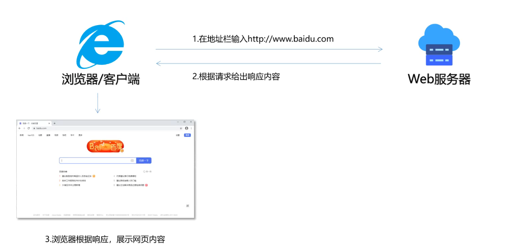
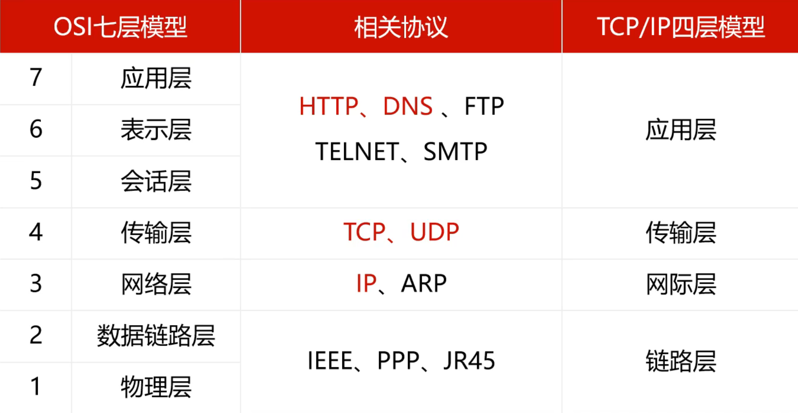
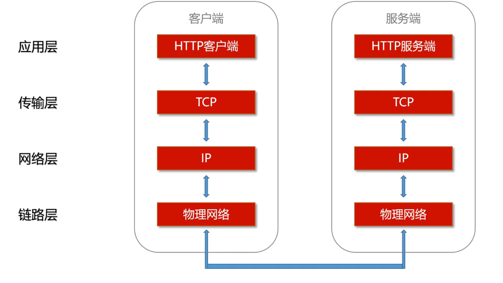
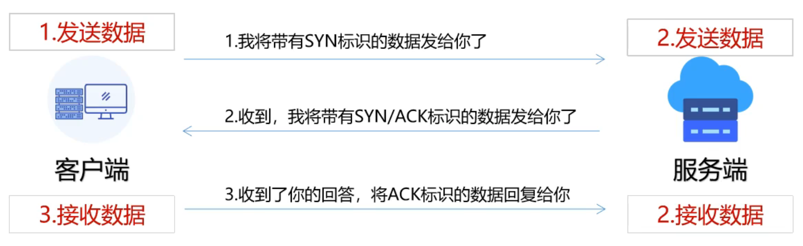
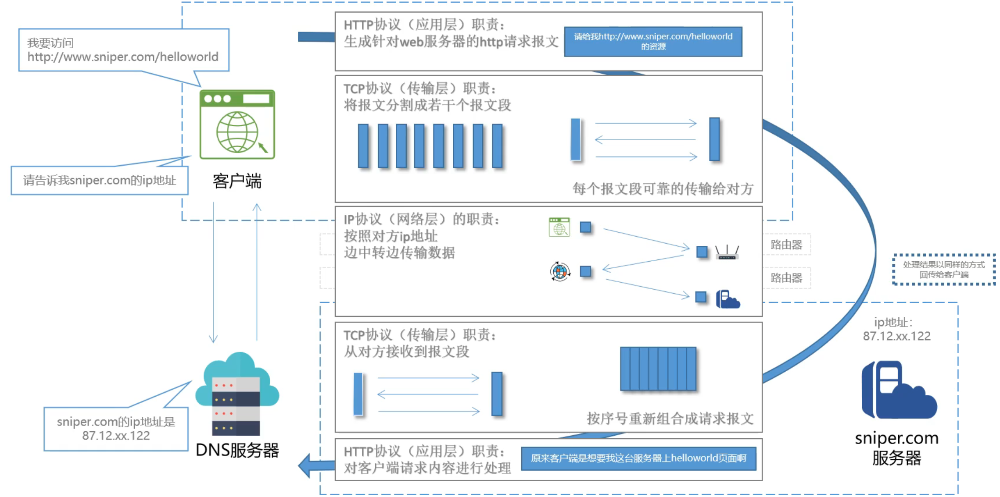
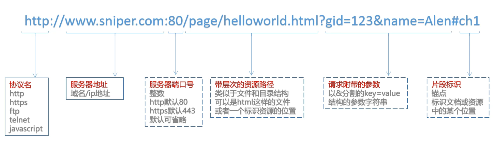
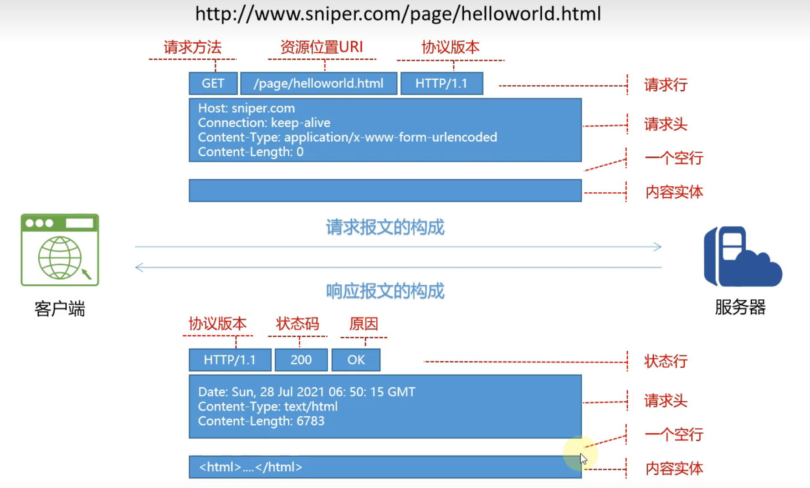
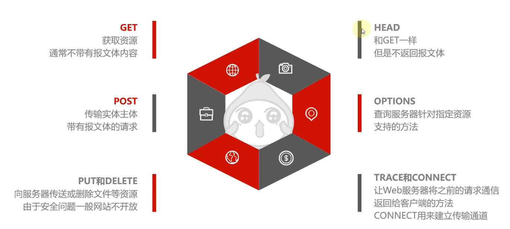
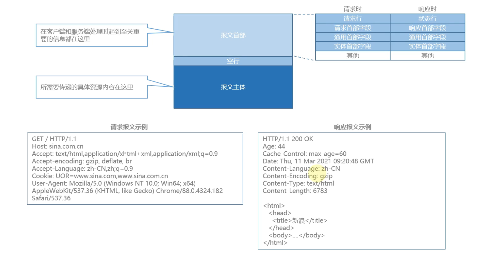

# 1. 了解Web

## 1.1 使用http协议访问Web

- 有客户端和服务端**双方**参与交互
- 客户端发送请求：**request**
- 服务端根据请求给出响应：**response**
- 请求通过**URL**来指定要获取都得资源
- 响应内容可以是**HTML**网页，或者用json表示的**数据**，
  或者其他**二进制**文件内容
- Web使用一种名为**HTTP**的协议作为规范，完成从客户
  端到服务端的一系列运作流程，而协议是指定**规则的约**
  **定**。Web是建立在HTTP协议上的通信。

## 1.2 WWW万维网的诞生

- 诞生于：1989年3月，蒂姆·伯纳斯 - 李 博士的一篇论文，提出了让远隔两地的研究者们共享知识的设想。
- 最初的理念：借助多文档之间的互相关联形成超文本(HyperText),连成可互相参阅的WWW(World Wide Web，万维网)。
- HTTP：HyperText Transfer Protocol，超文本传输协议
- HTML：HyperText Markup Language，超文本标记语言
- URL：Uniform Resource Locator，统一资源定位符

## 1.3 WWW万维网的构成

1. **HTML**：HTML超文本标记语言，是SGML标准通用标记语言的子集，作为文本内容描述的载体。
2. **HTTP**：HTTP超文本传输协议，作为文档传递的协议。让通讯双方能够达成统一的共识，完成数据传输
3. **URL**：URL统一资源定位符，指定远端文档所在位置。

## 1.4 HTTP的发展历程

- **HTTP/0.9**：从90年代初诞生开始，http并没有广泛流行起来，那时候上网的人群还是极少数，并没有形成正式的标准对外发布，所以通常将1.0版本以前的http称作0.9版本，有HTTP/1.0之前版本的意思。
- **HTTP/1.0**：1996年公布的第一个版本，并不是一个标准，更像是资料整理或笔记，记载于RFC1945，初期版本，但是该协议至今仍被广泛使用。
- **HTTP/1.1**：1999年发布的一个正式标准，是对1.0版本的完善和补充，记载于RFC2616，也是目前主流的HTTP协议版本，被广泛使用在各种web服务器和应用上。虽然1.1版本在传输状态、身份识别、数据安全上存在一些不足，但是后来都通过各种手段得到了补充和优化，1.1版本至今已经有20多年的历史，一直被沿用至今，几乎没有较大更新，但是协议本身却被广泛使用，这足见http协议的制订者的高瞻远瞩。
- **HTTP/2.0**：近10年来，以谷歌为首的互联网巨头组成工作组，开始制定HTTP的2.0标准，2004年推出Chrome浏览器，从多路复用、数据加密等多方面改善1.1版本的不足。
- **HTTP/3.0**：已经开始，有可能我们会从1直接进入3.0时代。

## 1.5 当下的HTTP

**以前 VS 现在**

1. **场景**：除了网页，承载更多的互联网应用场景
2. **前端**：不再依赖浏览器，可以是手机app，客户端或者一另个服务器
3. **传输方式**：Ajax的兴起改变了原本的同步请求模式
4. **传输内容**：HTML网页，二进制文件以外也可以依靠Json表示更广泛的内容
5. **数据安全**：HTTP+SSL组成HTTPS协议，同时扩展更多的密码学能力

# 2. HTTP相关的网络协议

## 2.1 网络基础TCP/IP

## 2.2 IP网际协议

- IP(Internet Protocol)协议位于网络层，负责将数据包递给对方。
- 任何一个参与到网络上的设备都会用到**IP协议**，为系统分配对应的**IP地址**。
- IP协议和IP地址不是一回事，IP地址是表明网络中每个设备的标签。
- IP地址需要转换成网卡的物理地址(**MAC地址**)才能真正完成数据通信。实际上网络中数据传输是异常复杂的，没有人能够完全跟踪整个传输过程，网络中大小网络、广域网、城域网、局域网等嵌套，需要路由才能真正传输到目的地。
- IP地址目前分为 **IPV4** 和 **IPV6**两个版本。

## 2.3 确保可靠性的TCP协议(三握四挥)

- TCP位于传输层，提供**可靠**的字节流服务。
- 将大的数据**分割成报文段**，并把数据可靠的传输给对方。
- 为了准确无误的将数据送达，TCP采用**三次握手**策略。

三次握手和四次挥手是 **TCP 传输层协议** 建立连接、断开连接的标准流程。TCP 是面向连接、可靠、全双工的协议，所以建立连接需要双方确认都就绪，断开连接需要双方各自关闭自己的发送通道。

先明确几个核心标志位：

- `SYN`（同步）：请求建立连接时携带
- `ACK`（确认）：确认收到对方的报文
- `FIN`（结束）：请求关闭连接时携带
- `seq`：己方的报文序列号
- `ack`：期望收到对方下一个报文的序列号

------

### **三次握手：建立 TCP 连接**

客户端主动发起连接，服务器被动监听端口，总共 3 次报文交互，完成后双方进入 `ESTABLISHED`（已连接）状态，可以开始传输数据。

**分步过程**

1. **第一次握手：客户端 → 服务器**
   - 客户端发送 `SYN` 报文，`seq = x`（随机生成的初始序列号）
   - 客户端状态：`CLOSED` → `SYN_SENT`（同步已发送）
   - 语义：我想和你建立连接，我的初始序列号是 x。
2. **第二次握手：服务器 → 客户端**
   - 服务器收到 SYN 后，回复 **SYN + ACK** 合并报文
     - `ack = x + 1`：确认收到客户端的序列号，下一个期望收到 x+1
     - `seq = y`：服务器自己的初始序列号
   - 服务器状态：`LISTEN` → `SYN_RCVD`（同步已收到）
   - 语义：我收到你的连接请求了，同意建立，我的初始序列号是 y。
3. **第三次握手：客户端 → 服务器**
   - 客户端收到 SYN+ACK 后，回复 `ACK` 报文
     - `ack = y + 1`
     - `seq = x + 1`
   - 客户端状态：`SYN_SENT` → `ESTABLISHED`
   - 服务器收到这个 ACK 后，状态：`SYN_RCVD` → `ESTABLISHED`
   - 语义：我也收到你的确认了，连接正式建立，可以传数据了。

**为什么是三次，不是两次？**

核心目的：**防止历史失效的连接请求到达服务器，造成服务器资源浪费**。 如果只有两次握手，服务器收到 SYN 就直接建立连接。如果客户端一个迟到的旧 SYN 请求到达服务器，服务器会误以为是新连接，直接建立并等待客户端发数据，但客户端根本没打算建立连接，服务器就会一直挂着空连接浪费资源。 三次握手中，客户端会忽略旧请求的确认，不回复第三次握手，服务器收不到确认就不会建立连接。

------

### **四次挥手：断开 TCP 连接**

TCP 是全双工协议，发送和接收是两条独立通道，**双方都要主动关闭自己的发送通道**，每个方向的关闭都需要 FIN + ACK，因此总共 4 次交互。 通常由客户端主动发起关闭，服务器被动响应。

**分步过程**

1. **第一次挥手：客户端 → 服务器**
   - 客户端发送 `FIN` 报文，`seq = u`
   - 客户端状态：`ESTABLISHED` → `FIN_WAIT_1`
   - 语义：我数据发完了，要关闭我的发送通道了。
2. **第二次挥手：服务器 → 客户端**
   - 服务器收到 FIN 后，回复 `ACK` 报文，`ack = u + 1`
   - 服务器状态：`ESTABLISHED` → `CLOSE_WAIT`（关闭等待）
   - 客户端收到 ACK 后，状态：`FIN_WAIT_1` → `FIN_WAIT_2`
   - 语义：我收到你的关闭请求了，但我这边还有数据没发完，你先等我。
3. **第三次挥手：服务器 → 客户端**
   - 服务器数据全部发完后，发送 `FIN` 报文，`seq = v`
   - 服务器状态：`CLOSE_WAIT` → `LAST_ACK`（最后确认）
   - 语义：我也发完数据了，我也要关闭发送通道了。
4. **第四次挥手：客户端 → 服务器**
   - 客户端收到 FIN 后，回复 `ACK` 报文，`ack = v + 1`
   - 客户端状态：`FIN_WAIT_2` → `TIME_WAIT`
   - 服务器收到这个 ACK 后，状态：`LAST_ACK` → `CLOSED`，服务器端连接正式关闭
   - 客户端等待 `2*MSL`（最长报文寿命）后，也进入 `CLOSED` 状态

**为什么是四次，不是三次？**

因为服务器收到客户端的 FIN 时，可能还有数据没传输完成，不能立刻跟着发 FIN，必须先回复 ACK 确认收到关闭请求，等自己的数据全部发完，才能发 FIN 请求关闭自己的方向。 ACK 和 FIN 分开发送，就比连接时多了一步，变成四次。

**为什么要有 TIME_WAIT，等 2MSL？**

MSL 是报文在网络中的最长存活时间。

1. **保证最后一个 ACK 能到达服务器** 如果客户端发完 ACK 直接关闭，万一这个 ACK 丢了，服务器收不到就会重发 FIN，但客户端已经关了，服务器就无法正常关闭。等待 2MSL 的时间里，如果收到服务器重发的 FIN，客户端可以重发 ACK。
2. **防止旧连接的残留报文干扰新连接** 等待 2MSL 可以让本次连接的所有报文都从网络中消失，避免下一个新连接收到上一次连接的残留数据，造成数据混乱。

------

**通俗类比记忆**

- **三次握手（打电话）** 甲：喂，听得到吗？ 乙：听得到，你听得到我吗？ 甲：听得到，开始聊吧。
- **四次挥手（挂电话）** 甲：我说完了，我挂了啊。 乙：好，我知道了，等我再说两句。 乙：我也说完了，我挂了。 甲：好的。（等两秒确认对方挂了再挂）

## 2.4 让IP地址更容易被记住的DNS协议

- DNS(Domain Name System)域名服务，与HTTP一样，位于TCP/IP分层的应用层的协议，它负责提供域名到IP地址的解析服务。
- 域名：`www.baidu.com`, `pic.baidu.com`, `sports.sina.com.cn`
- **根域名**: `com` `cn` `com.cn` `org` `tech` `info` `me`
- **二级域名**：`baidu.com` `sina.com.cn` `qq.com` `163.com` `12306.cn`
- **子域名**：`pic.baidu.com` `sports.sina.com.cn` `news.qq.com`
- 如果要使用域名完成网络通讯，必须先从域名服务器获取域名对应的IP地址。

## 2.5 各协议之间的关系图

## 2.6 HTTP协议安全性的不足

1. **公开**：HTTP是一个公开的协议，任何人都可以随时了解协议的细节，并可以模仿、模拟、伪造HTTP请求获取服务端资源。
2. **明文**：HTTP/1.1协议本身没有加密规则，所以整个报文体都是明文在网络上流转。
3. **网络**：HTTP是为网络数据传输而生的，根本职责就是传输数据，那么网络上任何一个传输节点，包括代理、网管、路由器等，都可以随时知道HTTP传输的内容。

## 2.7 HTTP协议安全性的解决办法

### SSL/TLS安全传输

- SSL(Secure Socket Layer)安全套接层
- TLS(Transport Layer Security)安全传输层协议
- HTTP与SSL或TLS组合使用，建立安全通路
- **SSL + HTTP = HTTPS**
- HTTPS(HTTP Secure)超文本传输安全协议
- SSL通路与TCP一样，为了安全和完整性都牺牲一些效率。

### 加密报文体

- HTTP协议的报文分为：报文头、报文体
- 针对报文体的明文内容，结合密码学相关技术
- 只将报文体的内容进行加密，保证数据安全
- 这种方式需要客户端、服务端单独支持，提高了系统实现的复杂度。
- 而密钥和加密算法可以完全私有化，安全性相对较高

> 实际应用中，已经更多采用2种方式结合，既加密通讯又加密报文体。

# 3. HTTP协议

## 3.1 HTTP是什么？又不是什么？

HyperText Transfer Protocol，超文本传输协议

### HTTP是什么？

1. **协议**：有两个或者多个参与者，定义了交互的约定和规范
2. **传输**：http是一个专门用来在两点之间传输内容的协议，包括请求方和响应方
3. **超文本**：http不仅可以传输文本，还可以传输音频、视频、文件

### HTTP又不是什么？

1. **不是浏览器、不是操作系统：**http只是浏览器等客户端传输数据时使用的规范
2. **不是HTML：**http和html经常一起出现，但是他们不一样，html是超文本的载体，传输的内容
3. **不是编程语言：**http不是java、python这种编程语言，但是可以用语言来模拟http请求

## 3.2 URI和URL

- URI(Uniform Resource Identifier)，统一资源标识符。
- URL(Uniform Resource Locator)，统一资源定位符，也就是网址。

## 3.3 HTTP报文的构成

## 3.4 HTTP协议八大请求方法

**左侧：业务开发高频方法**

**1. GET — 获取资源**

- **核心作用**：从服务器获取数据 / 资源，是最常用的请求方法。
- **特点**：
  - 参数一般拼接在 URL 地址后面，**通常不带请求体（报文主体）**。
  - 语义上是「只读」操作，不应该修改服务器数据，属于安全的请求。
- **常见场景**：打开网页、查询列表、获取商品详情、加载图片等。

**2. POST — 提交实体数据**

- **核心作用**：向服务器提交数据、新增资源，也是最常用的方法之一。
- **特点**：
  - 数据放在**请求体**里传输，不会暴露在 URL 上，能承载的数据量更大。
  - 语义上是「新增 / 提交」操作，会改变服务器的数据状态。
- **常见场景**：登录、提交表单、发布内容、上传文件等。

**3. PUT 和 DELETE — 修改与删除**

- **PUT**：全量更新 / 上传资源，用客户端传的数据覆盖服务器上对应的资源。
- **DELETE**：删除服务器上的指定资源。
- 这两个是 RESTful 接口风格的标准方法，但图中也提到：因为可以直接操作服务器资源，存在安全风险，普通网站一般不会直接开放，大多在后端内部接口规范中使用。

------

**右侧：特殊场景方法**

**1. HEAD — 只获取响应头**

- 逻辑和 GET 完全一致，但服务器**只返回响应头，不返回响应体（实际内容）**。
- 用途：在不下载完整资源的前提下，检查文件是否存在、获取文件大小、校验资源更新时间，节省带宽。

**2. OPTIONS — 查询支持的方法**

- **核心作用**：询问服务器，针对某个资源支持哪些请求方法、是否允许跨域等。
- 最常见场景：浏览器的**跨域预检请求**。发复杂跨域请求前，浏览器会先发一个 OPTIONS 请求探路，确认服务器允许后，才发送真正的业务请求。

**3. TRACE 和 CONNECT**

- **TRACE**：回显请求。服务器会把收到的请求报文原封不动返回给客户端，用来排查链路问题（比如请求有没有被中间代理篡改），因为安全风险，生产环境基本都禁用。
- **CONNECT**：建立 TCP 隧道。最典型的用途是 HTTPS 代理，让代理服务器建立一条到目标的透明通道，后续数据直接在隧道里传输。

------

**一句话总结**

日常前后端开发，99% 的业务场景只用 **GET 和 POST**；RESTful 风格接口会补充 PUT、DELETE；剩下的方法基本都是协议底层、浏览器 / 代理自动使用，业务代码里几乎不会主动调用。

## 3.5 返回结果的HTTP状态码

| | 状态码类型 | 说明 | 常见的码值 |
|---|-----------|------|-----------|
| 1XX | Informational 信息性状态码 | 请求正在处理中 | |
| 2XX | Suecess 成功状态码 | 请求正常处理完毕 | `200`、`204`、`206` |
| 3XX | Redirection 重定向状态码 | 需要进行附加操作以完成请求 | `301`、`302` |
| 4XX | Client Error 客户端错误状态码 | 服务器无法处理请求 | `400`、`403`、`404` |
| 5XX | Server Error 服务端错误状态码 | 服务器处理请求出错 | `500`、`502`、`503` |

- 状态码范围：`001 - 999`
- 可以根据需要定义私有的状态码
- 状态码是http协议中的标准而非强制规则

## 3.6 HTTP协议头部参数

## 3.7 最重要的HTTP首部参数

### 通用首部

| 字段 | 说明 |
|------|------|
| `Cache-Control` | 操作缓存工作机制，`no-cache` |
| `Connection` | 管理持久连接，`Keep-Alive` |
| `Date` | 创建http报文的日期和时间，`Thu, 11 Mar 2021 09:21:44 GMT` |

### 请求首部

| 字段 | 说明 |
|------|------|
| `Host` | 主机名和端口，唯一一个必须的字段 |
| `Accept` | 请求方或代理能处理的媒体类型，`text/html`, `text/json`, `image/jpeg`, `video/mpeg`, `application/octet-stream` |
| `Accept-Charset` | 请求方或代理支持的字符集 |
| `Accept-Language` | 请求方或代理支持的语言 |
| `Accept-encoding` | 请求方或代理支持的编码方式 |
| `User-Agent` | 表达请求方浏览器种类 |
| `Cookie` | 操作Cookie的首部字段 |

### 响应首部

| 字段 | 说明 |
|------|------|
| `Location` | 配合3xx响应码，给出重定向资源地址 |
| `Server` | 服务端http应用程序信息，Tomcat或Apache |
| `X-Frame-Options` | 限制内容在其他网站frame标签下的显示问题，防止点击劫持 |
| `Set-Cookie` | 操作Cookie的首部字段 |

### 实体首部

| 字段 | 说明 |
|------|------|
| `Content-Type` | 描述实体的媒体类型，`text/html`, `text/css`, `image/jpeg`等 |
| `Content-Language` | 实体内容使用的语言 |
| `Content-Encoding` | 实体内容使用的编码方式 |
| `Content-Length` | 实体内容的长度（单位：字节） |
| `Last-Modified` | 资源最后修改时间 |
| `Set-Cookie` | 操作Cookie的首部字段 |

## 3.8 无状态协议和Cookie_Session_Token

### 一、核心背景：HTTP 是无状态协议

**1. 什么叫「无状态」**

HTTP 协议本身**不会记录请求的上下文信息**，服务器对每一次请求都视为「完全独立的陌生人」。

- 你第 1 次请求登录，第 2 次请求查询店铺信息，服务器天然不知道这两次请求来自同一个用户。
- 协议层面没有任何机制保存「你是谁、你之前做过什么」。

**2. 为什么设计成无状态**

早期 HTTP 只用来看静态网页，不需要状态。无状态的好处是：

- 服务器结构简单，不用额外存储会话数据，压力小
- 水平扩容方便，随便哪台服务器都能处理请求，不用同步状态

**3. 带来的问题**

当出现登录、购物车、个性化推荐这类**需要记住用户身份**的场景时，纯 HTTP 无状态就不够用了。 于是就衍生出了三套主流方案，在**应用层给 HTTP 附加上状态**：Cookie、Session、Token。

------

### 二、Cookie：客户端存储方案

**是什么**

Cookie 是**浏览器保存在本地的一小段文本数据**（大小约 4KB 限制），由服务器通过响应头 `Set-Cookie` 下发，浏览器会自动保存。 之后同域名下的所有请求，浏览器都会自动把 Cookie 放在请求头里带给服务器。

**完整流程**

1. 浏览器第一次请求服务器
2. 服务器返回响应，响应头里加 `Set-Cookie: userId=123; expires=xxx`
3. 浏览器把这段键值对存在本地
4. 后续所有同域名请求，浏览器自动在请求头带上 `Cookie: userId=123`
5. 服务器读取 Cookie，就知道是哪个用户了

**特点**

- **存储位置**：客户端（浏览器）
- **优点**：实现简单，服务器不用存，减轻服务端压力
- **缺点**：
  - 不安全：存在本地，容易被窃取、篡改（XSS 攻击可以偷 Cookie）
  - 容量小：单条最大 4KB，一个域名最多几十条
  - 只能存字符串，且默认会随着请求自动发送

> Cookie 只是一个「存储 + 自动携带」的载体，它本身不负责身份验证逻辑，只是传数据的工具。

------

### 三、Session：服务端会话方案

Session 是为了解决 Cookie 不安全的问题诞生的，**核心思路：状态存在服务器，客户端只拿一个标识**。

**是什么**

Session 是**服务器端存储的用户会话数据**，每个会话对应一个唯一的 `sessionId`，把这个 id 发给客户端，客户端下次只传 id 就行。

**完整流程**

1. 用户输入账号密码登录
2. 服务器校验通过后，生成一个 `session` 对象，里面存用户信息（id、昵称、权限等）
3. 生成一个唯一的 `sessionId`，通过 `Set-Cookie` 把 sessionId 发给浏览器
4. 浏览器存下 sessionId（存在 Cookie 里）
5. 后续请求自动带 sessionId
6. 服务器拿到 sessionId，去内存 / 数据库里查到对应的 session，就认出用户了

**特点**

- **存储位置**：服务端（内存、Redis、数据库）
- **优点**：
  - 相对安全，用户信息不会泄露到客户端
  - 可以主动作废会话（比如用户登出，直接删除服务端 session）
- **缺点**：
  - 服务端有存储压力，用户量大会占用大量内存
  - **分布式集群场景麻烦**：用户第一次请求到 A 服务器，session 存在 A；第二次请求到 B 服务器，B 找不到 session，就会认不出用户。
    - 解决方案：session 共享（统一存 Redis）、粘性会话（同一个用户固定路由到同一台服务器）

> 注意：Session 本身不依赖 Cookie，但绝大多数场景下，sessionId 都是通过 Cookie 来传输的。Cookie 是载体，Session 是方案。

------

### 四、Token：令牌认证方案

Token 是现在前后端分离、分布式项目的主流方案，最典型的就是 JWT（JSON Web Token）。 **核心思路：服务器不存状态，所有用户信息都加密 / 签名后塞到令牌里，客户端自己存，每次带过来，服务器校验就行。**

**是什么**

登录成功后，服务器生成一段**带签名的字符串令牌**，里面包含用户身份、过期时间等信息，发给客户端。客户端自己保存，每次请求放在请求头里。

**完整流程（以 JWT 为例）**

1. 用户提交账号密码登录
2. 服务器校验通过，用密钥生成 JWT Token（包含用户 id、权限、过期时间，加上签名防篡改）
3. 把 Token 返回给前端
4. 前端自己存在 localStorage / Cookie 里
5. 后续请求，前端手动放在请求头里：`Authorization: Bearer <token>`
6. 服务器收到 Token，校验签名是否合法、是否过期，解析出用户信息，完成身份识别

**特点**

- **存储位置**：客户端自己存
- **优点**：
  - **服务端无状态**：服务器不用存会话，只需要校验签名，水平扩容极其方便，加多少台服务器都可以
  - 支持跨域：不依赖 Cookie，移动端、小程序都能用
  - 避免 CSRF 攻击：不自动随请求发送
- **缺点**：
  - 一旦签发，默认无法主动作废，用户登出需要额外做黑名单机制
  - Token 体积比 sessionId 大，每次请求都要传输
  - 敏感信息不能放里面：JWT 主体只是 Base64 编码，不是加密，任何人拿到都能解码看内容，签名只是防篡改

------

### 五、三者对比总结

| 方案    | 存储位置 | 安全性             | 分布式支持         | 适用场景                                      |
| ------- | -------- | ------------------ | ------------------ | --------------------------------------------- |
| Cookie  | 客户端   | 低，易篡改窃取     | 好                 | 存非敏感的简单数据，比如主题偏好、语言设置    |
| Session | 服务端   | 较高               | 差，需要额外做共享 | 传统单体项目、管理后台、对安全要求高的系统    |
| Token   | 客户端   | 中，防篡改不防窃取 | 极好，天然无状态   | 前后端分离项目、移动端 / 小程序、分布式微服务 |

**一句话理清关系**

- HTTP 本身是无状态的；
- Cookie 是客户端存储 + 自动携带的工具；
- Session 是服务端会话方案，依赖 Cookie 传 sessionId；
- Token 是无状态令牌方案，不依赖 Cookie，适合分布式场景。
