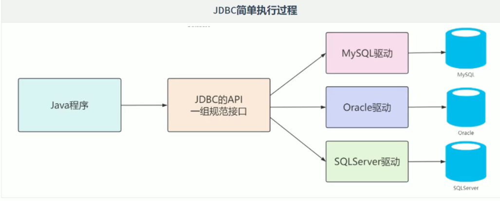
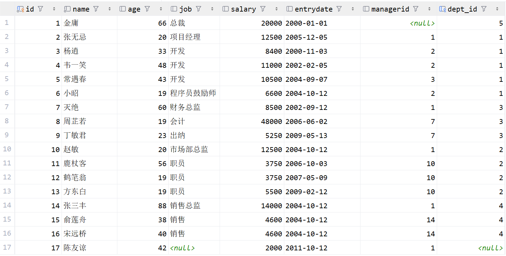
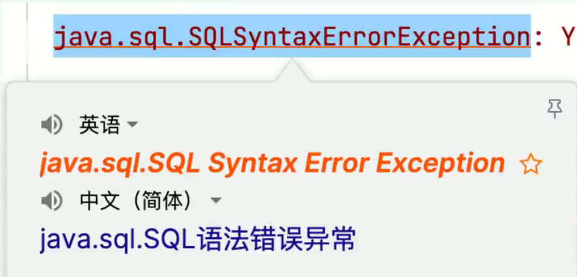
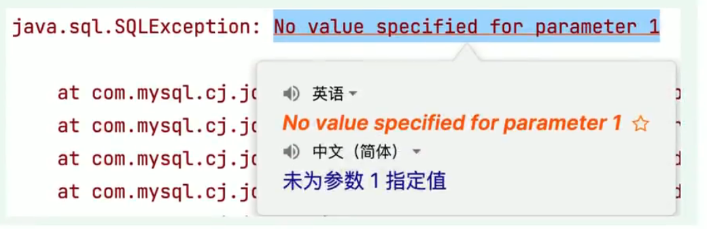
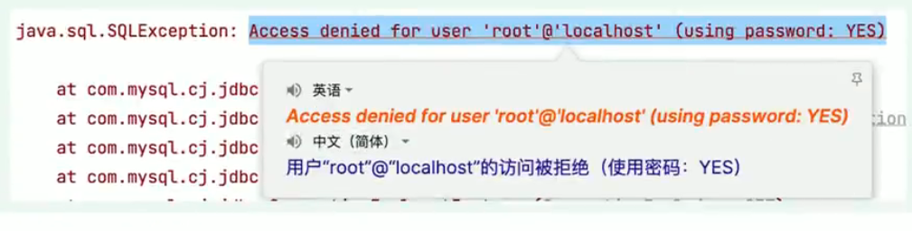
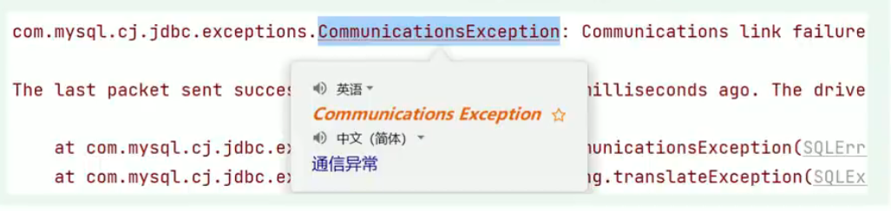

# JDBC基础篇

# 1. JDBC

## 1.1 JDBC的概念

- JDBC：Java Database Connectivity，意为Java数据库连接。
- JDBC是Java提供的一组独立于任何数据库管理系统的API。
- Java提供接口规范，由各个数据库厂商提供接口的实现，厂商提供的实现类封装成jar文件，也就是我们俗称的数据库驱动jar包。
- 学习JDBC，充分体现了面向接口编程的好处，程序员只关心标准和规范，而无需关注实现过程。



## 1.2 JDBC的核心组成

- 接口规范：
  - 为了项目代码的可移植性，可维护性，SUN公司从最初就制定了Java程序连接各种数据库的统一接口规范。这样的话，不管是连接哪一种DBMS软件，Java代码可以保持一致性。
  - 接口存储在java.sql和javax.sql包下。
- 实现规范：
  - 因为各个数据库厂商的DBMS软件各有不同，那么各自的内部如何通过SQL实现增、删、改、查等操作管理数据，只有这个数据库厂商自己更清楚，因此把接口规范的实现交给各个数据库厂商自己实现。
  - 厂商将实现内容和过程封装成jar文件，我们程序员只需要将jar文件引入到项目中集成即可，就可以开发调用实现过程操作数据库了。

## 1.3 JDBC快速入门代码

> 记得先导入依赖

```xml
<!-- Source: https://mvnrepository.com/artifact/com.mysql/mysql-connector-j -->
<dependency>
    <groupId>com.mysql</groupId>
    <artifactId>mysql-connector-j</artifactId>
    <version>9.7.0</version>
    <scope>compile</scope>
</dependency>
```

**示例代码:**

```java
import java.sql.Connection;
import java.sql.DriverManager;
import java.sql.ResultSet;
import java.sql.Statement;

public class JDBCQuick {
    public static void main(String[] args) throws Exception {
        // 1. 注册驱动
        Class.forName("com.mysql.cj.jdbc.Driver");
        // 2. 获取连接
        String url = "jdbc:mysql://localhost:3306/db_study_sql";
        String username = "root";
        String password = "123456";
        Connection connection = DriverManager.getConnection(url, username, password);
        // 3. 获取执行sql的对象
        Statement statement = connection.createStatement();
        // 4. 执行sql
        String sql = "select id, name, age, job from emp";
        ResultSet resultSet = statement.executeQuery(sql);
        // 5. 处理结果
        while (resultSet.next()) {
            int id = resultSet.getInt("id");
            String name = resultSet.getString("name");
            int age = resultSet.getInt("age");
            String job = resultSet.getString("job");
            System.out.println(id + "\t" + name + "\t" + age + "\t" + job);
        }
        resultSet.close();
        statement.close();
        connection.close();
    }
}

```

---

# 2. 核心API理解

## 2.1 注册驱动

- `Class.forName("com.mysql.cj.jdbc.Driver");`

- 在 Java 中，当使用 **JDBC（Java Database Connectivity）**连接数据库时，需要加载数据库特定的驱动程序，以便与数据库进行通信。加载驱动程序的目的是为了注册驱动程序，使得 **JDBC API** 能够识别并与特定的数据库进行交互。

- 从**JDK6**开始，不再需要显式地调用` Class.forName() `来加载 JDBC 驱动程序，只要在类路径中集成了对应的jar文件，会自动在初始化时注册驱动程序。

```java
// Class.forName("com.mysql.cj.jdbc.Driver");
```

> 也就是说这行代码注释后, 一样可以运行, 写出这行代码只是为了帮助更好理解 JDBC 的步骤

## 2.2 Connection

- `Connection`接口是**JDBC API**的重要接口，用于建立与数据库的通信通道。换而言之，`Connection`对象不为空，则代表一次数据库连接。

- 在建立连接时，需要指定数据库URL、用户名、密码参数。
  - **URL:** `jdbc:mysql://localhost:3306/db_study_sql`
    - `jdbc:mysql://IP地址:端口号/数据库名称?参数键值对1&参数键值对2`

- `Connection` 接口还负责管理事务，`Connection` 接口提供了 `commit`和 `rollback` 方法，用于提交事务和回滚事务。

- 可以创建 `Statement` 对象，用于执行 SQL 语句并与数据库进行交互。

- 在使用JDBC技术时，必须要先获取`Connection`对象，在使用完毕后，要释放资源，避免资源占用浪费及泄漏。

## 2.3 Statement

- `Statement` 接口用于执行 SQL 语句并与数据库进行交互。它是 JDBC API 中的一个重要接口。通过 `Statement` 对象，可以向数据库发送 SQL 语句并获取执行结果。

- 结果可以是一个或多个结果。
  - 增删改：受影响行数单个结果。
  - 查询：单行单列、多行多列、单行多列等结果。

- 但是 `Statement` 接口在执行SQL语句时，会产生 `SQL注入攻击问题`：
  - 当使用 `Statement` 执行动态构建的 SQL 查询时，往往需要将查询条件与 SQL 语句拼接在一起，直接将参数和SQL语句一并生成，让 SQL 的查询条件始终为 true 得到结果。

## 2.4 PreparedStatement

- `PreparedStatement` 是 `Statement` 接口的子接口，用于执行 预编译 的 SQL 查询，作用如下：
  - 预编译SQL语句：在创建PreparedStatement时，就会预编译SQL语句，也就是SQL语句已经固定。
  - 防止SQL注入：`PreparedStatement` 支持参数化查询，将数据作为参数传递到SQL语句中，采用 ? 占位符的方式，将传入的参数用一对单引号包裹起来 "，无论传递什么都作为值。有效防止传入关键字或值导致SQL注入问题。
  - 性能提升：`PreparedStatement`是预编译SQL语句，同一SQL语句多次执行的情况下，可以复用，不必每次重新编译和解析。

- 后续都是基于 `PreparedStatement` 进行实现，更安全、效率更高！

**示例代码:**

```java
public class JDBCQuick {
    public static void main(String[] args) throws Exception {
        // 1. 注册驱动
        // Class.forName("com.mysql.cj.jdbc.Driver");
        // 2. 获取连接
        String url = "jdbc:mysql://localhost:3306/db_study_sql";
        String username = "root";
        String password = "123456";
        Connection connection = DriverManager.getConnection(url, username, password);
        
        // 主要变化在这里
        // 3. 获取执行sql的对象
        PreparedStatement preparedStatement = connection.prepareStatement("select id, name, age, job from emp where name = ?");
        // 4.  给?占位符赋值, 执行sql
        preparedStatement.setString(1, "金庸");
        ResultSet resultSet = preparedStatement.executeQuery();
        
        
        // 5. 处理结果
        while (resultSet.next()) {
            int id = resultSet.getInt("id");
            String name = resultSet.getString("name");
            int age = resultSet.getInt("age");
            String job = resultSet.getString("job");
            System.out.println(id + "\t" + name + "\t" + age + "\t" + job);
        }
        resultSet.close();
        // 释放对应资源
        preparedStatement.close();
        connection.close();
    }
}
```

## 2.5 ResultSet

- **`ResultSet`** 是 JDBC API 中的一个接口，用于表示从数据库中 **`执行查询语句所返回的结果集`** 。它提供了一种用于遍历和访问查询结果的方式。

- 遍历结果：`ResultSet`可以使用 **`next()`** 方法将游标移动到结果集的下一行，逐行遍历数据库查询的结果，返回值为 boolean 类型，true 代表有下一行结果，false 则代表没有。

- 获取单列结果：可以通过 getXxx 的方法获取单列的数据，该方法为重载方法，支持索引和列名进行获取。

---

# 3. 基于PreparedStatement实现CRUD

> 这里先给出表用来当作测试样例



## 3.1 查询单行单列

**示例代码:**

```java
@Test
public void testQuerySingleRowAndCol() throws Exception{
    // 1. 注册驱动(可省略)
    // 2. 获取连接
    String url = "jdbc:mysql://localhost:3306/db_study_sql";
    String username = "root";
    String password = "123456";
    Connection connection = DriverManager.getConnection(url, username, password);
    // 3. 预编译sql语句, 获得preparedStatement对象
    String sql = "select count(id) as 数据条数 from emp";
    PreparedStatement preparedStatement = connection.prepareStatement(sql);
    // 4. 执行sql语句
    ResultSet resultSet = preparedStatement.executeQuery();
    // 5. 处理结果
    while(resultSet.next()) {
        int count = resultSet.getInt("数据条数");
        System.out.println("数据条数 = " + count);
    }
    // 6. 释放资源
    resultSet.close();
    preparedStatement.close();
    connection.close();
}
```

> 后面的查询单行多列和查询多行多列大多相同, 懒得写了

## 3.2 新增

**示例代码:**

```java
@Test
public void testInsert() throws Exception{
    // 1. 注册驱动(可省略)
    // 2. 获取连接
    String url = "jdbc:mysql://localhost:3306/db_study_sql";
    String username = "root";
    String password = "123456";
    Connection connection = DriverManager.getConnection(url, username, password);
    // 3. 获取执行sql的对象
    String sql = "INSERT INTO emp (name, job, salary, managerid) VALUES (?, ?, ?, ?)";
    PreparedStatement preparedStatement = connection.prepareStatement(sql);
    // 4. 给?赋值, 执行语句
    preparedStatement.setString(1, "张三");
    preparedStatement.setString(2, "程序员");
    preparedStatement.setDouble(3, 5000);
    preparedStatement.setInt(4, 1);
    // 5. 根据结果返回成功或者失败
    int count = preparedStatement.executeUpdate();
    System.out.println(count > 0 ? "插入成功" : "插入失败");
    // 6. 释放资源
    preparedStatement.close();
    connection.close();
}
```

## 3.3 修改

**示例代码:**

```Java
@Test
public void testUpdate() throws Exception{
    // 1. 注册驱动(可省略)
    // 2. 获取连接
    String url = "jdbc:mysql://localhost:3306/db_study_sql";
    String username = "root";
    String password = "123456";
    Connection connection = DriverManager.getConnection(url, username, password);
    // 3. 获取执行sql的对象
    String sql = "update emp set job = ? , salary = ? where id = ?";
    PreparedStatement preparedStatement = connection.prepareStatement(sql);
    // 4. 给?赋值, 执行语句
    preparedStatement.setString(1, "程序员");
    preparedStatement.setDouble(2, 5000);
    preparedStatement.setInt(3, 17);
    // 5. 根据结果返回成功或者失败
    int count = preparedStatement.executeUpdate();
    System.out.println(count > 0 ? "更新成功" : "更新失败");
    // 6. 释放资源
    preparedStatement.close();
    connection.close();
}
```

## 3.4 删除

**示例代码:**

```java
@Test
public void testDelete() throws Exception{
    // 1. 注册驱动(可省略)
    // 2. 获取连接
    String url = "jdbc:mysql://localhost:3306/db_study_sql";
    String username = "root";
    String password = "123456";
    Connection connection = DriverManager.getConnection(url, username, password);
    // 3. 获取执行sql的对象
    String sql = "delete from emp where id = ?";
    PreparedStatement preparedStatement = connection.prepareStatement(sql);
    // 4. 给?赋值, 执行语句
    preparedStatement.setInt(1, 18);
    // 5. 根据结果返回成功或者失败
    int count = preparedStatement.executeUpdate();
    System.out.println(count > 0 ? "删除成功" : "删除失败");
    // 6. 释放资源
    preparedStatement.close();
    connection.close();
}
```

---

# 4. 常见问题

## 4.1 资源的管理

在使用 JDBC 的相关资源时，比如`Connection、PreparedStatement、ResultSet`，使用完毕后，要及时关闭这些资源以 **释放数据库服务器资源** 和 **避免内存泄漏** 是很重要的。

## 4.2 SQL语句问题

`java.sql.SQLSyntaxErrorException: SQL`语句错误异常，一般有几种可能：

1. SQL语句有错误，检查SQL语句！建议SQL语句在SQL工具中测试后再复制到Java程序中！
2. 连接数据库的URL中，数据库名称编写错误，也会报该异常！



## 4.3 SQL语句未设置参数问题

`java.sql.SQLException: No value specified for parameter 1`

在使用预编译SQL语句时，如果有`?`占位符，要为每一个占位符赋值，否则报该错误！



## 4.4 用户名或密码错误问题

连接数据库时，如果用户名或密码输入错误，也会报`SQLException`，容易混淆！所以一定要看清楚异常后面的原因描述



## 4.5 通信异常

在连接数据库的URL中，如果IP或端口写错了，会报如下异常：

`com.mysql.cj.jdbc.exceptions.CommunicationsException: Communications link failure`



---
