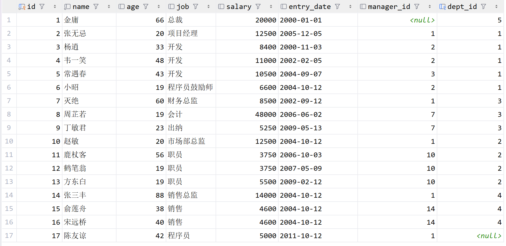

# JDBC进阶篇

# 1. JDBC扩展

## 1.1 实体类和ORM

- 在使用JDBC操作数据库时，我们会发现数据都是零散的，明明在数据库中是一行完整的数据，到了Java中变成了一个一个的变量，不利于维护和管理。而我们Java是面向对象的，一个表对应的是一个类，一行数据就对应的是Java中的一个对象，一个列对应的是对象的属性，所以我们要把数据存储在一个载体里，这个载体就是实体类！

- **ORM（Object Relational Mapping）**思想，**对象到关系数据库的映射**，作用是在编程中，把面向对象的概念跟数据库中表的概念对应起来，以面向对象的角度操作数据库中的数据，即一张表对应一个类，一行数据对应一个对象，一个列对应一个属性！

- 当下JDBC中这种过程我们称其为手动ORM。后续我们也会学习ORM框架，比如MyBatis、JPA等。



> 表结构

```java
@Data
@Builder
public class Employee {
    
    private Integer id;
    
    private String name;
    
    private Integer age;
    
    private String job;
    
    private Double salary;
    
    private Date entryDate;
    
    private Integer managerId;
    
    private Integer deptId;
    
}
```

**封装代码:**

> 此处为了方便, 我引入了lombok的依赖

```java
@Test
public void testORM() throws Exception{
    String url = "jdbc:mysql://localhost:3306/db_study_sql";
    String user = "root";
    String password = "123456";
    Connection connection = DriverManager.getConnection(url, user, password);

    String sql = "select * from emp";
    PreparedStatement preparedStatement = connection.prepareStatement(sql);

    ResultSet resultSet = preparedStatement.executeQuery();

    List<Employee> employees = new ArrayList<>();
    while (resultSet.next()) {
        Employee employee = Employee.builder()
                .id(resultSet.getInt("id"))
                .name(resultSet.getString("name"))
                .age(resultSet.getInt("age"))
                .job(resultSet.getString("job"))
                .salary(resultSet.getDouble("salary"))
                .entryDate(resultSet.getDate("entry_date"))
                .managerId(resultSet.getInt("manager_id"))
                .deptId(resultSet.getInt("dept_id")).build();

        employees.add(employee);
    }
    for (Employee employee : employees) {
        System.out.println(employee);
    }
    // 关闭资源
    resultSet.close();
    preparedStatement.close();
    connection.close();
}
```

## 1.2 主键回显

- 在数据中，执行新增操作时，主键列为自动增长，可以在表中直观的看到，但是在 Java 程序中，我们执行完新增后，只能得到受影响行数，无法得知当前新增数据的主键值。在 Java 程序中获取数据库中插入新数据后的主键值，并赋值给 Java 对象，此操作为主键回显。

- 代码实现：

```java
@Test
public void testReturnPK() throws Exception{
    String url = "jdbc:mysql://localhost:3306/db_study_sql";
    String user = "root";
    String password = "123456";
    Connection connection = DriverManager.getConnection(url, user, password);

    // 预编译sql语句, 返回自增主键
    String sql = "insert into emp (name, age, job) values (?, ?, ?)";
    PreparedStatement preparedStatement = connection.prepareStatement(sql, PreparedStatement.RETURN_GENERATED_KEYS);

    Employee employee = Employee.builder()
            .name("张三")
            .age(18)
            .job("程序员")
            .build();
    preparedStatement.setString(1, employee.getName());
    preparedStatement.setInt(2, employee.getAge());
    preparedStatement.setString(3, employee.getJob());
    int count = preparedStatement.executeUpdate();

    ResultSet generatedKeys = null;
    if (count > 0) {
        System.out.println("插入成功");
        generatedKeys = preparedStatement.getGeneratedKeys();
        if (generatedKeys.next()) {
            int id = generatedKeys.getInt(1);
            System.out.println("插入的记录ID为: " + id);
        }
    } else {
        System.out.println("插入失败");
    }
    // 关闭资源
    if (generatedKeys != null) {
        generatedKeys.close();
    }
    preparedStatement.close();
    connection.close();
}
```

## 1.3 批量操作

```java
@Test
public void testBatch() throws Exception{
    /*  批量操作
        注意:
            1. 必须在连接数据库的URL后面追加?rewriteBatchedStatements=true, 以启用批量操作
            2. 新增SQL必须用values关键字, 且语句最后不要追加 ; 结束
            3. 调用addBatch()方法将SQL语句添加到批处理中
            4. 调用executeBatch()方法执行批处理
    */
    String url = "jdbc:mysql:///db_study_sql?rewriteBatchedStatements=true";
    String user = "root";
    String password = "123456";
    Connection connection = DriverManager.getConnection(url, user, password);
    
    String sql = "insert into emp (name, age, job) values (?, ?, ?)";
    PreparedStatement preparedStatement = connection.prepareStatement(sql);
    
    for (int i = 0; i < 100; i++) {
        preparedStatement.setString(1, "张三" + i);
        preparedStatement.setInt(2, 18 + i);
        preparedStatement.setString(3, "程序员" + i);
        preparedStatement.addBatch();
    }
    preparedStatement.executeBatch();
    // 关闭资源
    preparedStatement.close();
    connection.close();
}
```

---

# 2. 连接池

## 2.1 现有问题

- 每次操作数据库都要获取新连接，使用完毕后就close释放，频繁的创建和销毁造成资源浪费。
- 连接的数量无法把控，对服务器来说压力巨大。

## 2.2 连接池

连接池就是数据库连接对象的缓冲区，通过配置，由连接池负责创建连接、管理连接、释放连接等操作。

预先创建数据库连接放入连接池，用户在请求时，通过池直接获取连接，使用完毕后，将连接放回池中，避免了频繁的创建和销毁，同时解决了创建的效率。

当池中无连接可用，且未达到上限时，连接池会新建连接。

池中连接达到上限，用户请求会等待，可以设置超时时间。

## 2.3 常见连接池

JDBC的数据库连接池使用`javax.sql.DataSource`接口进行规范，所有的第三方连接池都实现此接口，自行添加具体实现！也就是说，所有连接池获取连接的和回收连接方法都一样，不同的只有性能和扩展功能!

- DBCP是Apache提供的数据库连接池，速度相对C3P0较快，但自身存在一些BUG。
- C3P0 是一个开源组织提供的一个数据库连接池，速度相对较慢，稳定性还可以。
- Proxool 是sourceforge下的一个开源项目数据库连接池，有监控连接池状态的功能， 稳定性较c3p0差一点
- **Druid 是阿里提供的数据库连接池，是集DBCP 、C3P0 、Proxool 优点于一身的数据库连接池，性能、扩展性、易用性都更好，功能丰富。**
- **Hikari（ひかり[shi ga li]）取自日语，是光的意思，是SpringBoot2.x之后内置的一款连接池，基于 BoneCP（已经放弃维护，推荐该连接池）做了不少的改进和优化，口号是快速、简单、可靠。**

**主流连接池的功能对比**

| 功能 | dbcp | druid | c3p0 | tomcal-jdbc | HikariCP |
|------|------|-------|------|-------------|----------|
| 是否支持PSCache | 是 | 是 | 是 | 否 | 否 |
| 监控 | jmx | jmx/log/http | jmx,log | jmx | jmx |
| 扩展性 | 弱 | 好 | 弱 | 弱 | 弱 |
| sql拦截及解析 | 无 | 支持 | 无 | 无 | 无 |
| 代码 | 简单 | 中等 | 复杂 | 简单 | 简单 |
| 更新时间 | 2019.02 | 2019.05 | 2019.03 | | 2019.02 |
| 最新版本 | 2.60 | 1.1.17 | 0.9.5.4 | | 3.3.1 |
| 特点 | 依赖于common-pool | 阿里开源，功能全面 | 历史久远，代码逻辑复杂，且不易维护 | | 优化力度大，功能简单，起源于boneCP |
| 连接池管理 | LinkedBlockingDeque | 数组 | | FairBlockingQueue | threadlocal+CopyOnWriteArrayList |

## 2.4 Druid连接池使用

### 2.4.1 Druid硬编码实现

```java
@Test
public void testHardCodeDruid() throws SQLException {
    /*
        硬编码: 将连接池配置信息和Java代码耦合在一起
        1. 创建DruidDataSource连接池对象
        2. 设置连接池的配置信息[必须 | 非必须]
        3. 通过连接池获取连接对象
        4. 回收连接[不是释放连接, 而是将连接归还给连接池, 给其他线程进行复用]
     */

    // 1. 创建DruidDataSource连接池对象
    DruidDataSource druidDataSource = new DruidDataSource();

    // 2. 设置连接池的配置信息[必须 | 非必须]
    // 2.1 必须设置的配置
    druidDataSource.setDriverClassName("com.mysql.cj.jdbc.Driver");
    druidDataSource.setUrl("jdbc:mysql:///db_study_sql");
    druidDataSource.setUsername("root");
    druidDataSource.setPassword("123456");

    // 2.2 非必须设置的配置
    druidDataSource.setInitialSize(10);
    druidDataSource.setMaxActive(20);

    // 3. 通过连接池获取连接对象
    DruidPooledConnection connection = druidDataSource.getConnection();
    System.out.println("connection = " + connection);

    // 基于connection进行CRUD

    // 4. 回收连接
    connection.close();
}
```

### 2.4.1 Druid软编码实现

- **druid.properties**

```properties
driverClassName=com.mysql.cj.jdbc.Driver
url=jdbc:mysql:///db_study_sql
username=root
password=123456
initialSize=10
maxActive=20
```

- **DruidTest**

```java
@Test
public void testPropertiesDruid() throws Exception {
    // 1. 创建Properties集合, 用于存储外部配置文件的key和value值
    Properties properties = new Properties();

    // 2. 读取外部配置文件, 获取输入流, 加载到Properties集合中
    InputStream inputStream = DruidTest.class.getResourceAsStream("druid.properties");
    properties.load(inputStream);

    // 3. 基于Properties集合创建DruidDataSource连接池
    DataSource dataSource = DruidDataSourceFactory.createDataSource(properties);

    // 4. 通过连接池获取连接对象
    Connection connection = dataSource.getConnection();
    System.out.println("connection = " + connection);

    // 5. 进行CRUD

    // 6. 回收连接
    connection.close();
}
```

## 2.5 HikariCP连接池使用

### 2.5.1 HikariCP软编码实现

- **hikari.properties**

```properties
driverClassName=com.mysql.cj.jdbc.Driver
jdbcUrl=jdbc:mysql:///db_study_sql
username=root
password=123456
minimumIdle=10
maximumPoolSize=20
```

- **HikariTest**

```java
@Test
public void testResourcesHikari() throws Exception {
    // 1. 创建Properties集合, 用于存储外部配置文件的key和value值.
    Properties properties = new Properties();
    
    // 2. 读取外部配置文件, 获取输入流, 加载到Properties集合中
    InputStream inputStream = HikariTest.class.getClassLoader().getResourceAsStream("hikari.properties");
    properties.load(inputStream);
    
    // 3. 创建HikariConfig连接池配置对象, 将Properties集合传进去
    HikariConfig hikariConfig = new HikariConfig(properties);
    
    // 4. 基于HikariConfig连接池配置对象, 构建HikariDataSource
    HikariDataSource hikariDataSource = new HikariDataSource(hikariConfig);
    
    // 5. 获取连接
    Connection connection = hikariDataSource.getConnection();
    System.out.println("connection = " + connection);
    
    // 6. 回收连接
    connection.close();
}
```

---
