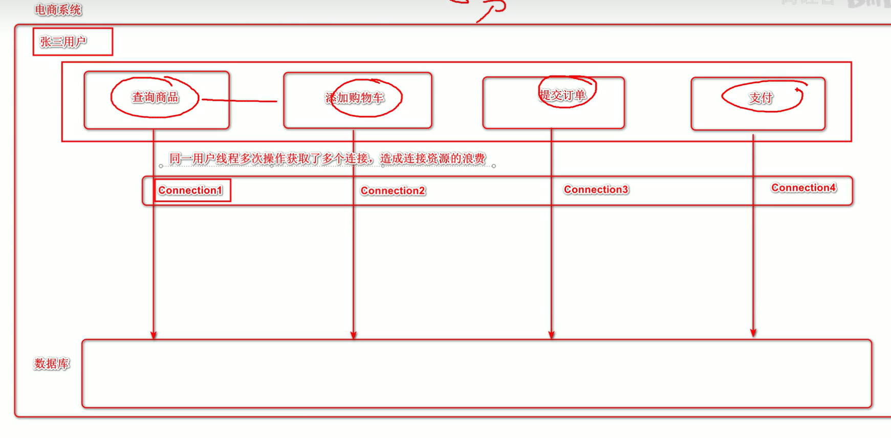

# JDBC高级篇

# 1. JDBC优化及工具类封装

## 1.1 现有问题

我们在使用JDBC的过程中，发现部分代码存在冗余的问题：

- 创建连接池。
- 获取连接。
- 连接的回收。

## 1.2 JDBC工具类封装V1.0

- **JDBCUtil**

```java
/**
 *  JDBC工具类(V1.0)
 *      1. 维护一个连接池对象
 *      2. 对外提供在连接池中获取连接的方法
 *      3. 对外提供回收连接的方法
 *  注意: 工具类仅对外提供共性的功能代码, 所以方法均为静态方法
 */
public class JDBCUtil {
    // 创建连接池引用, 因为要提供给当前项目的全局使用, 所以创建为静态的.
    private static DataSource dataSource;
    
    // 在项目启动时, 即创建连接池对象, 赋值给dataSource
    static {
        try {
            Properties properties = new Properties();
            InputStream inputStream = JDBCUtil.class.getClassLoader().getResourceAsStream("druid.properties");
            properties.load(inputStream);
            
            dataSource = DruidDataSourceFactory.createDataSource(properties);
        } catch (Exception e) {
            throw new RuntimeException(e);
        }
    }
    
    // 对外提供在连接池中获取连接的方法
    public static Connection getConnection() {
        try {
            return dataSource.getConnection();
        } catch (SQLException e) {
            throw new RuntimeException(e);
        }
    }
    
    // 对外提供回收连接的方法
    public static void release(Connection connection) {
        try {
            connection.close();
        } catch (SQLException e) {
            throw new RuntimeException(e);
        }
    }
}
```

- **JDBCUtilTest**

```java
@Test
public void testGetConnection() {
    Connection connection = JDBCUtil.getConnection();
    System.out.println("connection = " + connection);
    // CRUD
    
    JDBCUtil.release(connection);
}
```

## 1.3 ThreadLocal

`JDK 1.2`的版本中就提供`java.lang.ThreadLocal`，为解决多线程程序的并发问题提供了一种新的思路。使用这个工具类可以很简洁地编写出优美的多线程程序。通常用来在在多线程中管理共享数据库连接、`Session`等。

`ThreadLocal`用于保存某个线程共享变量，原因是在Java中，每一个线程对象中都有一个`ThreadLocalMap<ThreadLocal, Object>`，其key就是一个`ThreadLocal`，而`Object`即为该线程的共享变量。

而这个`map`是通过`ThreadLocal`的`set`和`get`方法操作的。对于同一个`static ThreadLocal`，不同线程只能从中`get，set，remove`自己的变量，而不会影响其他线程的变量。

- 在进行对象跨层传递的时候，使用`ThreadLocal`可以避免多次传递，打破层次间的约束。
- 线程间数据隔离。
- 进行事务操作，用于存储线程事务信息。
- 数据库连接，`Session`会话管理。

1、`ThreadLocal`对象`.get:` 获取`ThreadLocal`中当前线程共享变量的值。
2、`ThreadLocal`对象`.set:` 设置`ThreadLocal`中当前线程共享变量的值。
3、`ThreadLocal`对象`.remove`: 移除`ThreadLocal`中当前线程共享变量的值。



## 1.4 JDBC工具类封装V2.0
