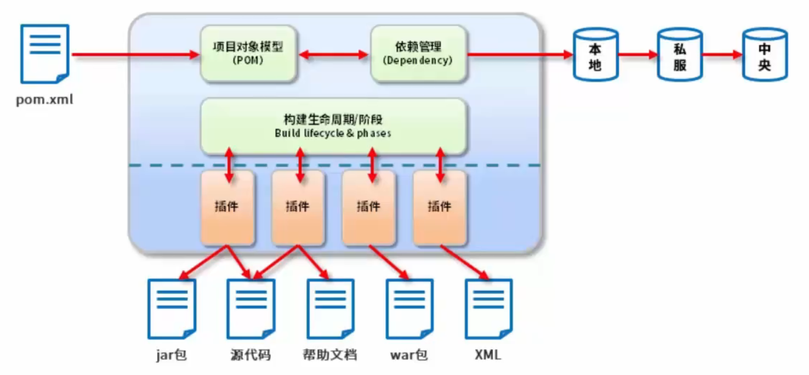
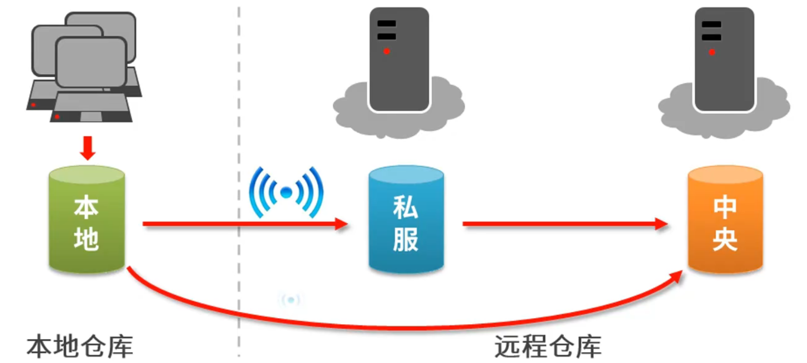
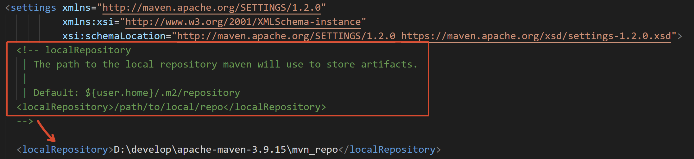
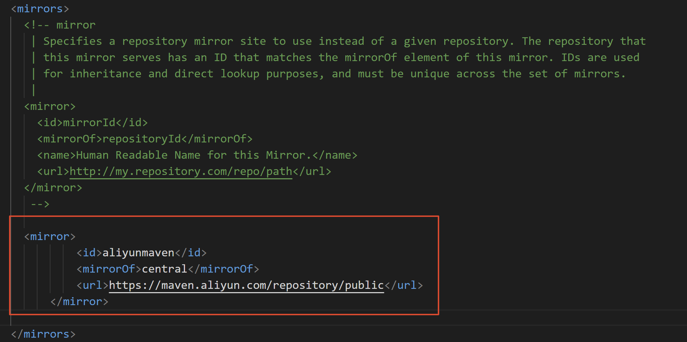

# Maven基础

# 1. Maven简介

## 1.1 Maven是什么

- Maven 的本质是一个项目管理工具，将项目开发和管理过程抽象成一个项目对象模型（POM）
- POM（Project Object Model）：项目对象模型



## 1.2 Maven的作用

- 项目构建：提供标准的、跨平台的自动化项目构建方式
- 依赖管理：方便快捷的管理项目依赖的资源（jar包），避免资源间的版本冲突问题
- 统一开发结构：提供标准的、统一的项目结构

---

# 2. Maven基础概念

## 2.1 仓库

- 仓库：用于存储资源，包含各种jar包
- 仓库分类：
  - 本地仓库：自己电脑上存储资源的仓库，连接远程仓库获取资源
  - 远程仓库：非本机电脑上的仓库，为本地仓库提供资源
    - 中央仓库：Maven团队维护，存储所有资源的仓库
    - 私服：部门/公司范围内存储资源的仓库，从中央仓库获取资源
- 私服的作用：
  - 保存具有版权的资源，包含购买或自主研发的jar
    - 中央仓库中的jar都是开源的，不能存储具有版权的资源
  - 一定范围内共享资源，仅对内部开放，不对外共享



## 2.2 坐标

- 什么是坐标？
  - Maven中的坐标用于描述仓库中资源的位置
  - https://repo1.maven.org/maven2/
- Maven坐标主要组成
  - groupId：定义当前Maven项目隶属组织名称（通常是域名反写，例如：org.mybatis）
  - artifactId：定义当前Maven项目名称（通常是模块名称，例如CRM、SMS）
  - version：定义当前项目版本号
  - packaging：定义该项目的打包方式
- Maven坐标的作用
  - 使用唯一标识，唯一性定位资源位置，通过该标识可以将资源的识别与下载工作交由机器完成

## 2.3 仓库配置

- **本地仓库配置**

**conf文件夹下会有个setting.xml文件, 如图设置本地仓库**



- Maven启动后，会自动保存下载的资源到本地仓库
  - 默认位置
    - `<localRepository>${user.home}/.m2/repository</localRepository>`
    - 当前目录位置为登录用户名所在目录下的.m2文件夹中
  - 自定义位置
    - `<localRepository>D:\maven\repository</localRepository>`
    - 当前目录位置为`D:\maven\repository`文件夹中

- **远程仓库**

- Maven默认连接的仓库位置

```xml
<repositories>
    <repository>
        <id>central</id>
        <name>Central Repository</name>
        <url>https://repo.maven.apache.org/maven2</url>
        <layout>default</layout>
        <snapshots>
            <enabled>false</enabled>
        </snapshots>
    </repository>
</repositories>
```

- **镜像仓库**

- 在setting文件中配置阿里云镜像仓库

```xml
<mirrors>
    <!--配置具体的仓库的下载镜像 -->
    <mirror>
        <!-- 此镜像的唯一标识符，用来区分不同的mirror元素 -->
        <id>nexus-aliyun</id>
        <!-- 对哪种仓库进行镜像，简单说就是替代哪个仓库 -->
        <mirrorOf>central</mirrorOf>
        <!-- 镜像名称 -->
        <name>Nexus aliyun</name>
        <!-- 镜像URL -->
        <url>http://maven.aliyun.com/nexus/content/groups/public</url>
    </mirror>
</mirrors>
```



## 2.4 全局setting与用户setting区别

- 全局setting定义了当前计算器中Maven的公共配置
- 用户setting定义了当前用户的配置

# 3. 依赖管理

## 3.1 依赖配置

- 依赖指当前项目运行所需的jar，一个项目可以设置多个依赖
- 格式：

```xml
<!--设置当前项目所依赖的所有jar-->
<dependencies>
    <!--设置具体的依赖-->
    <dependency>
        <!--依赖所属群组id-->
        <groupId>junit</groupId>
        <!--依赖所属项目id-->
        <artifactId>junit</artifactId>
        <!--依赖版本号-->
        <version>4.12</version>
    </dependency>
</dependencies>
```

## 3.2 依赖传递冲突问题

- 路径优先：当依赖中出现相同的资源时，层级越深，优先级越低，层级越浅，优先级越高
- 声明优先：当资源在相同层级被依赖时，配置顺序靠前的覆盖配置顺序靠后的
- 特殊优先：当同级配置了相同资源的不同版本，后配置的覆盖先配置的

## 3.3 可选依赖

- 可选依赖指对外隐藏当前所依赖的资源——不透明

> 人话: 父项目引入子项目的依赖后, 父项目没有子项目里的这个optional为true的依赖

```xml
<dependency>
    <groupId>junit</groupId>
    <artifactId>junit</artifactId>
    <version>4.12</version>
    <optional>true</optional>
</dependency>
```

## 3.4 排除依赖

- 排除依赖指主动断开依赖的资源，被排除的资源无需指定版本——不需要

```xml
<dependency>
    <groupId>junit</groupId>
    <artifactId>junit</artifactId>
    <version>4.12</version>
    <exclusions>
        <exclusion>
            <groupId>org.hamcrest</groupId>
            <artifactId>hamcrest-core</artifactId>
        </exclusion>
    </exclusions>
</dependency>
```

## 3.5 依赖范围

- 依赖的jar默认情况可以在任何地方使用，可以通过scope标签设定其作用范围
- 作用范围
  - 主程序范围有效（main文件夹范围内）
  - 测试程序范围有效（test文件夹范围内）
  - 是否参与打包（package指令范围内）

| scope | 主代码 | 测试代码 | 打包 | 范例 |
| --- | --- | --- | --- | --- |
| compile（默认） | Y | Y | Y | log4j |
| test |  | Y |  | junit |
| provided | Y | Y |  | servlet-api |
| runtime |  |  | Y | jdbc |

# 4. 生命周期和插件

## 4.1 项目构建生命周期

- Maven对项目构建的生命周期划分为3套
  - clean：清理工作
  - default：核心工作，例如编译，测试，打包，部署等
  - site：产生报告，发布站点等

### clean生命周期

| 阶段 | 说明 |
| --- | --- |
| pre-clean | 执行一些需要在clean之前完成的工作 |
| clean | 移除所有上一次构建生成的文件 |
| post-clean | 执行一些需要在clean之后立刻完成的工作 |

### default构建生命周期

| 阶段 | 说明 |
| --- | --- |
| validate（校验） | 校验项目是否正确并且所有必要的信息可以完成项目的构建过程。 |
| initialize（初始化） | 初始化构建状态，比如设置属性值。 |
| generate-sources（生成源代码） | 生成包含在编译阶段中的任何源代码。 |
| process-sources（处理源代码） | 处理源代码，比如说，过滤任意值。 |
| generate-resources（生成资源文件） | 生成将会包含在项目包中的资源文件。 |
| process-resources（处理资源文件） | 复制和处理资源到目标目录，为打包阶段最好准备。 |
| compile（编译） | 编译项目的源代码。 |
| process-classes（处理类文件） | 处理编译生成的文件，比如说对Java class文件做字节码改善优化。 |
| generate-test-sources（生成测试源代码） | 生成包含在编译阶段中的任何测试源代码。 |
| process-test-sources（处理测试源代码） | 处理测试源代码，比如说，过滤任意值。 |
| generate-test-resources（生成测试资源文件） | 为测试创建资源文件。 |
| process-test-resources（处理测试资源文件） | 复制和处理测试资源到目标目录。 |
| test-compile（编译测试源码） | 编译测试源代码到测试目标目录. |
| process-test-classes（处理测试类文件） | 处理测试源码编译生成的文件。 |
| test（测试） | 使用合适的单元测试框架运行测试（Juint是其中之一）。 |
| prepare-package（准备打包） | 在实际打包之前，执行任何的必要的操作为打包做准备。 |
| package（打包） | 将编译后的代码打包成可分发格式的文件，比如JAR、WAR或者EAR文件。 |
| pre-integration-test（集成测试前） | 在执行集成测试前进行必要的动作。比如说，搭建需要的环境。 |
| integration-test（集成测试） | 处理和部署项目到可以运行集成测试环境中。 |
| post-integration-test（集成测试后） | 在执行集成测试完成后进行必要的动作。比如说，清理集成测试环境。 |
| verify（验证） | 运行任意的检查来验证项目包有效且达到质量标准。 |
| install（安装） | 安装项目包到本地仓库，这样项目包可以用作其他本地项目的依赖。 |
| deploy（部署） | 将最终的项目包复制到远程仓库中与其他开发者和项目共享。 |

### site构建生命周期

| 阶段 | 说明 |
| --- | --- |
| pre-site | 执行一些需要在生成站点文档之前完成的工作 |
| site | 生成项目的站点文档 |
| post-site | 执行一些需要在生成站点文档之后完成的工作，并且为部署做准备 |
| site-deploy | 将生成的站点文档部署到特定的服务器上 |

## 4.2 插件

- 插件与生命周期内的阶段绑定，在执行到对应生命周期时执行对应的插件功能
- 默认maven在各个生命周期上绑定有预设的功能
- 通过插件可以自定义其他功能

```xml
<build>
    <plugins>
        <plugin>
            <groupId>org.apache.maven.plugins</groupId>
            <artifactId>maven-source-plugin</artifactId>
            <version>2.2.1</version>
            <executions>
                <execution>
                    <goals>
                        <goal>jar</goal>
                    </goals>
                    <phase>generate-test-resources</phase>
                </execution>
            </executions>
        </plugin>
    </plugins>
</build>
```
