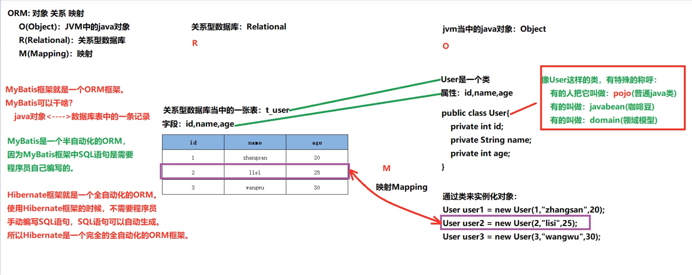
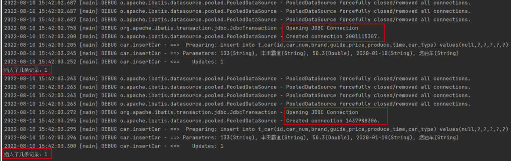
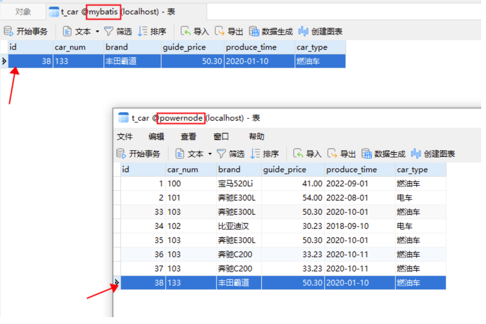
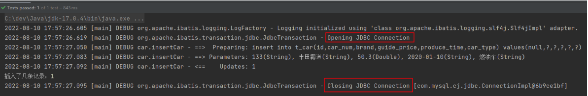
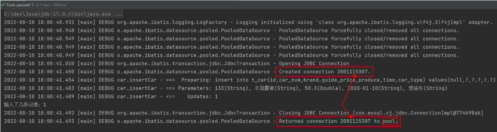
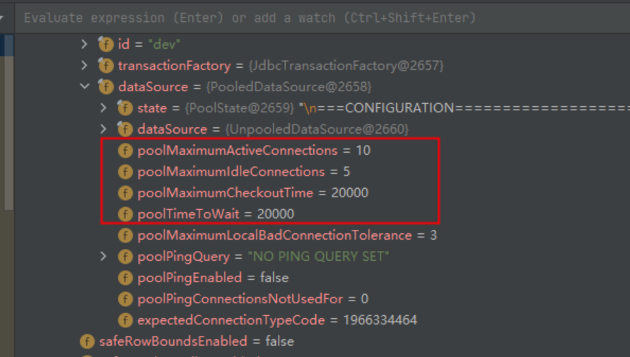
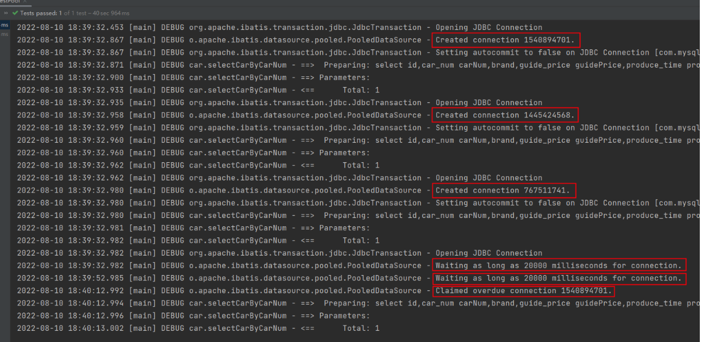

# MyBatis001

> 不会要多多看官方的使用手册

# 1. MyBatis概述

- MyBatis本质上就是对JDBC的封装，通过MyBatis完成CRUD。
- MyBatis在三层架构中负责持久层的，属于持久层框架。
- ORM：对象关系映射
  - **O（Object）**：Java虚拟机中的Java对象
  - **R（Relational）**：关系型数据库
  - **M（Mapping）**：将Java虚拟机中的Java对象映射到数据库表中一行记录，或是将数据库表中一行记录映射成Java虚拟机中的一个Java对象。



---

# 2. MyBatis入门程序

+ 步骤1：打包方式：jar（<font style="color:#F5222D;">不需要war，因为mybatis封装的是jdbc。</font>）

```xml
<groupId>com.powernode</groupId>
<artifactId>mybatis-001-introduction</artifactId>
<version>1.0-SNAPSHOT</version>
<packaging>jar</packaging>
```

+ 步骤2：引入依赖（mybatis依赖 + mysql驱动依赖）

```xml
<!--mybatis核心依赖-->
<dependency>
  <groupId>org.mybatis</groupId>
  <artifactId>mybatis</artifactId>
  <version>3.5.10</version>
</dependency>
<!--mysql驱动依赖-->
<dependency>
  <groupId>mysql</groupId>
  <artifactId>mysql-connector-java</artifactId>
  <version>8.0.30</version>
</dependency>
```

+ 步骤3：在resources根目录下新建mybatis-config.xml配置文件（可以参考mybatis手册拷贝）

```xml
<?xml version="1.0" encoding="UTF-8" ?>
<!DOCTYPE configuration
        PUBLIC "-//mybatis.org//DTD Config 3.0//EN"
        "http://mybatis.org/dtd/mybatis-3-config.dtd">
<configuration>
    <environments default="development">
        <environment id="development">
            <transactionManager type="JDBC"/>
            <dataSource type="POOLED">
                <property name="driver" value="com.mysql.cj.jdbc.Driver"/>
                <property name="url" value="jdbc:mysql://localhost:3306/powernode"/>
                <property name="username" value="root"/>
                <property name="password" value="123456"/>
            </dataSource>
        </environment>
    </environments>
    <mappers>
        <!--sql映射文件创建好之后，需要将该文件路径配置到这里-->
        <mapper resource=""/>
    </mappers>
</configuration>
```

注意1：mybatis核心配置文件的文件名不一定是mybatis-config.xml，可以是其它名字。

注意2：mybatis核心配置文件存放的位置也可以随意。这里选择放在resources根下，相当于放到了类的根路径下。

+ 步骤4：在resources根目录下新建CarMapper.xml配置文件（可以参考mybatis手册拷贝）

```xml
<?xml version="1.0" encoding="UTF-8" ?>
<!DOCTYPE mapper
        PUBLIC "-//mybatis.org//DTD Mapper 3.0//EN"
        "http://mybatis.org/dtd/mybatis-3-mapper.dtd">
<!--namespace先随意写一个-->
<mapper namespace="car">
    <!--insert sql：保存一个汽车信息-->
    <insert id="insertCar">
        insert into t_car
            (id,car_num,brand,guide_price,produce_time,car_type) 
        values
            (null,'102','丰田mirai',40.30,'2014-10-05','氢能源')
    </insert>
</mapper>
```

注意1：**<font style="color:#E8323C;">sql语句最后结尾可以不写“;”</font>**

注意2：CarMapper.xml文件的名字不是固定的。可以使用其它名字。

注意3：CarMapper.xml文件的位置也是随意的。这里选择放在resources根下，相当于放到了类的根路径下。

注意4：<font style="color:#F5222D;">将CarMapper.xml文件路径配置到mybatis-config.xml：</font>

```xml
<mapper resource="CarMapper.xml"/>
```

+ 步骤5：编写MyBatisIntroductionTest代码

```java
package com.powernode.mybatis;

import org.apache.ibatis.session.SqlSession;
import org.apache.ibatis.session.SqlSessionFactory;
import org.apache.ibatis.session.SqlSessionFactoryBuilder;

import java.io.InputStream;

/**
 * MyBatis入门程序
 */
public class MyBatisIntroductionTest {
    public static void main(String[] args) {
        // 1. 创建SqlSessionFactoryBuilder对象
        SqlSessionFactoryBuilder sqlSessionFactoryBuilder = new SqlSessionFactoryBuilder();
        // 2. 创建SqlSessionFactory对象
        InputStream is = Thread.currentThread().getContextClassLoader().getResourceAsStream("mybatis-config.xml");
        SqlSessionFactory sqlSessionFactory = sqlSessionFactoryBuilder.build(is);
        // 3. 创建SqlSession对象
        SqlSession sqlSession = sqlSessionFactory.openSession();
        // 4. 执行sql
        int count = sqlSession.insert("insertCar"); // 这个"insertCar"必须是sql的id
        System.out.println("插入几条数据：" + count);
        // 5. 提交（mybatis默认采用的事务管理器是JDBC，默认是不提交的，需要手动提交。）
        sqlSession.commit();
        // 6. 关闭资源（只关闭是不会提交的）
        sqlSession.close();
    }
}
```

注意1：默认采用的事务管理器是：JDBC。JDBC事务默认是不提交的，需要手动提交。

1. **resources目录：**

放在这个目录当中的，一般都是资源文件，配置文件。
直接放到resources目录下的资源，等同于放到了类的根路径下。

2. **开发步骤:**

* 第一步: 打包方式jar
* 第二步: 引入依赖
  * **mybatis依赖**
  * **mysql驱动依赖**
* 第三步: 编写 mybatis 核心配置文件: **mybatis-config.xml**

  **注意:**

  - 第一: 这个文件名不是必须叫做**mybatis-config.xml**，可以用其他的名字。只是大家都采用这个名字。
  - 第二: 这个文件存放的位置也不是固定的，可以随意，但一般情况下，会放到类的根路径下。

  **mybatis-config.xml**文件中的配置信息不理解没关系，先把连接数据库的信息修改即可。其他的别动。

* 第四步: 编写**XxxxMapper.xml**文件

  * 在这个配置文件当中编写SQL语句。
  * 这个文件名也不是固定的，放的位置也不是固定，我们这里给它起个名字，叫做：CarMapper.xml
  * 把它暂时放到类的根路径下。

* 第五步: 在**mybatis-config.xml**文件中指定**XxxxMapper.xml**文件的路径：

  ```xml
  <mapper resource="CarMapper.xml"/>
  ```

  注意：**resource**属性会自动从类的根路径下开始查找资源。

* 第六步: 编写**MyBatis**程序。（使用**mybatis**的类库，编写**mybatis**程序，连接数据库，做增删改查就行了。）

  **在MyBatis当中，负责执行SQL语句的那个对象叫做什么呢？**
  
  - **SqlSession**
  
  `SqlSession`是专门用来执行SQL语句的，是一个Java程序和数据库之间的一次会话。
  
  要想获取 `SqlSession` 对象，需要先获取 `SqlSessionFactory` 对象，通过 `SqlSessionFactory` 工厂来生产 `SqlSession` 对象。
  
  **怎么获取 `SqlSessionFactory` 对象呢？**
  
  - 需要首先获取 `SqlSessionFactoryBuilder` 对象。
  - 通过 `SqlSessionFactoryBuilder` 对象的 `build` 方法，来获取一个 `SqlSessionFactory` 对象。
  
  **mybatis的核心对象包括：**
  - `SqlSessionFactoryBuilder`
  - `SqlSessionFactory`
  - `SqlSession`
  
  `SqlSessionFactoryBuilder --> SqlSessionFactory --> SqlSession`

---

3. **从 XML 中构建 SqlSessionFactory**

通过官方的这句话，你能想到什么呢？
- 第一: 在 MyBatis 中一定是有一个很重要的对象，这个对象是: `SqlSessionFactory`对象。
- 第二: `SqlSessionFactory`对象的创建需要 XML。

**XML是什么？**

- 它一定是一个配置文件。

---

4. **mybatis中有两个主要的配置文件：**

其中一个是：**mybatis-config.xml**，这是核心配置文件，主要配置连接数据库的信息等。（一个）

另一个是：**XxxxMapper.xml**，这个文件是专门用来编写SQL语句的配置文件。（一个表一个）
- `t_user`表，一般会对应一个 `UserMapper.xml`
- `t_student` 表，一般会对应一个 `StudentMapper.xml`

---

5. **关于第一个程序的小细节**

* mybatis中sql语句的结尾`;`可以省略。

* **Resources.getResourceAsStream**

  小技巧：以后凡是遇到resource这个单词，大部分情况下，这种加载资源的方式就是从类的根路径下开始加载。（开始查找）

  优点：采用这种方式，从类路径当中加载资源，项目的移植性很强。项目从windows移植到linux，代码不需要修改，因为这个资源文件一直都在类路径当中。

* `InputStream is = new FileInputStream("d:\\mybatis-config.xml");`

  采用这种方式也可以。

  缺点：可移植性太差，程序不够健壮。可能会移植到其他的操作系统当中。导致以上路径无效，还需要修改java代码中的路径。这样违背了OCP原则。

* **已经验证了：**

  mybatis核心配置文件的名字，不一定是：`mybatis-config.xml`。可以是其它名字。

  mybatis核心配置文件存放的路径，也不一定是在类的根路径下。可以放到其它位置。但为了项目的移植性，健壮性，最好将这个配置文件放到类路径下面。

* `InputStream is = ClassLoader.getSystemClassLoader().getResourceAsStream("mybatis-config.xml");`

  `ClassLoader.getSystemClassLoader()` 获取系统的类加载器。

  系统类加载器有一个方法叫做：`getResourceAsStream`

  它就是从类路径当中加载资源的。

  通过源代码分析发现：

  `InputStream is = Resources.getResourceAsStream("mybatis-config.xml");`

  底层的源代码其实就是：

  `InputStream is = ClassLoader.getSystemClassLoader().getResourceAsStream("mybatis-config.xml");`

* **CarMapper.xml文件的名字是固定的吗？CarMapper.xml文件的路径是固定的吗？**

  都不是固定的。

  `<mapper resource="CarMapper.xml"/>` resource属性：这种方式是从类路径当中加载资源。

  `<mapper url="file:///d:/CarMapper.xml"/>` url属性：这种方式是从绝对路径当中加载资源。

---

# 3. MyBatis事务管理机制

* **在`mybatis-config.xml`文件中，可以通过以下的配置进行mybatis的事务管理：**

  ```xml
  <transactionManager type="JDBC"/>
  ```

* **type属性的值包括两个：**
  
  * `JDBC`(jdbc)
  * `MANAGED`(managed)
  
  type后面的值，只有以上两个值可选，不区分大小写。
  
* **在mybatis中提供了两种事务管理机制：**
  
  * 第一种：JDBC事务管理器
  
  * 第二种：MANAGED事务管理器
  
- **JDBC事务管理器：**

mybatis框架自己管理事务，自己采用原生的JDBC代码去管理事务：

```java
conn.setAutoCommit(false); // 开启事务
....业务处理...
conn.commit(); // 手动提交事务
```

使用JDBC事务管理器的话，底层创建的事务管理器对象：`JdbcTransaction`对象。

如果你编写的代码是下面的代码：

```java
SqlSession sqlSession = sqlSessionFactory.openSession(true);
```

表示没有开启事务。因为这种方式压根不会执行：`conn.setAutoCommit(false);`

在JDBC事务中，没有执行`conn.setAutoCommit(false);`那么`autoCommit`就是`true`。

如果`autoCommit`是`true`，就表示没有开启事务。只要执行任意一条DML语句就提交一次。

- **MANAGED事务管理器：**

mybatis不再负责事务的管理了。事务管理交给其它容器来负责。例如：`spring`。

我不管事务了，你来负责吧。

对于当前的单纯的只有`mybatis`的情况下，如果配置为：`MANAGED`

那么事务这块是没人管的。没有人管理事务表示事务压根没有开启。

- **JDBC中的事务：**

如果你没有在JDBC代码中执行：`conn.setAutoCommit(false);`的话，默认的`autoCommit`是`true`。

- **重点：**

以后注意了，只要你的autoCommit是true，就表示没有开启事务。

只有你的autoCommit是false的时候，就表示开启了事务。

---

# 4. 引入日志框架logback

- 引入日志框架的目的是为了看清楚mybatis执行的具体sql。
- 启用标准日志组件，只需要在mybatis-config.xml文件中添加以下配置：【可参考mybatis手册】

```xml
<settings>
  <setting name="logImpl" value="STDOUT_LOGGING" />
</settings>
```

标准日志也可以用，但是配置不够灵活，可以集成其他的日志组件，例如：log4j，logback等。

- logback是目前日志框架中性能较好的，较流行的，所以我们选它。
- 引入logback的步骤：
  - 第一步：引入logback相关依赖

```xml
<dependency>
  <groupId>ch.qos.logback</groupId>
  <artifactId>logback-classic</artifactId>
  <version>1.2.11</version>
  <scope>test</scope>
</dependency>
```

   - 第二步：引入logback相关配置文件（文件名叫做logback.xml或logback-test.xml，放到类路径当中）

```xml
<?xml version="1.0" encoding="UTF-8"?>

<configuration debug="false">
    <!-- 控制台输出 -->
    <appender name="STDOUT" class="ch.qos.logback.core.ConsoleAppender">
        <encoder class="ch.qos.logback.classic.encoder.PatternLayoutEncoder">
            <!--格式化输出：%d表示日期，%thread表示线程名，%-5level：级别从左显示5个字符宽度%msg：日志消息，%n是换行符-->
            <pattern>%d{yyyy-MM-dd HH:mm:ss.SSS} [%thread] %-5level %logger{50} - %msg%n</pattern>
        </encoder>
    </appender>
    <!-- 按照每天生成日志文件 -->
    <appender name="FILE" class="ch.qos.logback.core.rolling.RollingFileAppender">
        <rollingPolicy class="ch.qos.logback.core.rolling.TimeBasedRollingPolicy">
            <!--日志文件输出的文件名-->
            <FileNamePattern>${LOG_HOME}/TestWeb.log.%d{yyyy-MM-dd}.log</FileNamePattern>
            <!--日志文件保留天数-->
            <MaxHistory>30</MaxHistory>
        </rollingPolicy>
        <encoder class="ch.qos.logback.classic.encoder.PatternLayoutEncoder">
            <!--格式化输出：%d表示日期，%thread表示线程名，%-5level：级别从左显示5个字符宽度%msg：日志消息，%n是换行符-->
            <pattern>%d{yyyy-MM-dd HH:mm:ss.SSS} [%thread] %-5level %logger{50} - %msg%n</pattern>
        </encoder>
        <!--日志文件最大的大小-->
        <triggeringPolicy class="ch.qos.logback.core.rolling.SizeBasedTriggeringPolicy">
            <MaxFileSize>100MB</MaxFileSize>
        </triggeringPolicy>
    </appender>

    <!--mybatis log configure-->
    <logger name="com.apache.ibatis" level="TRACE"/>
    <logger name="java.sql.Connection" level="DEBUG"/>
    <logger name="java.sql.Statement" level="DEBUG"/>
    <logger name="java.sql.PreparedStatement" level="DEBUG"/>

    <!-- 日志输出级别,logback日志级别包括五个：TRACE < DEBUG < INFO < WARN < ERROR -->
    <root level="DEBUG">
        <appender-ref ref="STDOUT"/>
        <appender-ref ref="FILE"/>
    </root>

</configuration>
```

# 5. Mybatis工具类编写

- **SqlSessionUtil**

```java
/**
 * SqlSession工具类
 */
public class SqlSessionUtil {
    // 工具类的构造方法一般都是私有化(防止new对象)
    // 工具类中所用方法都是静态的, 直接采用类名即可调用, 不需要new对象
    private SqlSessionUtil(){};
    
    private static SqlSessionFactory sqlSessionFactory;
    
    // 类加载时执行
    // SqlSessionUtil工具类在第一次加载时, 解析xml文件, 创建SqlSessionFactory对象
    // SqlSessionFactory对象: 一个SqlSessionFactory对象对应一个environment(通常是一个数据库)
    static {
        SqlSessionFactoryBuilder sqlSessionFactoryBuilder = new SqlSessionFactoryBuilder();
        try {
            sqlSessionFactory = sqlSessionFactoryBuilder.build(Resources.getResourceAsStream("mybatis-config.xml"));
        } catch (IOException e) {
            throw new RuntimeException(e);
        }
    }
    
    // 获取SqlSession对象
    public static SqlSession getSqlSession(){
        return sqlSessionFactory.openSession();
    }
}
```

- **CatMapperTest**

```java
@Test
public void testInsertCarByUtil() {
    SqlSession sqlSession = SqlSessionUtil.getSqlSession();
    int count = sqlSession.insert("insertCar");
    System.out.println("count = " + count);
    sqlSession.commit();
    sqlSession.close();
}
```

# 6. MyBatis完成CRUD

分析以下SQL映射文件中SQL语句存在的问题

```xml
<?xml version="1.0" encoding="UTF-8" ?>
<!DOCTYPE mapper
        PUBLIC "-//mybatis.org//DTD Mapper 3.0//EN"
        "http://mybatis.org/dtd/mybatis-3-mapper.dtd">

<!--namespace先随便写-->
<mapper namespace="car">
    <insert id="insertCar">
        insert into t_car(car_num,brand,guide_price,produce_time,car_type) values('103', '奔驰E300L', 50.3, '2022-01-01', '燃油车')
    </insert>
</mapper>
```

存在的问题是：SQL语句中的值不应该写死，值应该是用户提供的。之前的JDBC代码是这样写的：

```java
// JDBC中使用 ? 作为占位符。那么MyBatis中会使用什么作为占位符呢？
String sql = "insert into t_car(car_num,brand,guide_price,produce_time,car_type) values(?,?,?,?,?)";
// ......
// 给 ? 传值。那么MyBatis中应该怎么传值呢？
ps.setString(1,"103");
ps.setString(2,"奔驰E300L");
ps.setDouble(3,50.3);
ps.setString(4,"2022-01-01");
ps.setString(5,"燃油车");
```

在MyBatis中可以这样做：
**在Java程序中，将数据放到Map集合中**
**在sql语句中使用 #{map集合的key} 来完成传值，#{} 等同于JDBC中的 ? ，#{}就是占位符**

```java
public class CarMapperTest {
    @Test
    public void testInsertCar(){
        // 准备数据
        Map<String, Object> map = new HashMap<>();
        map.put("k1", "103");
        map.put("k2", "奔驰E300L");
        map.put("k3", 50.3);
        map.put("k4", "2020-10-01");
        map.put("k5", "燃油车");
        // 获取SqlSession对象
        SqlSession sqlSession = SqlSessionUtil.openSession();
        // 执行SQL语句（使用map集合给sql语句传递数据）
        int count = sqlSession.insert("insertCar", map);
        System.out.println("插入了几条记录：" + count);
    }
}
```

**SQL语句**

```xml
    <insert id="insertCar">
        insert into t_car(car_num,brand,guide_price,produce_time,car_type) values(#{k1},#{k2},#{k3},#{k4},#{k5})
    </insert>
```

**如果#{}里写的是map集合中不存在的key会有什么问题？**

**1. 如果采用map集合传参，#{} 里写的是map集合的key，如果key不存在不会报错，数据库表中会插入NULL。**
**2. 如果采用POJO传参，#{} 里写的是get方法的方法名去掉get之后将剩下的单词首字母变小写（例如：getAge对应的是#{age}，getUserName对应的是#{userName}），如果这样的get方法不存在会报错。**

> 注意：其实传参数的时候有一个属性parameterType，这个属性用来指定传参的数据类型，不过这个属性是可以省略的

---

- **工具类**

```java
/**
 * SqlSession工具类
 */
public class SqlSessionUtil {
    // 工具类的构造方法一般都是私有化(防止new对象)
    // 工具类中所用方法都是静态的, 直接采用类名即可调用, 不需要new对象
    private SqlSessionUtil(){};
    
    private static SqlSessionFactory sqlSessionFactory;
    
    // 类加载时执行
    // SqlSessionUtil工具类在第一次加载时, 解析xml文件, 创建SqlSessionFactory对象
    // SqlSessionFactory对象: 一个SqlSessionFactory对象对应一个environment(通常是一个数据库)
    static {
        SqlSessionFactoryBuilder sqlSessionFactoryBuilder = new SqlSessionFactoryBuilder();
        try {
            sqlSessionFactory = sqlSessionFactoryBuilder.build(Resources.getResourceAsStream("mybatis-config.xml"));
        } catch (IOException e) {
            throw new RuntimeException(e);
        }
    }
    
    // 获取SqlSession对象
    public static SqlSession getSqlSession(){
        return sqlSessionFactory.openSession();
    }
}
```

- **pojo类**

```java
@Data
@NoArgsConstructor
@AllArgsConstructor
public class Car {
    
    private Integer id;
    
    private Integer carNum;
    
    private String brand;
    
    private double guidePrice;
    
    private LocalDate produceTime;
    
    private String carType;
    
}
```

## 6.1 增(insert)

- **CarMapper.xml**

```xml
<insert id="insertCar">
    insert into  t_car (id, car_num, brand, guide_price, produce_time, car_type)
    values (#{id}, #{carNum}, #{brand}, #{guidePrice}, #{produceTime}, #{carType})
</insert>
```

- **Test**

```java
@Test
public void testInsertCarByPojo() {
    SqlSession sqlSession = SqlSessionUtil.getSqlSession();
    Car car = new Car(null, 98, "宝马", 198.0, LocalDate.of(2023, 10, 10), "油车");
    int count = sqlSession.insert("insertCar", car);
    System.out.println("count = " + count);
    sqlSession.commit();
    sqlSession.close();
}
```

## 6.2 删(delete)

- **xml**

```xml
<delete id="deleteCar">
    delete from t_car where id = #{id}
</delete>
```

- **Test**

```java
@Test
public void testDeleteCarByPojo() {
    SqlSession sqlSession = SqlSessionUtil.getSqlSession();
    int count = sqlSession.delete("deleteCar", 15);
    System.out.println("count = " + count);
    sqlSession.commit();
    sqlSession.close();
}
```

## 6.3 改(update)

- **xml**

```xml
<update id="updateCar">
    update t_car set
         car_num = #{carNum},
         brand = #{brand},
         guide_price = #{guidePrice},
         produce_time = #{produceTime},
         car_type = #{carType}
    where
        id = #{id}
</update>
```

- **test**

```java
@Test
public void testUpdateCarByPojo() {
    SqlSession sqlSession = SqlSessionUtil.getSqlSession();
    Car newCar = new Car(14, 0, "宝马", 198.0, LocalDate.of(2023, 10, 10), "油车1");
    int count = sqlSession.update("updateCar", newCar);
    System.out.println("count = " + count);
    sqlSession.commit();
    sqlSession.close();
}
```

## 6.4 查(select)

### 6.4.1 查单个

- **xml**

```xml
<select id="selectCarById" resultType="com.gua.pojo.Car">
    select
        id,
        car_num as carNum,
        brand,
        guide_price as guidePrice,
        produce_time as produceTime,
        car_type as carType
        from t_car where id = #{id}
</select>
```

- **test**

```java
@Test
public void testSelectCarById() {
    SqlSession sqlSession = SqlSessionUtil.getSqlSession();
    Car car = sqlSession.selectOne("selectCarById", 1);
    System.out.println("car = " + car);
    sqlSession.close();
}
```

> 查询语句这里写了别名才能被查询到, 后续会换成驼峰映射

### 6.4.2 查全部

- **xml**

```xml
<select id="selectCar" resultType="com.gua.pojo.Car">
    select
        id,
        car_num as carNum,
        brand,
        guide_price as guidePrice,
        produce_time as produceTime,
        car_type as carType
    from t_car
</select>
```

- **test**

```java
@Test
public void testSelectAll() {
    SqlSession sqlSession = SqlSessionUtil.getSqlSession();
    List<Car> cars = sqlSession.selectList("selectCar");
    cars.forEach(car -> System.out.println(car));
    sqlSession.close();
}
```

## 6.5 关于SQL Mapper的namespace

在SQL Mapper配置文件中<mapper>标签的namespace属性可以翻译为命名空间，这个命名空间主要是为了防止sqlId冲突的。
创建CarMapper2.xml文件，代码如下：

```xml
<?xml version="1.0" encoding="UTF-8" ?>
<!DOCTYPE mapper
        PUBLIC "-//mybatis.org//DTD Mapper 3.0//EN"
        "http://mybatis.org/dtd/mybatis-3-mapper.dtd">

<mapper namespace="car2">
    <select id="selectCarAll" resultType="com.powernode.mybatis.pojo.Car">
        select
            id, car_num as carNum, brand, guide_price as guidePrice, produce_time as produceTime, car_type as carType
        from
            t_car
    </select>
</mapper>
```

不难看出，CarMapper.xml和CarMapper2.xml文件中都有 id="selectCarAll"
将CarMapper2.xml配置到mybatis-config.xml文件中。

```xml
<mappers>
  <mapper resource="CarMapper.xml"/>
  <mapper resource="CarMapper2.xml"/>
</mappers>
```

编写Java代码如下：

```java
@Test
public void testNamespace(){
    // 获取SqlSession对象
    SqlSession sqlSession = SqlSessionUtil.openSession();
    // 执行SQL语句
    List<Object> cars = sqlSession.selectList("selectCarAll");
    // 输出结果
    cars.forEach(car -> System.out.println(car));
}
```

运行结果如下：

```
org.apache.ibatis.exceptions.PersistenceException: 
### Error querying database.  Cause: java.lang.IllegalArgumentException: 
  selectCarAll is ambiguous in Mapped Statements collection (try using the full name including the namespace, or rename one of the entries) 
  【翻译】selectCarAll在Mapped Statements集合中不明确（请尝试使用包含名称空间的全名，或重命名其中一个条目）
  【大致意思是】selectCarAll重名了，你要么在selectCarAll前添加一个名称空间，要有你改个其它名字。
```

Java代码修改如下：

```java
@Test
public void testNamespace(){
    // 获取SqlSession对象
    SqlSession sqlSession = SqlSessionUtil.openSession();
    // 执行SQL语句
    //List<Object> cars = sqlSession.selectList("car.selectCarAll");
    List<Object> cars = sqlSession.selectList("car2.selectCarAll");
    // 输出结果
    cars.forEach(car -> System.out.println(car));
}
```

---

# 7. MyBatis核心配置文件详解

```xml
<?xml version="1.0" encoding="UTF-8" ?>
<!DOCTYPE configuration
        PUBLIC "-//mybatis.org//DTD Config 3.0//EN"
        "http://mybatis.org/dtd/mybatis-3-config.dtd">
<configuration>
    <environments default="development">
        <environment id="development">
            <transactionManager type="JDBC"/>
            <dataSource type="POOLED">
                <property name="driver" value="com.mysql.cj.jdbc.Driver"/>
                <property name="url" value="jdbc:mysql://localhost:3306/powernode"/>
                <property name="username" value="root"/>
                <property name="password" value="root"/>
            </dataSource>
        </environment>
    </environments>
    <mappers>
        <mapper resource="CarMapper.xml"/>
        <mapper resource="CarMapper2.xml"/>
    </mappers>
</configuration>
```

- configuration：根标签，表示配置信息。
- environments：环境（多个），以“s”结尾表示复数，也就是说mybatis的环境可以配置多个数据源。
  - default属性：表示默认使用的是哪个环境，default后面填写的是environment的id。**default的值只需要和environment的id值一致即可**。
- environment：具体的环境配置（**主要包括：事务管理器的配置 + 数据源的配置**）
  - id：给当前环境一个唯一标识，该标识用在environments的default后面，用来指定默认环境的选择。
- transactionManager：配置事务管理器
  - type属性：指定事务管理器具体使用什么方式，可选值包括两个
    - **JDBC**：使用JDBC原生的事务管理机制。**底层原理：事务开启conn.setAutoCommit(false); ...处理业务...事务提交conn.commit();**
    - **MANAGED**：交给其它容器来管理事务，比如WebLogic、JBOSS等。如果没有管理事务的容器，则没有事务。**没有事务的含义：只要执行一条DML语句，则提交一次**。
- dataSource：指定数据源
  - type属性：用来指定具体使用的数据库连接池的策略，可选值包括三个
    - **UNPOOLED**：采用传统的获取连接的方式，虽然也实现Javax.sql.DataSource接口，但是并没有使用池的思想。
      - property可以是：
        - driver 这是 JDBC 驱动的 Java 类全限定名。
        - url 这是数据库的 JDBC URL 地址。
        - username 登录数据库的用户名。
        - password 登录数据库的密码。
        - defaultTransactionIsolationLevel 默认的连接事务隔离级别。
        - defaultNetworkTimeout 等待数据库操作完成的默认网络超时时间（单位：毫秒）
    - **POOLED**：采用传统的javax.sql.DataSource规范中的连接池，mybatis中有针对规范的实现。
      - property可以是（除了包含**UNPOOLED**中之外）：
        - poolMaximumActiveConnections 在任意时间可存在的活动（正在使用）连接数量，默认值：10
        - poolMaximumIdleConnections 任意时间可能存在的空闲连接数。
        - 其它....
    - **JNDI**：采用服务器提供的JNDI技术实现，来获取DataSource对象，不同的服务器所能拿到DataSource是不一样。如果不是web或者maven的war工程，JNDI是不能使用的。
      - property可以是（最多只包含以下两个属性）：
        - initial_context 这个属性用来在 InitialContext 中寻找上下文（即，initialContext.lookup(initial_context)）这是个可选属性，如果忽略，那么将会直接从 InitialContext 中寻找 data_source 属性。
        - data_source 这是引用数据源实例位置的上下文路径。提供了 initial_context 配置时会在其返回的上下文中进行查找，没有提供时则直接在 InitialContext 中查找。
- mappers：在mappers标签中可以配置多个sql映射文件的路径。
- mapper：配置某个sql映射文件的路径
  - resource属性：使用相对于类路径的资源引用方式
  - url属性：使用完全限定资源定位符（URL）方式

## 7.1 environment

```xml
<configuration>
    <!--默认使用开发环境-->
    <!--<environments default="dev">-->
    <!--默认使用生产环境-->
    <environments default="production">
        <!--开发环境-->
        <environment id="dev">
            <transactionManager type="JDBC"/>
            <dataSource type="POOLED">
                <property name="driver" value="com.mysql.cj.jdbc.Driver"/>
                <property name="url" value="jdbc:mysql://localhost:3306/powernode"/>
                <property name="username" value="root"/>
                <property name="password" value="root"/>
            </dataSource>
        </environment>
        <!--生产环境-->
        <environment id="production">
            <transactionManager type="JDBC" />
            <dataSource type="POOLED">
                <property name="driver" value="com.mysql.cj.jdbc.Driver"/>
                <property name="url" value="jdbc:mysql://localhost:3306/mybatis"/>
                <property name="username" value="root"/>
                <property name="password" value="root"/>
            </dataSource>
        </environment>
    </environments>
    <mappers>
        <mapper resource="CarMapper.xml"/>
    </mappers>
</configuration>
```

```xml
<mapper namespace="car">
    <insert id="insertCar">
        insert into t_car(id,car_num,brand,guide_price,produce_time,car_type) values(null,#{carNum},#{brand},#{guidePrice},#{produceTime},#{carType})
    </insert>
</mapper>
```

- **test**

```java
@Test
public void testEnvironment() throws Exception{
    // 准备数据
    Car car = new Car();
    car.setCarNum("133");
    car.setBrand("丰田霸道");
    car.setGuidePrice(50.3);
    car.setProduceTime("2020-01-10");
    car.setCarType("燃油车");

    // 一个数据库对应一个SqlSessionFactory对象
    // 两个数据库对应两个SqlSessionFactory对象，以此类推
    SqlSessionFactoryBuilder sqlSessionFactoryBuilder = new SqlSessionFactoryBuilder();

    // 使用默认数据库
    SqlSessionFactory sqlSessionFactory = sqlSessionFactoryBuilder.build(Resources.getResourceAsStream("mybatis-config.xml"));
    SqlSession sqlSession = sqlSessionFactory.openSession(true);
    int count = sqlSession.insert("insertCar", car);
    System.out.println("插入了几条记录：" + count);

    // 使用指定数据库
    SqlSessionFactory sqlSessionFactory1 = sqlSessionFactoryBuilder.build(Resources.getResourceAsStream("mybatis-config.xml"), "dev");
    SqlSession sqlSession1 = sqlSessionFactory1.openSession(true);
    int count1 = sqlSession1.insert("insertCar", car);
    System.out.println("插入了几条记录：" + count1);
}
```

**执行结果：**





## 7.2 transactionManager

```xml
<configuration>
    <environments default="dev">
        <environment id="dev">
            <transactionManager type="MANAGED"/>
            <dataSource type="POOLED">
                <property name="driver" value="com.mysql.cj.jdbc.Driver"/>
                <property name="url" value="jdbc:mysql://localhost:3306/powernode"/>
                <property name="username" value="root"/>
                <property name="password" value="root"/>
            </dataSource>
        </environment>
    </environments>
    <mappers>
        <mapper resource="CarMapper.xml"/>
    </mappers>
</configuration>
```

- **test**

```java
@Test
public void testTransactionManager() throws Exception{
    // 准备数据
    Car car = new Car();
    car.setCarNum("133");
    car.setBrand("丰田霸道");
    car.setGuidePrice(50.3);
    car.setProduceTime("2020-01-10");
    car.setCarType("燃油车");
    // 获取SqlSessionFactory对象
    SqlSessionFactoryBuilder sqlSessionFactoryBuilder = new SqlSessionFactoryBuilder();
    SqlSessionFactory sqlSessionFactory = sqlSessionFactoryBuilder.build(Resources.getResourceAsStream("mybatis-config2.xml"));
    // 获取SqlSession对象
    SqlSession sqlSession = sqlSessionFactory.openSession();
    // 执行SQL
    int count = sqlSession.insert("insertCar", car);
    System.out.println("插入了几条记录：" + count);
}
```

当事务管理器是：JDBC

- 采用JDBC的原生事务机制：
  - 开启事务：`conn.setAutoCommit(false);`
  - 处理业务......
  - 提交事务：`conn.commit();`

当事务管理器是：MANAGED

- 交给容器去管理事务，但目前使用的是本地程序，没有容器的支持，**当mybatis找不到容器的支持时：没有事务**。也就是说只要执行一条DML语句，则提交一次。

## 7.3 dataSource

```xml
<configuration>
    <environments default="dev">
        <environment id="dev">
            <transactionManager type="JDBC"/>
            <dataSource type="UNPOOLED">
                <property name="driver" value="com.mysql.cj.jdbc.Driver"/>
                <property name="url" value="jdbc:mysql://localhost:3306/powernode"/>
                <property name="username" value="root"/>
                <property name="password" value="root"/>
            </dataSource>
        </environment>
    </environments>
    <mappers>
        <mapper resource="CarMapper.xml"/>
    </mappers>
</configuration>
```

- **test**

```java
@Test
public void testDataSource() throws Exception{
    // 准备数据
    Car car = new Car();
    car.setCarNum("133");
    car.setBrand("丰田霸道");
    car.setGuidePrice(50.3);
    car.setProduceTime("2020-01-10");
    car.setCarType("燃油车");
    // 获取SqlSessionFactory对象
    SqlSessionFactoryBuilder sqlSessionFactoryBuilder = new SqlSessionFactoryBuilder();
    SqlSessionFactory sqlSessionFactory = sqlSessionFactoryBuilder.build(Resources.getResourceAsStream("mybatis-config3.xml"));
    // 获取SqlSession对象
    SqlSession sqlSession = sqlSessionFactory.openSession(true);
    // 执行SQL
    int count = sqlSession.insert("insertCar", car);
    System.out.println("插入了几条记录：" + count);
    // 关闭会话
    sqlSession.close();
}
```

**当type是UNPOOLED，控制台输出：**



**修改配置文件mybatis-config3.xml中的配置：**

```xml
<dataSource type="POOLED">
```

**Java测试程序不需要修改，直接执行，看控制台输出：**



通过测试得出：UNPOOLED不会使用连接池，每一次都会新建JDBC连接对象。POOLED会使用数据库连接池。【这个连接池是mybatis自己实现的。】

```xml
<dataSource type="JNDI">
```

NDI的方式：表示对接JNDI服务器中的连接池。这种方式给了我们可以使用第三方连接池的接口。如果想使用dbcp、c3p0、druid（德鲁伊）等，需要使用这种方式。
这种再重点说一下type="POOLED"的时候，它的属性有哪些？

```xml
<?xml version="1.0" encoding="UTF-8" ?>
<!DOCTYPE configuration
        PUBLIC "-//mybatis.org//DTD Config 3.0//EN"
        "http://mybatis.org/dtd/mybatis-3-config.dtd">
<configuration>
    <environments default="dev">
        <environment id="dev">
            <transactionManager type="JDBC"/>
            <dataSource type="POOLED">
                <property name="driver" value="com.mysql.cj.jdbc.Driver"/>
                <property name="url" value="jdbc:mysql://localhost:3306/powernode"/>
                <property name="username" value="root"/>
                <property name="password" value="root"/>
                <!--最大连接数-->
                <property name="poolMaximumActiveConnections" value="3"/>
                <!--这是一个底层设置，如果获取连接花费了相当长的时间，连接池会打印状态日志并重新尝试获取一个连接（避免在误配置的情况下一直失败且不打印日志），默认值：20000 毫秒（即 20 秒）。-->
                <property name="poolTimeToWait" value="20000"/>
                <!--强行回归池的时间-->
                <property name="poolMaximumCheckoutTime" value="20000"/>
                <!--最多空闲数量-->
                <property name="poolMaximumIdleConnections" value="1"/>
            </dataSource>
        </environment>
    </environments>
    <mappers>
        <mapper resource="CarMapper.xml"/>
    </mappers>
</configuration>
```

poolMaximumActiveConnections：最大的活动的连接数量。默认值10
poolMaximumIdleConnections：最大的空闲连接数量。默认值5
poolMaximumCheckoutTime：强行回归池的时间。默认值20秒。
poolTimeToWait：当无法获取到空闲连接时，每隔20秒打印一次日志，避免因代码配置有误，导致傻等。（时长是可以配置的）
当然，还有其他属性。对于连接池来说，以上几个属性比较重要。
最大的活动的连接数量就是连接池连接数量的上限。默认值10，如果有10个请求正在使用这10个连接，第11个请求只能等待空闲连接。
最大的空闲连接数量。默认值5，如何已经有了5个空闲连接，当第6个连接要空闲下来的时候，连接池会选择关闭该连接对象。来减少数据库的开销。
需要根据系统的并发情况，来合理调整连接池最大连接数以及最多空闲数量。充分发挥数据库连接池的性能。【可以根据实际情况进行测试，然后调整一个合理的数量。】
下图是默认配置：



在以上配置的基础之上，可以编写java程序测试：

```java
@Test
public void testPool() throws Exception{
    SqlSessionFactoryBuilder sqlSessionFactoryBuilder = new SqlSessionFactoryBuilder();
    SqlSessionFactory sqlSessionFactory = sqlSessionFactoryBuilder.build(Resources.getResourceAsStream("mybatis-config3.xml"));
    for (int i = 0; i < 4; i++) {
        SqlSession sqlSession = sqlSessionFactory.openSession();
        Object selectCarByCarNum = sqlSession.selectOne("selectCarByCarNum");
    }
}
```

```xml
<select id="selectCarByCarNum" resultType="com.powernode.mybatis.pojo.Car">
  select id,car_num carNum,brand,guide_price guidePrice,produce_time produceTime,car_type carType from t_car where car_num = '100'
</select>
```



## 7.4 properties

mybatis提供了更加灵活的配置，连接数据库的信息可以单独写到一个属性资源文件中，假设在类的根路径下创建jdbc.properties文件，配置如下：

```properties
jdbc.driver=com.mysql.cj.jdbc.Driver
jdbc.url=jdbc:mysql://localhost:3306/powernode
```

**在mybatis核心配置文件中引入并使用：**

```xml
<configuration>
    <!--引入外部属性资源文件-->
    <properties resource="jdbc.properties">
        <property name="jdbc.username" value="root"/>
        <property name="jdbc.password" value="root"/>
    </properties>

    <environments default="dev">
        <environment id="dev">
            <transactionManager type="JDBC"/>
            <dataSource type="POOLED">
                <!--${key}使用-->
                <property name="driver" value="${jdbc.driver}"/>
                <property name="url" value="${jdbc.url}"/>
                <property name="username" value="${jdbc.username}"/>
                <property name="password" value="${jdbc.password}"/>
            </dataSource>
        </environment>
    </environments>
    <mappers>
        <mapper resource="CarMapper.xml"/>
    </mappers>
</configuration>
```

**编写Java程序进行测试：**

```java
@Test
public void testProperties() throws Exception{
    SqlSessionFactoryBuilder sqlSessionFactoryBuilder = new SqlSessionFactoryBuilder();
    SqlSessionFactory sqlSessionFactory = sqlSessionFactoryBuilder.build(Resources.getResourceAsStream("mybatis-config4.xml"));
    SqlSession sqlSession = sqlSessionFactory.openSession();
    Object car = sqlSession.selectOne("selectCarByCarNum");
    System.out.println(car);
}
```

**properties两个属性：**
**resource：这个属性从类的根路径下开始加载。【常用的。】**
**url：从指定的url加载，假设文件放在d:/jdbc.properties，这个url可以写成：file:///d:/jdbc.properties。注意是三个斜杠哦。**
注意：如果不知道mybatis-config.xml文件中标签的编写顺序的话，可以有两种方式知道它的顺序：

- 第一种方式：查看dtd约束文件。
- 第二种方式：通过idea的报错提示信息。【一般采用这种方式】

## 7.5 mapper

mapper标签用来指定SQL映射文件的路径，包含多种指定方式，这里先主要看其中两种：
第一种：resource，从类的根路径下开始加载【比url常用】

```xml
<mappers>
  <mapper resource="CarMapper.xml"/>
</mappers>
```

如果是这样写的话，必须保证类的根下有CarMapper.xml文件。
如果类的根路径下有一个包叫做test，CarMapper.xml如果放在test包下的话，这个配置应该是这样写：

```xml
<mappers>
  <mapper resource="test/CarMapper.xml"/>
</mappers>
```

第二种：url，从指定的url位置加载
假设CarMapper.xml文件放在d盘的根下，这个配置就需要这样写：

```xml
<mappers>
  <mapper url="file:///d:/CarMapper.xml"/>
</mappers>
```

**mapper还有其他的指定方式，后面再看！！！**

---
