# MyBatis002

# 10. MyBatis参数处理

- **表结构**

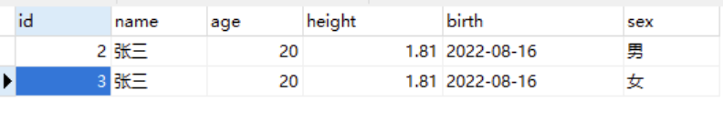

- **pojo类：**

```java
/**
 * 学生类
 */
public class Student {
    private Long id;
    private String name;
    private Integer age;
    private Double height;
    private Character sex;
    private Date birth;
    // constructor
    // setter and getter
    // toString
}
```

## 10.1 单个简单类型参数

简单类型包括：

- byte short int long float double char
- Byte Short Integer Long Float Double Character
- String
- java.util.Date
- java.sql.Date

需求：根据name查、根据id查、根据birth查、根据sex查

```java
package com.gua.mybatis.mapper;

/**
 * 学生数据Sql映射器
 */
public interface StudentMapper {
    /**
     * 根据name查询
     * @param name
     * @return
     */
    List<Student> selectByName(String name);

    /**
     * 根据id查询
     * @param id
     * @return
     */
    Student selectById(Long id);

    /**
     * 根据birth查询
     * @param birth
     * @return
     */
    List<Student> selectByBirth(Date birth);

    /**
     * 根据sex查询
     * @param sex
     * @return
     */
    List<Student> selectBySex(Character sex);
}
```

- **xml**

```xml
<mapper namespace="com.powernode.mybatis.mapper.StudentMapper">
    <select id="selectByName" resultType="student">
        select * from t_student where name = #{name}
    </select>
    <select id="selectById" resultType="student">
        select * from t_student where id = #{id}
    </select>
    <select id="selectByBirth" resultType="student">
        select * from t_student where birth = #{birth}
    </select>
    <select id="selectBySex" resultType="student">
        select * from t_student where sex = #{sex}
    </select>
</mapper>
```

- **test**

```java
public class StudentMapperTest {

    StudentMapper mapper = SqlSessionUtil.openSession().getMapper(StudentMapper.class);

    @Test
    public void testSelectByName(){
        List<Student> students = mapper.selectByName("张三");
        students.forEach(student -> System.out.println(student));
    }
    @Test
    public void testSelectById(){
        Student student = mapper.selectById(2L);
        System.out.println(student);
    }
    @Test
    public void testSelectByBirth(){
        try {
            Date birth = new SimpleDateFormat("yyyy-MM-dd").parse("2022-08-16");
            List<Student> students = mapper.selectByBirth(birth);
            students.forEach(student -> System.out.println(student));
        } catch (ParseException e) {
            throw new RuntimeException(e);
        }

    }
    @Test
    public void testSelectBySex(){
        List<Student> students = mapper.selectBySex('男');
        students.forEach(student -> System.out.println(student));
    }
}

```

通过测试得知，简单类型对于mybatis来说都是可以自动类型识别的：

- 也就是说对于mybatis来说，它是可以自动推断出ps.setXxxx()方法的。ps.setString()还是ps.setInt()。它可以自动推断。

其实SQL映射文件中的配置比较完整的写法是：

```xml
<select id="selectByName" resultType="student" parameterType="java.lang.String">
  select * from t_student where name = #{name, javaType=String, jdbcType=VARCHAR}
</select>
```

其中sql语句中的javaType，jdbcType，以及select标签中的parameterType属性，都是用来帮助mybatis进行类型确定的。不过这些配置多数是可以省略的。因为mybatis它有强大的自动类型推断机制。

- javaType：可以省略
- jdbcType：可以省略
- parameterType：可以省略

**如果参数只有一个的话，#{} 里面的内容就随便写了。对于 ${} 来说，注意加单引号。**

## 10.2 Map参数

需求：根据name和age查询

```java
/**
* 根据name和age查询
* @param paramMap
* @return
*/
List<Student> selectByParamMap(Map<String,Object> paramMap);
```

```java
@Test
public void testSelectByParamMap(){
    // 准备Map
    Map<String,Object> paramMap = new HashMap<>();
    paramMap.put("nameKey", "张三");
    paramMap.put("ageKey", 20);

    List<Student> students = mapper.selectByParamMap(paramMap);
    students.forEach(student -> System.out.println(student));
}
```

```xml
<select id="selectByParamMap" resultType="student">
  select * from t_student where name = #{nameKey} and age = #{ageKey}
</select>
```

测试运行正常。
**这种方式是手动封装Map集合，将每个条件以key和value的形式存放到集合中。然后在使用的时候通过#{map集合的key}来取值。**

## 10.3 实体类参数

需求：插入一条Student数据

```java
/**
 * 保存学生数据
 * @param student
 * @return
 */
int insert(Student student);
```

```xml
<insert id="insert">
  insert into t_student values(null,#{name},#{age},#{height},#{birth},#{sex})
</insert>
```

```java
@Test
public void testInsert(){
    Student student = new Student();
    student.setName("李四");
    student.setAge(30);
    student.setHeight(1.70);
    student.setSex('男');
    student.setBirth(new Date());
    int count = mapper.insert(student);
    SqlSessionUtil.openSession().commit();
}
```

运行正常，数据库中成功添加一条数据。
**这里需要注意的是：#{} 里面写的是属性名字。这个属性名其本质上是：set/get方法名去掉set/get之后的名字。**

## 10.4 多参数

需求：通过name和sex查询

```java
    /**
     * 根据name和sex查询
     * @param name
     * @param sex
     * @return
     */
    List<Student> selectByNameAndSex(String name, Character sex);
```

```java
@Test
public void testSelectByNameAndSex(){
    List<Student> students = mapper.selectByNameAndSex("张三", '女');
    students.forEach(student -> System.out.println(student));
}
```

```xml
<select id="selectByNameAndSex" resultType="student">
  select * from t_student where name = #{name} and sex = #{sex}
</select>
```

执行结果：

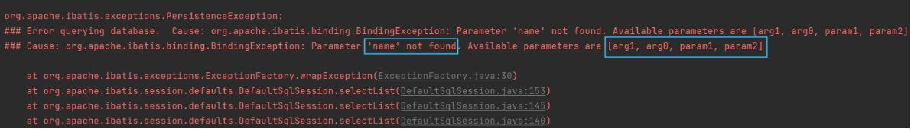

异常信息描述了：name参数找不到，可用的参数包括[arg1, arg0, param1, param2]
修改StudentMapper.xml配置文件：尝试使用[arg1, arg0, param1, param2]去参数

```xml
<select id="selectByNameAndSex" resultType="student">
  <!--select * from t_student where name = #{name} and sex = #{sex}-->
  select * from t_student where name = #{arg0} and sex = #{arg1}
</select>
```

运行结果：

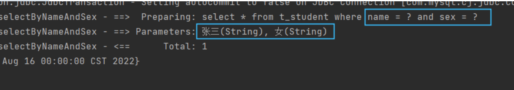

再次尝试修改StudentMapper.xml文件

```xml
<select id="selectByNameAndSex" resultType="student">
  <!--select * from t_student where name = #{name} and sex = #{sex}-->
  <!--select * from t_student where name = #{arg0} and sex = #{arg1}-->
  <!--select * from t_student where name = #{param1} and sex = #{param2}-->
  select * from t_student where name = #{arg0} and sex = #{param2}
</select>
```

通过测试可以看到：

- arg0 是第一个参数
- param1是第一个参数
- arg1 是第二个参数
- param2是第二个参数

实现原理：**实际上在mybatis底层会创建一个map集合，以arg0/param1为key，以方法上的参数为value**，例如以下代码：

```java
Map<String,Object> map = new HashMap<>();
map.put("arg0", name);
map.put("arg1", sex);
map.put("param1", name);
map.put("param2", sex);

// 所以可以这样取值：#{arg0} #{arg1} #{param1} #{param2}
// 其本质就是#{map集合的key}
```

注意：**使用mybatis3.4.2之前的版本时：要用#{0}和#{1}这种形式。**

## 10.5 @Param注解（命名参数）

可以不用arg0 arg1 param1 param2吗？这个map集合的key我们自定义可以吗？当然可以。使用@Param注解即可。这样可以增强可读性。
需求：根据name和age查询

```java
    /**
     * 根据name和age查询
     * @param name
     * @param age
     * @return
     */
    List<Student> selectByNameAndAge(@Param(value="name") String name, @Param("age") int age);
```

```java
    @Test
    public void testSelectByNameAndAge(){
        List<Student> stus = mapper.selectByNameAndAge("张三", 20);
        stus.forEach(student -> System.out.println(student));
    }
```

```xml
<select id="selectByNameAndAge" resultType="student">
  select * from t_student where name = #{name} and age = #{age}
</select>
```

通过测试，一切正常。
核心：@Param("**这里填写的其实就是map集合的key**")

## 10.6 @Param源码分析

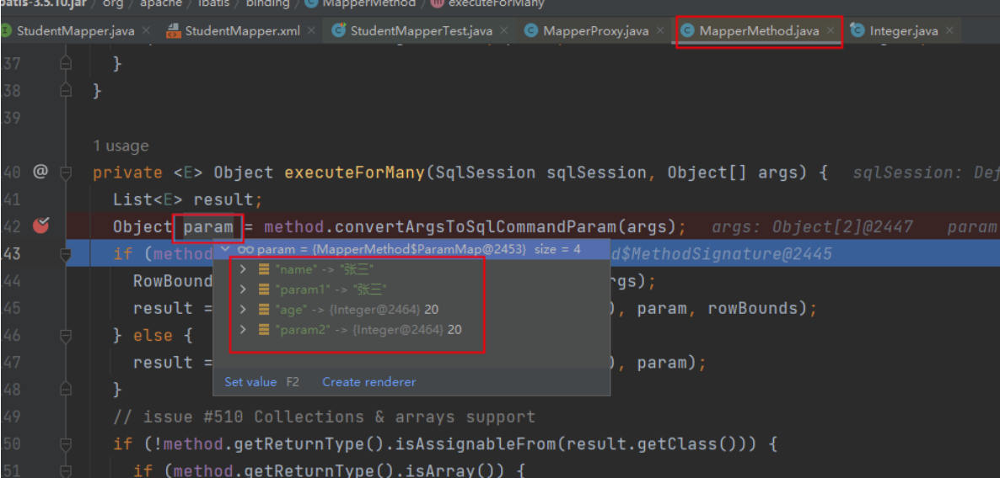

---

# 11. MyBatis查询语句专题

## 11.1 返回Car

当查询的结果，有对应的实体类，并且查询结果只有一条时：

```java
public interface CarMapper {

    /**
     * 根据id主键查询：结果最多只有一条
     * @param id
     * @return
     */
    Car selectById(Long id);
}
```

```xml
<mapper namespace="com.powernode.mybatis.mapper.CarMapper">
    <select id="selectById" resultType="Car">
        select id,car_num carNum,brand,guide_price guidePrice,produce_time produceTime,car_type carType from t_car where id = #{id}
    </select>
</mapper>
```

```java
public class CarMapperTest {
    @Test
    public void testSelectById(){
        CarMapper mapper = SqlSessionUtil.openSession().getMapper(CarMapper.class);
        Car car = mapper.selectById(35L);
        System.out.println(car);
    }
}
```

执行结果：

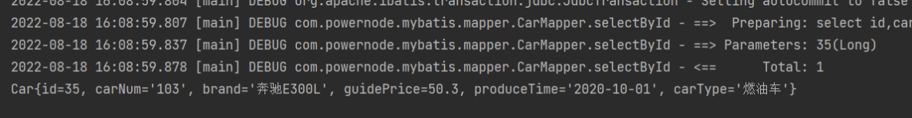

**查询结果是一条的话可以使用List集合接收吗？当然可以**。

```java
/**
* 根据id主键查询：结果最多只有一条，可以放到List集合中吗？
* @return
*/
List<Car> selectByIdToList(Long id);
```

```xml
<select id="selectByIdToList" resultType="Car">
  select id,car_num carNum,brand,guide_price guidePrice,produce_time produceTime,car_type carType from t_car where id = #{id}
</select>
```

```java
@Test
public void testSelectByIdToList(){
    CarMapper mapper = SqlSessionUtil.openSession().getMapper(CarMapper.class);
    List<Car> cars = mapper.selectByIdToList(35L);
    System.out.println(cars);
}
```

执行结果：

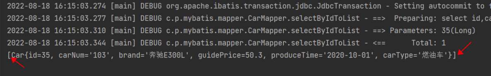

## 11.2 返回List\<Car\>

当查询的记录条数是多条的时候，必须使用集合接收。如果使用单个实体类接收会出现异常。

```java
/**
* 查询所有的Car
* @return
*/
List<Car> selectAll();
```

```xml
<select id="selectAll" resultType="Car">
  select id,car_num carNum,brand,guide_price guidePrice,produce_time produceTime,car_type carType from t_car
</select>
```

```java
@Test
public void testSelectAll(){
    CarMapper mapper = SqlSessionUtil.openSession().getMapper(CarMapper.class);
    List<Car> cars = mapper.selectAll();
    cars.forEach(car -> System.out.println(car));
}
```

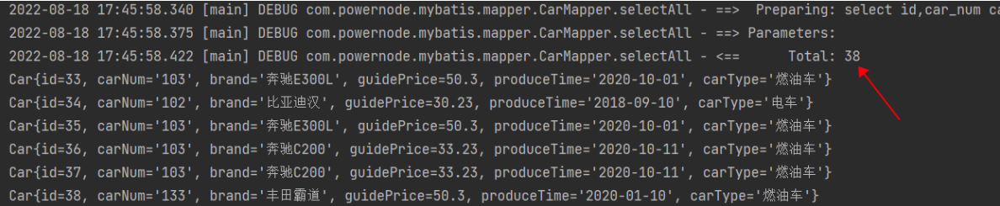

如果返回多条记录，采用单个实体类接收会怎样？

```java
/**
* 查询多条记录，采用单个实体类接收会怎样？
* @return
*/
Car selectAll2();
```

```xml
<select id="selectAll2" resultType="Car">
  select id,car_num carNum,brand,guide_price guidePrice,produce_time produceTime,car_type carType from t_car
</select>
```

```java
@Test
public void testSelectAll2(){
    CarMapper mapper = SqlSessionUtil.openSession().getMapper(CarMapper.class);
    Car car = mapper.selectAll2();
    System.out.println(car);
}
```

执行结果：

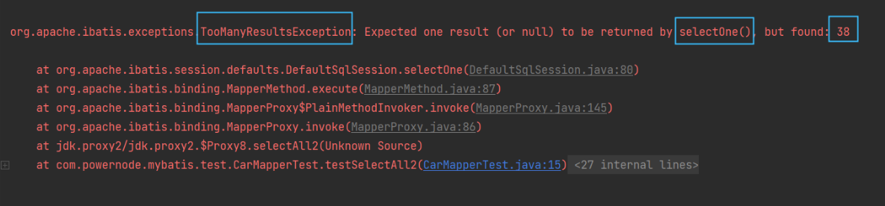

## 11.3 返回Map

当返回的数据，没有合适的实体类对应的话，可以采用Map集合接收。字段名做key，字段值做value。
查询如果可以保证只有一条数据，则返回一个Map集合即可。

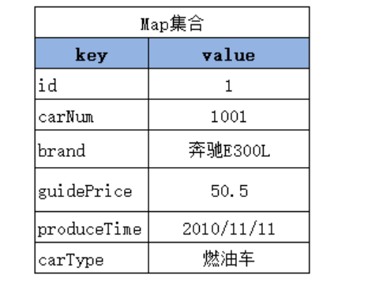


```java
/**
 * 通过id查询一条记录，返回Map集合
 * @param id
 * @return
 */
Map<String, Object> selectByIdRetMap(Long id);
```

```xml
<select id="selectByIdRetMap" resultType="map">
  select id,car_num carNum,brand,guide_price guidePrice,produce_time produceTime,car_type carType from t_car where id = #{id}
</select>
```

**resultMap="map"，这是因为mybatis内置了很多别名。【参见mybatis开发手册】**

```java
@Test
public void testSelectByIdRetMap(){
    CarMapper mapper = SqlSessionUtil.openSession().getMapper(CarMapper.class);
    Map<String,Object> car = mapper.selectByIdRetMap(35L);
    System.out.println(car);
}
```

执行结果：

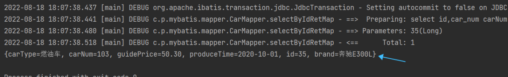

当然，如果返回一个Map集合，可以将Map集合放到List集合中吗？当然可以，这里就不再测试了。
反过来，如果返回的不是一条记录，是多条记录的话，只采用单个Map集合接收，这样同样会出现之前的异常：**TooManyResultsException**

## 11.4 返回List\<Map\>

查询结果条数大于等于1条数据，则可以返回一个存储Map集合的List集合。**List\<Map\>**等同于**List\<Car\>**

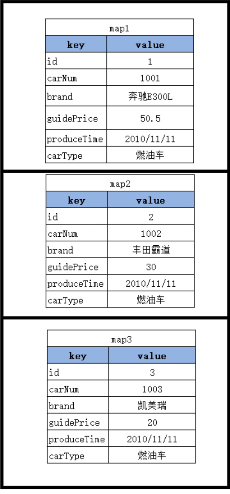


```java
/**
     * 查询所有的Car，返回一个List集合。List集合中存储的是Map集合。
     * @return
     */
List<Map<String,Object>> selectAllRetListMap();
```

```xml
<select id="selectAllRetListMap" resultType="map">
  select id,car_num carNum,brand,guide_price guidePrice,produce_time produceTime,car_type carType from t_car
</select>
```

```java
@Test
public void testSelectAllRetListMap(){
    CarMapper mapper = SqlSessionUtil.openSession().getMapper(CarMapper.class);
    List<Map<String,Object>> cars = mapper.selectAllRetListMap();
    System.out.println(cars);
}
```

执行结果：

```json
[
  {carType=燃油车, carNum=103, guidePrice=50.30, produceTime=2020-10-01, id=33, brand=奔驰E300L}, 
  {carType=电车, carNum=102, guidePrice=30.23, produceTime=2018-09-10, id=34, brand=比亚迪汉}, 
  {carType=燃油车, carNum=103, guidePrice=50.30, produceTime=2020-10-01, id=35, brand=奔驰E300L}, 
  {carType=燃油车, carNum=103, guidePrice=33.23, produceTime=2020-10-11, id=36, brand=奔驰C200},
  ......
]
```

## 11.5 返回Map<String,Map>

**拿Car的id做key，以后取出对应的Map集合时更方便。**

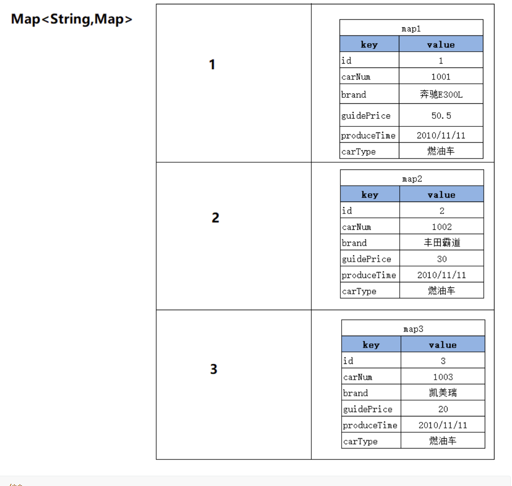


```java
/**
     * 获取所有的Car，返回一个Map集合。
     * Map集合的key是Car的id。
     * Map集合的value是对应Car。
     * @return
     */
@MapKey("id")
Map<Long,Map<String,Object>> selectAllRetMap();
```

```xml
<select id="selectAllRetMap" resultType="map">
  select id,car_num carNum,brand,guide_price guidePrice,produce_time produceTime,car_type carType from t_car
</select>
```

```java
@Test
public void testSelectAllRetMap(){
    CarMapper mapper = SqlSessionUtil.openSession().getMapper(CarMapper.class);
    Map<Long,Map<String,Object>> cars = mapper.selectAllRetMap();
    System.out.println(cars);
}
```

执行结果：

```json
{
64={carType=燃油车, carNum=133, guidePrice=50.30, produceTime=2020-01-10, id=64, brand=丰田霸道}, 
66={carType=燃油车, carNum=133, guidePrice=50.30, produceTime=2020-01-10, id=66, brand=丰田霸道}, 
67={carType=燃油车, carNum=133, guidePrice=50.30, produceTime=2020-01-10, id=67, brand=丰田霸道}, 
69={carType=燃油车, carNum=133, guidePrice=50.30, produceTime=2020-01-10, id=69, brand=丰田霸道},
......
}
```

## 11.6 resultMap结果映射

查询结果的列名和java对象的属性名对应不上怎么办？

- 第一种方式：as 给列起别名
- 第二种方式：使用resultMap进行结果映射
- 第三种方式：是否开启驼峰命名自动映射（配置settings）

### 使用resultMap进行结果映射

```java
/**
     * 查询所有Car，使用resultMap进行结果映射
     * @return
     */
List<Car> selectAllByResultMap();
```

```xml
<!--
        resultMap:
            id：这个结果映射的标识，作为select标签的resultMap属性的值。
            type：结果集要映射的类。可以使用别名。
-->
<resultMap id="carResultMap" type="car">
  <!--对象的唯一标识，官方解释是：为了提高mybatis的性能。建议写上。-->
  <id property="id" column="id"/>
  <result property="carNum" column="car_num"/>
  <!--当属性名和数据库列名一致时，可以省略。但建议都写上。-->
  <!--javaType用来指定属性类型。jdbcType用来指定列类型。一般可以省略。-->
  <result property="brand" column="brand" javaType="string" jdbcType="VARCHAR"/>
  <result property="guidePrice" column="guide_price"/>
  <result property="produceTime" column="produce_time"/>
  <result property="carType" column="car_type"/>
</resultMap>

<!--resultMap属性的值必须和resultMap标签中id属性值一致。-->
<select id="selectAllByResultMap" resultMap="carResultMap">
  select * from t_car
</select>
```

```java
@Test
public void testSelectAllByResultMap(){
    CarMapper carMapper = SqlSessionUtil.openSession().getMapper(CarMapper.class);
    List<Car> cars = carMapper.selectAllByResultMap();
    System.out.println(cars);
}
```

执行结果正常。

### 是否开启驼峰命名自动映射

使用这种方式的前提是：属性名遵循Java的命名规范，数据库表的列名遵循SQL的命名规范。
Java命名规范：首字母小写，后面每个单词首字母大写，遵循驼峰命名方式。
SQL命名规范：全部小写，单词之间采用下划线分割。
比如以下的对应关系：

| **实体类中的属性名** | **数据库表的列名** |
| -------------------- | ------------------ |
| carNum               | car_num            |
| carType              | car_type           |
| produceTime          | produce_time       |

如何启用该功能，在mybatis-config.xml文件中进行配置：

```xml
<!--放在properties标签后面-->
<settings>
  <setting name="mapUnderscoreToCamelCase" value="true"/>
</settings>
```

```java
/**
* 查询所有Car，启用驼峰命名自动映射
* @return
*/
List<Car> selectAllByMapUnderscoreToCamelCase();
```

```xml
<select id="selectAllByMapUnderscoreToCamelCase" resultType="Car">
  select * from t_car
</select>
```

```java
@Test
public void testSelectAllByMapUnderscoreToCamelCase(){
    CarMapper carMapper = SqlSessionUtil.openSession().getMapper(CarMapper.class);
    List<Car> cars = carMapper.selectAllByMapUnderscoreToCamelCase();
    System.out.println(cars);
}
```

执行结果正常。

## 11.7 返回总记录条数

需求：查询总记录条数

```java
/**
     * 获取总记录条数
     * @return
     */
Long selectTotal();
```

```xml
<!--long是别名，可参考mybatis开发手册。-->
<select id="selectTotal" resultType="long">
  select count(*) from t_car
</select>
```

```java
@Test
public void testSelectTotal(){
    CarMapper carMapper = SqlSessionUtil.openSession().getMapper(CarMapper.class);
    Long total = carMapper.selectTotal();
    System.out.println(total);
}
```

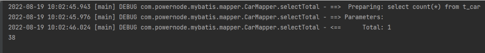

# 12. 动态SQL

有的业务场景，也需要SQL语句进行动态拼接，例如：

- 批量删除
  - `delete from t_car where id in(1,2,3,4,5,6,......这里的值是动态的，根据用户选择的id不同，值是不同的);`

- 多条件查询
  - `select * from t_car where brand like '丰田%' and guide_price > 30 and .....;`

## 12.1 if标签

需求：多条件查询。
可能的条件包括：品牌（brand）、指导价格（guide_price）、汽车类型（car_type）

```java
public interface CarMapper {
    /**
     * 根据多条件查询Car
     * @param brand
     * @param guidePrice
     * @param carType
     * @return
     */
    List<Car> selectByMultiCondition(@Param("brand") String brand, @Param("guidePrice") Double guidePrice, @Param("carType") String carType);
}

```

```xml
<mapper namespace="com.powernode.mybatis.mapper.CarMapper">
    <select id="selectByMultiCondition" resultType="car">
        select * from t_car where
        <if test="brand != null and brand != ''">
            brand like #{brand}"%"
        </if>
        <if test="guidePrice != null and guidePrice != ''">
            and guide_price >= #{guidePrice}
        </if>
        <if test="carType != null and carType != ''">
            and car_type = #{carType}
        </if>
    </select>

</mapper>
```

```java
import java.util.List;

public class CarMapperTest {
    @Test
    public void testSelectByMultiCondition(){
        CarMapper mapper = SqlSessionUtil.openSession().getMapper(CarMapper.class);
        List<Car> cars = mapper.selectByMultiCondition("丰田", 20.0, "燃油车");
        System.out.println(cars);
    }
}
```

执行结果：

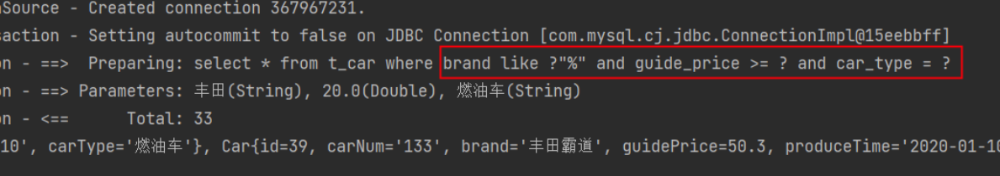

如果第一个条件为空，剩下两个条件不为空，会是怎样呢？

```java
List<Car> cars = mapper.selectByMultiCondition("", 20.0, "燃油车");
```

执行结果：

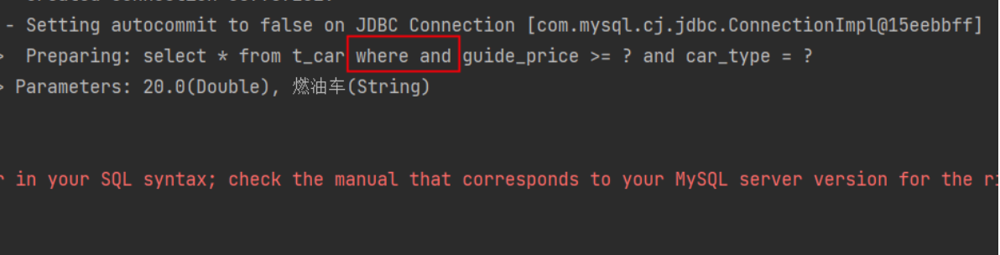

报错了，SQL语法有问题，where后面出现了and。这该怎么解决呢？

- 可以where后面添加一个恒成立的条件。

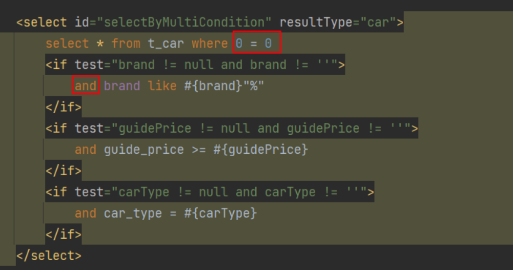

执行结果：

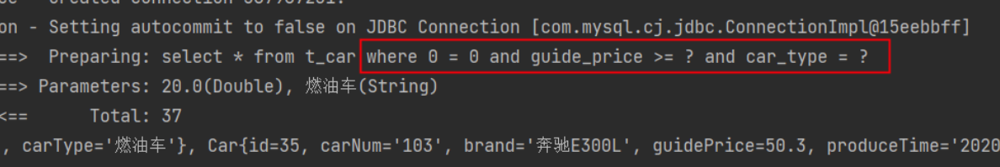

如果三个条件都是空，有影响吗？

```java
List<Car> cars = mapper.selectByMultiCondition("", null, "");
```

执行结果：

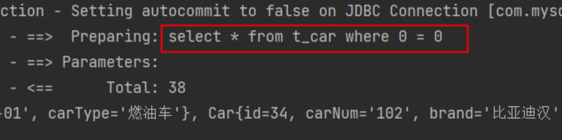

三个条件都不为空呢？

```java
List<Car> cars = mapper.selectByMultiCondition("丰田", 20.0, "燃油车");
```

执行结果：

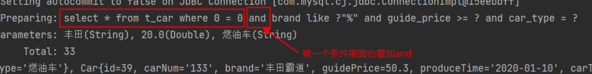

## 12.2 where标签

where标签的作用：让where子句更加动态智能。

- 所有条件都为空时，where标签保证不会生成where子句。
- 自动去除某些条件**前面**多余的and或or。

继续使用if标签中的需求。

```java
/**
* 根据多条件查询Car，使用where标签
* @param brand
* @param guidePrice
* @param carType
* @return
*/
List<Car> selectByMultiConditionWithWhere(@Param("brand") String brand, @Param("guidePrice") Double guidePrice, @Param("carType") String carType);
```

```xml
<select id="selectByMultiConditionWithWhere" resultType="car">
  select * from t_car
  <where>
    <if test="brand != null and brand != ''">
      and brand like #{brand}"%"
    </if>
    <if test="guidePrice != null and guidePrice != ''">
      and guide_price >= #{guidePrice}
    </if>
    <if test="carType != null and carType != ''">
      and car_type = #{carType}
    </if>
  </where>
</select>
```

```java
@Test
public void testSelectByMultiConditionWithWhere(){
    CarMapper mapper = SqlSessionUtil.openSession().getMapper(CarMapper.class);
    List<Car> cars = mapper.selectByMultiConditionWithWhere("丰田", 20.0, "燃油车");
    System.out.println(cars);
}
```

运行结果：

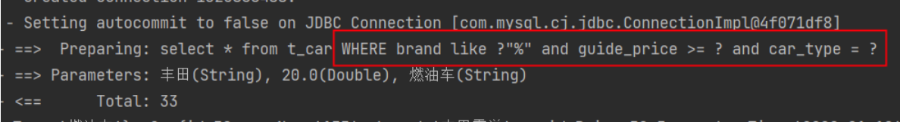

如果所有条件都是空呢？

```java
List<Car> cars = mapper.selectByMultiConditionWithWhere("", null, "");
```

运行结果：

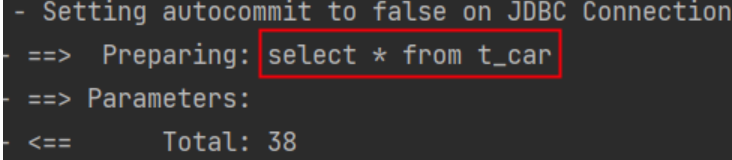

它可以自动去掉前面多余的and，那可以自动去掉前面多余的or吗？

```java
List<Car> cars = mapper.selectByMultiConditionWithWhere("丰田", 20.0, "燃油车");
```

```xml
<select id="selectByMultiConditionWithWhere" resultType="car">
  select * from t_car
  <where>
    <if test="brand != null and brand != ''">
      or brand like #{brand}"%"
    </if>
    <if test="guidePrice != null and guidePrice != ''">
      and guide_price >= #{guidePrice}
    </if>
    <if test="carType != null and carType != ''">
      and car_type = #{carType}
    </if>
  </where>
</select>
```

执行结果：

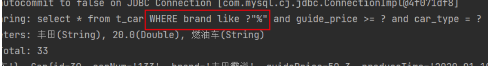

它可以自动去掉前面多余的and，那可以自动去掉后面多余的and吗？

```xml
<select id="selectByMultiConditionWithWhere" resultType="car">
  select * from t_car
  <where>
    <if test="brand != null and brand != ''">
      brand like #{brand}"%" and
    </if>
    <if test="guidePrice != null and guidePrice != ''">
      guide_price >= #{guidePrice} and
    </if>
    <if test="carType != null and carType != ''">
      car_type = #{carType}
    </if>
  </where>
</select>
```

```xml
// 让最后一个条件为空
List<Car> cars = mapper.selectByMultiConditionWithWhere("丰田", 20.0, "");
```

运行结果：

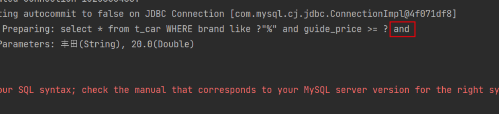

很显然，后面多余的and是不会被去除的。

## 12.3 trim标签

trim标签的属性：

- prefix：在trim标签中的语句前**添加**内容
- suffix：在trim标签中的语句后**添加**内容
- prefixOverrides：前缀**覆盖掉（去掉）**
- suffixOverrides：后缀**覆盖掉（去掉）**

```java
/**
* 根据多条件查询Car，使用trim标签
* @param brand
* @param guidePrice
* @param carType
* @return
*/
List<Car> selectByMultiConditionWithTrim(@Param("brand") String brand, @Param("guidePrice") Double guidePrice, @Param("carType") String carType);
```

```xml
<select id="selectByMultiConditionWithTrim" resultType="car">
  select * from t_car
  <trim prefix="where" suffixOverrides="and|or">
    <if test="brand != null and brand != ''">
      brand like #{brand}"%" and
    </if>
    <if test="guidePrice != null and guidePrice != ''">
      guide_price >= #{guidePrice} and
    </if>
    <if test="carType != null and carType != ''">
      car_type = #{carType}
    </if>
  </trim>
</select>
```

```java
@Test
public void testSelectByMultiConditionWithTrim(){
    CarMapper mapper = SqlSessionUtil.openSession().getMapper(CarMapper.class);
    List<Car> cars = mapper.selectByMultiConditionWithTrim("丰田", 20.0, "");
    System.out.println(cars);
}
```

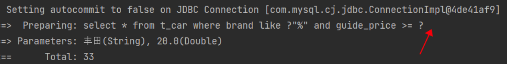

如果所有条件为空，where会被加上吗？

```java
List<Car> cars = mapper.selectByMultiConditionWithTrim("", null, "");
```

执行结果：

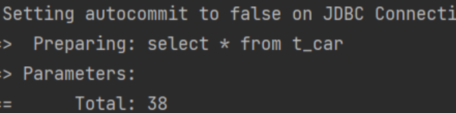

## 12.4 set标签

主要使用在update语句当中，用来生成set关键字，同时去掉最后多余的“,”
比如我们只更新提交的不为空的字段，如果提交的数据是空或者""，那么这个字段我们将不更新。

```java
/**
* 更新信息，使用set标签
* @param car
* @return
*/
int updateWithSet(Car car);
```

```xml
<update id="updateWithSet">
  update t_car
  <set>
    <if test="carNum != null and carNum != ''">car_num = #{carNum},</if>
    <if test="brand != null and brand != ''">brand = #{brand},</if>
    <if test="guidePrice != null and guidePrice != ''">guide_price = #{guidePrice},</if>
    <if test="produceTime != null and produceTime != ''">produce_time = #{produceTime},</if>
    <if test="carType != null and carType != ''">car_type = #{carType},</if>
  </set>
  where id = #{id}
</update>
```

```java
@Test
public void testUpdateWithSet(){
    CarMapper mapper = SqlSessionUtil.openSession().getMapper(CarMapper.class);
    Car car = new Car(38L,"1001","丰田霸道2",10.0,"",null);
    int count = mapper.updateWithSet(car);
    System.out.println(count);
    SqlSessionUtil.openSession().commit();
}
```

执行结果：

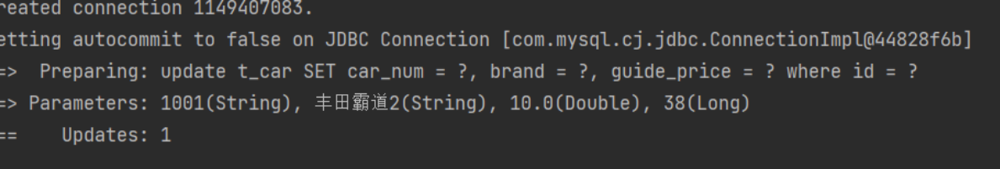

## 12.5 choose when otherwise

这三个标签是在一起使用的：

```xml
<choose>
  <when></when>
  <when></when>
  <when></when>
  <otherwise></otherwise>
</choose>
```

等同于：

```java
if(){
    
}else if(){
    
}else if(){
    
}else if(){
    
}else{

}
```

只有一个分支会被选择！！！！
需求：先根据品牌查询，如果没有提供品牌，再根据指导价格查询，如果没有提供指导价格，就根据生产日期查询。

```java
/**
* 使用choose when otherwise标签查询
* @param brand
* @param guidePrice
* @param produceTime
* @return
*/
List<Car> selectWithChoose(@Param("brand") String brand, @Param("guidePrice") Double guidePrice, @Param("produceTime") String produceTime);
```

```xml
<select id="selectWithChoose" resultType="car">
  select * from t_car
  <where>
    <choose>
      <when test="brand != null and brand != ''">
        brand like #{brand}"%"
      </when>
      <when test="guidePrice != null and guidePrice != ''">
        guide_price >= #{guidePrice}
      </when>
      <otherwise>
        produce_time >= #{produceTime}
      </otherwise>
    </choose>
  </where>
</select>
```

```java
@Test
public void testSelectWithChoose(){
    CarMapper mapper = SqlSessionUtil.openSession().getMapper(CarMapper.class);
    //List<Car> cars = mapper.selectWithChoose("丰田霸道", 20.0, "2000-10-10");
    //List<Car> cars = mapper.selectWithChoose("", 20.0, "2000-10-10");
    //List<Car> cars = mapper.selectWithChoose("", null, "2000-10-10");
    List<Car> cars = mapper.selectWithChoose("", null, "");
    System.out.println(cars);
}
```

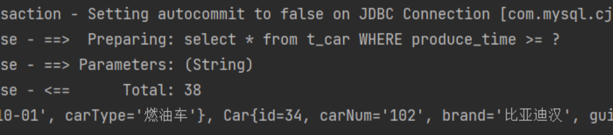

## 12.6 foreach标签

循环数组或集合，动态生成sql，比如这样的SQL：

```sql
delete from t_car where id in(1,2,3);
delete from t_car where id = 1 or id = 2 or id = 3;
```

```sql
insert into t_car values
  (null,'1001','凯美瑞',35.0,'2010-10-11','燃油车'),
  (null,'1002','比亚迪唐',31.0,'2020-11-11','新能源'),
  (null,'1003','比亚迪宋',32.0,'2020-10-11','新能源')
```

### 批量删除

- 用in来删除

```java
/**
* 通过foreach完成批量删除
* @param ids
* @return
*/
int deleteBatchByForeach(@Param("ids") Long[] ids);
```

```xml
<!--
collection：集合或数组
item：集合或数组中的元素
separator：分隔符
open：foreach标签中所有内容的开始
close：foreach标签中所有内容的结束
-->
<delete id="deleteBatchByForeach">
  delete from t_car where id in
  <foreach collection="ids" item="id" separator="," open="(" close=")">
    #{id}
  </foreach>
</delete>
```

```java
@Test
public void testDeleteBatchByForeach(){
    CarMapper mapper = SqlSessionUtil.openSession().getMapper(CarMapper.class);
    int count = mapper.deleteBatchByForeach(new Long[]{40L, 41L, 42L});
    System.out.println("删除了几条记录：" + count);
    SqlSessionUtil.openSession().commit();
}
```

执行结果：

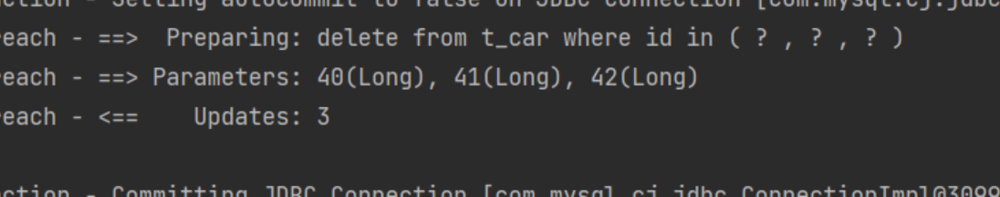

- 用or来删除

```java
/**
* 通过foreach完成批量删除
* @param ids
* @return
*/
int deleteBatchByForeach2(@Param("ids") Long[] ids);
```

```xml
<delete id="deleteBatchByForeach2">
  delete from t_car where
  <foreach collection="ids" item="id" separator="or">
    id = #{id}
  </foreach>
</delete>
```

```java
@Test
public void testDeleteBatchByForeach2(){
    CarMapper mapper = SqlSessionUtil.openSession().getMapper(CarMapper.class);
    int count = mapper.deleteBatchByForeach2(new Long[]{40L, 41L, 42L});
    System.out.println("删除了几条记录：" + count);
    SqlSessionUtil.openSession().commit();
}
```

执行结果：

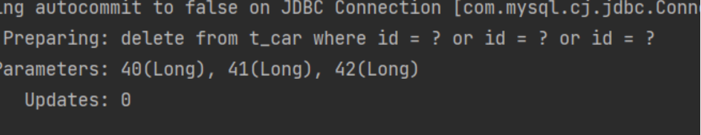

### 批量添加

```java
/**
* 批量添加，使用foreach标签
* @param cars
* @return
*/
int insertBatchByForeach(@Param("cars") List<Car> cars);
```

```xml
<insert id="insertBatchByForeach">
  insert into t_car values 
  <foreach collection="cars" item="car" separator=",">
    (null,#{car.carNum},#{car.brand},#{car.guidePrice},#{car.produceTime},#{car.carType})
  </foreach>
</insert>
```

```java
@Test
public void testInsertBatchByForeach(){
    CarMapper mapper = SqlSessionUtil.openSession().getMapper(CarMapper.class);
    Car car1 = new Car(null, "2001", "兰博基尼", 100.0, "1998-10-11", "燃油车");
    Car car2 = new Car(null, "2001", "兰博基尼", 100.0, "1998-10-11", "燃油车");
    Car car3 = new Car(null, "2001", "兰博基尼", 100.0, "1998-10-11", "燃油车");
    List<Car> cars = Arrays.asList(car1, car2, car3);
    int count = mapper.insertBatchByForeach(cars);
    System.out.println("插入了几条记录" + count);
    SqlSessionUtil.openSession().commit();
}
```

执行结果：

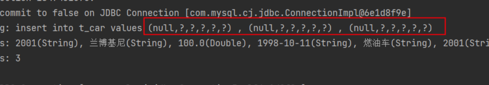

## 12.7 sql标签与include标签

sql标签用来声明sql片段
include标签用来将声明的sql片段包含到某个sql语句当中
作用：代码复用。易维护。

```xml
<sql id="carCols">id,car_num carNum,brand,guide_price guidePrice,produce_time produceTime,car_type carType</sql>

<select id="selectAllRetMap" resultType="map">
  select <include refid="carCols"/> from t_car
</select>

<select id="selectAllRetListMap" resultType="map">
  select <include refid="carCols"/> carType from t_car
</select>

<select id="selectByIdRetMap" resultType="map">
  select <include refid="carCols"/> from t_car where id = #{id}
</select>
```

