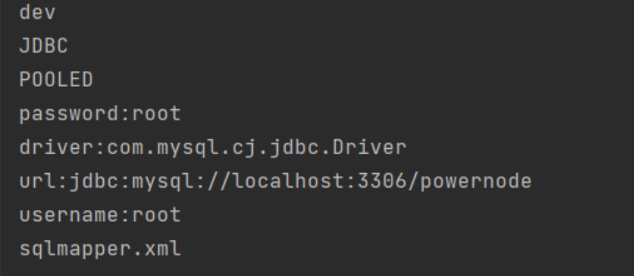
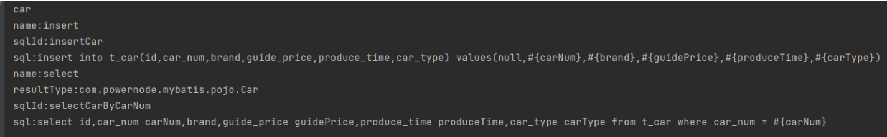

# 手写MyBatis框架(理解原理)

# 1. 解析xml文件

第一步：引入dom4j和jaxen的依赖

```xml
<!--dom4j依赖-->
        <dependency>
            <groupId>org.dom4j</groupId>
            <artifactId>dom4j</artifactId>
            <version>2.1.3</version>
        </dependency>
        <!--jaxen依赖-->
        <dependency>
            <groupId>jaxen</groupId>
            <artifactId>jaxen</artifactId>
            <version>1.2.0</version>
        </dependency>
```

第二步：编写配置文件godbatis-config.xml

```xml
<?xml version="1.0" encoding="UTF-8" ?>

<configuration>
    <environments default="dev">
        <environment id="dev">
            <transactionManager type="JDBC"/>
            <dataSource type="POOLED">
                <property name="driver" value="com.mysql.cj.jdbc.Driver"/>
                <property name="url" value="jdbc:mysql://localhost:3306/powernode"/>
                <property name="username" value="root"/>
                <property name="password" value="root"/>
            </dataSource>
        </environment>
        <mappers>
            <mapper resource="sqlmapper.xml"/>
        </mappers>
    </environments>
</configuration>
```

第三步：解析godbatis-config.xml

```java
/**
 * 使用dom4j解析XML文件
 */
public class ParseXMLByDom4j {
    @Test
    public void testGodBatisConfig() throws Exception{

        // 读取xml，获取document对象
        SAXReader saxReader = new SAXReader();
        Document document = saxReader.read(Thread.currentThread().getContextClassLoader().getResourceAsStream("godbatis-config.xml"));

        // 获取<environments>标签的default属性的值
        Element environmentsElt = (Element)document.selectSingleNode("/configuration/environments");
        String defaultId = environmentsElt.attributeValue("default");
        System.out.println(defaultId);

        // 获取environment标签
        Element environmentElt = (Element)document.selectSingleNode("/configuration/environments/environment[@id='" + defaultId + "']");

        // 获取事务管理器类型
        Element transactionManager = environmentElt.element("transactionManager");
        String transactionManagerType = transactionManager.attributeValue("type");
        System.out.println(transactionManagerType);

        // 获取数据源类型
        Element dataSource = environmentElt.element("dataSource");
        String dataSourceType = dataSource.attributeValue("type");
        System.out.println(dataSourceType);

        // 将数据源信息封装到Map集合
        Map<String,String> dataSourceMap = new HashMap<>();
        dataSource.elements().forEach(propertyElt -> {
            dataSourceMap.put(propertyElt.attributeValue("name"), propertyElt.attributeValue("value"));
        });

        dataSourceMap.forEach((k, v) -> System.out.println(k + ":" + v));

        // 获取sqlmapper.xml文件的路径
        Element mappersElt = (Element) document.selectSingleNode("/configuration/environments/mappers");
        mappersElt.elements().forEach(mapper -> {
            System.out.println(mapper.attributeValue("resource"));
        });
    }
}
```

执行结果：



第四步：编写配置文件sqlmapper.xml

```xml
<?xml version="1.0" encoding="UTF-8" ?>

<mapper namespace="car">
    <insert id="insertCar">
        insert into t_car(id,car_num,brand,guide_price,produce_time,car_type) values(null,#{carNum},#{brand},#{guidePrice},#{produceTime},#{carType})
    </insert>
    <select id="selectCarByCarNum" resultType="com.powernode.mybatis.pojo.Car">
        select id,car_num carNum,brand,guide_price guidePrice,produce_time produceTime,car_type carType from t_car where car_num = #{carNum}
    </select>
</mapper>
```

第五步：解析sqlmapper.xml

```java
@Test
public void testSqlMapper() throws Exception{
    // 读取xml，获取document对象
    SAXReader saxReader = new SAXReader();
    Document document = saxReader.read(Thread.currentThread().getContextClassLoader().getResourceAsStream("sqlmapper.xml"));

    // 获取namespace
    Element mapperElt = (Element) document.selectSingleNode("/mapper");
    String namespace = mapperElt.attributeValue("namespace");
    System.out.println(namespace);

    // 获取sql id
    mapperElt.elements().forEach(statementElt -> {
        // 标签名
        String name = statementElt.getName();
        System.out.println("name:" + name);
        // 如果是select标签，还要获取它的resultType
        if ("select".equals(name)) {
            String resultType = statementElt.attributeValue("resultType");
            System.out.println("resultType:" + resultType);
        }
        // sql id
        String id = statementElt.attributeValue("id");
        System.out.println("sqlId:" + id);
        // sql语句
        String sql = statementElt.getTextTrim();
        System.out.println("sql:" + sql);
    });
}
```

执行结果：



> 用正则表达式一键替换 #{} 为 ?

---

