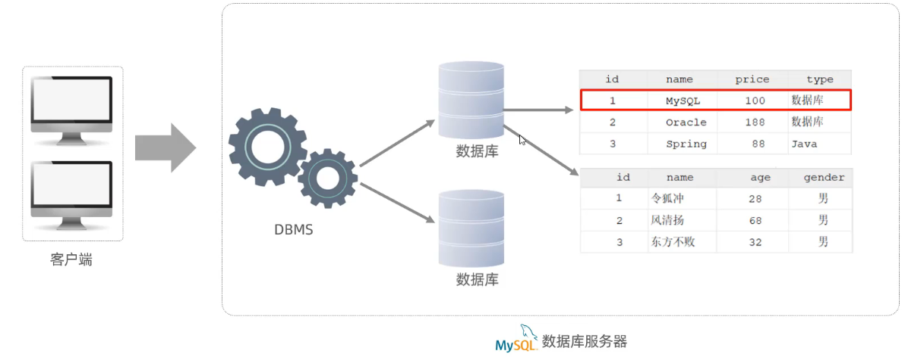

# MySQL数据库-基础

# 1. 数据库概述

## 1.1 数据库相关概念

| 名称 | 全称 | 简称 |
| --- | --- | --- |
| 数据库 | 存储数据的仓库，数据是有组织的进行存储 | DataBase（DB） |
| 数据库管理系统 | 操纵和管理数据库的大型软件 | DataBase Management System（DBMS） |
| SQL | 操作关系型数据库的编程语言，定义了一套操作关系型数据库统一标准 | Structured Query Language（SQL） |

---

## 1.2 关系型数据库（RDBMS）

**概念：** 建立在关系模型基础上，由多张相互连接的二维表组成的数据库。

**特点：**

1. 使用表存储数据，格式统一，便于维护
2. 使用SQL语言操作，标准统一，使用方便

---

## 1.3 数据模型



---

# 2. SQL

## 2.1 SQL通用语法

1. SQL语句可以单行或多行书写，以分号结尾。
2. SQL语句可以使用空格/缩进来增强语句的可读性。
3. MySQL数据库的SQL语句不区分大小写，关键字建议使用大写。
4. 注释：
   - 单行注释：-- 注释内容 或 # 注释内容(MySQL特有)
   - 多行注释：/* 注释内容 */

---

## 2.2 SQL分类

| 分类 | 全称 | 说明 |
| --- | --- | --- |
| DDL | Data Definition Language | 数据定义语言，用来定义数据库对象(数据库，表，字段) |
| DML | Data Manipulation Language | 数据操作语言，用来对数据库表中的数据进行增删改 |
| DQL | Data Query Language | 数据查询语言，用来查询数据库中表的记录 |
| DCL | Data Control Language | 数据控制语言，用来创建数据库用户、控制数据库的访问权限 |

---

## 2.3 DDL

### 2.3.1 DDL-数据库操作

> 方括号内容可选

**查询**

- 查询所有数据库

```sql
SHOW DATABASES;
```

- 查询当前数据库

```sql
SELECT DATABASE();
```

**创建**

```sql
CREATE DATABASE [IF NOT EXISTS] 数据库名 [DEFAULT CHARSET 字符集] [COLLATE 排序规则];
```

**删除**

```sql
DROP DATABASE [IF EXISTS] 数据库名;
```

**使用**

```sql
USE 数据库名;
```

---

### 2.3.2 数据类型

MySQL中的数据类型有很多，主要分为三类：数值类型、字符串类型、日期时间类型。

***数值类型***

| 分类 | 类型 | 大小 | 有符号(SIGNED)范围 | 无符号(UNSIGNED)范围 | 描述 |
| --- | --- | --- | --- | --- | --- |
| 数值类型 | TINYINT | 1 byte | (-128, 127) | (0, 255) | 小整数值 |
| | SMALLINT | 2 bytes | (-32768, 32767) | (0, 65535) | 大整数值 |
| | MEDIUMINT | 3 bytes | (-8388608, 8388607) | (0, 16777215) | 大整数值 |
| | INT或INTEGER | 4 bytes | (-2147483648, 2147483647) | (0, 4294967295) | 大整数值 |
| | BIGINT | 8 bytes | (-2^63, 2^63-1) | (0, 2^64-1) | 极大整数值 |
| | FLOAT | 4 bytes | (-3.402823466 E+38, 3.402823466351 E+38) | 0 和 (1.175494351 E-38, 3.402823466 E+38) | 单精度浮点数值 |
| | DOUBLE | 8 bytes | (-1.7976931348623157 E+308, 1.7976931348623157 E+308) | 0 和 (2.2250738585072014 E-308, 1.7976931348623157 E+308) | 双精度浮点数值 |
| | DECIMAL | 依赖于M(精度)和D(标度)的值 | 依赖于M(精度)和D(标度)的值 | | 小数值(精确定点数) |

---

***字符串类型***

| 分类 | 类型 | 大小 | 描述 |
| --- | --- | --- | --- |
| 字符串类型 | CHAR | 0-255 bytes | 定长字符串 |
| | VARCHAR | 0-65535 bytes | 变长字符串 |
| | TINYBLOB | 0-255 bytes | 不超过255个字符的二进制数据 |
| | TINYTEXT | 0-255 bytes | 短文本字符串 |
| | BLOB | 0-65 535 bytes | 二进制形式的长文本数据 |
| | TEXT | 0-65 535 bytes | 长文本数据 |
| | MEDIUMBLOB | 0-16 777 215 bytes | 二进制形式的中等长度文本数据 |
| | MEDIUMTEXT | 0-16 777 215 bytes | 中等长度文本数据 |
| | LONGBLOB | 0-4 294 967 295 bytes | 二进制形式的极大文本数据 |
| | LONGTEXT | 0-4 294 967 295 bytes | 极大文本数据 |

> char的性能相对varchar好些 , 但是varchar更加灵活
>
> char(10)：定长，固定占10个字符的空间，不足补空格；varchar(10)：变长，按实际数据长度占用空间，另需1~2字节记录长度，最多存10个字符。
> 注意：括号内是字符数，不是字节数（字节数由字符集决定）。

---

***日期类型***

| 分类 | 类型 | 大小 | 范围 | 格式 | 描述 |
| --- | --- | --- | --- | --- | --- |
| 日期类型 | DATE | 3 | 1000-01-01 至 9999-12-31 | YYYY-MM-DD | 日期值 |
| | TIME | 3 | -838:59:59 至 838:59:59 | HH:MM:SS | 时间值或持续时间 |
| | YEAR | 1 | 1901 至 2155 | YYYY | 年份值 |
| | DATETIME | 8 | 1000-01-01 00:00:00 至 9999-12-31 23:59:59 | YYYY-MM-DD HH:MM:SS | 混合日期和时间值 |
| | TIMESTAMP | 4 | 1970-01-01 00:00:01 至 2038-01-19 03:14:07 | YYYY-MM-DD HH:MM:SS | 混合日期和时间值，时间戳 |

---

### 2.3.3 DDL-表操作

**查询**

- 查询当前数据库所有表

```sql
SHOW TABLES;
```

- 查询表结构

```sql
DESC 表名;
```

- 查询指定表的建表语句

```sql
SHOW CREATE TABLE 表名;
```

**创建**

```sql
CREATE TABLE 表名(
    字段1 字段1类型 [COMMENT 字段1注释],
    字段2 字段2类型 [COMMENT 字段2注释],
    字段3 字段3类型 [COMMENT 字段3注释],
    ......
    字段n 字段n类型 [COMMENT 字段n注释]
) [COMMENT 表注释];
```

> 注意：[...]为可选参数，最后一个字段后面没有逗号

**修改**

- 添加字段

```sql
ALTER TABLE 表名 ADD 字段名 类型(长度) [COMMENT 注释] [约束];
```

- 修改数据类型

```sql
ALTER TABLE 表名 MODIFY 字段名 新数据类型(长度);
```

- 修改字段名和字段类型

```sql
ALTER TABLE 表名 CHANGE 旧字段名 新字段名 类型(长度) [COMMENT 注释] [约束];
```

- 删除字段

```sql
ALTER TABLE 表名 DROP 字段名;
```

- 修改表名

```sql
ALTER TABLE 表名 RENAME TO 新表名;
```

**删除**

- 删除表

```sql
DROP TABLE [IF EXISTS] 表名;
```

- 删除指定表，并重新创建该表

```sql
TRUNCATE TABLE 表名;
```

---

## 2.4 DML

### 2.4.1 添加数据

1. 给指定字段添加数据

```sql
INSERT INTO 表名 (字段名1, 字段名2, ...) VALUES (值1, 值2, ...);
```

2. 给全部字段添加数据

```sql
INSERT INTO 表名 VALUES (值1, 值2, ...);
```

3. 批量添加数据

```sql
INSERT INTO 表名 (字段名1, 字段名2, ...) VALUES (值1, 值2, ...), (值1, 值2, ...), (值1, 值2, ...);
```

```sql
INSERT INTO 表名 VALUES (值1, 值2, ...), (值1, 值2, ...), (值1, 值2, ...);
```

> **注意：**
> - 插入数据时，指定的字段顺序需要与值的顺序是一一对应的。
> - 字符串和日期型数据应该包含在引号中。
> - 插入的数据大小，应该在字段的规定范围内。

---

### 2.4.2 修改数据

```sql
UPDATE 表名 SET 字段名1=值1, 字段名2=值2, .... [WHERE 条件];
```

> 注意：修改语句的条件可以有，也可以没有，如果没有条件，则会修改整张表的所有数据。

---

### 2.4.3 删除数据

```sql
DELETE FROM 表名 [WHERE 条件]
```

> **注意：**
> - DELETE 语句的条件可以有，也可以没有，如果没有条件，则会删除整张表的所有数据。
> - DELETE 语句不能删除某一个字段的值(可以使用UPDATE)。

---

## 2.5 DQL

### 2.5.1 语法

```sql
SELECT
    字段列表
FROM
    表名列表
WHERE
    条件列表
GROUP BY
    分组字段列表
HAVING
    分组后条件列表
ORDER BY
    排序字段列表
LIMIT
    分页参数
```

- `基本查询`
- `条件查询（WHERE）`
- `聚合函数（count、max、min、avg、sum）`
- `分组查询（GROUP BY）`
- `排序查询（ORDER BY）`
- `分页查询（LIMIT）`

---

### 2.5.2 基本查询

1. 查询多个字段

```sql
SELECT 字段1,字段2,字段3 ... FROM 表名;
```

```sql
SELECT * FROM 表名;
```

2. 设置别名

```sql
SELECT 字段1 [AS 别名1],字段2 [AS 别名2] ... FROM 表名;
```

3. 去除重复记录

```sql
SELECT DISTINCT 字段列表 FROM 表名;
```

---

### 2.5.3 条件查询

1. **语法**

```sql
SELECT 字段列表 FROM 表名 WHERE 条件列表;
```

2. **条件**

- ***比较运算符***

| 比较运算符 | 功能 |
| --- | --- |
| > | 大于 |
| >= | 大于等于 |
| < | 小于 |
| <= | 小于等于 |
| = | 等于 |
| <> 或 != | 不等于 |
| BETWEEN ... AND ... | 在某个范围之内(含最小、最大值) |
| IN(...) | 在in之后的列表中的值，多选一 |
| LIKE 占位符 | 模糊匹配(_匹配单个字符, %匹配任意个字符) |
| IS NULL | 是NULL |

- ***逻辑运算符***

| 逻辑运算符 | 功能 |
| --- | --- |
| AND 或 && | 并且(多个条件同时成立) |
| OR 或 \|\| | 或者(多个条件任意一个成立) |
| NOT 或 ! | 非，不是 |

---

### 2.5.4 聚合函数

1. **介绍**

将**一列**数据作为一个整体，进行纵向计算。

2. **常见聚合函数**

| 函数 | 功能 |
| --- | --- |
| count | 统计数量 |
| max | 最大值 |
| min | 最小值 |
| avg | 平均值 |
| sum | 求和 |

> 注意: 是按列计算的

3. **语法**

```sql
SELECT 聚合函数(字段列表) FROM 表名;
```

- **注意: null值不参与所有聚合函数运算.**

### 2.5.5 分组查询

1. **语法**

```sql
SELECT 字段列表 FROM 表名 [WHERE 条件] GROUP BY 分组字段名 [HAVING 分组后过滤条件];
```

2. **where与having区别**

- 执行时机不同：where是分组之前进行过滤，不满足where条件，不参与分组；而having是分组之后对结果进行过滤。
- 判断条件不同：where不能对聚合函数进行判断，而having可以。

> **注意**
>
> - 执行顺序：where > 聚合函数 > having。
> - 分组之后，查询的字段一般为聚合函数和分组字段，查询其他字段无任何意义。

### 2.5.6 排序查询

1. **语法**

```sql
SELECT 字段列表 FROM 表名 ORDER BY 字段1 排序方式1,字段2 排序方式2;
```

2. **排序方式**

- ASC：升序（默认值）
- DESC：降序

> 注意：如果是多字段排序，当第一个字段值相同时，才会根据第二个字段进行排序。

---

