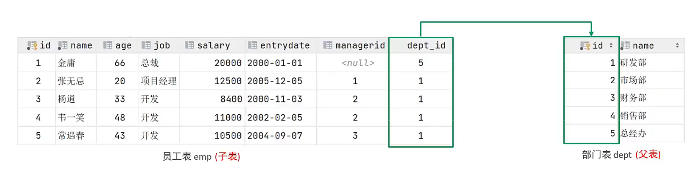
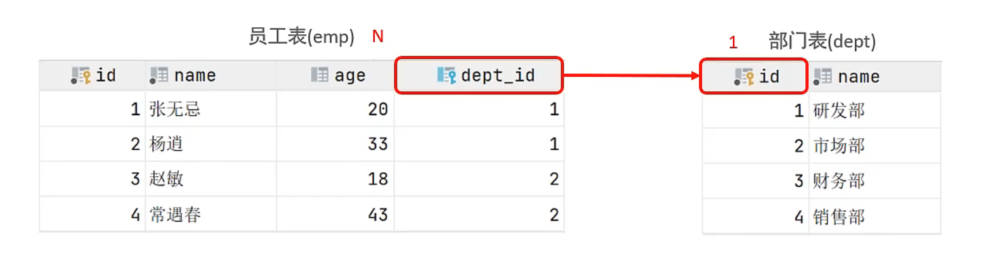
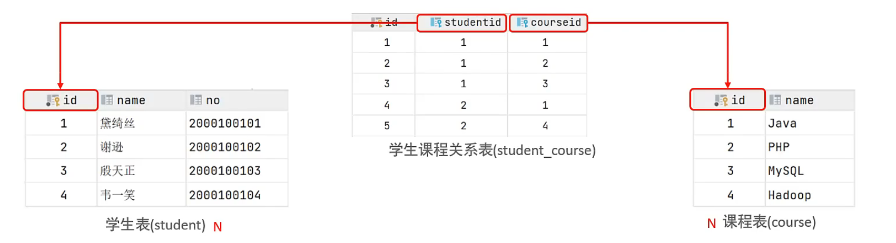
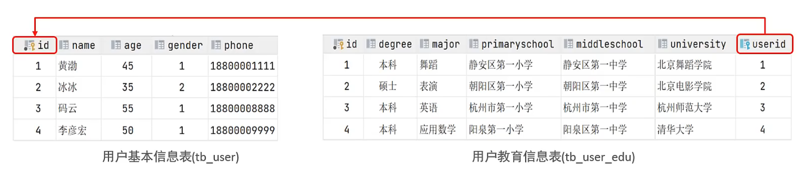
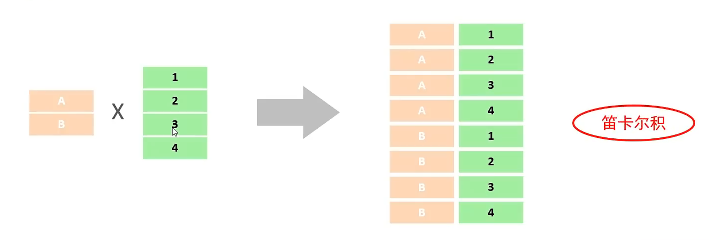
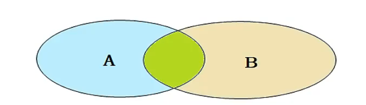
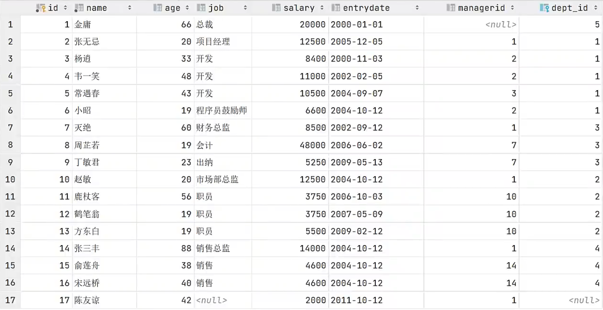

# MySQL数据库-基础

# 1. 数据库概述

## 1.1 数据库相关概念

| 名称 | 全称 | 简称 |
| --- | --- | --- |
| 数据库 | 存储数据的仓库，数据是有组织的进行存储 | DataBase（DB） |
| 数据库管理系统 | 操纵和管理数据库的大型软件 | DataBase Management System（DBMS） |
| SQL | 操作关系型数据库的编程语言，定义了一套操作关系型数据库统一标准 | Structured Query Language（SQL） |

---

## 1.2 关系型数据库（RDBMS）

**概念：** 建立在关系模型基础上，由多张相互连接的二维表组成的数据库。

**特点：**

1. 使用表存储数据，格式统一，便于维护
2. 使用SQL语言操作，标准统一，使用方便

---

## 1.3 数据模型


---

# 2. SQL

## 2.1 SQL通用语法

1. SQL语句可以单行或多行书写，以分号结尾。
2. SQL语句可以使用空格/缩进来增强语句的可读性。
3. MySQL数据库的SQL语句不区分大小写，关键字建议使用大写。
4. 注释：
   - 单行注释：-- 注释内容 或 # 注释内容(MySQL特有)
   - 多行注释：/* 注释内容 */

---

## 2.2 SQL分类

| 分类 | 全称 | 说明 |
| --- | --- | --- |
| DDL | Data Definition Language | 数据定义语言，用来定义数据库对象(数据库，表，字段) |
| DML | Data Manipulation Language | 数据操作语言，用来对数据库表中的数据进行增删改 |
| DQL | Data Query Language | 数据查询语言，用来查询数据库中表的记录 |
| DCL | Data Control Language | 数据控制语言，用来创建数据库用户、控制数据库的访问权限 |

---

## 2.3 DDL

### 2.3.1 DDL-数据库操作

> 方括号内容可选

**查询**

- 查询所有数据库

```sql
SHOW DATABASES;
```

- 查询当前数据库

```sql
SELECT DATABASE();
```

**创建**

```sql
CREATE DATABASE [IF NOT EXISTS] 数据库名 [DEFAULT CHARSET 字符集] [COLLATE 排序规则];
```

**删除**

```sql
DROP DATABASE [IF EXISTS] 数据库名;
```

**使用**

```sql
USE 数据库名;
```

---

### 2.3.2 数据类型

MySQL中的数据类型有很多，主要分为三类：数值类型、字符串类型、日期时间类型。

***数值类型***

| 分类 | 类型 | 大小 | 有符号(SIGNED)范围 | 无符号(UNSIGNED)范围 | 描述 |
| --- | --- | --- | --- | --- | --- |
| 数值类型 | TINYINT | 1 byte | (-128, 127) | (0, 255) | 小整数值 |
| | SMALLINT | 2 bytes | (-32768, 32767) | (0, 65535) | 大整数值 |
| | MEDIUMINT | 3 bytes | (-8388608, 8388607) | (0, 16777215) | 大整数值 |
| | INT或INTEGER | 4 bytes | (-2147483648, 2147483647) | (0, 4294967295) | 大整数值 |
| | BIGINT | 8 bytes | (-2^63, 2^63-1) | (0, 2^64-1) | 极大整数值 |
| | FLOAT | 4 bytes | (-3.402823466 E+38, 3.402823466351 E+38) | 0 和 (1.175494351 E-38, 3.402823466 E+38) | 单精度浮点数值 |
| | DOUBLE | 8 bytes | (-1.7976931348623157 E+308, 1.7976931348623157 E+308) | 0 和 (2.2250738585072014 E-308, 1.7976931348623157 E+308) | 双精度浮点数值 |
| | DECIMAL | 依赖于M(精度)和D(标度)的值 | 依赖于M(精度)和D(标度)的值 | | 小数值(精确定点数) |

---

***字符串类型***

| 分类 | 类型 | 大小 | 描述 |
| --- | --- | --- | --- |
| 字符串类型 | CHAR | 0-255 bytes | 定长字符串 |
| | VARCHAR | 0-65535 bytes | 变长字符串 |
| | TINYBLOB | 0-255 bytes | 不超过255个字符的二进制数据 |
| | TINYTEXT | 0-255 bytes | 短文本字符串 |
| | BLOB | 0-65 535 bytes | 二进制形式的长文本数据 |
| | TEXT | 0-65 535 bytes | 长文本数据 |
| | MEDIUMBLOB | 0-16 777 215 bytes | 二进制形式的中等长度文本数据 |
| | MEDIUMTEXT | 0-16 777 215 bytes | 中等长度文本数据 |
| | LONGBLOB | 0-4 294 967 295 bytes | 二进制形式的极大文本数据 |
| | LONGTEXT | 0-4 294 967 295 bytes | 极大文本数据 |

> char的性能相对varchar好些 , 但是varchar更加灵活
>
> char(10)：定长，固定占10个字符的空间，不足补空格；varchar(10)：变长，按实际数据长度占用空间，另需1~2字节记录长度，最多存10个字符。
> 注意：括号内是字符数，不是字节数（字节数由字符集决定）。

---

***日期类型***

| 分类 | 类型 | 大小 | 范围 | 格式 | 描述 |
| --- | --- | --- | --- | --- | --- |
| 日期类型 | DATE | 3 | 1000-01-01 至 9999-12-31 | YYYY-MM-DD | 日期值 |
| | TIME | 3 | -838:59:59 至 838:59:59 | HH:MM:SS | 时间值或持续时间 |
| | YEAR | 1 | 1901 至 2155 | YYYY | 年份值 |
| | DATETIME | 8 | 1000-01-01 00:00:00 至 9999-12-31 23:59:59 | YYYY-MM-DD HH:MM:SS | 混合日期和时间值 |
| | TIMESTAMP | 4 | 1970-01-01 00:00:01 至 2038-01-19 03:14:07 | YYYY-MM-DD HH:MM:SS | 混合日期和时间值，时间戳 |

---

### 2.3.3 DDL-表操作

**查询**

- 查询当前数据库所有表

```sql
SHOW TABLES;
```

- 查询表结构

```sql
DESC 表名;
```

- 查询指定表的建表语句

```sql
SHOW CREATE TABLE 表名;
```

**创建**

```sql
CREATE TABLE 表名(
    字段1 字段1类型 [COMMENT 字段1注释],
    字段2 字段2类型 [COMMENT 字段2注释],
    字段3 字段3类型 [COMMENT 字段3注释],
    ......
    字段n 字段n类型 [COMMENT 字段n注释]
) [COMMENT 表注释];
```

> 注意：[...]为可选参数，最后一个字段后面没有逗号

**修改**

- 添加字段

```sql
ALTER TABLE 表名 ADD 字段名 类型(长度) [COMMENT 注释] [约束];
```

- 修改数据类型

```sql
ALTER TABLE 表名 MODIFY 字段名 新数据类型(长度);
```

- 修改字段名和字段类型

```sql
ALTER TABLE 表名 CHANGE 旧字段名 新字段名 类型(长度) [COMMENT 注释] [约束];
```

- 删除字段

```sql
ALTER TABLE 表名 DROP 字段名;
```

- 修改表名

```sql
ALTER TABLE 表名 RENAME TO 新表名;
```

**删除**

- 删除表

```sql
DROP TABLE [IF EXISTS] 表名;
```

- 删除指定表，并重新创建该表

```sql
TRUNCATE TABLE 表名;
```

---

## 2.4 DML

### 2.4.1 添加数据

1. 给指定字段添加数据

```sql
INSERT INTO 表名 (字段名1, 字段名2, ...) VALUES (值1, 值2, ...);
```

2. 给全部字段添加数据

```sql
INSERT INTO 表名 VALUES (值1, 值2, ...);
```

3. 批量添加数据

```sql
INSERT INTO 表名 (字段名1, 字段名2, ...) VALUES (值1, 值2, ...), (值1, 值2, ...), (值1, 值2, ...);
```

```sql
INSERT INTO 表名 VALUES (值1, 值2, ...), (值1, 值2, ...), (值1, 值2, ...);
```

> **注意：**
> - 插入数据时，指定的字段顺序需要与值的顺序是一一对应的。
> - 字符串和日期型数据应该包含在引号中。
> - 插入的数据大小，应该在字段的规定范围内。

---

### 2.4.2 修改数据

```sql
UPDATE 表名 SET 字段名1=值1, 字段名2=值2, .... [WHERE 条件];
```

> 注意：修改语句的条件可以有，也可以没有，如果没有条件，则会修改整张表的所有数据。

---

### 2.4.3 删除数据

```sql
DELETE FROM 表名 [WHERE 条件]
```

> **注意：**
> - DELETE 语句的条件可以有，也可以没有，如果没有条件，则会删除整张表的所有数据。
> - DELETE 语句不能删除某一个字段的值(可以使用UPDATE)。

---

## 2.5 DQL

### 2.5.1 语法

```sql
# 编写顺序 -- 并非执行顺序
SELECT
    字段列表
FROM
    表名列表
WHERE
    条件列表
GROUP BY
    分组字段列表
HAVING
    分组后条件列表
ORDER BY
    排序字段列表
LIMIT
    分页参数
```

- `基本查询`
- `条件查询（WHERE）`
- `聚合函数（count、max、min、avg、sum）`
- `分组查询（GROUP BY）`
- `排序查询（ORDER BY）`
- `分页查询（LIMIT）`

---

### 2.5.2 基本查询

1. 查询多个字段

```sql
SELECT 字段1,字段2,字段3 ... FROM 表名;
```

```sql
SELECT * FROM 表名;
```

2. 设置别名

```sql
SELECT 字段1 [AS 别名1],字段2 [AS 别名2] ... FROM 表名;
```

3. 去除重复记录

```sql
SELECT DISTINCT 字段列表 FROM 表名;
```

---

### 2.5.3 条件查询

1. **语法**

```sql
SELECT 字段列表 FROM 表名 WHERE 条件列表;
```

2. **条件**

- ***比较运算符***

| 比较运算符 | 功能 |
| --- | --- |
| > | 大于 |
| >= | 大于等于 |
| < | 小于 |
| <= | 小于等于 |
| = | 等于 |
| <> 或 != | 不等于 |
| BETWEEN ... AND ... | 在某个范围之内(含最小、最大值) |
| IN(...) | 在in之后的列表中的值，多选一 |
| LIKE 占位符 | 模糊匹配(_匹配单个字符, %匹配任意个字符) |
| IS NULL | 是NULL |

- ***逻辑运算符***

| 逻辑运算符 | 功能 |
| --- | --- |
| AND 或 && | 并且(多个条件同时成立) |
| OR 或 \|\| | 或者(多个条件任意一个成立) |
| NOT 或 ! | 非，不是 |

---

### 2.5.4 聚合函数

1. **介绍**

将**一列**数据作为一个整体，进行纵向计算。

2. **常见聚合函数**

| 函数 | 功能 |
| --- | --- |
| count | 统计数量 |
| max | 最大值 |
| min | 最小值 |
| avg | 平均值 |
| sum | 求和 |

> 注意: 是按列计算的

3. **语法**

```sql
SELECT 聚合函数(字段列表) FROM 表名;
```

- **注意: null值不参与所有聚合函数运算.**

### 2.5.5 分组查询

1. **语法**

```sql
SELECT 字段列表 FROM 表名 [WHERE 条件] GROUP BY 分组字段名 [HAVING 分组后过滤条件];
```

2. **where与having区别**

- 执行时机不同：where是分组之前进行过滤，不满足where条件，不参与分组；而having是分组之后对结果进行过滤。
- 判断条件不同：where不能对聚合函数进行判断，而having可以。

> **注意**
>
> - 执行顺序：where > 聚合函数 > having。
> - 分组之后，查询的字段一般为聚合函数和分组字段，查询其他字段无任何意义。

### 2.5.6 排序查询

1. **语法**

```sql
SELECT 字段列表 FROM 表名 ORDER BY 字段1 排序方式1,字段2 排序方式2;
```

2. **排序方式**

- ASC：升序（默认值）
- DESC：降序

> 注意：如果是多字段排序，当第一个字段值相同时，才会根据第二个字段进行排序。

### 2.5.7 分页查询

1. **语法**

```sql
SELECT 字段列表 FROM 表名 LIMIT 起始索引,查询记录数;
```

> **注意**
>
> - 起始索引从0开始，起始索引 = （查询页码 - 1）* 每页显示记录数。
> - 分页查询是数据库的方言，不同的数据库有不同的实现，MySQL中是LIMIT。
> - 如果查询的是第一页数据，起始索引可以省略，直接简写为 limit 10。

### 2.5.8 执行顺序

**SQL 的编写顺序 ≠ 执行顺序。**

| 步骤 | 编写顺序（写代码的顺序） | 执行顺序（MySQL实际执行的顺序） | 执行动作 |
| --- | --- | --- | --- |
| 1 | SELECT | FROM | 确定从哪张表/哪些表取数据 |
| 2 | FROM | WHERE | 按条件过滤行，不满足的行直接丢弃 |
| 3 | WHERE | GROUP BY | 把过滤后的数据按指定字段分组 |
| 4 | GROUP BY | HAVING | 对分组后的结果再次过滤（可以用聚合函数） |
| 5 | HAVING | SELECT | 确定最终要显示哪些字段、计算哪些表达式 |
| 6 | ORDER BY | ORDER BY | 对 SELECT 出来的结果排序 |
| 7 | LIMIT | LIMIT | 截取指定条数，分页 |

**记忆口诀：** FROM → WHERE → GROUP BY → HAVING → SELECT → ORDER BY → LIMIT

**为什么执行顺序要这样设计？（从数据流角度理解）**

1. 先得知道"从哪取"（FROM）
2. 再筛掉不需要的行（WHERE）—— 早过滤可以减少后续计算量，这也是性能优化的关键
3. 再分组（GROUP BY）
4. 再筛组（HAVING）
5. 然后才决定"显示什么"（SELECT）—— 前面过滤完了，才知道哪些数据需要计算和展示
6. 最后排序（ORDER BY）和截取（LIMIT）

**这个知识点的实际影响（面试高频考点）**

1. **WHERE 里不能用 SELECT 中定义的别名**
   - 因为 WHERE 在 SELECT 之前执行，别名还没定义
   - 错误：`SELECT name AS n FROM user WHERE n = '张三'`
   - 正确：`SELECT name AS n FROM user WHERE name = '张三'`

2. **ORDER BY 里可以用 SELECT 中定义的别名**
   - 因为 ORDER BY 在 SELECT 之后执行，别名已经存在
   - 正确：`SELECT name AS n FROM user ORDER BY n`

3. **WHERE 不能用聚合函数，HAVING 可以**
   - WHERE 在 GROUP BY 之前执行，还没分组，聚合函数无从计算
   - HAVING 在 GROUP BY 之后，可以对分组结果用聚合函数过滤
   - 错误：`WHERE count(*) > 5`
   - 正确：`GROUP BY dept HAVING count(*) > 5`

4. **执行顺序也是性能优化的依据**
   - WHERE 尽量在早期过滤掉大量数据，减少 GROUP BY 和聚合的计算量
   - 这也是"索引要建在 WHERE 条件字段上"的原因之一

---

## 2.6 DCL

### 2.6.1 管理用户

1. 查询用户

```sql
USE mysql;
SELECT * FROM user;
```

2. 创建用户

```sql
CREATE USER '用户名'@'主机名' IDENTIFIED BY '密码';
```

3. 修改用户密码

```sql
ALTER USER '用户名'@'主机名' IDENTIFIED WITH mysql_native_password BY '新密码';
```

4. 删除用户

```sql
DROP USER '用户名'@'主机名';
```

> **注意：**
> - 主机名可以使用 % 通配。
> - 这类SQL开发人员操作的比较少，主要是DBA（Database Administrator 数据库管理员）使用。

### 2.6.2 权限控制

MySQL中定义了很多种权限，但是常用的就以下几种：

| 权限 | 说明 |
| --- | --- |
| ALL, ALL PRIVILEGES | 所有权限 |
| SELECT | 查询数据 |
| INSERT | 插入数据 |
| UPDATE | 修改数据 |
| DELETE | 删除数据 |
| ALTER | 修改表 |
| DROP | 删除数据库/表/视图 |
| CREATE | 创建数据库/表 |

1. **查询权限**

```sql
SHOW GRANTS FOR '用户名'@'主机名';
```

2. **授予权限**

```sql
GRANT 权限列表 ON 数据库名.表名 TO '用户名'@'主机名';
```

3. **撤销权限**

```sql
REVOKE 权限列表 ON 数据库名.表名 FROM '用户名'@'主机名';
```

> **注意：**
> - 多个权限之间，使用逗号分隔
> - 授权时，数据库名和表名可以使用 * 进行通配，代表所有。

---

# 3. 函数

- 字符串函数
- 数值函数
- 日期函数
- 流程函数
- 聚合函数（在前面 2.5.4 DQL 部分已有，此处不再重复）

## 3.1 字符串函数

MySQL中内置了很多字符串函数，常用的几个如下：

| 函数 | 功能 |
| --- | --- |
| CONCAT(S1,S2,...Sn) | 字符串拼接，将S1，S2，... Sn拼接成一个字符串 |
| LOWER(str) | 将字符串str全部转为小写 |
| UPPER(str) | 将字符串str全部转为大写 |
| LPAD(str,n,pad) | 左填充，用字符串pad对str的左边进行填充，达到n个字符串长度 |
| RPAD(str,n,pad) | 右填充，用字符串pad对str的右边进行填充，达到n个字符串长度 |
| TRIM(str) | 去掉字符串头部和尾部的空格 |
| SUBSTRING(str,start,len) | 返回从字符串str从start位置起的len个长度的字符串 |
| CHAR_LENGTH(str) | 返回字符串str的字符数 |
| LENGTH(str) | 返回字符串str的字节数 |

```sql
SELECT 函数(参数);
```

> `CHAR_LENGTH('你好abc')` = 5
>
> `LENGTH(str)`返回**字节数**`LENGTH('你好abc')` = 9（中文 3 字节 ×2 + 英文 1 字节 ×3）

---

## 3.2 数值函数

常见的数值函数如下：

| 函数 | 功能 |
| --- | --- |
| CEIL(x) | 向上取整 |
| FLOOR(x) | 向下取整 |
| MOD(x,y) | 返回x/y的模 |
| RAND() | 返回0~1内的随机数 |
| ROUND(x,y) | 求参数x的四舍五入的值，保留y位小数 |

---

## 3.3 日期函数

常见的日期函数如下：

| 函数 | 功能 |
| --- | --- |
| CURDATE() | 返回当前日期 |
| CURTIME() | 返回当前时间 |
| NOW() | 返回当前日期和时间 |
| YEAR(date) | 获取指定date的年份 |
| MONTH(date) | 获取指定date的月份 |
| DAY(date) | 获取指定date的日期 |
| DATE_ADD(date, INTERVAL expr type) | 返回一个日期/时间值加上一个时间间隔expr后的时间值 |
| DATEDIFF(date1,date2) | 返回起始时间date1 和 结束时间date2之间的天数 |

```sql
-- date_add
select date_add(now(), INTERVAL 70 YEAR );

-- datediff
select datediff('2021-12-01', '2021-11-01');
```

---

## 3.4 流程函数

流程函数也是很常用的一类函数，可以在SQL语句中实现条件筛选，从而提高语句的效率。

| 函数 | 功能 |
| --- | --- |
| IF(value,t,f) | 如果value为true，则返回t，否则返回f |
| IFNULL(value1,value2) | 如果value1不为空，返回value1，否则返回value2 |
| CASE WHEN [val1] THEN [res1] ... ELSE [default] END | 如果val1为true，返回res1，...否则返回default默认值 |
| CASE [expr] WHEN [val1] THEN [res1] ... ELSE [default] END | 如果expr的值等于val1，返回res1，...否则返回default默认值 |

**例子：**

```sql
-- IF：条件为真返回第一个值，否则返回第二个
SELECT IF(10 > 5, '大', '小');  -- 大

-- IFNULL：第一个值不为空就用它，否则用第二个
SELECT IFNULL(NULL, '默认值');  -- 默认值

-- CASE WHEN（搜索型）：逐个判断条件，满足哪个返回哪个
SELECT CASE WHEN 85 >= 90 THEN '优秀' WHEN 85 >= 60 THEN '及格' ELSE '不及格' END;  -- 及格

-- CASE expr WHEN（匹配型）：拿expr的值去匹配
SELECT CASE 2 WHEN 1 THEN '一' WHEN 2 THEN '二' ELSE '其他' END;  -- 二
```

---

# 4. 约束

## 4.1 概述

1. 概念：约束是作用于表中字段上的规则，用于限制存储在表中的数据。
2. 目的：保证数据库中数据的正确、有效性和完整性。
3. 分类：

| 约束 | 描述 | 关键字 |
| --- | --- | --- |
| 非空约束 | 限制该字段的数据不能为null | NOT NULL |
| 唯一约束 | 保证该字段的所有数据都是唯一、不重复的 | UNIQUE |
| 主键约束 | 主键是一行数据的唯一标识，要求非空且唯一 | PRIMARY KEY |
| 默认约束 | 保存数据时，如果未指定该字段的值，则采用默认值 | DEFAULT |
| 检查约束(8.0.16版本之后) | 保证字段值满足某一个条件 | CHECK |
| 外键约束 | 用来让两张表的数据之间建立连接，保证数据的一致性和完整性 | FOREIGN KEY |

> 注意：约束是作用于表中字段上的，可以在创建表/修改表的时候添加约束。
>
> **主键自增：** 关键字 `AUTO_INCREMENT`，插入数据时不用指定主键值，MySQL 自动从1开始递增。通常和主键约束搭配使用：
> ```sql
> id INT PRIMARY KEY AUTO_INCREMENT
> ```

**案例：**

```sql
create table user(
    id int primary key auto_increment comment '主键',
    name varchar(10) not null unique comment '姓名',
    age int check ( age > 0 && age <= 120 ) comment '年龄',
    status char(1) default '1' comment '状态',
    gender char(1) comment '性别'
) comment '用户表';
```

## 4.2 外键约束

**概念：** 外键用来让两张表的数据之间建立连接，从而保证数据的一致性和完整性。

**示例：**



> 注意：目前上述的两张表，在数据库层面，并未建立外键关联，所以是无法保证数据的一致性和完整性的。

**语法：**

***添加外键***

**创建表时添加：**

```sql
CREATE TABLE 表名(
    字段名 数据类型,
    ...
    [CONSTRAINT] [外键名称] FOREIGN KEY(外键字段名) REFERENCES 主表(主表列名)
);
```

**修改表时添加：**

```sql
ALTER TABLE 表名 ADD CONSTRAINT 外键名称 FOREIGN KEY(外键字段名) REFERENCES 主表(主表列名);
```

***删除外键***

```sql
ALTER TABLE 表名 DROP FOREIGN KEY 外键名称;
```

**删除/更新行为：**

| 行为 | 说明 |
| --- | --- |
| NO ACTION | 当在父表中删除/更新对应记录时，首先检查该记录是否有对应外键，如果有则不允许删除/更新。（与RESTRICT一致） |
| RESTRICT | 当在父表中删除/更新对应记录时，首先检查该记录是否有对应外键，如果有则不允许删除/更新。（与NO ACTION一致） |
| CASCADE | 当在父表中删除/更新对应记录时，首先检查该记录是否有对应外键，如果有，则也删除/更新外键在子表中的记录。 |
| SET NULL | 当在父表中删除对应记录时，首先检查该记录是否有对应外键，如果有则设置子表中该外键值为null（这就要求该外键允许取null）。 |
| SET DEFAULT | 父表有变更时，子表将外键列设置成一个默认的值(Innodb不支持) |

```sql
ALTER TABLE 表名 ADD CONSTRAINT 外键名称 FOREIGN KEY (外键字段) REFERENCES 主表名 (主表字段名) ON UPDATE CASCADE ON DELETE CASCADE;
```

> **实际使用提醒：** 互联网项目中基本都用**逻辑外键**（只存关联字段，不建 FOREIGN KEY 约束），物理外键很少用。
>
> 原因：
>
> - ①每次增删改都要检查约束，影响性能；
>
> - ②分库分表后物理外键无法跨库生效；
>
> - ③不够灵活，删数据容易被拦截；
>
> - ④高并发下额外加锁容易死锁。逻辑外键靠业务代码+事务保证一致性，物理外键仅用于银行金融等对一致性要求极高且并发不高的场景。

---

# 5. 多表查询

## 5.1 多表关系

**概述: **

项目开发中，在进行数据库表结构设计时，会根据业务需求及业务模块之间的关系，分析并设计表结构，由于业务之间相互关联，所以各个表结构之间也存在着各种联系，基本上分为三种：

- 一对多(多对一)
- 多对多
- 一对一

### 5.1.1 一对多(多对一)

- 案例：部门与员工的关系
- 关系：一个部门对应多个员工，一个员工对应一个部门
- 实现：**在多的一方建立外键，指向一的一方的主键**



### 5.1.2 多对多

- 案例：学生与课程的关系
- 关系：一个学生可以选修多门课程，一门课程也可以供多个学生选择
- 实现：建立第三张中间表，中间表至少包含两个外键，分别关联两方主键



---

### 5.1.3 一对一

- 案例：用户与用户详情的关系
- 关系：一对一关系，多用于单表拆分，将一张表的基础字段放在一张表中，其他详情字段放在另一张表中，以提升操作效率
- 实现：在任意一方加入外键，关联另外一方的主键，并且设置外键为唯一的(UNIQUE)



---

## 5.2 多表查询概述

- 概述：指从多张表中查询数据
- 笛卡尔积：笛卡尔乘积是指在数学中，两个集合A集合和B集合的所有组合情况。(在多表查询时，需要消除无效的笛卡尔积)



## 5.3多表查询分类

- **连接查询**
  - **内连接：**相当于查询A、B交集部分数据
  - **外连接：**
    - 左外连接：查询**左表**所有数据，以及两张表交集部分数据
    - 右外连接：查询**右表**所有数据，以及两张表交集部分数据
  - **自连接：**当前表与自身的连接查询，自连接必须使用**表别名**
- **子查询(后面说明)**




### 5.3.1 连接查询-内连接

**内连接查询语法：**

- ***隐式内连接***

```sql
SELECT 字段列表 FROM 表1,表2 WHERE 条件...;
```

- ***显式内连接***

```sql
SELECT 字段列表 FROM 表1 [INNER] JOIN 表2 ON 连接条件...;
```

> 内连接查询的是两张表交集的部分

### 5.3.2 连接查询-外连接

外连接查询语法：

***左外连接***

```sql
SELECT 字段列表 FROM 表1 LEFT [OUTER] JOIN 表2 ON 条件...;
```

> 相当于查询表1(左表)的所有数据 包含 表1和表2交集部分的数据

***右外连接***

```sql
SELECT 字段列表 FROM 表1 RIGHT [OUTER] JOIN 表2 ON 条件...;
```

> 相当于查询表2(右表)的所有数据 包含 表1和表2交集部分的数据

### 5.3.3 连接查询-自连接

自连接查询语法：

```sql
SELECT 字段列表 FROM 表A 别名A JOIN 表A 别名B ON 条件...;
```

> 自连接查询，可以是内连接查询，也可以是外连接查询。



> 上表便可以用自连接查询 **员工** 和对应的 **领导**

### 5.3.4 联合查询

对于union查询，就是把多次查询的结果合并起来，形成一个新的查询结果集。

```sql
SELECT 字段列表 FROM 表A ...
UNION [ALL]
SELECT 字段列表 FROM 表B ....;
```

> 对于联合查询的多张表的列数必须保持一致，字段类型也需要保持一致。
>
> union all会将全部的数据直接合并在一起，union会对合并之后的数据去重。

---

## 5.5 子查询

### 5.5.1 概述

- 概念：SQL语句中嵌套SELECT语句，称为嵌套查询，又称子查询。

```sql
SELECT * FROM t1 WHERE column1 = (SELECT column1 FROM t2);
```

> 子查询外部的语句可以是INSERT / UPDATE / DELETE / SELECT的任何一个。

- **根据子查询结果不同，分为：**
  - 标量子查询(子查询结果为单个值)
  - 列子查询(子查询结果为一列)
  - 行子查询(子查询结果为一行)
  - 表子查询(子查询结果为多行多列)

- **根据子查询位置，分为：`WHERE`之后、`FROM`之后、`SELECT`之后。**

### 5.5.2 标量子查询

子查询返回的结果是单个值（数字、字符串、日期等），最简单的形式，这种查询成为标量子查询。

常用的操作符：`= <> > >= < <=`

> <>为不等于

**例子：** 查询研发部的所有员工

```sql
SELECT * FROM emp WHERE dept_id = (SELECT id FROM dept WHERE name = '研发部');
```

子查询先查出研发部的 `id`（单个值），外层再用这个值查员工表。

### 5.5.3 列子查询

子查询返回的结果是一列（可以是多行），这种子查询称为列子查询。

常用的操作符：`IN 、NOT IN 、ANY 、SOME 、ALL`

| 操作符 | 描述 |
| --- | --- |
| IN | 在指定的集合范围之内，多选一 |
| NOT IN | 不在指定的集合范围之内 |
| ANY | 子查询返回列表中，有任意一个满足即可 |
| SOME | 与ANY等同，使用SOME的地方都可以使用ANY |
| ALL | 子查询返回列表的所有值都必须满足 |

**例子：** 查询研发部和市场部的所有员工

```sql
SELECT * FROM emp WHERE dept_id IN (SELECT id FROM dept WHERE name IN ('研发部', '市场部'));
```

子查询返回研发部和市场部的 `id` 列表（一列多行，如 1,2），外层用 `IN` 匹配。

### 5.5.4 行子查询

子查询返回的结果是一行（可以是多列），这种子查询称为行子查询。

常用的操作符：`= 、<>、IN、NOT IN`

**例子：** 查询与张无忌同部门、同领导的员工

```sql
SELECT * FROM emp WHERE (dept_id, manager_id) = (SELECT dept_id, manager_id FROM emp WHERE name = '张无忌');
```

子查询返回张无忌的 `dept_id` 和 `manager_id`（一行两列），外层用整行匹配。

### 5.5.5 表子查询

子查询返回的结果是多行多列，这种子查询称为表子查询。

常用的操作符：IN

**例子：** 查询薪资大于10000的员工及其部门名称

```sql
SELECT e.name, e.salary, d.name
FROM (SELECT * FROM emp WHERE salary > 10000) e
JOIN dept d ON e.dept_id = d.id;
```

子查询返回薪资大于10000的员工（多行多列），作为临时表 `e` 再与部门表连接。

---

# 6. 事务

## 6.1 事务简介

事务是一组操作的集合，它是一个不可分割的工作单位，事务会把所有的操作作为一个整体一起向系统提交或撤销操作请求，即这些操作要么同时成功，要么同时失败。


**默认MySQL的事务是自动提交的，也就是说，当执行一条DML语句，MySQL会立即隐式的提交事务。**

## 6.2 事务操作

- **查看/设置事务提交方式**

```sql
SELECT @@autocommit;
SET @@autocommit = 0;
```

- **开启事务**

```sql
START TRANSACTION 或 BEGIN;
```

- **提交事务**

```sql
COMMIT;
```

- **回滚事务**

```sql
ROLLBACK;
```

## 6.3 事务四大特性(ACID)

- **原子性（Atomicity）**：事务是不可分割的**最小操作单元**，要么全部成功，要么全部失败。
- **一致性（Consistency）**：事务完成时，必须使所有的数据都保持**一致状态**。
- **隔离性（Isolation）**：数据库系统提供的隔离机制，保证事务在**不受外部并发操作影响**的独立环境下运行。
- **持久性（Durability）**：事务一旦提交或回滚，它对数据库中的数据的**改变就是永久的**。

## 6.4 并发事务问题

| 问题 | 描述 |
| --- | --- |
| 脏读 | 一个事务读到另外一个事务还没有提交的数据。 |
| 不可重复读 | 一个事务先后读取同一条记录，但两次读取的数据不同，称之为不可重复读。 |
| 幻读 | 一个事务按照条件查询数据时，没有对应的数据行，但是在插入数据时，又发现这行数据已经存在，好像出现了"幻影"。 |

> **脏读:** 事务在没 commit 提交前，修改是在**数据库内存**里生效的，只是还没**持久化到磁盘**；如果隔离级别很低，别的事务就能读到这个内存里未提交的临时修改。

## 6.5 事务隔离级别

| 隔离级别 | 脏读 | 不可重复读 | 幻读 |
| --- | --- | --- | --- |
| Read uncommitted | √ | √ | √ |
| Read committed | × | √ | √ |
| Repeatable Read(MySQL默认) | × | × | √ |
| Serializable | × | × | × |

```sql
-- 查看事务隔离级别
SELECT @@TRANSACTION_ISOLATION;

-- 设置事务隔离级别
SET [SESSION|GLOBAL] TRANSACTION ISOLATION LEVEL {READ UNCOMMITTED | READ COMMITTED | REPEATABLE READ | SERIALIZABLE}
```

**注意: 事务隔离级别越高, 数据越安全, 但是性能越低** 
