# MySQL数据库-进阶

# 1. 存储引擎

## 1.1 Mysql的体系结构

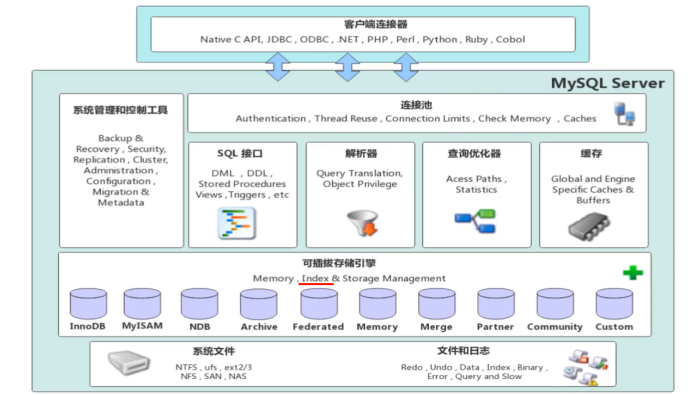

**连接层**

最上层是一些客户端和链接服务，主要完成一些类似于连接处理、授权认证、及相关的安全方案。服务器也会为安全接入的每个客户端验证它所具有的操作权限。

**服务层**

第二层架构主要完成大多数的核心服务功能，如SQL接口，并完成缓存的查询，SQL的分析和优化，部分内置函数的执行。所有跨存储引擎的功能也在这一层实现，如过程、函数等。

**引擎层**

存储引擎真正的负责了MySQL中数据的存储和提取，服务器通过API和存储引擎进行通信。不同的存储引擎具有不同的功能，这样我们可以根据自己的需要，来选取合适的存储引擎。

**存储层**

主要是将数据存储在文件系统之上，并完成与存储引擎的交互。

## 1.2 存储引擎简介

存储引擎就是存储数据、建立索引、更新/查询数据等技术的实现方式。存储引擎是基于表的，而不是基于库的，所以存储引擎也可被称为表类型。

```sql
-- 查询建表语句 --- 默认存储引擎:InnoDB
show create table dept
```

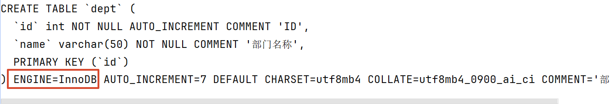

如图, 默认的存储引擎是 **InnoDB**

## 1.3 存储引擎操作

1. 在创建表时，指定存储引擎

```sql
CREATE TABLE 表名(
    字段1 字段1类型 [COMMENT 字段1注释],
    ......
    字段n 字段n类型 [COMMENT 字段n注释]
) ENGINE = INNODB [COMMENT 表注释];
```

2. 查看当前数据库支持的存储引擎

```sql
SHOW ENGINES;
```

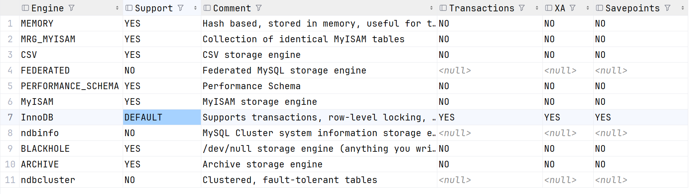

> 查询结果如图

## 1.4 存储引擎特点

**InnoDB**

**介绍**

InnoDB 是一种兼顾高可靠性和高性能的通用存储引擎，在MySQL 5.5之后，InnoDB是默认的MySQL存储引擎。

**特点**

- DML操作遵循ACID模型，支持**事务**；
- **行级锁**，提高并发访问性能；
- 支持**外键 **`FOREIGN KEY` 约束，保证数据的完整性和正确性；

**文件**

- `xxx.ibd：xxx`代表的是表名，innodb引擎的每张表都会对应这样一个表空间文件，存储该表的表结构（frm、sdi）、数据和索引。
- 参数：`innodb_file_per_table`

**逻辑存储结构**

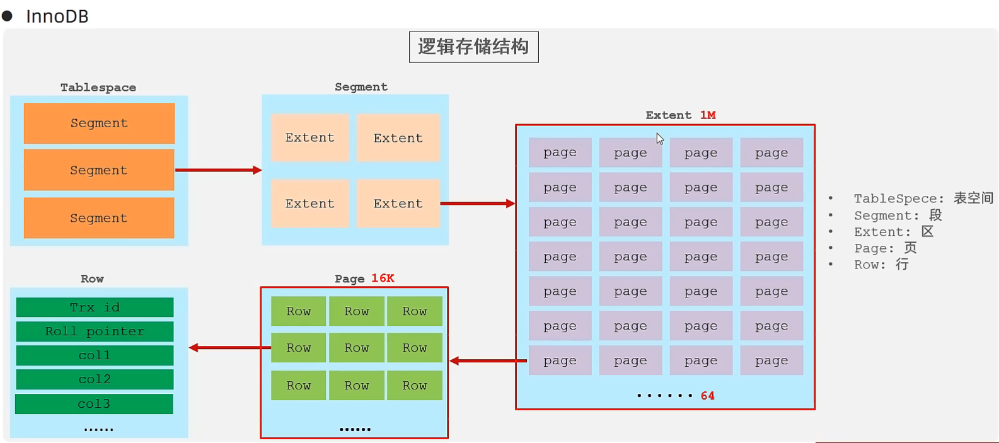

**MyISAM**

- **介绍**

MyISAM是MySQL早期的默认存储引擎。

- **特点**

  - 不支持事务，不支持外键

  - 支持表锁，不支持行锁

  - 访问速度快

- **文件**

  - xxx.sdi：存储表结构信息

  - xxx.MYD：存储数据

  - xxx.MYI：存储索引

**Memory**

- **介绍**

Memory引擎的表数据时存储在内存中的，由于受到硬件问题、或断电问题的影响，只能将这些表作为临时表或缓存使用。

- **特点**
  - 内存存放
  
  - hash索引（默认）
  
- **文件**
  - xxx.sdi：存储表结构信息

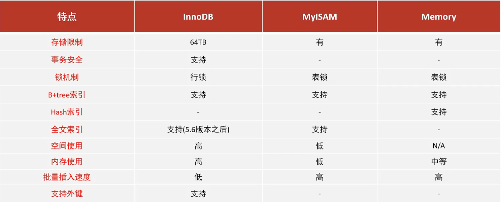

> **面试题：InnoDB引擎与MyISAM引擎的区别？**
>
> ①. InnoDB引擎，支持事务，而MyISAM不支持。
>
> ②. InnoDB引擎，支持行锁和表锁，而MyISAM仅支持表锁，不支持行锁。
>
> ③. InnoDB引擎，支持外键，而MyISAM是不支持的。
>
> 主要是上述三点区别，当然也可以从索引结构、存储限制等方面，更加深入的回答，具体参考如下官方文档：
>
> https://dev.mysql.com/doc/refman/8.0/en/innodb-introduction.html
>
> https://dev.mysql.com/doc/refman/8.0/en/myisam-storage-engine.html

### (补)什么是行锁

行锁是 **InnoDB 引擎特有的、粒度为「行级」的锁机制**，简单说就是：当事务操作某几行数据时，只锁住这几行数据，表中其他行完全不受影响，其他事务依然可以正常读写。

它是 InnoDB 支持高并发写入的核心，相比 MyISAM 的整表锁，并发性能提升了一个量级，也对应了之前讲的「MyISAM 不支持事务、并发写入差」的特点。

------

**一、行锁的核心特点**

1. **粒度细，并发高**：只锁定涉及的行，不影响表中其他数据。多个事务同时操作不同行时，互不阻塞，支持高并发写入。
2. **开销比表锁大**：加锁、解锁、冲突判断的成本高于表锁，因为要逐行处理。
3. **可能出现死锁**：因为是逐行加锁，两个事务互相等待对方持有的行锁时，就会触发死锁。
4. **仅 InnoDB 支持**：MyISAM 引擎只有整表锁，没有行锁，这也是 MyISAM 并发写入性能差的核心原因。

------

**二、行锁的触发与释放**

**1. 哪些操作会加行锁**

InnoDB 默认给写操作加**排他行锁（X 锁）**，一行加了排他锁后，其他事务不能再修改这行，也不能再加锁，必须等锁释放。

- `UPDATE`、`DELETE` 语句：自动给涉及的行加排他行锁
- `SELECT ... FOR UPDATE`：手动给查询结果加排他行锁，常用于「先查后改」场景，防止查询和修改之间数据被别人改动
- `SELECT ... LOCK IN SHARE MODE`：手动加**共享行锁（S 锁）**，加锁后别人可以读但不能改

**2. 什么时候释放锁**

行锁**必须等事务提交（COMMIT）或回滚（ROLLBACK）后才会释放**，不是语句执行完就释放。

这也是为什么强调「长事务是性能杀手」：长事务里一条 update 锁住的行，会一直锁到事务结束，期间其他事务都改不了这行数据，很容易引发大面积阻塞。

------

**三、核心本质：行锁锁的是索引，不是行**

这是开发最容易踩的坑，也是面试高频考点： **InnoDB 的行锁，是通过给「索引节点」加锁实现的，不是直接锁行数据本身。**

**结合 merchant 表对比两种场景**

**✅ 走索引 → 真正的行锁**

```sql
update merchant set shop_name = '新店铺名' where id = 4;
```

`id` 是主键索引，InnoDB 直接给主键索引上 id=4 的节点加锁，只锁定这一行，其他行完全不受影响，并发正常。

**❌ 不走索引 → 行锁退化成「表锁效果」**

```sql
update merchant set shop_name = '新店铺名' where shop_desc = '测试';
```

`shop_desc` 没有索引，InnoDB 无法定位到具体行，只能全表扫描，**逐行给所有行都加上行锁**。 最终效果等同于锁了整张表，其他所有写入操作都会被阻塞，并发性能直接崩塌。

> 这也是为什么「更新 / 删除语句必须走索引」是强制开发规范的核心原因之一。

------

**四、结合业务场景举例**

场景：两个商家同时登录后台，修改各自的店铺信息。

- 商家 A 修改 id=4 的店铺：`update merchant set ... where id = 4` → 锁住 id=4 这一行
- 商家 B 修改 id=8 的店铺：`update merchant set ... where id = 8` → 锁住 id=8 这一行

因为是不同行，两把行锁互不冲突，两个操作可以同时执行，这就是行锁带来的并发优势。

如果两个管理员同时修改 id=4 的同一家店铺，第二个操作就会阻塞等待第一个事务提交，保证同一行数据不会被同时修改，避免数据覆盖。

------

**五、行锁 vs 表锁 直观对比**

| 锁类型 | 锁定粒度 | 并发性能           | 支持引擎                | 典型场景         |
| ------ | -------- | ------------------ | ----------------------- | ---------------- |
| 表锁   | 整张表   | 差，写操作全串行   | MyISAM、InnoDB 无索引时 | 全表批量数据操作 |
| 行锁   | 单行数据 | 高，不同行互不影响 | InnoDB（走索引时）      | 常规业务并发读写 |

## 1.5 存储引擎选择

在选择存储引擎时，应该根据应用系统的特点选择合适的存储引擎。对于复杂的应用系统，还可以根据实际情况选择多种存储引擎进行组合。

- **InnoDB**：是Mysql的默认存储引擎，支持事务、外键。如果应用对事务的完整性有比较高的要求，在并发条件下要求数据的一致性，数据操作除了插入和查询之外，还包含很多的更新、删除操作，那么InnoDB存储引擎是比较合适的选择。
- **MyISAM**：如果应用是以读操作和插入操作为主，只有很少的更新和删除操作，并且对事务的完整性、并发性要求不是很高，那么选择这个存储引擎是非常合适的。
- **MEMORY**：将所有数据保存在内存中，访问速度快，通常用于临时表及缓存。MEMORY的缺陷就是对表的大小有限制，太大的表无法缓存在内存中，而且无法保障数据的安全性。

# 2. 索引

## 2.1 索引概述

**介绍**

索引（index）是帮助MySQL高效获取数据的数据结构(有序)。在数据之外，数据库系统还维护着满足特定查找算法的数据结构，这些数据结构以某种方式引用（指向）数据，这样就可以在这些数据结构上实现高级查找算法，这种数据结构就是索引。

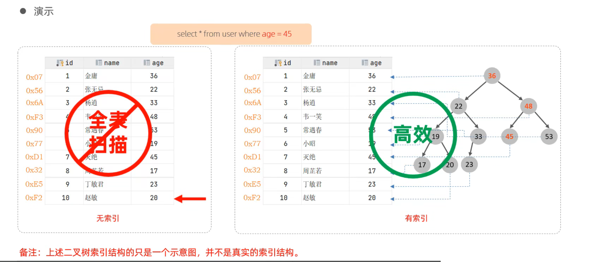

> 这里的二叉树只是为了演示而已

---

**优点**

- 提高数据检索的效率，降低数据库的IO成本
- 通过索引列对数据进行排序，降低数据排序的成本，降低CPU的消耗。

**缺点**

- 索引列也是要占用空间的。
- 索引大大提高了查询效率，同时却也降低更新表的速度，如对表进行INSERT、UPDATE、DELETE时，效率降低。

## 2.2 索引结构

MySQL的索引是在存储引擎层实现的，不同的存储引擎有不同的结构，主要包含以下几种：

| 索引结构 | 描述 |
| --- | --- |
| B+Tree索引 | 最常见的索引类型，大部分引擎都支持B+树索引 |
| Hash索引 | 底层数据结构是用哈希表实现的，只有精确匹配索引列的查询才有效，不支持范围查询 |
| R-tree(空间索引) | 空间索引是MyISAM引擎的一个特殊索引类型，主要用于地理空间数据类型，通常使用较少 |
| Full-text(全文索引) | 是一种通过建立倒排索引，快速匹配文档的方式。类似于Lucene,Solr,ES |

| 索引 | InnoDB | MyISAM | Memory |
| --- | --- | --- | --- |
| B+tree索引 | 支持 | 支持 | 支持 |
| Hash索引 | 不支持 | 不支持 | 支持 |
| R-tree索引 | 不支持 | 支持 | 不支持 |
| Full-text | 5.6版本之后支持 | 支持 | 不支持 |

> 我们平常所说的索引，如果没有特别指明，都是指B+树结构组织的索引。

**关于B-Tree**

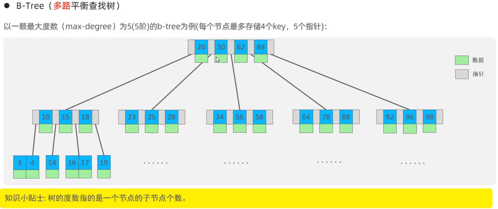

可以具体看看[B树图解与可视化 - 算法导航](https://algo.codefather.cn/data/tree/b-tree?tab=visualization)

---

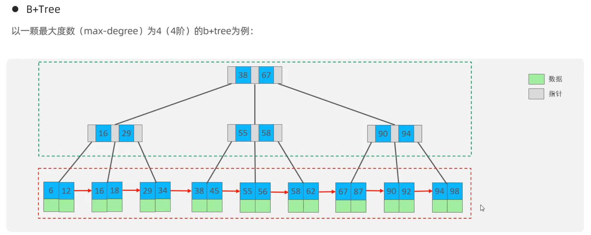

相对于B-Tree区别

- 所有的数据都会出现在叶子节点
- 叶子节点形成一个单向链表

[B+树图解与可视化 - 算法导航](https://algo.codefather.cn/data/tree/b-plus-tree?tab=visualization#heading-0)

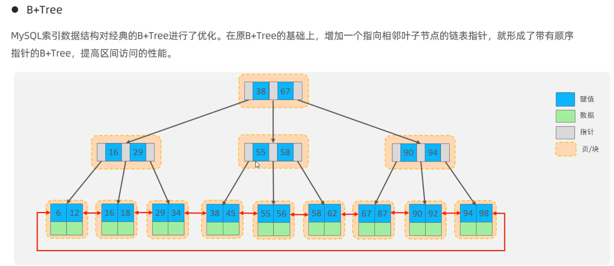

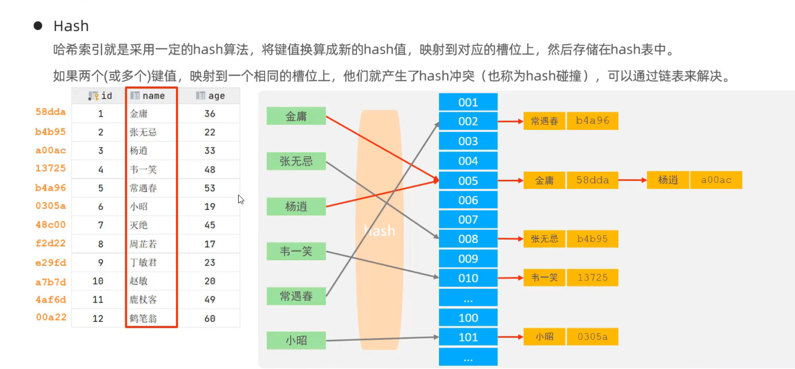

**Hash**

- **Hash索引特点**
  1. Hash索引只能用于对等比较(=, in)，不支持范围查询（between, >, <, ...）
  1. 无法利用索引完成排序操作
  1. 查询效率高，通常只需要一次检索就可以了，效率通常要高于B+tree索引

- **存储引擎支持**

  在MySQL中，支持hash索引的是Memory引擎，而InnoDB中具有自适应hash功能，hash索引是存储引擎根据B+Tree索引在指定条件下自动构建的。

> **思考题：为什么InnoDB存储引擎选择使用B+tree索引结构？**
>
> - 相对于二叉树，层级更少，搜索效率高；
> - 对于B-tree，无论是叶子节点还是非叶子节点，都会保存数据，这样导致一页中存储的键值减少，指针跟着减少，要同样保存大量数据，只能增加树的高度，导致性能降低；
> - 相对Hash索引，B+tree支持范围匹配及排序操作；

---

## 2.3  索引分类

| 分类 | 含义 | 特点 | 关键字 |
| --- | --- | --- | --- |
| 主键索引 | 针对于表中主键创建的索引 | 默认自动创建, 只能有一个 | PRIMARY |
| 唯一索引 | 避免同一个表中某数据列中的值重复 | 可以有多个 | UNIQUE |
| 常规索引 | 快速定位特定数据 | 可以有多个 | |
| 全文索引 | 全文索引查找的是文本中的关键词，而不是比较索引中的值 | 可以有多个 | FULLTEXT |

在InnoDB存储引擎中，根据索引的存储形式，又可以分为以下两种：

| 分类 | 含义 | 特点 |
| --- | --- | --- |
| 聚集索引(Clustered Index) | 将数据存储与索引放到了一块，索引结构的叶子节点保存了行数据 | 必须有,而且只有一个 |
| 二级索引(Secondary Index) | 将数据与索引分开存储，索引结构的叶子节点关联的是对应的主键 | 可以存在多个 |

**聚集索引选取规则:**

- 如果存在主键，主键索引就是聚集索引。
- 如果不存在主键，将使用第一个唯一（UNIQUE）索引作为聚集索引。
- 如果表没有主键，或没有合适的唯一索引，则InnoDB会自动生成一个rowid作为隐藏的聚集索引。

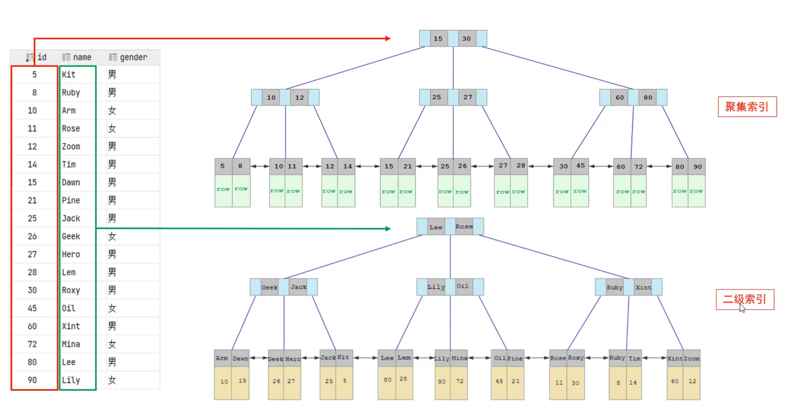

**举个实际查询的例子**

假设用户表 `id` 是主键（聚集索引），`name` 字段建了二级索引：

- `select * from user where id = 10`：走聚集索引，直接在叶子节点找到整行数据，一步返回
- `select * from user where name = '张三'`：先走 `name` 二级索引，拿到对应的主键 `id=10`；再拿着 `id=10` 去聚集索引里查，才能拿到整行数据（回表过程）

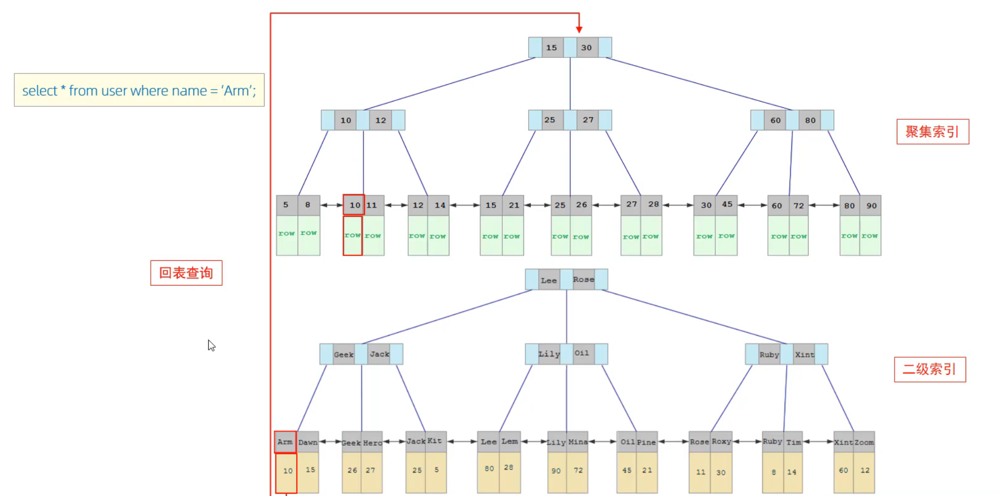

## 2.4 索引语法

- 创建索引

```sql
CREATE [ UNIQUE | FULLTEXT ] INDEX index_name ON table_name (index_col_name,...);
```

- 查看索引

```sql
SHOW INDEX FROM table_name;
```

- 删除索引

```sql
DROP INDEX index_name ON table_name;
```

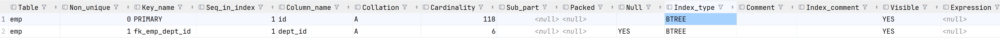

**. `Table`**

**含义**：索引所属的表名。 你这里两行都是 `emp`，说明这两个索引都属于员工表。

**2. `Non_unique`**

**含义**：是否为「非唯一索引」，也就是索引字段的值允不允许重复。

- `0` = 唯一索引，字段值不能重复。第一行是 `0`，因为主键 `id` 必须全局唯一。
- `1` = 非唯一索引，字段值可以重复。第二行是 `1`，说明 `dept_id`（部门 ID）允许重复，一个部门可以有多个员工。

**3. `Key_name`**

**含义**：索引的名称。

- 第一行 `PRIMARY`：主键索引的固定专属名称，每张表的主键索引都叫这个。
- 第二行 `fk_emp_dept_id`：普通二级索引的名字，通常是建外键时自动生成，或者你自己命名的索引名。

**4. `Seq_in_index`**

**含义**：字段在索引中的序号，从 1 开始计数。

- 单列索引就都是 `1`，你图里两个都是单列索引。
- 如果是联合索引（比如 `idx_name_age`），`name` 是 1，`age` 是 2，对应最左前缀原则的顺序。

**5. `Column_name`**

**含义**：索引具体绑定的数据库字段名。

- 第一行是 `id`（主键字段）
- 第二行是 `dept_id`（部门 ID 字段）

**6. `Collation`**

**含义**：索引中字段的排序方式。

- `A` = 升序（Ascending），MySQL 的 BTREE 索引默认都是升序存储。
- `D` = 降序，日常开发很少用。

**7. `Cardinality`**

**含义**：**基数**，索引中「不重复值的估算数量」，是优化器判断要不要走索引的核心依据。

- 第一行 `id` 基数是 `118`：主键的基数基本等于表里的总行数，说明这张员工表大概 118 条数据。
- 第二行 `dept_id` 基数是 `6`：说明部门 ID 大概只有 6 种不同的值，区分度很低。

> 补充：基数越高（字段重复值越少），索引的查询效率越好；如果基数特别低（比如性别只有男 / 女两种），优化器可能会直接放弃走索引。

**8. `Sub_part`**

**含义**：前缀索引的长度。

- `<null>` 表示对**整列**建索引，是最常见的情况。
- 如果只给字符串前 N 个字符建索引（比如给 `varchar(200)` 的前 30 位建索引），这里就会显示具体数字，用来节省索引空间。

**9. `Packed`**

**含义**：索引的压缩方式。

- `<null>` 表示不压缩，默认配置。
- 开启压缩可以减少磁盘占用，但查询时会额外消耗 CPU 解压。

**10. `Null`**

**含义**：该字段是否允许存入 `NULL` 值。

- 第一行主键 `id` 不允许为 NULL，所以为空。
- 第二行 `dept_id` 显示 `YES`，说明这个字段允许存空值。

**11. `Index_type`**

**含义**：索引底层的数据结构类型。 两行都是 `BTREE`，也就是 B+ 树结构，是 InnoDB 的默认索引结构，聚集索引和二级索引底层用的都是它。

**12. `Comment` / `Index_comment`**

- `Comment`：对应字段的备注说明。
- `Index_comment`：给索引本身加的备注。 你这里都为空，说明建表 / 建索引时没写备注。

**13. `Visible`**

**含义**：索引是否对查询优化器可见、是否生效。

- 都是 `YES`：正常生效，优化器生成执行计划时会考虑使用。
- 设为 `NO` 就是隐藏索引，索引还在但优化器会忽略它，常用于性能测试。

**14. `Expression`**

**含义**：函数 / 表达式索引的表达式。

- 都是 `<null>`：普通的字段索引。
- 如果是 `lower(name)` 这种函数索引，这里就会显示对应的表达式。

------

**总结**

- **第 1 行 `PRIMARY`**：**聚集索引**，叶子节点直接存整行员工数据，有且只有一个。
- **第 2 行 `fk_emp_dept_id`**：**二级索引（辅助索引）**，叶子节点存的是对应的主键 `id` 值，查询时需要先拿它回表查聚集索引才能拿到完整数据。

### (补)关于联合索引的思考

> 这里对于联合索引没有太大体会, 自己补充学习一下

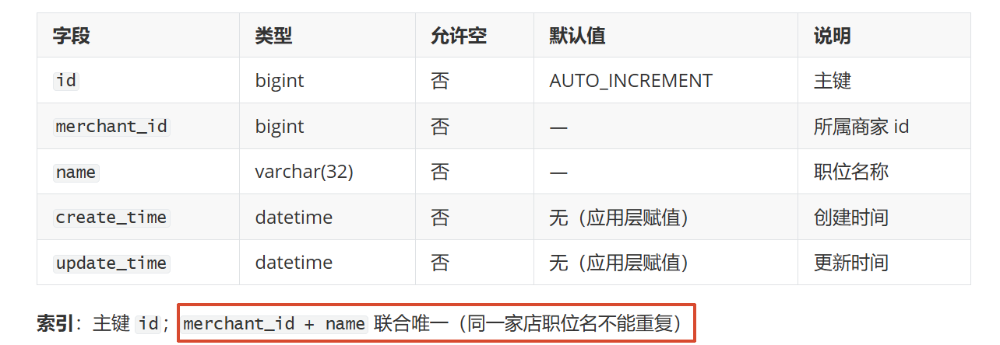

从呱呱外卖项目拿了个表出来演示

**一、什么是联合索引**

联合索引（也叫组合索引），就是**把多个字段绑定在一起，共同构建一个 B + 树索引**。 对应你这张表：

- 主键 `id` 是**单列聚集索引**
- `merchant_id + name` 就是一个**联合二级索引**，并且加了唯一约束，全称叫「联合唯一索引」

它不是 “给 merchant_id 建一个索引、再给 name 建一个索引”，而是把两个字段的值拼成一个整体，来组织索引树的结构。

------

**二、这个联合索引的两个核心用处**

**1. 业务约束：实现「同商家内职位名不重复」**

这是它最核心的设计目的，注释里也写得很清楚。

- 如果只给 `name` 加唯一索引：会变成 “全平台所有商家的职位名都不能重复”—— 商家 A 用了 “店长”，商家 B 就不能用了，显然不符合业务。
- 如果只给 `merchant_id` 加唯一索引：会变成 “一个商家只能有一个职位”，完全错误。
- 用 `merchant_id + name` 联合唯一：
  - `商家1 + 店长` → 允许存在 1 条
  - `商家2 + 店长` → 也允许存在 1 条
  - 再插入一条 `商家1 + 店长` → 直接报错，因为组合重复了

完美实现了**同商家内唯一、跨商家可重复**的业务规则。

**2. 性能作用：加速查询**

和单列索引一样，它可以让带相关条件的查询避免全表扫描；并且一个联合索引可以同时服务多种查询条件，比建多个单列索引更省空间、更高效。

------

**三、它是怎么产生作用的？（最左前缀原则）**

这是联合索引最核心的工作原理，也是面试必考点。

**1. 索引的存储结构**

这个 `merchant_id + name` 联合索引的 B + 树叶子节点，存储的内容是： `(merchant_id的值, name的值, 对应的主键id)`

排序规则是：

1. 先按 `merchant_id` 升序排序
2. `merchant_id` 相同的条目，再按 `name` 升序排序

就像字典先按拼音首字母分大类，首字母相同再按第二个字母排序。

**2. 最左前缀原则**

查询的时候，**必须从索引最左边的字段开始匹配，才能用上这个索引；跳过左边直接查右边的字段，索引失效**。

结合你这个索引，举几个实际 SQL 例子：

✅ **能正常走索引的情况**

1. 两个字段全匹配（最高效）

```sql
select * from 表 where merchant_id = 100 and name = '店长';
```

直接在联合索引树里精准定位到唯一一条记录。

1. 只匹配最左列

```sql
select * from 表 where merchant_id = 100;
```

只查商家 ID，也能走这个联合索引，快速查出该商家下的所有职位。

❌ **走不了索引的情况** 跳过最左列，只查右边的 `name`：

```sql
select * from 表 where name = '店长';
```

因为索引是先按商家 ID 排序的，没有商家 ID 这个前提，没法在树里快速定位，只能走全表扫描。

**补充**

顺序不重要

```sql
# 这样依旧正常走索引(最高效)
select * from 表 where name = '店长' and merchant_id = 100;
```

**为什么顺序不重要？**

MySQL 在真正执行 SQL 之前，会经过**查询优化器（Optimizer）** 这一步。优化器会自动分析所有 where 条件，重新排列条件顺序，计算不同执行方案的成本，选择最优的索引匹配方式。

所以这两句，在优化器眼里是完全等价的，执行计划、性能没有任何区别

---

**四、覆盖索引场景**

如果你的查询是：

```sql
select id, merchant_id, name from 表 
where merchant_id = 100 and name = '店长';
```

查询要返回的 `id、merchant_id、name` 这三个字段，在这个联合索引的叶子节点里**全部都能拿到**，所以**不需要回表**，直接从索引里就能返回数据，性能是最优的。

---

## 2.5 SQL性能分析

**1. SQL执行频率**

MySQL客户端连接成功后，通过show [session|global] status命令可以提供服务器状态信息。通过如下指令，可以查看当前数据库的INSERT、UPDATE、DELETE、SELECT的访问频次：

```sql
SHOW GLOBAL STATUS LIKE 'Com_______';
```

> 这里是7个下划线

**2. 慢查询日志**

慢查询日志记录了所有执行时间超过指定参数（long_query_time，单位：秒，默认10秒）的所有SQL语句的日志。

MySQL的慢查询日志默认没有开启，需要在MySQL的配置文件（/etc/my.cnf）中配置如下信息：

```ini
# 开启MySQL慢日志查询开关
slow_query_log=1

# 设置慢日志的时间为2秒，SQL语句执行时间超过2秒，就会视为慢查询，记录慢查询日志
long_query_time=2
```

配置完毕之后，通过以下指令重新启动MySQL服务器进行测试，查看慢日志文件中记录的信息 /var/lib/mysql/localhost-slow.log。

**profile详情**

show profiles能够在做SQL优化时帮助我们了解时间都耗费到哪里去了。通过have_profiling参数，能够看到当前MySQL是否支持profile操作：

```sql
SELECT @@have_profiling;
```

默认profiling是关闭的，可以通过set语句在session/global级别开启profiling：

```sql
SET profiling = 1;
```

执行一系列的业务SQL的操作，然后通过如下指令查看指令的执行耗时：

```sql
-- 查看每一条SQL的耗时基本情况
show profiles;

-- 查看指定query_id的SQL语句各个阶段的耗时情况
show profile for query query_id;

-- 查看指定query_id的SQL语句CPU的使用情况
show profile cpu for query query_id;
```

**explain执行计划**

EXPLAIN 或者 DESC命令获取 MySQL 如何执行 SELECT 语句的信息，包括在 SELECT 语句执行过程中表如何连接和连接的顺序。

语法：

```sql
-- 直接在select语句之前加上关键字 explain / desc
EXPLAIN SELECT 字段列表 FROM 表名 WHERE 条件;
```

> 这里准备两张表进行演示

**商家表**

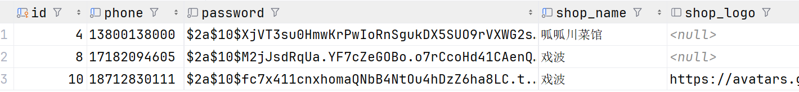

> 后面字段没有放出来, 因为没必要

**职位表**


**查询每个商家有的职位**

```sql
explain select * from merchant m,position p where p.merchant_id = m.id;
```

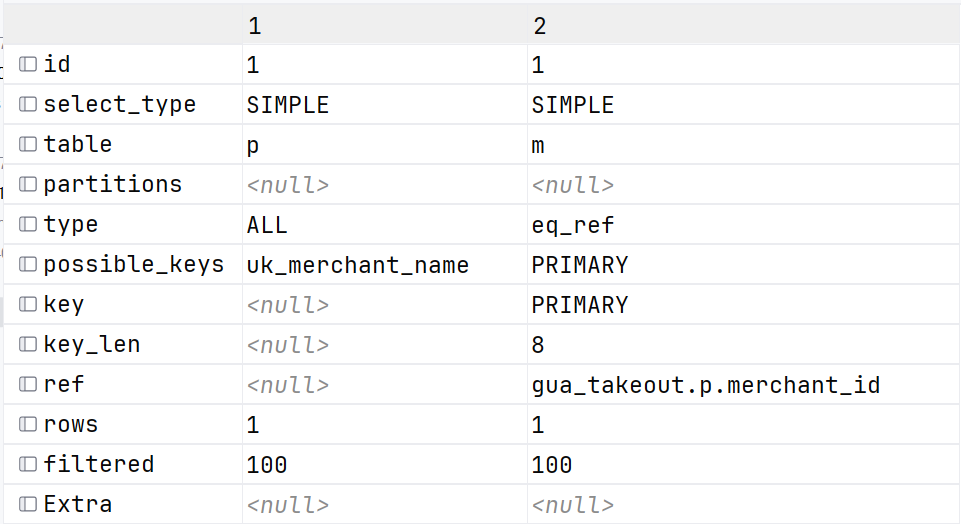

> 这里对表的结果进行了转置, 方便截图和观看

这是 MySQL 中 `EXPLAIN` 命令输出的**SQL 执行计划**，用来分析一条查询的执行逻辑：会不会走索引、用了哪个索引、表关联顺序是什么、扫描了多少行。图里有两行，代表这条 SQL 关联了两张表（别名 `p` 和 `m`），每一行对应一张表的访问策略。

下面逐个字段讲解，同时对应图里的值做解释：

------

**1. `id`**

**含义**：查询执行的序号，用来标识执行顺序。

- 规则：`id` 值相同，执行顺序**从上到下**；`id` 值不同，id 越大越先执行。
- 图里两行都是 `1`，说明这是同层级的表关联查询，先执行第 1 行的 `p` 表（驱动表），再执行第 2 行的 `m` 表（被驱动表）。

**2. `select_type`**

**含义**：查询的类型。

- 图里都是 `SIMPLE`：代表**简单查询**，不包含子查询、`UNION`、嵌套查询等复杂结构，是最常见的类型。

**3. `table`**

**含义**：这一行对应的数据库表名（或表别名）。

- 第 1 行 `p`：一般是职位表（position）的别名
- 第 2 行 `m`：一般是商家表（merchant）的别名

**4. `partitions`**

**含义**：查询匹配到的分区表分区。

- 图里都是 `<null>`：说明这两张表都不是分区表，是普通表。

**5. `type`（核心性能指标）**

**含义**：数据访问类型，代表 MySQL 找到目标行的方式，**性能从优到劣大致是：system > const > eq_ref > ref > range > index > ALL**。

- 第 1 行 `p` 表：`ALL` 也就是**全表扫描**，MySQL 会从头到尾遍历整张表来匹配条件，是最差的访问类型。通常说明没走索引，或者优化器认为全表扫比走索引更快（比如表数据极少时）。
- 第 2 行 `m` 表：`eq_ref` 关联查询里非常好的级别。意思是**用主键 / 唯一索引做等值关联匹配**，每张驱动表的行，只会在被驱动表里匹配到唯一一行。这里就是用 `p` 表的商家 ID 去关联 `m` 表的主键 ID，一行对一行。

**6. `possible_keys`**

**含义**：**可能能用的索引候选列表**。MySQL 会先列出所有理论上能帮上忙的索引，但最终不一定用。

- 第 1 行 `p` 表：`uk_merchant_name` 就是你之前建的 `merchant_id + name` 联合唯一索引，MySQL 觉得它可能有用。
- 第 2 行 `m` 表：`PRIMARY` 候选索引是主键索引。

**7. `key`（核心）**

**含义**：**MySQL 最终实际选择使用的索引**。

- 第 1 行 `p` 表：`<null>` 最终没走任何索引，落到了全表扫描。
- 第 2 行 `m` 表：`PRIMARY` 最终选择了主键索引来做关联查询。

**8. `key_len`**

**含义**：索引里实际使用的字节长度，可以用来判断联合索引用了多少个字段。

- 第 1 行 `p` 表：`<null>`，没走索引所以为空。
- 第 2 行 `m` 表：`8` 主键 `id` 是 `bigint` 类型，在 MySQL 里 `bigint` 占 8 字节，所以这里是 8，说明完整用到了主键索引。

**9. `ref`**

**含义**：关联查询中，用哪个字段 / 值去匹配索引列。

- 第 1 行 `p` 表：`<null>`，不是关联的右表，所以为空。
- 第 2 行 `m` 表：`gua_takeout.p.merchant_id` 意思是：用 `p` 表的 `merchant_id` 字段，去匹配 `m` 表的主键索引。对应的 SQL 关联条件就是 `m.id = p.merchant_id`。

**10. `rows`**

**含义**：MySQL 估算**需要扫描多少行**才能得到结果，是个估算值，越小越好。

- 两行都是 `1`：估算每张表都只需要扫描 1 行。这里 `p` 表虽然是全表扫描，但估算 1 行大概率是因为表里本身数据就很少。

**11. `filtered`**

**含义**：返回结果的行数，占扫描行数的百分比。

- 都是 `100`：代表扫描了多少行，就返回多少行，没有额外的条件过滤掉数据。

**12. `Extra`**

**含义**：额外的执行信息，比如是否用了覆盖索引、是否需要回表、是否有文件排序等。

- 图里都是 `<null>`：没有特殊的额外信息。

------

**整体复盘这条 SQL 的执行流程**

结合字段信息，这条 SQL 大致是这样执行的：

1. 全表扫描 `p`（职位）表（没走索引），取出每一行数据；
2. 拿着每一行的 `merchant_id`，去 `m`（商家）表的主键索引里精准查找对应的商家信息；
3. 拼接结果返回。

**补充一个常见疑问**

为什么 `p` 表有 `uk_merchant_name` 索引却没走？ 大概率是两种情况：

1. 你的 `where` 条件不符合**最左前缀原则**，比如只写了 `name = 'xxx'`，跳过了 `merchant_id`；
2. 表数据太少（只有几行），MySQL 觉得全表扫比走索引还快，主动放弃了索引。

**什么情况下会让id不同呢?**

```sql
# 查询有职位为 '店长' 的商家

select merchant_id from position p where name = '店长';

select id,phone,password,shop_name from merchant where id = 4;

# 主要执行这条
explain select id,phone,password,shop_name from merchant where id = (select merchant_id from position p where name = '店长');
```

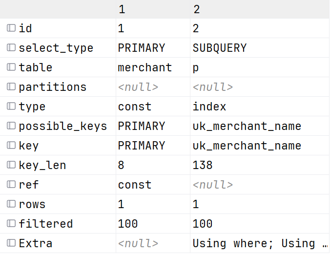

> id值越大越先执行

---

### explain总结

EXPLAIN 执行计划各字段含义：

- **id**：select查询的序列号，表示查询中执行select子句或者是操作表的顺序(id相同，执行顺序从上到下；id不同，值越大，越先执行)。
- **select_type**：表示SELECT的类型，常见的取值有SIMPLE（简单表，即不使用表连接或者子查询）、PRIMARY（主查询，即外层的查询）、UNION（UNION中的第二个或者后面的查询语句）、SUBQUERY（SELECT/WHERE之后包含了子查询）等
- **type**：表示连接类型，性能由好到差的连接类型为NULL、system、const、eq_ref、ref、range、index、all。
- **possible_key**：显示可能应用在这张表上的索引，一个或多个。
- **Key**：实际使用的索引，如果为NULL，则没有使用索引。
- **Key_len**：表示索引中使用的字节数，该值为索引字段最大可能长度，并非实际使用长度，在不损失精确性的前提下，长度越短越好。
- **rows**：MySQL认为必须要执行查询的行数，在innodb引擎的表中，是一个估计值，可能并不总是准确的。
- **filtered**：表示返回结果的行数占需读取行数的百分比，filtered的值越大越好。

---

## 2.6 索引使用

### 2.6.1 验证索引效率

在未建立索引之前，执行如下SQL语句，查看SQL的耗时。

```sql
SELECT * FROM 表名 WHERE 字段名 = '值';
```

针对字段创建索引

```sql
CREATE INDEX 索引名 ON 表名(字段名);
```

然后再次执行相同的SQL语句，再次查看SQL的耗时。

```sql
SELECT * FROM 表名 WHERE 字段名 = '值';
```

### 2.6.2 索引失效

#### 一、**最左前缀原则**

查询的时候，**必须从索引最左边的字段开始匹配，才能用上这个索引；跳过左边直接查右边的字段，索引失效**。

✅ **能正常走索引的情况**

1. 两个字段全匹配（最高效）

```sql
select * from 表 where merchant_id = 100 and name = '店长';
```

直接在联合索引树里精准定位到唯一一条记录。

2. 只匹配最左列

```sql
select * from 表 where merchant_id = 100;
```

只查商家 ID，也能走这个联合索引，快速查出该商家下的所有职位。

❌ **走不了索引的情况** 跳过最左列，只查右边的 `name`：

```sql
select * from 表 where name = '店长';
```

因为索引是先按商家 ID 排序的，没有商家 ID 这个前提，没法在树里快速定位，只能走**全表扫描**。

**补充**

顺序不重要

```sql
# 这样依旧正常走索引(最高效)
select * from 表 where name = '店长' and merchant_id = 100;
```

**为什么顺序不重要？**

MySQL 在真正执行 SQL 之前，会经过**查询优化器（Optimizer）** 这一步。优化器会自动分析所有 where 条件，重新排列条件顺序，计算不同执行方案的成本，选择最优的索引匹配方式。

所以这两句，在优化器眼里是完全等价的，执行计划、性能没有任何区别

**总结**

**写 SQL 的时候，where 条件的先后顺序随便写；但建联合索引的时候，字段的先后顺序绝对不能乱。**

> 这里从 **(补)关于联合索引的思考** 拿来的, 具体可以去看看这一块内容

#### 二、**范围查询**

联合索引中，出现范围查询(>,<)，范围查询右侧的列索引失效

联合索引是**按字段从左到右依次排序**的：先按第 1 列排，第 1 列值相同再按第 2 列排，第 2 列相同再按第 3 列排…… 一旦中间某一列用了**范围查询**（`>`、`<`、`>=`、`<=`、`between`、`like 'xxx%'` 前缀匹配），这一列的值是一个连续区间，区间内的行，它**右边的列在索引里就不再是有序的了**，因此没法继续用索引去精准匹配右边的列。

一句话核心：**范围列本身还能走索引，但范围列右边的所有列，索引失效。**

------

**结合「职位表」举例**

职位表字段：`id, merchant_id, name, create_time, update_time` 为了直观演示 “右侧失效”，我们先给它建一个**三字段联合索引**：

```sql
-- 联合索引顺序：商家ID → 创建时间 → 职位名称
create index idx_merchant_time_name on position(merchant_id, create_time, name);
```

这个索引的内部排序规则：

1. 先按 `merchant_id` 升序排序
2. 同一个商家下，再按 `create_time` 升序排序
3. 同一个商家、同一个创建时间下，最后按 `name` 升序排序

------

**场景 1：范围查询在中间列，右侧列失效**

查询需求：查询「商家 4 号，2026-10-01 之后创建的，叫 “店长” 的职位」

```sql
select * from position 
where merchant_id = 4 
  and create_time > '2026-10-01 00:00:00' 
  and name = '店长';
```

**索引实际使用情况：**

- ✅ `merchant_id = 4`：等值匹配，能正常用到索引
- ✅ `create_time > '2026-10-01'`：范围查询，**本身还能用到索引**，可以在 “商家 4” 的范围内快速定位到时间起点
- ❌ `name = '店长'`：在 `create_time` 范围查询的**右侧**，索引失效 原因：时间是一个范围区间，这个区间里不同时间点都可能有 “店长”，name 是乱序的，没法继续用索引快速定位，只能先把时间范围内的所有行都查出来，再逐行过滤 name 条件。

**对应 explain 的表现：**

`key_len` 的字节长度只会等于 `merchant_id + create_time` 的总长度，不会包含 name 的长度，说明索引只用到了前两列。

------

**场景 2：范围查询放在最后一列，无右侧列，全部生效**

这是优化后的写法：**把范围字段放到索引的最右边**，就不会有 “右侧失效” 的问题。

我们调整索引顺序：

```sql
-- 调整顺序：商家ID → 职位名称 → 创建时间
create index idx_merchant_name_time on position(merchant_id, name, create_time);
```

再执行同样的查询：

```sql
select * from position 
where merchant_id = 4 
  and name = '店长'
  and create_time > '2026-10-01 00:00:00';
```

**索引实际使用情况：**

- ✅ `merchant_id = 4`：等值，用索引
- ✅ `name = '店长'`：等值，用索引
- ✅ `create_time > '2026-10-01'`：范围查询，但它是**最后一列**，右边没有其他字段了，所以不存在 “右侧失效”

这时候索引三列都能充分利用，性能比上一种写法好很多。

------

**回到现有的联合索引（merchant_id + name）**

现在的联合唯一索引是 `uk_merchant_name (merchant_id, name)`，套一下规则：

**例子 1：左列是范围，右列失效**

```sql
select * from position 
where merchant_id > 5 
  and name = '店长';
```

- `merchant_id > 5` 是范围查询，它右边的 `name` 索引失效
- 索引只能用来过滤 `merchant_id > 5`，name 条件只能拿到行之后再过滤

**例子 2：左列等值，右列范围，无右侧列，不影响**

```sql
select * from position 
where merchant_id = 4 
  and name like '店%';
```

- `merchant_id = 4` 等值匹配，用索引
- `name like '店%'` 是前缀范围查询，本身能用索引
- 它已经是最右列了，没有右边的字段，所以不存在失效问题，索引两列都能利用

**一个非常实用的建索引经验**

**设计联合索引时，把经常做等值查询、筛选性强的字段放左边；把经常做范围查询的字段，尽量放在索引的右边。** 这样可以尽可能让更多字段用上索引，避免范围查询 “截断” 后面的列。

---

#### 三、索引列运算

不要在索引列上进行运算操作，**否则索引将失效**

**场景 1：数值运算（以主键为例）**

职位表 `id` 是主键（聚集索引）： ❌ **索引失效**（运算写在索引列上）

```sql
select * from position where id + 1 = 2;
```

逻辑上等价于找 `id=1`，但因为对 `id` 列做了 `+1` 运算，MySQL 不会自动反推，直接放弃主键索引，走全表扫描。

✅ **索引生效**（运算移到等号右边，索引列保持干净）

```sql
select * from position where id = 2 - 1;
```

索引列 `id` 本身没有任何运算，MySQL 直接拿 `1` 去主键索引树匹配，正常走索引。

---

**场景 2：日期函数运算**

职位表有 `create_time` 字段，假设给它建了单列索引： ❌ **索引失效**（对索引列套了 DATE 函数）

```sql
select * from position where date(create_time) = '2026-10-08';
```

索引树里存的是完整的 `datetime` 时间值，没有 `date()` 计算后的值，只能逐行计算后过滤，索引失效。

✅ **索引生效**（改成范围查询，列本身不碰函数）

```sql
select * from position 
where create_time >= '2026-10-08 00:00:00' 
  and create_time <  '2026-10-09 00:00:00';
```

`create_time` 列本身没有被函数包裹，用范围匹配就能正常走索引。

------

**场景 3：字符串函数运算**

商家表有 `phone` 字段，假设给它建了唯一索引： ❌ **索引失效**（对索引列做字符串截取）

```sql
select * from merchant where substring(phone, 1, 3) = '138';
```

对 `phone` 列用了 `substring()` 截取函数，索引树里只有完整的手机号，没有截取后的值，索引失效。

✅ **索引生效**（改成前缀模糊匹配）

```sql
select * from merchant where phone like '138%';
```

`phone` 列本身没有被函数包裹，前缀匹配符合索引最左前缀规则，正常走索引。

**场景 4：联合索引的情况**

现有的 `merchant_id + name` 联合唯一索引举例： ❌ **索引完全失效**（最左列被运算包裹）

```sql
select * from position where merchant_id + 0 = 4 and name = '店长';
```

联合索引的最左列 `merchant_id` 做了运算，整个索引树直接用不了，整句退化成全表扫描。

**总结**

看**比较符左边的索引列**是不是干干净净的字段名：

- 左边是纯字段，没有函数、加减乘除包裹 → 能走索引
- 左边套了函数 / 运算 → 索引失效

#### 四、字符串不加引号

字符串类型字段使用时, 不加引号, **索引将失效**

这属于**隐式类型转换**，相当于偷偷给索引列套了个转换函数，本质还是「索引列被运算」，所以索引失效

**1. 为什么会自动转换？**

MySQL 有个类型兼容规则：当 `where` 条件中等号两边的**数据类型不一致**时，它会自动把其中一边转成相同类型再比较。 核心规则：**字符串 和 数字 做比较时，MySQL 会把字符串转成数字再比**

**2. 结合 `phone` 字段讲透**

商家表里 `phone` 是 `varchar`（字符串类型），并且假设建了索引。

**✅ 正确写法：加引号，类型匹配**

```sql
select * from merchant where phone = '13800138000';
```

- 左边字段是字符串，右边值也是字符串，类型完全一致。
- MySQL 直接拿 `'13800138000'` 这个原始字符串，去 B+ 树索引里快速定位，索引正常生效。

**❌ 错误写法：不加引号，触发隐式转换**

```sql
select * from merchant where phone = 13800138000;
```

- 左边 `phone` 是字符串，右边 `13800138000` 是数字，类型对不上。
- MySQL 自动执行转换：把**左边索引列 `phone` 的每一行值**都转成数字，再和右边的数字比对。
- 相当于变成了 `where cast(phone as 数字) = 13800138000`，函数直接作用在了索引列上。
- 索引树里存的是原始字符串，不是转换后的数字，所以索引完全用不上，最终走全表扫描。

**3. 关键反例（绕开误区）**

很多人会问：那数字字段加了引号，会不会失效？ 比如主键 `id` 是 `bigint`（数字类型），写成：

```sql
select * from merchant where id = '4';
```

**答案：索引依然生效。**

原因：

- 左边 `id` 是数字，右边 `'4'` 是字符串。
- MySQL 会把**右边的值** `'4'` 转成数字 `4`，转换发生在「值」那边，**索引列本身没有被碰过**。
- 所以还是拿着数字 `4` 去主键索引树里正常查找。

**总结判断标准**

**类型不一致时，转换发生在索引列上 → 索引失效；转换发生在值那边 → 不影响索引**

---

#### 五、模糊查询

如果仅仅是尾部模糊匹配，索引不会失效。如果是头部模糊匹配，索引失效。

这个规则和联合索引的**最左前缀原则**是同一个底层逻辑：B + 树索引是按字符串**从左到右的字符顺序**排序存储的，只有左边固定，才能利用索引的有序性快速定位。

结合职位表 `name` 字段（假设建了索引），分三种情况讲：

**1. 尾部模糊（前缀匹配）✅ 索引生效**

```sql
select * from position where name like '店%';
```

左边开头固定是 “店”，索引里所有以 “店” 开头的值都是连续排在一起的。MySQL 可以直接在索引树里定位到第一个 “店” 开头的位置，往后遍历到不是 “店” 开头为止，本质就是一次范围查询，索引正常生效。

**2. 头部模糊（后缀匹配）❌ 索引失效**

```sql
select * from position where name like '%长';
```

只有结尾固定是 “长”，开头是乱的（店长、组长、主管...）。索引是按开头排序的，结尾的值散落在索引树各处，没法快速定位范围，只能逐行扫描比对，索引失效。

**3. 两边都模糊 ❌ 索引彻底失效**

```sql
select * from position where name like '%店%';
```

开头结尾都不固定，完全没法利用索引的有序性，只能走全表扫描。

**总结**

**模糊查询，% 号在右边才能走索引；% 号在左边，索引就失效。**

---

#### 六、or连接的条件

用or分割开的条件，如果or前的条件中的列有索引，而后面的列中没有索引，那么涉及的索引都**不会被用到**。

or 的逻辑是「两个条件满足任意一个都要返回」。只要**有一边的条件没索引、必须全表扫才能找全**，MySQL 就会干脆直接整句走全表扫描，另一边哪怕有索引也不会用了。

------

**结合 `position` 表举例**

职位表：`id` 有主键索引，`name` 没有单独索引（只有 `merchant_id+name` 联合索引，单独查 name 走不了）。

**❌ 索引失效的情况**

```sql
select * from position where id = 1 or name = '店长';
```

- 前半段 `id=1`：有主键索引，能快速定位
- 后半段 `name='店长'`：没有可用索引，必须扫完整张表才能找全
- 结果：既然后半段都要全表扫了，MySQL 觉得不如直接扫一遍整张表，顺便把 `id=1` 的也找出来，主键索引也被放弃。

**✅ 索引不失效的例外**

如果 **or 两边的字段各自都有独立的可用索引**，MySQL 可以用「索引合并」：分别走两个索引查出结果，再合并去重返回。 比如给 `name` 也建一个单列索引，那上面这条 SQL 就能走索引了。

再举一个现有索引就能生效的例子：

```sql
select * from position where id = 1 or merchant_id = 4;
```

左边主键索引能用，右边 `merchant_id` 是联合索引最左列也能用，两边都有索引，就会走索引合并。

**总结**

**or 两边都有索引才可能走；一边没索引，整体全失效。**

---

#### 七、数据分布影响

如果MySQL评估使用索引比全表更慢，则不使用索引 (**不算失效，是优化器主动选择不用**)

MySQL 优化器会提前估算两种方案的成本：

- 方案 A：走索引 + 回表
- 方案 B：直接全表扫描

如果它算出来**走索引的成本更高**，就会主动放弃索引，选择全表扫描。

------

**结合 position 表举例**

表有 `merchant_id + name` 联合索引，`merchant_id` 是最左列，本身是可以走索引的。

**场景 1：返回数据太多，走索引反而更慢**

假设表里一共 118 条职位数据，其中 **100 条都属于 merchant_id = 4**（绝大多数职位都在这个商家下）。 执行查询：

```sql
select * from position where merchant_id = 4;
```

如果走索引：

1. 先在二级索引里找出 100 条对应的主键 id
2. 拿着 100 个 id 去聚集索引里逐个回表查完整数据
3. 这是 100 次随机磁盘读取，来回跳着读，成本很高

如果全表扫描：

1. 顺序读取整张表的 118 行数据
2. 顺序读磁盘速度很快，只需要扫一遍

优化器一算：走索引要读 100 次随机页，全表只需要顺序读几页，**全表更便宜**，于是主动放弃索引。

**场景 2：表数据太少，索引没必要**

比如表现在只有十几条数据，哪怕查 `merchant_id = 1`（只有 1 条），优化器也可能直接全表扫。 原因：表太小了，一共就占 1、2 个数据页，直接读完比去翻索引树还快，索引的 overhead（额外开销）反而凸显。

------

**反过来对比**

如果查 `merchant_id = 99`，这个商家下只有 1 条数据：

```sql
select * from position where merchant_id = 99;
```

走索引只需要 1 次索引定位 + 1 次回表，成本远低于全表扫，优化器就会乖乖走索引。

**总结**

**索引是给 “筛选出少量数据” 的场景提速的；如果筛选完还要返回大半张表，或者表本身就没几行，全表扫描反而更快，MySQL 就不会用索引。**

### 2.6.3 覆盖索引

尽量使用覆盖索引（查询使用了索引，并且需要返回的列，在该索引中已经全部能够找到），减少select *。

**覆盖索引的本质**

覆盖索引**不是一种新的索引类型**，而是二级索引的一种「最优使用场景」： 查询需要返回的所有字段，在二级索引树里**全部都能直接拿到**，不需要再回表去聚集索引查完整行数据，省去了回表的磁盘 IO 开销，性能大幅提升。

先回顾已经知道的基础：InnoDB 二级索引的叶子节点，存的是「索引字段 + 主键 id」。

------

**结合 position 表举例**

- 主键聚集索引：`id` → 叶子节点存整行所有字段
- 二级联合索引：`uk_merchant_name (merchant_id, name)` → 叶子节点存 `merchant_id、name、主键id`

**非覆盖索引（需要回表）**

```sql
select * from position where merchant_id = 4 and name = '店长';
```

- `select *` 要返回 `id、merchant_id、name、create_time、update_time` 全部字段
- 二级索引里只有 `merchant_id、name、id`，缺少 `create_time、update_time`
- 所以必须先在二级索引拿到 id，再回表去聚集索引查剩下的两个时间字段

**覆盖索引（无需回表，性能最优）**

```sql
select id, merchant_id, name from position where merchant_id = 4 and name = '店长';
```

- 只查 `id、merchant_id、name` 三个字段
- 这三个字段，在 `uk_merchant_name` 二级索引的叶子节点里**全部都有**
- 直接在二级索引树里就能拿到全部结果，一次索引查找就完成，不用回表

------

**怎么验证有没有用上覆盖索引**

执行 `explain` 后，看结果里的 **Extra 列**，如果出现 `Using index`，就说明成功用上了覆盖索引，没有回表。

------

**和「减少 select *」的关系**

`select *` 会把表中所有列都查出来，而二级索引不可能包含所有列，几乎必然触发回表，用不上覆盖索引。 只查你真正需要的字段，才更容易满足「所有字段都在索引里」的条件，用上覆盖索引优化性能。

### 2.6.4 前缀索引

**一、前缀索引的用法**

当字段类型为字符串（varchar，text等）时，有时候需要索引很长的字符串，这会让索引变得很大，查询时，浪费大量的磁盘IO，影响查询效率。此时可以只将字符串的一部分前缀，建立索引，这样可以大大节约索引空间，从而提高索引效率。

**语法**

```sql
create index 索引名称 on 表名(字段名(前缀长度));
```

- 字段名后加 `(n)`，代表只取该字段的**前 `n` 个字符**来构建索引树
- `n` 是核心参数，直接决定索引的磁盘占用和查询效率

**前缀长度**

选长度的核心指标是**索引选择性**：不重复的索引值数量（基数） ÷ 表总记录数。

- 选择性越接近 1，区分度越高，查询效率越好；唯一索引的选择性是 1，是理论最优值
- 前缀索引要在「省空间」和「够区分」之间找平衡：找到**区分度接近全字段的最短前缀长度**

计算选择性的通用 SQL：

```sql
-- 先算全字段的选择性，作为基准值
select count(distinct 字段名) / count(*) from 表名;

-- 再试前n个字符的选择性
select count(distinct left(字段名, n)) / count(*) from 表名;
```

逐步调大 `n`，直到选择性接近全字段的基准值，此时的 `n` 就是最优长度。

**适用场景**

仅针对**长字符串类型字段**（`varchar(100+)`、`text` 等）：

- 给整个长字符串建索引，索引文件会非常臃肿，占用大量磁盘空间
- 查询时加载索引的 IO 开销高，反而拖累性能
- 业务上字段前半部分的区分度就足够高，不需要完整字符串做筛选

**二、结合商家表举实例**

使用 **merchant 商家表**（字段：`id、phone、password、shop_name`）演示。 我们给 `shop_name` 店铺名称字段做前缀索引。

**步骤 1：计算选择性，确定前缀长度**

先算全字段的选择性当基准：

```sql
select count(distinct shop_name) / count(*) from merchant;
```

假设表里店铺名都不重复，结果为 `1`。

再分别测试不同前缀长度：

```sql
-- 试前2个字
select count(distinct left(shop_name, 2)) / count(*) from merchant;

-- 试前4个字
select count(distinct left(shop_name, 4)) / count(*) from merchant;
```

假设前 4 个字的选择性已经达到 0.95，区分度足够高，那我们就选 **4** 作为前缀长度。

**步骤 2：创建前缀索引**

```sql
create index idx_shopname_pre4 on merchant(shop_name(4));
```

索引里只存每个店铺名的前 4 个字，索引体积比全字段索引小很多。

**步骤 3：查询时的实际效果**

✅ 等值查询，正常走索引：

```sql
select * from merchant where shop_name = '呱呱川菜馆';
```

执行过程：

1. 提取查询值的前 4 位 `'呱呱川菜'`，去前缀索引树里快速定位
2. 拿到匹配的主键 id，回表取出完整的 `shop_name` 值
3. 校验完整值是不是 `'呱呱川菜馆'`，匹配就返回结果

❌ 后缀模糊查询，依然走不了索引：

```sql
select * from merchant where shop_name like '%菜馆';
```

和普通索引规则一致，`%` 在开头，前缀索引也无法利用有序性快速定位。

**补充说明**

- `phone` 字段只有 11 位，本身很短，没必要用前缀索引，全字段建索引即可
- 前缀索引永远做不了覆盖索引：因为索引里只有前 n 个字符，只要查询需要返回该字段，就必须回表

---

## 2.7 SQL提示

SQL提示，是优化数据库的一个重要手段，简单来说，就是在SQL语句中加入一些人为的提示来达到优化操作的目的

SQL 提示（Index Hint）是用来**人为干预 MySQL 查询优化器的索引选择**的语法。优化器有时候会因为数据分布、统计信息不准等原因选错索引（比如该走不走、不该走却走），这时候就可以用提示来引导甚至强制它。

一共三个常用的，按干预强度从弱到强讲解，都结合 `position` 表举例：

------

**1. `USE INDEX`：建议用（参考级，优化器可不听）**

**作用**：给优化器列出你推荐的索引，告诉它 “优先考虑这几个”，但**没有强制力**。如果优化器评估后觉得推荐的索引还不如全表扫描，依然会放弃。

**结合表举例: **  position 表有联合索引 `uk_merchant_name`，想让优化器优先考虑它：

```sql
select * from position 
use index(uk_merchant_name)
where merchant_id = 4;
```

如果优化器算完觉得全表更快，还是会走全表，只是会优先评估你给的索引。

------

**2. `IGNORE INDEX`：禁止用（排除级，一定不用）**

**作用**：明确告诉优化器**不准使用**指定的索引，把这些索引从候选列表里直接删掉。

**典型场景**：优化器总是错误地选中一个低效索引，你想让它换别的，就先把错的屏蔽掉。

**举例**：你不想让优化器用 `uk_merchant_name` 这个索引：

```sql
select * from position 
ignore index(uk_merchant_name)
where merchant_id = 4;
```

优化器就不会再考虑这个索引，只能从剩下的索引（比如主键）里选，或者走全表。

------

**3. `FORCE INDEX`：强制用（命令级，必须用）**

**作用**：**强制**优化器使用指定的索引，优先级最高。只要这个索引本身是可用的（不违反最左前缀、索引列没被运算等硬规则），优化器就必须走它，哪怕它评估全表更快。

**典型场景**：就是我们上一条讲的「数据分布影响」—— 优化器判断失误，明明走索引更好却选了全表，这时候用 force index 强制纠正。

**结合你的表举例** 比如 position 表大部分数据都是 `merchant_id=4`，优化器觉得走索引回表太贵，主动选了全表。你确认走索引更快，就强制它用：

```sql
select * from position 
force index(uk_merchant_name)
where merchant_id = 4;
```

这时候优化器会乖乖走 `uk_merchant_name` 索引。

------

**关键注意点**

1. **语法位置**：都写在**表名的后面**，格式是 `from 表名 xxx index(索引名)`。

2. **强制也破不了硬规则**：`force index` 只能改变优化器的成本判断，不能打破索引失效的硬规则。 比如下面这句，哪怕强制也没用，因为违反了最左前缀，索引本身就用不了：

   ```sql
   -- 依然走全表，最左前缀不满足，强制也没用
   select * from position force index(uk_merchant_name) where name = '店长';
   ```

3. **不建议滥用**：优先靠优化 SQL 语句、调整索引字段顺序来解决问题。SQL 提示是兜底手段，数据量和分布变化后，强制的索引可能反而变成性能瓶颈。

---

## 2.8 索引设计原则

1. 针对于数据量较大，且查询比较频繁的表建立索引。
2. 针对于常作为查询条件（where）、排序（order by）、分组（group by）操作的字段建立索引。
3. 尽量选择区分度高的列作为索引，尽量建立唯一索引，区分度越高，使用索引的效率越高。
4. 如果是字符串类型的字段，字段的长度较长，可以针对于字段的特点，建立前缀索引。
5. 尽量使用联合索引，减少单列索引，查询时，联合索引很多时候可以覆盖索引，节省存储空间，避免回表，提高查询效率。
6. 要控制索引的数量，索引并不是多多益善，索引越多，维护索引结构的代价也就越大，会影响增删改的效率。
7. 如果索引列不能存储NULL值，请在创建表时使用NOT NULL约束它。当优化器知道每列是否包含NULL值时，它可以更好地确定哪个索引最有效地用于查询。

---

# 3. SQL优化

## 3.1 插入数据

### 3.1.1 insert优化

**一、批量插入**

**本质**

把多条数据合并成**一条 SQL 语句**一次性提交，避免每条插入都重复走「网络传输 → SQL 解析 → 事务开启 → 日志写入 → 事务提交」的完整流程。

**为什么快**

- 单条插入：N 条数据 = N 次网络交互 + N 次 SQL 解析 + N 次事务提交
- 批量插入：N 条数据 = 1 次网络交互 + 1 次 SQL 解析 + 1 次事务提交 重复开销被大幅压缩。

**结合 merchant 表举例**

```sql
-- 低效：一条条插
INSERT INTO merchant(id, phone, shop_name) VALUES (4, '13800138000', '呱呱川菜馆');
INSERT INTO merchant(id, phone, shop_name) VALUES (8, '17182094605', '戏波');
INSERT INTO merchant(id, phone, shop_name) VALUES (10, '18712830111', '戏波');

-- 高效：批量插入
INSERT INTO merchant(id, phone, shop_name) 
VALUES (4, '13800138000', '呱呱川菜馆'),
       (8, '17182094605', '戏波'),
       (10, '18712830111', '戏波');
```

**注意**

不是批量越大越好，单条 SQL 大小不能超过 MySQL 的 `max_allowed_packet` 限制（默认 4M），业务中一般一次批量 500~2000 条性价比最高。

------

**二、手动提交事务**

**本质**

MySQL 默认开启 `autocommit`（自动提交），每执行一条 INSERT 都会自动开启并提交一个事务，每次事务提交都要触发 redo log 刷盘，是很重的磁盘 IO 操作。 手动开启事务后，多条 INSERT 共用一个事务，最后统一提交，只做**一次刷盘**。

**为什么快**

- 自动提交：N 条插入 = N 次事务提交 = N 次磁盘刷盘
- 手动事务：N 条插入 = 1 次事务提交 = 1 次磁盘刷盘 核心是减少了事务提交带来的高频磁盘 IO。

**典型场景**

当数据量特别大，不能拼成一条 SQL（怕超过包大小），需要分成多条批量 SQL 执行时，外层包一个手动事务，性能提升最明显。

```sql
start transaction;
-- 第一批
INSERT INTO merchant VALUES (...),(...),(...);
-- 第二批
INSERT INTO merchant VALUES (...),(...),(...);
-- 第三批
INSERT INTO merchant VALUES (...),(...),(...);
commit;
```

------

**三、主键顺序插入**

**本质**

InnoDB 是**聚集索引组织表**：整张表的数据是按照主键的升序，物理上顺序存储在数据页里的，就像一本按页码排好的书。

- **乱序插入**：数据随机插在中间位置，页满了就会触发「页分裂」—— 把一页拆成两页，数据挪动，产生大量随机 IO 和数据碎片，性能很差。
- **顺序插入**：数据一直往末尾追加，几乎不会触发页分裂，基本都是顺序磁盘 IO，写入效率最高。

**对应的例子**

- 乱序：`8 1 9 21 88 2 4...` 插入时要反复在不同位置插队，频繁拆页
- 顺序：`1 2 3 4 5...` 一直往后追加，一页写满写下一页，几乎零分裂

**对应业务**

这也是为什么表设计时**主键推荐用自增 ID**，而不是 UUID、乱序雪花值的核心原因 —— 自增主键天然就是顺序插入，写入性能最好。

------

**总结三个优化的定位**

- 批量插入：减少 SQL 层面的重复开销
- 手动事务：减少事务提交的磁盘 IO
- 主键顺序：减少数据页分裂的随机 IO

三者配合使用，就是大批量数据导入的最优写法

---

### 3.1.2 大批量插入数据

使用 `LOAD DATA INFILE` 指令，性能远超普通 INSERT，是 MySQL 原生写入速度最快的方式

**1. 核心原理**

跳过 SQL 解析、优化等上层流程，以近乎底层文件拷贝的方式批量灌入数据，批量维护索引，一次性提交事务

**2. 前置开关（安全限制，默认关闭）**

1. **客户端开启**：连接时加参数

```bash
mysql --local-infile -u root -p
```

1. **服务端开启**：全局配置

```sql
set global local_infile = 1;
```

**3. 导入语法**

```sql
load data [local] infile '文件路径' into table `表名`
fields terminated by ','   -- 字段分隔符
lines terminated by '\n';  -- 行分隔符
```

- 加 `local`：从客户端本地读取文件
- 不加 `local`：文件在 MySQL 服务端磁盘，速度更快

**4. 注意事项**

- 文件列的顺序、数量必须和表字段严格一一对应
- 主键有序的文件导入速度远快于乱序主键
- 导入完成后建议关闭 `local_infile` 开关，降低安全风险
- 极致优化：导入前临时关闭二级索引，导入完成后重建

**5. 性能量级对比**

单条 INSERT ＜ 批量 INSERT ＜ 批量 + 事务 + 主键顺序 ＜ LOAD DATA INFILE

---

## 3.2 主键优化

### 3.2.1 数据组织方式

在InnoDB存储引擎中，表数据都是根据主键顺序组织存放的

这种存储方式的表称为**索引组织表**`(index organized table IOT)`

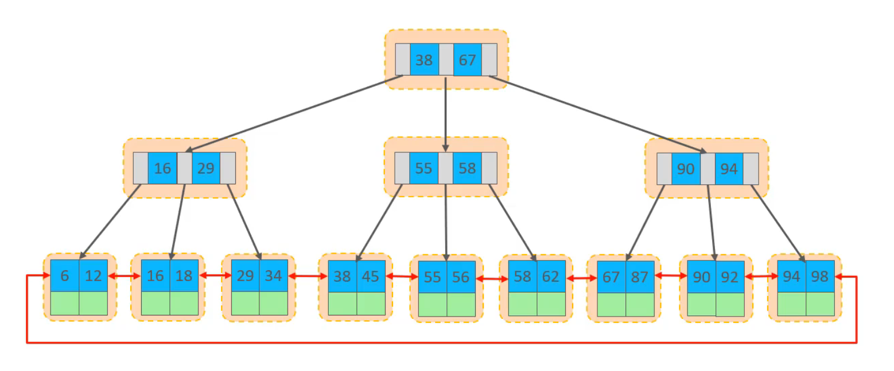

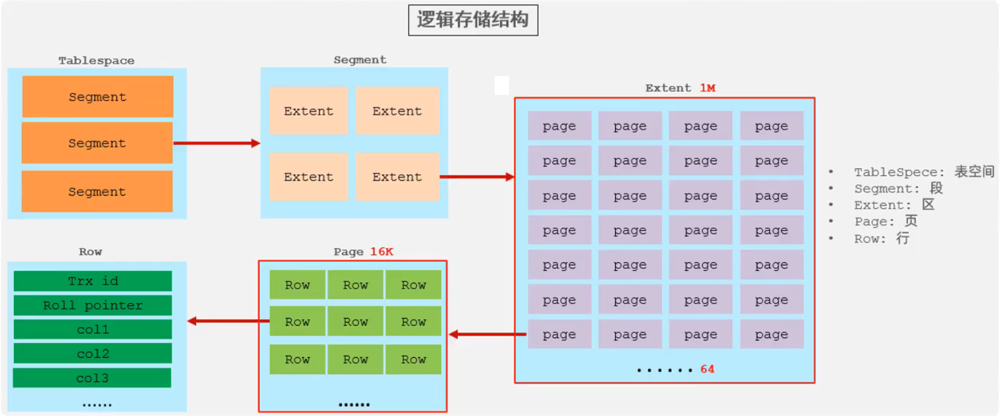

---

### 3.2.2 页分裂

页可以为空，也可以填充一半，也可以填充100%。每个页包含了2-N行数据(如果一行数据多大，会行溢出)，根据主键排列

**页分裂的底层背景**

InnoDB 存储引擎的最小存储单位是**数据页**，默认大小 16KB。我们的表数据（聚集索引）就是按主键升序，一行一行存在这些数据页里的：

- 单个页内部：所有行按主键从小到大有序排列
- 页与页之间：通过双向链表连接，整体也是按主键顺序串联

正常情况下，新数据插入时，会先找到它主键对应的目标页，然后写进去。

------

**什么是页分裂**

当目标数据页已经被写满（16KB 空间用完），无法再插入新行时，InnoDB 必须把当前这一页**拆分成两个数据页**，将原页里的一部分数据移动到新的空页中，腾出空间再插入新数据，这个拆分 + 数据迁移的过程，就叫做**页分裂**。

------

**两种插入场景的页分裂差异**

**1. 主键顺序插入（自增 ID）—— 几乎无代价**

如果主键是自增的，新数据的主键永远比现有数据大，只会插入到**最后一个数据页的末尾**。

- 最后一页写满时，直接申请一个新的空页，把新数据放进新页即可
- 不需要挪动原有任何数据，原页的数据完全不动
- 本质只是 “尾部追加新页”，几乎没有额外开销，空间利用率也很高

这就是自增主键写入快的核心原因之一。

**2. 主键乱序插入（UUID、随机 ID）—— 代价极高**

如果主键是乱序的，新数据可能要插入到**中间某一页的中间位置**。

- 目标页已经写满，必须对半拆分成两页
- 把原页中大约一半的数据，整体迁移到新的空页里
- 调整双向链表的指针，把新页插入到两个旧页中间
- 最后才能把新数据写进对应的位置

这个过程会产生大量的**随机磁盘 IO**，而且分裂后的两个页都只会用到约一半的空间，产生大量数据碎片，空间利用率大幅下降。

------

**页分裂的性能影响**

1. **写入性能下降**：每次分裂都伴随数据迁移和随机 IO，插入速度大幅变慢
2. **空间浪费**：分裂后的页存在空闲空间，数据碎片增多，同样的数据占用更多磁盘
3. **查询性能下降**：查询时需要读取更多的数据页，IO 次数增加，查询效率降低

---

### 3.2.3 页合并

>当删除一行记录时，实际上记录并没有被物理删除，只是记录被标记（flaged）为删除并且它的空间变得允许被其他记录声明使用
>当页中删除的记录达到**MERGE_THRESHOLD（默认为页的50%）**，InnoDB会开始寻找最靠近的页（前或后）看看是否可以将两个页合并以优化空间使用

页合并是**页分裂的反向操作**，二者都是 InnoDB B+ 树为了维护空间利用率、保证查询效率的内部自动机制：页分裂管 “写满了拆分”，页合并管 “删空了合并”。

------

**一、InnoDB 删除数据的本质**

执行 `DELETE` 语句时，数据**不会立刻从磁盘页中物理抹除**，InnoDB 只是给对应行打上**删除标记（delete mark）**，该行占用的空间还暂时保留着。 等后台 purge 线程清理完旧版本事务后，这些被标记的行才会真正释放，成为页内的空闲空间；当一页里空闲空间太多时，就会触发页合并。

------

**二、什么是页合并 & 触发条件**

当一个数据页因为大量删除、或者更新导致数据长度缩短，使得**页内有效数据的使用率低于合并阈值（默认 50%）**时，InnoDB 会自动检查它的左右相邻兄弟页：

- 如果相邻页的使用率也很低，且两页的有效数据加起来 ≤ 1 个页的容量
- 就会把两页的有效数据合并到同一页，把另一页清空回收，变成空闲页供后续新数据复用

这个合并数据、回收空页的过程，就是**页合并**。

------

**三、页合并的执行过程**

1. 锁定当前页和相邻的兄弟页，保证合并过程数据一致
2. 将其中一页的所有有效数据，整体迁移到另一页，按主键顺序排好
3. 调整 B+ 树的双向链表指针，把空页从链表中摘除
4. 将空页加入「空闲页列表」，后续发生页分裂时可以直接复用，不用申请新的磁盘空间

------

**四、和页分裂的核心对比**

| 维度             | 页分裂                         | 页合并                                     |
| ---------------- | ------------------------------ | ------------------------------------------ |
| **触发原因**     | 写入 / 更新导致页空间不足      | 删除 / 更新导致页空间太空闲                |
| **核心动作**     | 1 页拆成 2 页                  | 2 页合成 1 页                              |
| **空间影响**     | 产生数据碎片，空间利用率下降   | 回收碎片，提升空间利用率                   |
| **性能影响**     | 随机 IO + 数据迁移，拖慢写入   | 也有数据迁移开销，但长期能减少查询 IO      |
| **顺序主键场景** | 尾部追加，几乎不分裂，性能极高 | 顺序删除旧数据，相邻页批量空闲，合并效率高 |

------

**五、关键注意点**

1. **阈值可配置** 合并阈值由 `MERGE_THRESHOLD` 控制，范围 1~50，默认 50（使用率低于 50% 才尝试合并）。
   - 调得越低：合并越少，空间浪费多，但写入抖动小
   - 调得越高：合并越频繁，空间利用率高，但写入开销大
2. **所有 B+ 树都会发生** 不只是聚集索引，所有二级索引的叶子节点也同样会发生页分裂和页合并。
3. **为什么删了很多数据，表文件大小没变？** 页合并回收的空页，只是放回了表内部的空闲列表，留给后续新数据复用，**不会把空间还给操作系统**，所以 `.ibd` 表文件的大小不会缩小。如果要真正收缩磁盘空间，需要执行 `OPTIMIZE TABLE` 重建表。

**总结**

页分裂和页合并都是 B+ 树的常态机制。我们做写入优化的核心，就是让分裂 / 合并尽量少发生、尽量只在尾部发生，避免中间随机位置的频繁拆分合并 —— 这也是自增主键性能好的核心原因之一。

---

### 3.2.4 主键设计原则

**原则一：满足业务需求下，尽量降低主键长度**

**核心理由**

**主键是所有二级索引的「公共组成部分」，主键的长度会被放大到每一个二级索引上。**

InnoDB 中，每个二级索引的叶子节点，存储的内容都是「索引字段值 + 主键值」。

- 主键越长，每个二级索引的每一条叶子条目就越大，整张索引文件就越臃肿；
- 一张表如果有 5 个、10 个二级索引，主键长度的影响会成倍放大；
- 主键越长，单个数据页能放下的索引条目就越少，B+ 树的高度就越高，查询时需要的磁盘 IO 次数就越多。

举个直观对比：

- `INT` 主键：4 字节
- `BIGINT` 主键：8 字节
- UUID 主键：约 36 字节

同样百万级数据、多个二级索引的场景，UUID 主键的索引总体积会是自增主键的数倍，查询和写入的 IO 开销都更高。

------

**原则二：尽量顺序插入，选择自增主键**

**核心理由**

**规避聚集索引的「中间页分裂」，最大化写入性能和空间利用率。**

InnoDB 聚集索引是按主键升序物理存储的：

- 自增主键的新数据，永远往**最后一个数据页的末尾**追加，几乎不会触发中间位置的页分裂；
- 不需要挪动任何原有数据，基本都是顺序磁盘 IO，写入性能最高；
- 数据页的空间利用率也最高，不会产生大量数据碎片。

这和我们之前讲的「主键顺序插入优化」「页分裂」是完全对应的，自增主键是写入性能的基础保障。

------

**原则三：不要用 UUID、身份证号等自然主键**

**核心理由**

**同时违反了「短」和「顺序」两大最优原则，还额外带来业务风险。**

1. **乱序，写入性能差** UUID 是完全随机无序的，每次插入都可能插到索引树的中间位置，频繁触发页分裂和数据迁移，写入性能比自增主键低数倍；身份证号也不是严格连续递增，同样存在中间插入、拆页的问题。
2. **太长，索引普遍膨胀** UUID（36 字符）、身份证号（18 位）都远长于 `INT`/`BIGINT`，会导致所有二级索引普遍臃肿，浪费大量磁盘空间，同时增加查询 IO 次数。
3. **业务字段有变更风险** 自然主键自带业务含义，一旦业务规则变化（比如身份证号更正、业务编码调整），就需要修改主键，会引发极高的性能代价和数据关联风险。

------

**原则四：业务操作时，避免修改主键**

**核心理由**

**修改主键 = 整行物理迁移 + 全量二级索引更新，是数据库里代价最高的操作之一。**

1. **聚集索引层面** 主键决定了行的物理存储位置。修改主键会把整行数据从原数据页中删除，重新插入到新的主键位置，触发数据迁移、页分裂，产生大量随机磁盘 IO。
2. **二级索引层面** 所有二级索引的叶子节点都存储着主键值。主键修改后，**每张二级索引都要同步更新所有对应条目**，相当于全表所有索引重写一遍。
3. **业务层面** 主键通常用于关联其他表、做外键关联，修改主键会导致其他表的关联数据全部失效，引发严重的数据一致性问题。

**总结**

四条原则本质都是同一个底层逻辑：**InnoDB 是主键驱动的聚集索引表，主键的长度、有序性、稳定性，直接决定了整张表的写入性能、空间占用和维护成本。**

---

## 3.3 order by优化

**一、两种排序方式的本质区别**

`order by` 的优化核心目标：**尽量让排序走索引本身的有序性，避免额外排序**。MySQL 有两种排序模式，性能差距极大。

**1. Using filesort（文件排序，低效）**

- **定义**：先通过索引或全表扫描读取满足条件的数据行，再在排序缓冲区（sort buffer）中完成额外的排序操作，最终返回结果。只要不是通过索引本身有序直接返回的排序，都属于 FileSort。
- **注意**：名字虽叫「文件排序」，但不代表一定走磁盘：数据量小时在内存 sort_buffer 中完成排序；数据量超过缓冲区大小时，才会溢写到磁盘临时文件做归并排序。但无论哪种，都存在额外的排序计算开销。

**2. Using index（索引排序，高效）**

- **定义**：通过有序索引顺序扫描，直接返回有序结果，不需要做任何额外排序操作。
- **特点**：零排序开销，是 order by 优化的最优解；如果同时满足查询字段都在索引中，就是覆盖索引，性能达到最佳。

---

**二、order by 核心优化原则**

**原则 1：排序字段建索引，多字段排序遵循最左前缀法则**

和查询条件的最左前缀规则完全一致，`order by` 想走索引，排序字段必须和索引的左侧顺序对齐。

**✅ 能走索引排序的写法（匹配最左前缀）**

```sql
-- 匹配联合索引第1列，有序
select * from position order by merchant_id;

-- 匹配联合索引全部两列，有序
select * from position order by merchant_id, name;
```

这两种都可以直接复用 `uk_merchant_name` 索引的有序性，不会触发 filesort。

**❌ 走不了索引排序的写法（破坏最左前缀）**

```sql
-- 跳过了 merchant_id，直接按 name 排序，不满足最左前缀
select * from position order by name;
```

索引是先按商家排序、再按职位名排序的，没有单独按职位名的全局顺序，只能全表扫完再排序，触发 filesort。

------

**原则 2：尽量使用覆盖索引**

排序场景下，能不能触发覆盖索引，往往决定了优化器最终选不选索引排序。

**❌ 容易放弃索引的写法**

```sql
select * from position order by merchant_id, name;
```

虽然排序字段匹配索引，但 `select *` 需要回表去拿 `create_time、update_time` 等字段。优化器评估后可能觉得「回表开销还不如全表扫描 + 排序」，最终直接走 filesort。

**✅ 最优写法（覆盖索引 + 索引排序）**

```sql
select id, merchant_id, name from position order by merchant_id, name;
```

要返回的三个字段，在 `uk_merchant_name` 索引里全部都有，既不用额外排序，也不用回表，`explain` 的 Extra 列会显示 `Using index`，是排序查询的性能天花板。

> 对应你的业务：商家端下拉职位选择列表，只需要职位 id 和名称，就可以这么写，性能最好。

------

**原则 3：一升一降混合排序，索引要对应定义升降序**

联合索引默认全是升序（ASC）存储的，如果排序需求是「一个升序、一个降序」，默认索引就匹配不上了。

**场景举例**

实现：**按商家 id 正序，同商家下按职位名称倒序**

```sql
select id, merchant_id, name from position 
order by merchant_id asc, name desc;
```

- 你的默认索引 `(merchant_id asc, name asc)`：同商家下 name 是升序存的，要倒序就没法直接用，会触发 filesort。

- 解决方案（MySQL 8.0+ 支持）：建一个和排序方向完全匹配的索引

  ```sql
  create index idx_merchant_asc_name_desc 
  on position(merchant_id asc, name desc);
  ```

  索引内部的排列顺序和排序需求完全一致，就可以直接走索引有序返回。

  > 给出一份例图 (当例子看就行, 这是关于年龄和手机号的)

  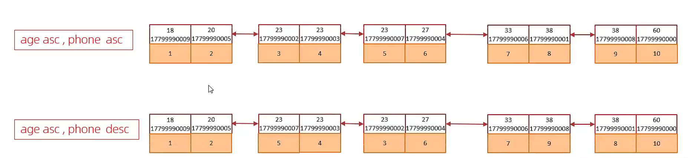

> 补充：如果是全升序、全降序两种极端情况，不用单独建索引，比如 `order by merchant_id desc, name desc`，MySQL 可以直接反向扫描升序索引，也不会触发 filesort。只有「一升一降」才需要特殊处理。

------

**原则 4：不可避免 filesort 时，大数据量可增大 sort_buffer_size**

这是兜底优化手段，优先级远低于建索引。

**对应场景**

比如要给所有商家按 `shop_desc` 排序，这个字段没建索引，业务又必须这么查，就一定会走 filesort。

- 默认 `sort_buffer_size = 256K`，数据量小时在内存里排完，速度还可以；
- 如果商家数据量很大，排序数据超过 256K，就会拆分成多批，溢写到磁盘临时文件做归并排序，引入大量磁盘 IO，性能骤降。

**优化方式**

适当调大排序缓冲区，让排序尽量全在内存中完成：

```
set global sort_buffer_size = 1024 * 1024; -- 调成1M
```

> 注意：不要盲目调大，每个数据库连接都会独立分配一份 sort_buffer，过大会消耗过多服务器内存。优先还是通过建索引解决排序问题。

---

## 3.4 group by优化

**group by 优化的核心逻辑**

`group by` 的默认执行逻辑是：**先对分组字段做排序 → 再按顺序遍历做分组聚合**。所以它的优化逻辑和 `order by` 完全同源 —— 核心都是**利用索引的天然有序性，跳过额外的排序步骤，同时避免生成临时表**。

没有匹配索引时，`group by` 通常会同时出现 `Using temporary`（用临时表存中间结果）+ `Using filesort`（额外排序）两个性能杀手；有匹配索引时，这两个开销都可以消除。

下面用的 `position` 职位表讲解，表索引基础：

- 联合唯一索引：`uk_merchant_name (merchant_id, name)`
- 索引叶子节点存储：`merchant_id、name、主键id`

------

**一、四种分组场景对比**

**1. 最优场景：匹配最左前缀 + 覆盖索引**

```sql
-- 统计每个商家的职位数量
select merchant_id, count(*) from position group by merchant_id;
```

- **为什么最快**： 索引本身就是按 `merchant_id` 升序排列的，相同商家的记录在索引里是连续挨在一起的。MySQL 顺着索引叶子节点顺序扫一遍，遇到相同的 `merchant_id` 就累加计数，**不需要额外排序，也不需要临时表**。 同时返回的字段只有 `merchant_id` 和聚合结果，索引里全都有，命中覆盖索引（`Extra` 显示 `Using index`），连回表都省了。

**2. 良好场景：匹配全部索引列 + 覆盖索引**

```sql
-- 按「商家+职位名」分组统计数量
select merchant_id, name, count(*) from position group by merchant_id, name;
```

- **为什么高效**： 分组字段顺序和联合索引完全对齐，索引内部就是「先按商家排序、同商家内再按职位名排序」的结构。直接遍历索引就能完成分组，同样不需要排序和临时表，也命中覆盖索引。

**3. 低效场景：破坏最左前缀法则**

```sql
-- 按职位名称分组，统计全平台每个职位名的数量
select name, count(*) from position group by name;
```

- **为什么慢**： 跳过了最左列 `merchant_id`，不满足最左前缀。索引里的 `name` 只是「每个商家内部有序」，全局是乱序的。 MySQL 只能走全表扫描，把所有数据读出来，创建临时表，先做一次全量 `filesort` 排序，排完序才能做分组聚合。`Extra` 会同时出现 `Using temporary + Using filesort`，数据量大时性能下降非常明显。

**4. 进阶场景：where 过滤 + group by 联合匹配**

```sql
-- 统计4号商家下，各个职位的数量
select name, count(*) from position where merchant_id = 4 group by name;
```

- **为什么也能走索引**： `where` 先用最左列 `merchant_id = 4` 定位到索引里的一段连续区间，在这个区间内，`name` 本身就是有序的。后续 `group by name` 直接在这个区间里遍历分组即可，不需要全表排序，同样能用上索引优化。

------

**二、两个关键优化细节**

**1. 别用 `select *`，尽量触发覆盖索引**

```sql
-- 不推荐
select * from position group by merchant_id;
```

这条语句**分组排序依然能用索引，但成不了覆盖索引**。因为 `select *` 需要返回所有字段，索引里没有 `create_time、update_time`，每行都得回表查聚集索引。 当数据量大时，优化器会评估「索引扫描 + 逐行回表」和「全表扫描 + 排序分组」哪个成本低，很可能直接放弃索引，走全表 filesort。

**2. MySQL 5.7 可加 `order by null` 跳过隐式排序**

MySQL 5.7 及更早版本中，`group by` 即使不写 `order by`，也会**默认按分组字段升序排序**。如果业务不要求分组结果有序，可以手动跳过这步额外排序：

```sql
select merchant_id, count(*) from position group by merchant_id order by null;
```

MySQL 8.0 开始已经优化了这个行为，`group by` 不再保证结果有序，不需要额外加。

**三、总结**

`group by` 的优化本质和 `order by`、`where` 完全通用：**让分组字段匹配联合索引的最左前缀，用索引的有序性消除排序和临时表；再配合只查必要字段，触发覆盖索引消除回表**。

---

## 3.5 limit优化

**一、limit 大偏移量的核心痛点**

`limit M, N` 的执行逻辑是：先扫描并排序出前 `M+N` 条记录，然后丢弃前 `M` 条，只返回后面的 `N` 条。 当偏移量 M 非常大时（几十万、上百万），前面绝大多数的扫描和排序工作都是无用功，性能会随偏移量指数级下降。

比如 `limit 2000000, 10`：

- MySQL 要完整扫描排序前 2000010 条记录
- 最终只返回 10 条，前面 200 万条的扫描、排序成本全部浪费
- 如果是 `select *` 还会伴随大量回表 IO，开销进一步放大

------

**二、主流优化方案：覆盖索引 + 子查询**

**优化思路**

把分页拆成两步，核心是**先在索引里轻量定位，再少量回表**：

1. **内层子查询**：只在索引中完成排序和分页，仅返回目标行的主键 ID。索引体积小、且不用回表，遍历速度快很多，快速定位到目标页的 10 个主键 ID。
2. **外层关联**：用这 10 个 ID，通过主键关联回表查询完整数据。只需要回表 10 次，避免了前面几十万、上百万条的回表开销。

------

**三、结合 position 表演示**

表索引基础：主键 `id`、联合索引 `uk_merchant_name (merchant_id, name)`

**场景 1：按主键分页（最常见的列表分页）**

**原始低效写法**

```
-- 查询第20001页，每页10条
select * from position order by id limit 200000, 10;
```

**慢的原因**： 虽然 `order by id` 走主键聚集索引，本身有序不需要额外排序，但 InnoDB 无法直接跳到第 20 万行的位置，必须从索引叶子节点头部开始逐行遍历计数。聚集索引存的是整行数据，扫描 20 万行的磁盘 IO 开销很大。

**优化写法**

```
select * from position t
inner join (
    select id from position order by id limit 200000, 10
) a on t.id = a.id;
```

**为什么更快**：

- 内层子查询只查主键 ID，相当于只扫描索引条目，不需要读取整行数据，扫描 IO 量大幅减小，快速定位到目标 10 个 ID。
- 外层只拿这 10 个 ID 去主键查完整数据，仅回表 10 次。
- 整体把「20 万次整行扫描」变成了「20 万次轻量索引扫描 + 10 次回表」，性能提升显著。

------

**场景 2：二级索引分页（优化收益更明显）**

比如查询 4 号商家下的职位列表，翻到第 1000 页：

**原始低效写法**

```
select * from position 
where merchant_id = 4 
order by name 
limit 10000, 10;
```

**慢的原因**： 虽然走了 `uk_merchant_name` 联合索引，但 `select *` 需要每条都回表，前面 10000 条记录全部要回表查询完整数据，产生大量随机 IO。

**优化写法**

```
select * from position t
inner join (
    select id from position 
    where merchant_id = 4 
    order by name 
    limit 10000, 10
) a on t.id = a.id;
```

**优化核心**： 内层子查询用到的 `merchant_id、name、id` 刚好全部在 `uk_merchant_name` 联合索引里，命中**覆盖索引**，完全不需要回表，在索引树里就完成了过滤、排序、分页，只返回 10 个 ID。 外层再用 10 个 ID 回表查完整数据，回表次数从 10010 次直接降到 10 次。

------

**四、更优方案：游标分页（彻底规避大偏移量）**

如果业务允许「不支持跳转到指定页码」（比如移动端滚动加载、后台列表上下页），这是分页性能的最优解，完全消除大偏移量的开销。

**原理**

不用 `limit M,N` 跳过前 M 条，而是用**上一页最后一条的主键值**作为过滤条件，直接从目标位置开始往后读取。

比如你的职位列表按主键升序分页，上一页最后一个 ID 是 200000，下一页直接写：

```
select * from position 
where id > 200000 
order by id 
limit 10;
```

- 直接通过主键索引定位到 ID=200000 的位置，往后取 10 条就结束
- 不需要扫描前面任何数据，无论翻到多少页，性能都和第一页完全一致
- 缺点：不支持跳转到指定页码，只能按顺序上一页 / 下一页

------

**五、总结**

1. `limit 大偏移量` 慢的本质：前面绝大多数扫描都是无用功，偏移越大性能越差
2. 覆盖索引 + 子查询：把「全量整行扫描」变成「索引轻量扫描 + 少量回表」，是兼容跳页场景下的主流优化方案
3. 游标分页：彻底规避大偏移量，性能恒定最优，是列表分页的首选方案，前提是业务能接受不支持跳页

---

## 3.6 count优化

**一、先讲核心差异：为什么 MyISAM 快、InnoDB 慢**

**1. MyISAM：直接读计数器，O (1) 复杂度**

MyISAM 引擎在磁盘上单独维护了一个**总行数计数器**，执行不带 where 的 `count(*)` 时，直接读取这个计数器返回即可，不需要查表，速度极快。 代价是：不支持事务、不支持行锁，并发写入性能差，现在基本已经被淘汰。

**2. InnoDB：必须逐行扫描计数**

InnoDB 没有存这个统一的总行数，执行全表 `count(*)` 时，必须把数据一行一行从索引里读出来累加计数，数据量越大越慢。

**为什么不存总行数？—— MVCC 事务隔离导致的** InnoDB 支持事务和多版本并发控制，不同的事务同时查询时，看到的有效行数是不一样的（比如有的事务刚插入了数据还没提交，另一个事务看不到）。不存在一个 “对所有事务都准确” 的统一总行数，所以没法像 MyISAM 那样存一个数字直接返回，只能每个事务自己数。

------

**二、InnoDB count (*) 的真实执行逻辑**

很多人以为 `count(*)` 会扫全表整行数据，其实 InnoDB 做了优化： **它会自动选择整张表里「体积最小的二级索引」来遍历计数**，因为二级索引叶子节点只存索引字段 + 主键，体积远小于聚集索引（整行数据），扫描的磁盘 IO 更少。

结合表举例：

- `merchant` 表：有主键 `id`、`phone` 唯一索引。全表 `count(*)` 时，会选 `phone` 二级索引来扫，而不是扫聚集索引整行数据。
- `position` 表：有主键 `id`、`uk_merchant_name` 联合索引。全表 `count(*)` 时，会扫这个联合二级索引来计数。

但即便选了最小的索引，依然是**逐行遍历计数**，百万级以上数据时，耗时依然会很明显。

------

三、四种常见 count 写法的对比

很多人有误区，这里统一说清楚性能排序： `count(*) ≈ count(1) ≈ count(主键) > count(普通字段)`

表格

| 写法               | 作用                        | 性能                                          |
| ------------------ | --------------------------- | --------------------------------------------- |
| `count(*)`         | 统计**总行数**，不判断空值  | 最优，MySQL 专门优化过，和 count (1) 基本无差 |
| `count(1)`         | 统计总行数，用常量 1 代替行 | 和 count (*) 几乎一致                         |
| `count(id)`        | 统计主键非空的行数          | 接近 count (*)，需要读取主键值                |
| `count(shop_name)` | 统计该字段非空的行数        | 最慢，要判断字段是否为 null                   |

> 结论：统计行数统一用 `count(*)` 就行，这是标准写法，也是性能最优的，不存在 “count (*) 最慢” 的说法。

------

**四、count 优化方案**

**1. 带条件的 count：优先靠索引优化**

这是最常见的场景，也是最容易优化的。 比如你要统计「4 号商家的职位数量」：

```sql
select count(*) from position where merchant_id = 4;
```

- 你的 `uk_merchant_name` 联合索引最左列就是 `merchant_id`，直接定位到该商家的索引区间，在索引里直接计数
- 不需要全表扫，性能非常高，基本不需要额外优化

> 绝大多数业务场景的 count 都是带过滤条件的，只要 where 条件能走索引，性能就不会差。

**2. 全表 count 优化方案（无 where 条件）**

如果业务需要频繁查全表总行数（比如商家总数、职位总数），全表逐行数太慢，有两种主流方案：

**方案 A：近似值估算（允许微小误差）**

如果业务不需要 100% 精确值（比如后台列表页的总数展示），直接用元数据估算：

```sql
show table status like 'position';
```

或者用 explain 估算：

```sql
explain select * from position;
```

返回的 `rows` 列就是 MySQL 估算的行数，速度极快，误差通常在 5% 以内，大部分业务场景足够用。

**方案 B：业务自己维护计数器（精确值）**

也就是图里说的「自己计数」，核心思路：**把计数从 MySQL 里拿出来，单独维护**。 最常用的是用 Redis 维护：

- 新增商家 / 职位时，Redis 对应 key +1
- 删除商家 / 职位时，Redis 对应 key -1
- 查询总数时，直接读 Redis 的值，O (1) 复杂度

优点：性能极高，和数据总量无关 缺点：有一定的维护成本，极端场景下可能和数据库有微小偏差，需要定期校准

------

**五、总结**

- 带 where 条件的 count：优先让过滤条件走索引，性能基本都够用
- 全表精确 count：数据量大了 InnoDB 天生慢，业务层自己维护计数器是工业界主流方案
- 不需要精确值：直接用元数据估算，性价比最高

---

## 3.7 update优化

