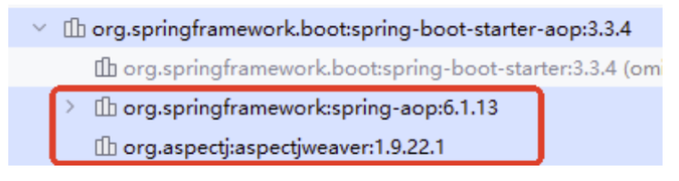

# 8. Spring Boot中如何进行AOP的开发

## 8.1 Spring Boot AOP概述

面向切面编程AOP在Spring教程中已经进行了详细讲解，这里不再赘述，如果忘记的同学，可以重新听一下Spring教程中AOP相关的内容。这里仅带着大家在Spring Boot中实现AOP编程。

Spring Boot的AOP编程和Spring框架中AOP编程的唯一区别是：引入依赖的方式不同。其他内容完全一样。Spring Boot中AOP编程需要引入aop启动器：

```xml
<!--aop启动器-->
<dependency>
  <groupId>org.springframework.boot</groupId>
  <artifactId>spring-boot-starter-aop</artifactId>
</dependency>
```



可以看到，当引入`aop启动器`之后，会引入`aop依赖`和`aspectj依赖`。

+ aop依赖：如果只有这一个依赖，也可以实现AOP编程，这种方式表示使用了纯Spring AOP实现aop编程。
+ aspectj依赖：一个独立的可以完成AOP编程的AOP框架，属于第三方的，不属于Spring框架。（我们通常用它，因为它的功能更加强大）

