# 8. Spring Boot中如何进行AOP的开发

## 8.1 Spring Boot AOP概述

面向切面编程AOP在Spring教程中已经进行了详细讲解，这里不再赘述，如果忘记的同学，可以重新听一下Spring教程中AOP相关的内容。这里仅带着大家在Spring Boot中实现AOP编程。

Spring Boot的AOP编程和Spring框架中AOP编程的唯一区别是：引入依赖的方式不同。其他内容完全一样。Spring Boot中AOP编程需要引入aop启动器：

```xml
<!--aop启动器-->
<dependency>
  <groupId>org.springframework.boot</groupId>
  <artifactId>spring-boot-starter-aop</artifactId>
</dependency>
```

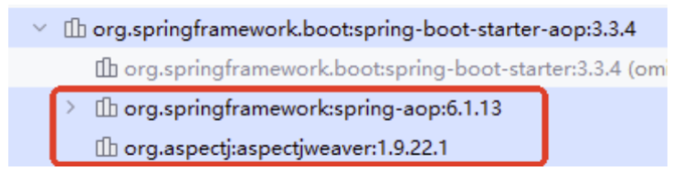

可以看到，当引入`aop启动器`之后，会引入`aop依赖`和`aspectj依赖`。

+ aop依赖：如果只有这一个依赖，也可以实现AOP编程，这种方式表示使用了纯Spring AOP实现aop编程。
+ aspectj依赖：一个独立的可以完成AOP编程的AOP框架，属于第三方的，不属于Spring框架。（我们通常用它，因为它的功能更加强大）

## 8.2 Spring Boot AOP实现

实现功能：项目中很多service，要求执行`任何service中的任何方法之前`记录日志。

- **创建Spring Boot项目引入aop启动器**

项目名：sb3-08-aop

```xml
<!--aop启动器-->
<dependency>
  <groupId>org.springframework.boot</groupId>
  <artifactId>spring-boot-starter-aop</artifactId>
</dependency>
```

- **编写service并提供方法**

```java
public interface OrderService {
    /**
     * 生成订单
     */
    void generate();

    /**
     * 订单详情
     */
    void detail();
}
```

```java
@Service("orderService")
public class OrderServiceImpl implements OrderService {
    @Override
    public void generate(Integer id, String name) {
        System.out.println("生成订单");
    }

    @Override
    public void detail(Integer id) {
        System.out.println("订单详情");
    }
}

```

- **编写切面**

```java
@Component // 纳入IoC容器
@Aspect // 指定该类为切面类
public class LogAspect {

    // 日期格式化器
    private DateTimeFormatter formatter = DateTimeFormatter.ofPattern("yyyy-MM-dd HH:mm:ss SSS");

    // 前置通知
    // 切入点表达式：service包下任意类的任意方法
    @Before("execution(* com.powernode.aop.service..*.*(..))")
    public void sysLog(JoinPoint joinPoint) throws Throwable {
        StringBuilder log = new StringBuilder();
        LocalDateTime now = LocalDateTime.now();
        String strNow = formatter.format(now);
        // 追加日期
        log.append(strNow);
        // 追加冒号
        log.append(":");
        // 追加方法签名
        log.append(joinPoint.getSignature().getName());
        // 追加方法参数
        log.append("(");
        Object[] args = joinPoint.getArgs();
        for (int i = 0; i < args.length; i++) {
            log.append(args[i]);
            if(i < args.length - 1) {
                log.append(",");
            }
        }
        log.append(")");
        System.out.println(log);
    }
}
```

- **测试**

```java
@SpringBootTest
class Sb308AopApplicationTests {

	@Autowired
	private OrderService orderService;

	@Test
	void contextLoads() {
		orderService.generate(10, "name");
		orderService.detail(10);
	}

}

```

**执行结果如下：**

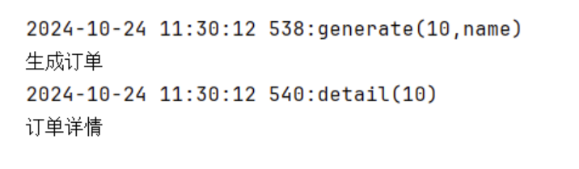

---

# SSM整合

# 9. 整合持久层框架MyBatis

**1. 准备数据库表及数据**

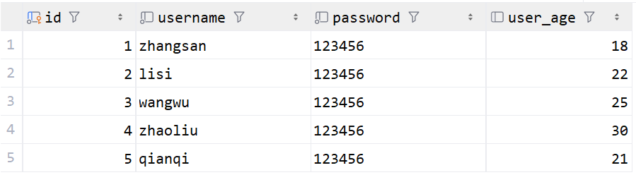

**2. 创建SpringBoot项目**

引入mysql驱动以及mybatis的启动器

依赖如下：

```xml
<!--mybatis的启动器-->
<dependency>
    <groupId>org.mybatis.spring.boot</groupId>
    <artifactId>mybatis-spring-boot-starter</artifactId>
    <version>3.0.3</version>
</dependency>
<!--mysql的驱动依赖-->
<dependency>
    <groupId>com.mysql</groupId>
    <artifactId>mysql-connector-j</artifactId>
    <scope>runtime</scope>
</dependency>
```

> **注意：**
>
> **Spring Boot官方提供的启动器的名字规则：spring-boot-starter-xxx**
>
> **第三方（非Spring Boot官方）提供的启动器的名字规则：xxx-spring-boot-starter**

**3. 编写数据源配置**

```yaml
spring:
  datasource:
    driver-class-name: com.mysql.cj.jdbc.Driver
    url: jdbc:mysql://localhost:3306/springboot-mybatis
    username: root
    password: 123456
    type: com.zaxxer.hikari.HikariDataSource
```

以上的配置属于连接池的配置，连接池使用的是Spring Boot默认的连接池：HikariCP

**4. 编写实体类User**

```java
@Data
@NoArgsConstructor
@AllArgsConstructor
public class User {
    private Integer id;
    private String username;
    private String password;
    private Integer userAge; //这里故意这样写是为了后续演示驼峰自动映射
}
```

**5. 编写Mapper接口**

创建`mapper`包，在该包下新建`UserMapper`接口，代码如下：

```java
// @Mapper 这里不用@Mapper 具体看后面
public interface UserMapper {
    /**
     * 插入用户
     * @param user 用户信息
     * @return 1 表示插入成功
     */
    int insert(User user);
    
    /**
     * 查询所有用户
     * @return 用户列表
     */
    List<User> selectAll();
}
```

**6. 编写Mapper接口的XML配置文件**

在`resources`目录下新建`mapper`目录，将来的`mapper.xml`配置文件放在这个目录下。

安装`MyBatisX`插件，该插件可以根据我们编写的`VipMapper`接口自动生成mapper的XML配置文件。

最终`UserMapper.xml`文件的配置如下：

```xml
<?xml version="1.0" encoding="UTF-8" ?>
<!DOCTYPE mapper PUBLIC "-//mybatis.org//DTD Mapper 3.0//EN" "http://mybatis.org/dtd/mybatis-3-mapper.dtd" >
<mapper namespace="com.gua.springboot003.mapper.UserMapper">

    <insert id="insert" parameterType="user">
        insert into user
            (username, password, user_age)
        values
            (#{username}, #{password}, #{userAge})
    </insert>

    <select id="selectAll" resultType="com.gua.springboot003.pojo.User">
        select * from user
    </select>

</mapper>
```

**7. 添加Mapper的扫描**

这里有俩种方法

- 第一种: 给 `mapper` 接口加上 `@mapper` 注解

- 第二种: 在Spring Boot的入口程序上添加

   `@MapperScan(basePackages = {"com.gua.springboot003.mapper"})` 注解

```java
@MapperScan(basePackages = {"com.gua.springboot003.mapper"})
@SpringBootApplication
public class SpringBoot003Application {
    public static void main(String[] args) {
        SpringApplication.run(SpringBoot003Application.class, args);
    }
}
```

这里用第二种方法吧, 比较推荐

**8. 告诉MyBatis框架MapperXML文件的位置**

在`application.properties`配置文件中进行如下配置：

```properties
mybatis.mapper-locations=classpath:mapper/*.xml
```

**9. 测试整合MyBatis是否成功**

在Spring Boot主入口程序中获取Spring上下文对象`ApplicationContext`，从Spring容器中获取`UserMapper`对象，然后调用相关方法进行测试：

```java
@MapperScan(basePackages = {"com.gua.springboot003.mapper"})
@SpringBootApplication
public class SpringBoot003Application {
    public static void main(String[] args) {
        ConfigurableApplicationContext applicationContext = SpringApplication.run(SpringBoot003Application.class, args);
        
        // 获取service对象
        UserService userService = applicationContext.getBean(UserService.class);
        
        // 保存用户信息
        User user = new User(null, "zhangsan", "123456", 18);
        userService.save(user);
        
        // 查询所有用户信息
        userService.findAll().forEach(System.out::println);
        
        applicationContext.close();
    }
}
```

测试结果：

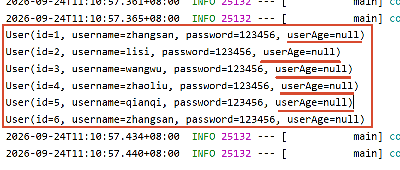

测试结果中可以看到`userAge`属性没有赋值成功，原因是：表中的字段名叫做`user_age`，和实体类`User`的属性名`userAge`对应不上。解决办法两个：

- **第一种方式：查询语句使用as关键字起别名，让查询结果列名和实体类的属性名对应上。**

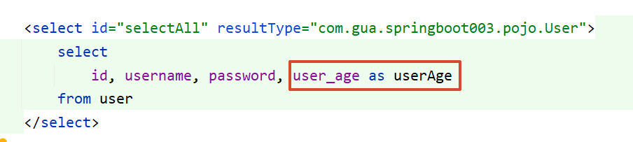

再次测试:

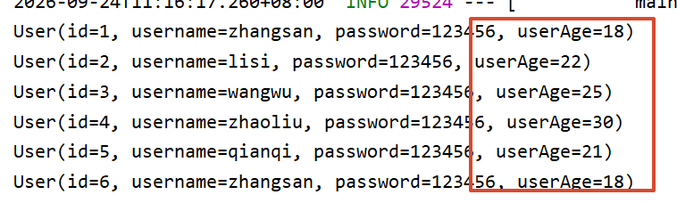

- **第二种方式：通过配置自动映射**

在`application.properties`配置文件中进行如下配置：

```properties
mybatis.configuration.map-underscore-to-camel-case=true
```

map-underscore-to-camel-case 是一个配置项，主要用于处理数据库字段名与Java对象属性名之间的命名差异。在许多数据库中，字段名通常使用下划线（_）分隔单词，例如 first_name 或 last_name。而在Java代码中，变量名通常使用驼峰式命名法（camel case），如 firstName 和 lastName。

当使用MyBatis作为ORM框架时，默认情况下它会将SQL查询结果映射到Java对象的属性上。如果数据库中的字段名与Java对象的属性名不一致，那么就需要手动为每个字段指定相应的属性名，或者使用某种方式来自动转换这些名称。

map-underscore-to-camel-case 这个配置项的作用就是在查询结果映射到Java对象时，自动将下划线分隔的字段名转换成驼峰式命名法。这样可以减少手动映射的工作量，并提高代码的可读性和可维护性。

> 这里是我的配置文件

```yaml
# 数据源的配置
spring:
  datasource:
    driver-class-name: com.mysql.cj.jdbc.Driver
    url: jdbc:mysql://localhost:3306/springboot-mybatis
    username: root
    password: 123456
    type: com.zaxxer.hikari.HikariDataSource
    
# mybatis相关配置
# 1. 起别名
mybatis:
  type-aliases-package: com.gua.springboot003.pojo
# 2. mapper配置文件的位置
  mapper-locations: classpath:mapper/*.xml
# 3. 自动映射数据库表的列名和bean的属性名
  configuration:
    map-underscore-to-camel-case: true
```

mapper的xml文件中的sql语句仍然使用`*`的方式：

```xml
<select id="selectAll" resultType="com.gua.springboot003.pojo.User">
    select
        *
    from user
</select>
```

测试结果如下：

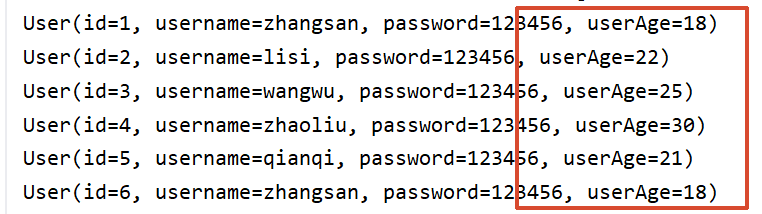

---

# 10. Lombok库

Lombok 是一个 Java 库，它可以通过注解的方式减少 Java 代码中的样板代码。Lombok 自动为你生成构造函数、getter、setter、equals、hashCode、toString 方法等，从而避免了手动编写这些重复性的代码。这不仅减少了出错的机会，还让代码看起来更加简洁。

**<font style="color:#DF2A3F;">Lombok只是一个编译阶段的库，能够帮我们自动补充代码，在Java程序运行阶段并不起作用。（因此Lombok库并不会影响Java程序的执行效率）</font>**

例如我们有这样一个java源文件`User.java`，代码如下：

```java
@Data
public class User{
    private String name;
}
```

以上代码在程序的编译阶段，Lombok库会将`User.java`文件编译生成这样的`User.class`字节码文件：

```java
public class com.powernode.lomboktest.model.User {
  public com.powernode.lomboktest.model.User();
    Code:
       0: aload_0
       1: invokespecial #1                  // Method java/lang/Object."<init>":()V
       4: return

  public java.lang.String getName();
    Code:
       0: aload_0
       1: getfield      #7                  // Field name:Ljava/lang/String;
       4: areturn

  public void setName(java.lang.String);
    Code:
       0: aload_0
       1: aload_1
       2: putfield      #7                  // Field name:Ljava/lang/String;
       5: return

  public boolean equals(java.lang.Object);
    Code:
       0: aload_1
       1: aload_0
       2: if_acmpne     7
       5: iconst_1
       6: ireturn
       7: aload_1
       8: instanceof    #8                  // class com/powernode/lomboktest/model/User
      11: ifne          16
      14: iconst_0
      15: ireturn
      16: aload_1
      17: checkcast     #8                  // class com/powernode/lomboktest/model/User
      20: astore_2
      21: aload_2
      22: aload_0
      23: invokevirtual #13                 // Method canEqual:(Ljava/lang/Object;)Z
      26: ifne          31
      29: iconst_0
      30: ireturn
      31: aload_0
      32: invokevirtual #17                 // Method getName:()Ljava/lang/String;
      35: astore_3
      36: aload_2
      37: invokevirtual #17                 // Method getName:()Ljava/lang/String;
      40: astore        4
      42: aload_3
      43: ifnonnull     54
      46: aload         4
      48: ifnull        65
      51: goto          63
      54: aload_3
      55: aload         4
      57: invokevirtual #21                 // Method java/lang/Object.equals:(Ljava/lang/Object;)Z
      60: ifne          65
      63: iconst_0
      64: ireturn
      65: iconst_1
      66: ireturn

  protected boolean canEqual(java.lang.Object);
    Code:
       0: aload_1
       1: instanceof    #8                  // class com/powernode/lomboktest/model/User
       4: ireturn

  public int hashCode();
    Code:
       0: bipush        59
       2: istore_1
       3: iconst_1
       4: istore_2
       5: aload_0
       6: invokevirtual #17                 // Method getName:()Ljava/lang/String;
       9: astore_3
      10: iload_2
      11: bipush        59
      13: imul
      14: aload_3
      15: ifnonnull     23
      18: bipush        43
      20: goto          27
      23: aload_3
      24: invokevirtual #24                 // Method java/lang/Object.hashCode:()I
      27: iadd
      28: istore_2
      29: iload_2
      30: ireturn

  public java.lang.String toString();
    Code:
       0: aload_0
       1: invokevirtual #17                 // Method getName:()Ljava/lang/String;
       4: invokedynamic #28,  0             // InvokeDynamic #0:makeConcatWithConstants:(Ljava/lang/String;)Ljava/lang/String;
       9: areturn
}
```

通过字节码可以看到Lombok库的`@Data`注解可以帮助我们生成`无参构造器`、`setter`、`getter`、`toString`、`hashCode`、`equals`。

## 10.1 Lombok 的主要注解

**@Data**：

+ 等价于 `@ToString`, `@EqualsAndHashCode`, `@Getter`，`@Setter`, `@RequiredArgsConstructor`.
+ 用于生成：必要参数的构造方法、getter、setter、toString、equals 和 hashcode 方法。

**@Getter** / **@Setter**：

+ 分别用于生成所有的 getter 和 setter 方法。
+ 可以作用于整个类，也可以作用于特定的字段。

**@NoArgsConstructor**：

+ 生成一个无参构造方法。

**@AllArgsConstructor**：

+ 生成一个包含所有实例变量的构造器。

**@RequiredArgsConstructor**：

+ 生成包含所有被 `final` 修饰符修饰的实例变量的构造方法。
+ **<font style="color:#DF2A3F;">如果没有</font>`final`<font style="color:#DF2A3F;">的实例变量，则自动生成无参数构造方法。</font>**

**@ToString** / **@EqualsAndHashCode**：

+ 用于生成 toString 和 equals/hashCode 方法。
+ **<font style="color:#DF2A3F;">这两个注解都有</font>**`exclude`**<font style="color:#DF2A3F;background-color:#ffffff;">属性，通过这个属性可以定制toString、hashCode、equals方法。</font>**

**<font style="color:#DF2A3F;">注：Lombok只能帮助我们生成无参数构造方法和全参数构造方法，其他定制参数的构造方法无法生成。</font>**

## 10.2 Lombok的其他常用注解

@Value

@Builder

@Singular

@Slf4j

......

### @Value

该注解会给所有属性添加`final`，给所有属性提供`getter`方法，自动生成`toString`、`hashCode`、`equals`

**通过这个注解可以创建不可变对象。**

```java
@Value
public class Customer {
    Long id;
    String name;
    String password;
}
```

可以查看一下字节码，你会发现，@Value注解的作用只会生成：全参数构造方法、getter方法、hashCode、equals、toString方法。（没有setter方法。）

### @Builder

**GoF23种设计模式之一：建造模式**

建造模式（Builder Pattern）属于创建型设计模式。GoF23种设计模式之一。

用于解决对象创建时参数过多的问题。它通过将对象的构造过程与其表示分离，使得构造过程可以逐步完成，而不是一次性提供所有参数。建造模式的主要目的是让对象的创建过程更加清晰、灵活和可控。

简而言之，建造模式用于：

1. **简化构造过程**：通过逐步构造对象，避免构造函数参数过多。
2. **提高可读性和可维护性**：让构造过程更加清晰和有序。
3. **增强灵活性**：允许按需配置对象的不同部分。

这样可以更方便地创建复杂对象，并且使得代码更加易于理解和维护。

**建造模式代码如下：**

```java
// 建造模式
public class Person {
    // 属性
    private final String name;
    private final int age;
    private final String email;

    // 私有的全参数构造方法
    private Person(String name, int age, String email) {
        this.name = name;
        this.age = age;
        this.email = email;
    }

    public String getName() {
        return name;
    }

    public int getAge() {
        return age;
    }

    public String getEmail() {
        return email;
    }

    public static PersonBuilder builder() {
        return new PersonBuilder();
    }

    // 静态内部类
    public static class PersonBuilder {
        private String name;
        private int age;
        private String email;

        public PersonBuilder name(String name) {
            this.name = name;
            return this;
        }

        public PersonBuilder age(int age) {
            this.age = age;
            return this;
        }

        public PersonBuilder email(String email) {
            this.email = email;
            return this;
        }

        // 建造对象的核心方法
        public Person build() {
            return new Person(name, age, email);
        }
    }

    @Override
    public String toString() {
        return "Person{" + "name='" + name + '\'' + ", age=" + age + ", email='" + email + '\'' + '}';
    }

    public static void main(String[] args) {
        Person person = Person.builder()
                .name("jackson")
                .age(20)
                .email("jackson@123.com")
                .build();
        System.out.println(person);
    }
}

```

执行结果如下：

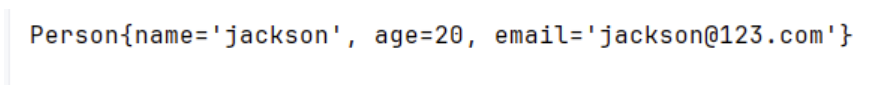

**使用@Builder注解自动生成建造模式的代码**

该注解可以直接帮助我们生成以上的代码。使用`@Builder`注解改造以上代码。

```java
@Data
@Builder
// 建造模式
public class Person {
    // 属性
    private String name;
    private int age;
    private String email;

    public static void main(String[] args) {
        Person person = Person.builder()
                .name("jackson")
                .age(20)
                .email("jackson@123.com")
                .build();
        System.out.println(person);
    }
}
```

执行结果：

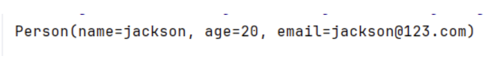

### @Singular

@Singular注解是辅助@Builder注解的。

当被建造的对象的属性是一个集合，这个集合属性使用@Singular注解进行标注的话，可以连续调用集合属性对应的方法完成多个元素的添加。如果没有这个注解，则无法连续调用方法完成多个元素的添加。代码如下：

```java
@Data
@Builder
// 建造模式
public class Person {
    // 属性
    private final String name;
    private final int age;
    private final String email;
    // Singular翻译为：单数。表示一条一条添加
    @Singular("addPhone")
    private final List<String> phones;

    public static void main(String[] args) {
        Person person = Person.builder()
                .name("jackson")
                .age(20)
                .email("jackson@123.com")
                .addPhone("15222020214")
                .addPhone("14875421424")
                .addPhone("16855241424")
                .build();
        System.out.println(person);
    }
}

```

执行结果如下：


### @Slf4j

Lombok 支持多种日志框架的注解，可以根据你使用的日志框架选择合适的注解。以下是 Lombok 提供的**<font style="color:#DF2A3F;">部分日志注解</font>**及其对应的日志框架：

1. `@Log4j`：
   - 自动生成一个 `org.apache.log4j.Logger` 对象。
   - 适用于 Apache Log4j 1.x 版本。
2. `@Slf4j`：
   - 自动生成一个 `org.slf4j.Logger` 对象。
   - 适用于 SLF4J（Simple Logging Facade for Java），这是一种日志门面，可以与多种实际的日志框架（如 Logback、Log4j 等）集成。
3. `@Log4j2`：
   - 自动生成一个 `org.apache.logging.log4j.Logger` 对象。
   - 适用于 Apache Log4j 2.x 版本。

**使用示例**

假设我们有一个类 `ExampleClass`，并且我们想要使用 SLF4J 作为日志框架，我们可以这样使用 `@Slf4j` 注解：

```java
@Slf4j
public class UserService {
    public void login(){
        log.info("登录验证...");
    }
    // 测试
    public static void main(String[] args) {
        UserService userService = new UserService();
        userService.login();
    }
}
```

在这个例子中，`log` 是一个静态成员变量，表示一个 `org.slf4j.Logger` 对象。Lombok 自动生成了这个日志对象，并且你可以直接使用它来进行日志记录。

**1. 选择合适的注解**

选择哪个注解取决于你使用的日志框架。例如：

+ 如果你使用的是 SLF4J，可以选择 `@Slf4j`。
+ 如果你使用的是 Log4j 1.x，可以选择 `@Log4j`。
+ 如果你使用的是 Log4j 2.x，可以选择 `@Log4j2`。

**2. 注意事项**

确保在使用这些注解之前，已经在项目中引入了相应的日志框架依赖。例如，如果你使用 SLF4J，你需要在项目中添加 SLF4J 的依赖，以及一个具体的日志实现（如 Logback）。对于其他日志框架，也需要相应地添加依赖。

**3. 示例依赖**

如果你使用 Maven 项目，并且选择了 SLF4J + Logback 的组合，可以添加以下依赖：

```xml
<!--Slf4j日志规范-->
<dependency>
    <groupId>org.slf4j</groupId>
    <artifactId>slf4j-api</artifactId>
    <version>2.0.16</version>
</dependency>
<!--Slf4j日志实现：logback-->
<dependency>
    <groupId>ch.qos.logback</groupId>
    <artifactId>logback-classic</artifactId>
    <version>1.5.11</version>
</dependency>
```

通过这些日志注解，你可以方便地在类中使用日志记录功能，而无需手动创建日志对象。

执行结果：

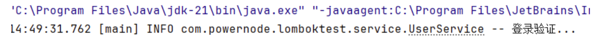

---

# 11. MyBatis逆向生成

MyBatis逆向工程：使用IDEA插件可以根据数据库表的设计逆向生成MyBatis的Mapper接口 与 MapperXML文件。

**1. 安装插件`free mybatis tools`**

**2. 生成MyBatis代码放到SpringBoot项目中**

在表上右键：Mybatis-Generator

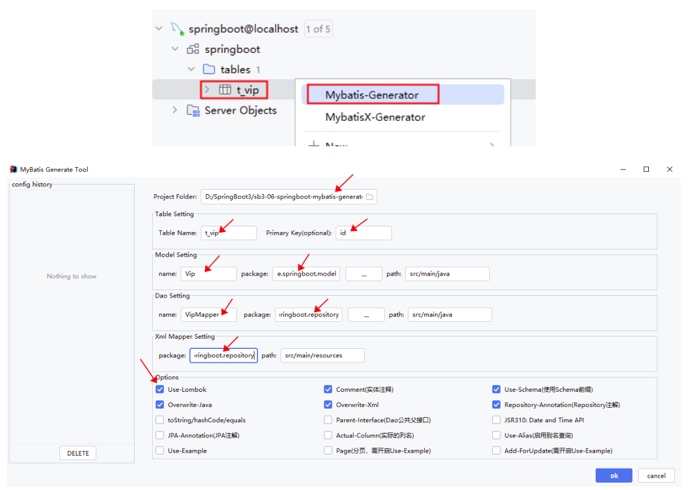

**3. 编写mybatis相关配置**

application.properties属性文件的配置：

```properties
spring.datasource.type=com.zaxxer.hikari.HikariDataSource
spring.datasource.driver-class-name=com.mysql.cj.jdbc.Driver
spring.datasource.url=jdbc:mysql://localhost:3306/springboot
spring.datasource.username=root
spring.datasource.password=123456

mybatis.mapper-locations=classpath:com/powernode/springboot/repository/*.xml
mybatis.configuration.map-underscore-to-camel-case=true
```

**4. 编写测试程序**

```java
@MapperScan(basePackages = "com.powernode.springboot.repository")
@SpringBootApplication
public class Sb306SpringbootMybatisGeneratorApplication {

    public static void main(String[] args) {
        ConfigurableApplicationContext applicationContext = SpringApplication.run(Sb306SpringbootMybatisGeneratorApplication.class, args);
        VipMapper vipMapper = applicationContext.getBean("vipMapper", VipMapper.class);
        // 增
        Vip vip = new Vip();
        vip.setName("孙悟空");
        vip.setBirth("1999-11-11");
        vip.setCardNumber("1234567894");
        vipMapper.insert(vip);
        // 查一个
        Vip vip1 = vipMapper.selectByPrimaryKey(2L);
        System.out.println(vip1);
        // 改
        vip1.setName("孙行者");
        vipMapper.updateByPrimaryKey(vip1);
        // 删
        vipMapper.deleteByPrimaryKey(1L);

        // 关闭Spring容器
        applicationContext.close();
    }
}
```

# 12. 自动配置

## 12.1 SpringBoot的两大核心

Spring Boot 框架的两大核心特性可以概括为“启动器”（Starter）和“自动配置”（Auto-configuration）。

- **启动器（Starter）**：  
  Spring Boot 提供了一系列的 Starter POMs，它们是一组预定义的依赖关系。

当你在项目中引入一个 Starter POM 时，它会自动包含所有必要的 Spring 组件以及合理的默认设置。开发者不需要手动管理复杂的依赖关系，也不需要担心版本冲突的问题，减少了配置上的出错可能。

- **自动配置（Auto-Configuration）**：  
  当添加了特定的 Starter POM 后，Spring Boot 会**<font style="color:#DF2A3F;">根据类路径上存在的 jar 包来自动配置 Bean（自动配置相关组件）（比如：SpringBoot发现类路径上存在mybatis相关的类，例如SqlSessionFactory.class，那么SpringBoot将自动配置mybatis相关的所有Bean。）</font>**。

如果开发者没有显式地提供任何与特定功能相关的配置，Spring Boot 将使用其默认配置来自动设置这些功能。当然，如果需要的话，用户也可以覆盖这些默认设置。

这两个特性结合在一起，使得使用 Spring Boot 开发应用程序变得更加简单快速，减少了大量的样板代码和重复配置的工作。**<font style="color:#DF2A3F;">让程序员专注业务逻辑的开发，在环境方面耗费最少的时间</font>**。

## 12.2 自动配置带来的便捷

拿SpringBoot集成MyBatis为例。

以前，在没有SpringBoot框架的时候，我们用Spring集成MyBatis框架，需要进行如下的配置：

```xml
<?xml version="1.0" encoding="UTF-8"?>
<beans xmlns="http://www.springframework.org/schema/beans"
       xmlns:xsi="http://www.w3.org/2001/XMLSchema-instance"
       xmlns:context="http://www.springframework.org/schema/context"
       xmlns:tx="http://www.springframework.org/schema/tx"
       xsi:schemaLocation="
        http://www.springframework.org/schema/beans
        http://www.springframework.org/schema/beans/spring-beans.xsd
        http://www.springframework.org/schema/context
        http://www.springframework.org/schema/context/spring-context.xsd
        http://www.springframework.org/schema/tx
        http://www.springframework.org/schema/tx/spring-tx.xsd">

    <!-- 数据源配置 -->
    <bean id="dataSource" class="org.apache.commons.dbcp2.BasicDataSource">
        <property name="driverClassName" value="com.mysql.cj.jdbc.Driver"/>
        <property name="url" value="jdbc:mysql://localhost:3306/mydb"/>
        <property name="username" value="root"/>
        <property name="password" value="password"/>
    </bean>

    <!-- SqlSessionFactory -->
    <bean id="sqlSessionFactory" class="org.mybatis.spring.SqlSessionFactoryBean">
        <property name="dataSource" ref="dataSource"/>
        <property name="mapperLocations" value="classpath:mapper/*.xml"/>
        <property name="typeAliasesPackage" value="com.example.model"/>
    </bean>

    <!-- Mapper 扫描器 -->
    <bean class="org.mybatis.spring.mapper.MapperScannerConfigurer">
        <property name="basePackage" value="com.example.mapper"/>
        <property name="sqlSessionFactoryBeanName" value="sqlSessionFactory"/>
    </bean>

    <!-- 事务管理器 -->
    <bean id="transactionManager" class="org.springframework.jdbc.datasource.DataSourceTransactionManager">
        <property name="dataSource" ref="dataSource"/>
    </bean>

    <!-- 开启事务注解 -->
    <tx:annotation-driven transaction-manager="transactionManager"/>

    <!-- 扫描 service 层的包 -->
    <context:component-scan base-package="com.example.service"/>

</beans>
```

通过以上的配置可以看到Spring集成MyBatis的时候，需要手动提供`BasicDataSource`、`SqlSessionFactoryBean`、`MapperScannerConfigurer`、`DataSourceTransactionManager`等Bean的配置。

---

使用了Spring Boot框架之后，这些配置都不需要提供了，SpringBoot框架的自动配置机制可以全部按照默认的方式自动化完成。减少了大量的配置，在环境方面耗费很少的时间，让程序员更加专注业务逻辑的处理。我们只需要在`application.yml`中提供以下的配置即可：

```yaml
spring:
  datasource:
    driver-class-name: com.mysql.cj.jdbc.Driver
    url: jdbc:mysql://localhost:3306/springboot
    username: root
    password: 123456
    type: com.zaxxer.hikari.HikariDataSource
```

## 12.3 引入web启动器都有哪些组件会准备好

通过以下代码获取spring ioc容器中的所有注册的bean，一个Bean就是一个组件：

```java
@SpringBootApplication
public class TestApplication {

    public static void main(String[] args) {
        ConfigurableApplicationContext applicationContext = SpringApplication.run(TestApplication.class, args);
        String[] beanDefinitionNames = applicationContext.getBeanDefinitionNames();
        for (String beanDefinitionName : beanDefinitionNames) {
            System.out.println(beanDefinitionName);
        }
        applicationContext.close();
    }

}
```

在springboot没有引入任何启动器的情况下，默认提供了`59`bean

引入web启动器：

```xml
<dependency>
  <groupId>org.springframework.boot</groupId>
  <artifactId>spring-boot-starter-web</artifactId>
</dependency>
```

可以发现，ioc容器中注册的bean总数量为`160`个

也就是说，引入了`web启动器`后，ioc容器中增加了`101`个bean对象（**<font style="color:#DF2A3F;">加入了101个组件</font>**）。这`101`个bean对象都是为web开发而准备的，例如我们常见的：

+ dispatcherServlet：DispatcherServlet 是 Spring MVC 的前端控制器，负责接收所有的 HTTP 请求，并将请求分发给适当的处理器（Controller）
+ viewResolver：ViewResolver 是 Spring MVC 中用于将逻辑视图名称解析为实际视图对象的组件。它的主要作用是根据控制器返回的视图名称，找到对应的视图实现（如 JSP、Thymeleaf、Freemarker 等），并返回给 DispatcherServlet 用于渲染视图。
+ characterEncodingFilter：字符集过滤器组件，解决请求和响应的乱码问题。
+ mappingJackson2HttpMessageConverter：负责处理消息转换的组件。它可以将json字符串转换成java对象，也可以将java对象转换为json字符串。
+ ......

每一个组件都有它特定的功能。

没有使用SpringBoot之前，以上的很多组件都是需要手动配置的。

## 12.4 默认的包扫描规则

之前我们已经说过并且测试过：springboot默认情况下只扫描`主入口类`所在包及子包下的类。

这是因为`@SpringBootApplication`注解被`@ComponentScan`标注，代替spring以前的这个配置：`<context:component-scan base-packages="主入口类所在包"/>`

当然，我们也可以打破这个规则，通过以下两种方式：

+ 第一种：@SpringBootApplication(scanBasePackages = "com")
+ 第二种：@ComponentScan("com")

```java
@SpringBootConfiguration
@EnableAutoConfiguration
@ComponentScan("com")
public class TestApplication {}
```

## 12.5 默认配置

springboot为功能的实现提供了非常多的默认配置.

例如：tomcat服务器端口号在没有配置的情况下，默认是`8080`

当然，也可以在`application.properties`文件中进行重新配置：

```properties
server.port=8081
```

再如，配置thymeleaf的模板引擎时，默认的模板引擎前缀是`classpath:/templates/`，默认的后缀是`.html`

当然，也可以重新配置：

```properties
spring.thymeleaf.prefix=classpath:/templates/
spring.thymeleaf.suffix=.html
```

这些配置最终都会通过`@ConfigurationProperties(prefix="")`注解绑定到对应的bean的属性上。这个Bean我们一般称为`属性类`。例如：

`ServerProperties`：服务器属性类，专门负责配置服务器相关信息。

```java
@ConfigurationProperties(prefix = "server", ignoreUnknownFields = true)
public class ServerProperties {}
```

`ThymeleafProperties`：Thymeleaf属性类，专门负责配置Thymeleaf模板引擎的。

```java
@ConfigurationProperties(prefix = "spring.thymeleaf")
public class ThymeleafProperties {}
```

SpringBoot官方文档当中也有指导，告诉你都有哪些`属性类`，告诉你在`application.properties`中都可以配置哪些东西。默认值都是什么：

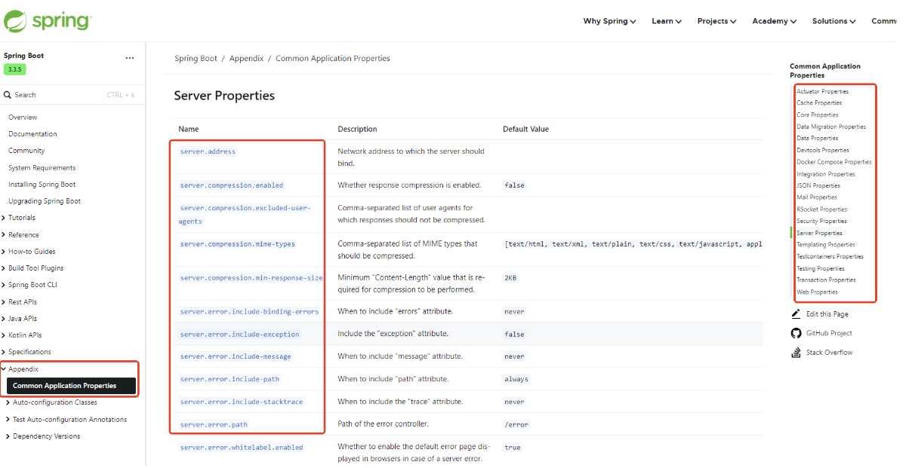

## 12.6 自动配置是按需加载的

SpringBoot提供了非常多的自动配置类，有的是`web`相关的自动配置，有的是`mail`相关的自动配置。但是这些自动配置并不是全部生效，它是按需加载的。**<font style="color:#DF2A3F;">导入了哪个启动器，则该启动器对应的自动配置类才会被加载</font>**。

这些自动配置类在哪里？

任何启动器都会关联引入这样一个启动器：`spring-boot-starter`，它是springboot框架最核心的启动器。

`spring-boot-starter`又关联引入了`spring-boot-autoconfigure`。所有的自动配置类都在这里。

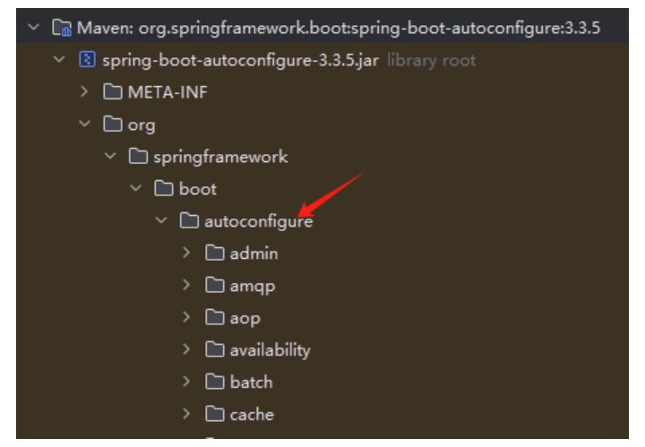

## 12.7 SpringBoot框架提供的条件注解

如何做到按需加载的，依靠SpringBoot框架中的条件注解来实现的。

Spring Boot框架中的@ConditionalOnXxx系列注解属于条件注解（Conditional Annotations），它们用于基于某些条件来决定是否应该创建一个或一组Bean。这些注解通常用在自动配置类上，以确保只有在特定条件满足时才会应用相应的配置。

这里是一些常见的@ConditionalOnXxx注解及其作用：

+ `@ConditionalOnClass`：当指定的类存在时，才创建Bean。
+ `@ConditionalOnMissingClass`：当指定的类不存在时，才创建Bean。
+ `@ConditionalOnBean`：当容器中存在指定的Bean时，才创建Bean。
+ `@ConditionalOnMissingBean`：当容器中不存在指定的Bean时，才创建Bean。
+ `@ConditionalOnProperty`：当配置文件中存在指定的属性时，才创建Bean。也可以设置属性值需要匹配的值。
+ `@ConditionalOnResource`：当指定的资源存在时，才创建Bean。
+ `@ConditionalOnWebApplication`：当应用程序是Web应用时，才创建Bean。
+ `@ConditionalOnNotWebApplication`：当应用程序不是Web应用时，才创建Bean。

使用这些注解可以帮助开发者根据不同的运行环境或配置来灵活地控制Bean的创建，从而实现更智能、更自动化的配置过程。这对于构建可插拔的模块化系统特别有用，因为可以根据实际需求选择性地启用或禁用某些功能。

---

假设我们来实现这样一个功能：如果IoC容器当中**<font style="color:#DF2A3F;">存在</font>**`A`**<font style="color:#DF2A3F;">Bean</font>**，就创建`B`Bean，代码如下：

```java
@Configuration
public class AppConfig {

    @Bean
    public A a(){
        return new A();
    }

    @ConditionalOnBean(A.class)
    @Bean
    public B b(){
        return new B();
    }
}
```

如果IoC容器当中**<font style="color:#DF2A3F;">不存在</font>**`A`**<font style="color:#DF2A3F;">Bean</font>**，就创建`B`Bean，代码如下：

```java
@Configuration
public class AppConfig {

    @Bean
    public A a(){
        return new A();
    }

    @ConditionalOnMissingBean(A.class)
    @Bean
    public B b(){
        return new B();
    }
}
```

当类路径当中存在`DispatcherServlet`类，则启用配置，反之则不启用配置，代码如下：

```java
@ConditionalOnClass(name = {"org.springframework.web.servlet.DispatcherServlet"})
@Configuration
public class MyConfig {
    @Bean
    public A getA(){
        return new A();
    }
}
```

# 13. 自动配置实现原理

深入的分析一个问题：为什么导入`web启动器`，web开发相关的自动配置就会生效？

我们来深入的分析一个问题：为什么导入`web启动器`，web开发相关的自动配置就会生效？

## 13.1 在程序没有开始执行之前都导入了哪些依赖

在程序没有开始运行之前，我们先来分析一下，当导入`web启动器`之后，底层都一连串的导入了哪些依赖！

1. 从这里开始：导入了`spring-boot-starter-web`【web启动器】
2. 然后关联导入了`spring-boot-starter`、`spring-boot-starter-json`、`spring-boot-starter-tomcat`、`spring-web`、`spring-webmvc`
   - 注意：`spring-boot-starter`是springboot核心启动器，任何启动器在导入时，都会关联导入springboot核心启动器。
3. 核心启动器导入之后，关联导入了一个jar包：`spring-boot-autoconfigure`。
   
   **1. 注意：这个jar包中存放的是springboot框架<font style="color:#DF2A3F;">官方支持的自动配置类</font>。如下图：**

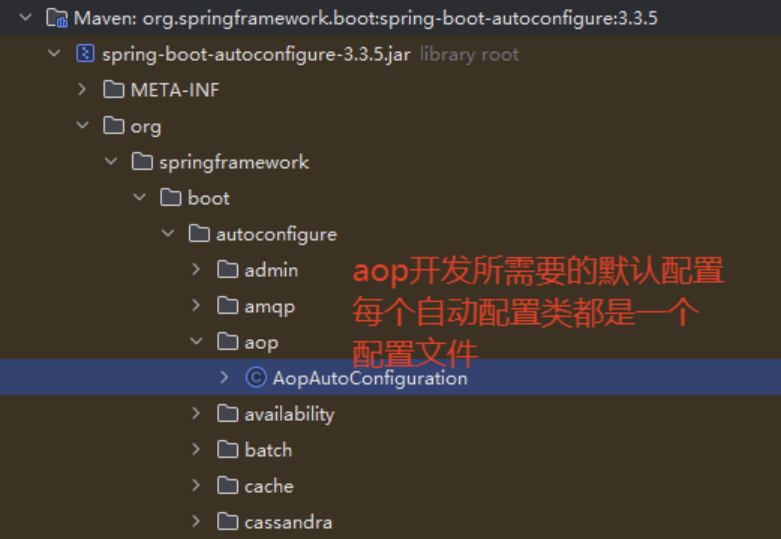

​	**2. 官方支持的自动配置类有多少个呢，可以通过下图位置查看：**

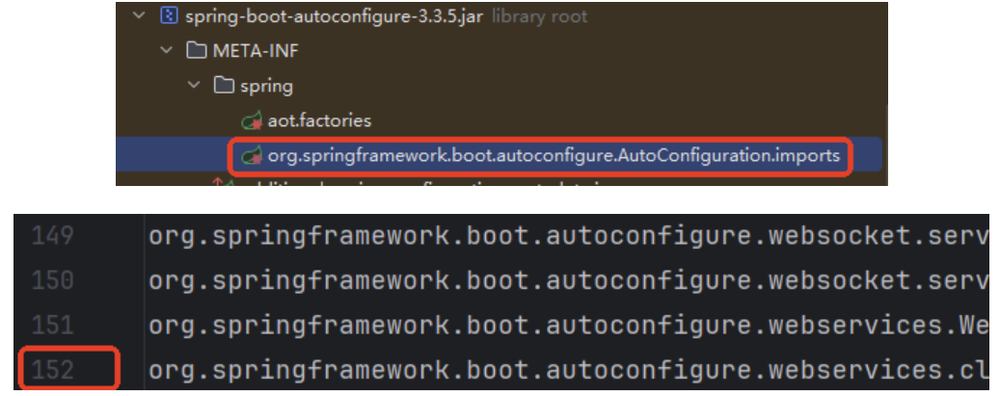

得知`springboot3.3.5`这个版本共`152`个自动配置类。自动配置类的命名规则是`XxxxAutoConfiguration`。

**<font style="color:#DF2A3F;">提示：哪个自动配置类生效，就代表哪个配置文件生效，那么对应的技术就完成了整合，就可以进行对应技术的开发。</font>**

---

## 13.2 从main方法开始执行之后都发生了什么

以上分析的是在项目结构上已经完成了相关依赖的导入，这些自动配置了导入到了项目当中，那么在运行时哪些自动配置类会被加载？哪些自动配置类会生效呢？我们接下来进行程序运行阶段的分析：

1. **程序从main方法进入执行，主入口类上使用`@SpringBootApplication`进行了标注。**

2. **`@SpringBootApplication`注解是复合注解，代表以下三个注解的功能**：

   - `@SpringBootConfiguration`：它被`@Configuration`标注，说明主入口类就是一个配置类，此时该配置开始加载。

   - `@ComponentScan`：默认扫描的是主入口所在包以及子包。因此`spring-boot-autoconfigure`包是扫描不到的，按说`XxxAutoConfiguration`自动配置类是无法加载的！！！那么这些自动配置类又是如何加载和生效的呢？

   - `@EnableAutoConfiguration`：自动配置类的加载和生效全靠它了。该注解被翻译为：启用自动配置。

3. **`@EnableAutoConfiguration`被`@Import(AutoConfigurationImportSelector.class)`标注**

   - `@Import(AutoConfigurationImportSelector.class)`的作用是：将`AutoConfigurationImportSelector`作为一个Bean加载到IoC容器中。

   - 这个Bean的作用是：负责收集和选择所有符合条件的自动配置类。

4. **添加断点，跟踪`AutoConfigurationImportSelector`源码：**

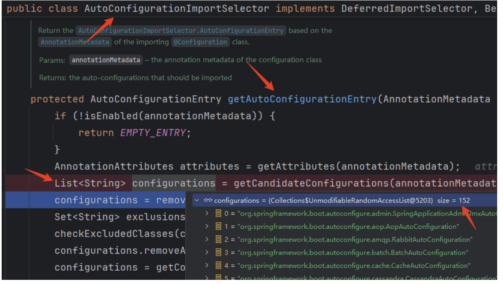

通过跟踪得知，这`152`个自动配置类的**类名**都会被加载到IoC容器中。**<font style="color:#DF2A3F;">注意：加载了152，并不是152个全部生效</font>**。

5. **这`152`个自动配置类底层是怎么查找的？**

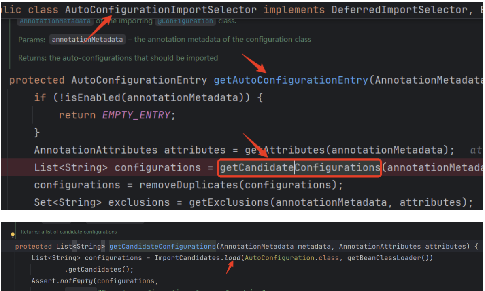


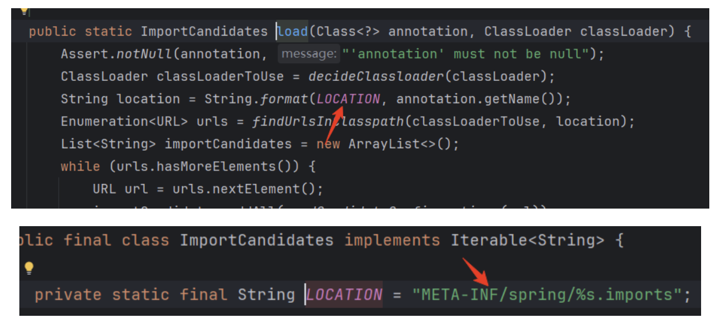

通过以上源码跟踪，得知，是从下图位置加载的：

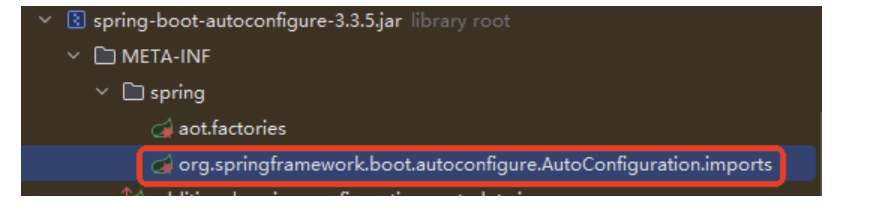

6. **最终哪些自动配置类生效了？**

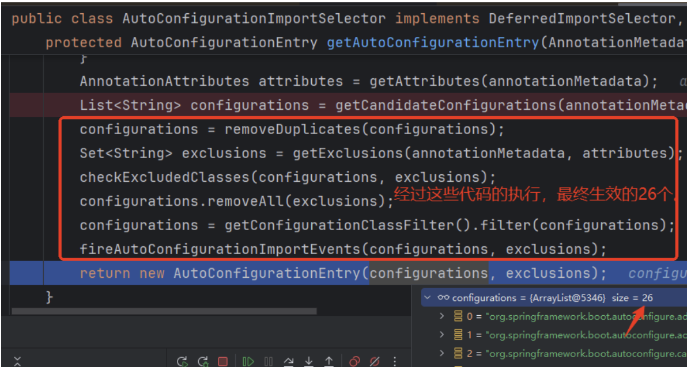

最先获取到`152`个，经过上图的一层一层的过滤（**条件注解**），**<font style="color:#DF2A3F;">最终筛选了</font>**`26`**<font style="color:#DF2A3F;">个自动配置类，为什么这么少，因为你只引入了</font>**`web starter`**<font style="color:#DF2A3F;">。这26个配置就是做web开发需要的最少配置</font>**。

**具体怎么排除的，请看以下解释：**

+ `configurations = removeDuplicates(configurations);`

去重：移除 configurations 列表中的重复项，确保每个配置类只出现一次。

+ `Set<String> exclusions = getExclusions(annotationMetadata, attributes);`

获取排除列表：从注解元数据和属性中获取需要排除的配置类名称集合。因为`@EnableAutoConfiguration`注解还能这么用：`@EnableAutoConfiguration(exclude = {排除列表}, excludeName = {排除列表})`

+ `checkExcludedClasses(configurations, exclusions);`

检查排除：验证 `configurations` 中是否有被排除的类，如果有，可能会抛出异常或记录警告。

+ `configurations.removeAll(exclusions);`

移除排除项：从 `configurations` 列表中移除所有在 `exclusions` 集合中的配置类。

+ `configurations = getConfigurationClassFilter().filter(configurations);`

过滤配置类：使用 `ConfigurationClassFilter` 对 `configurations` 进行进一步过滤。**这一行通过条件注解进行判断**，例如 `@ConditionalOnClass、@ConditionalOnMissingBean` 等。

+ `fireAutoConfigurationImportEvents(configurations, exclusions);`

触发事件：触发自动配置导入事件，通知其他组件或监听器关于最终确定的配置类和排除的类。

---

## 13.3 自动配置类都干了啥

**<font style="color:#DF2A3F;">自动配置类导入了一堆相关的组件（一个组件一个功能），而每个组件获取配置时都是从属性类中获取，而属性类恰好又和配置文件绑定。</font>**

以`DispatcherServletAutoConfiguration`自动配置类为例，这个自动配置类主要是配置了SpringMVC中的前端控制器。

源码：

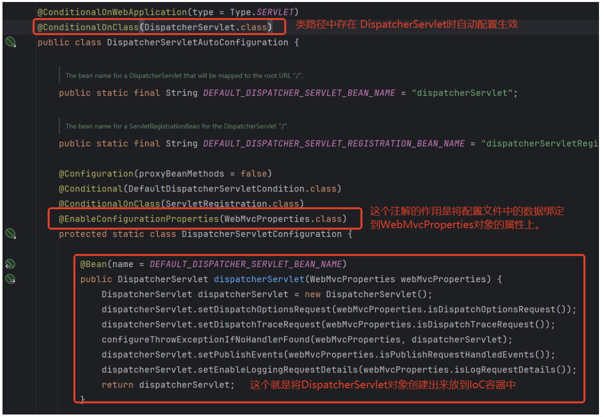

通过以上源码得知，`DispatcherServletConfiguration`组件的配置信息来源于`WebMvcProperties`属性类。`WebMvcProperties`类源码如下：

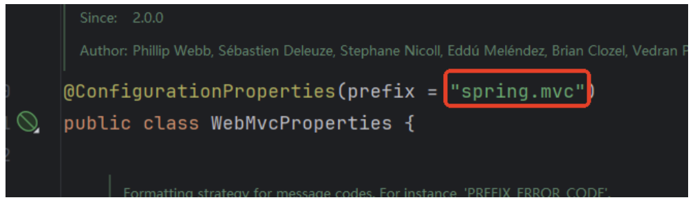

通过以上源码又得知，要对`DispatcherServletConfiguration`进行配置的话，应该在`application.properties`中使用这样的前缀配置：`spring.mvc....`

再来看`嵌入式Web服务器工厂自定义程序自动配置`：`EmbeddedWebServerFactoryCustomizerAutoConfiguration`，通俗讲：通过它可以配置web服务器。

源码：

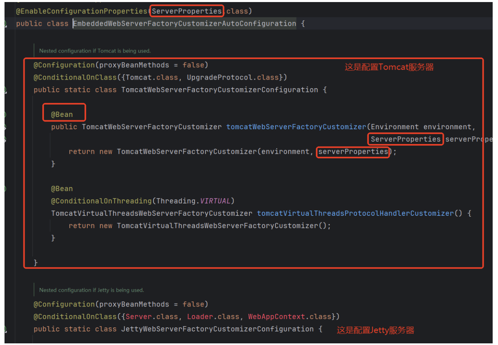

通过以上源码得知，这个自动配置类中也有很多组件，有tomcat组件，有jetty组件。单独看Tomcat，要配置Tomcat服务器，需要参照`ServerProperties`属性类，打开源码看看：

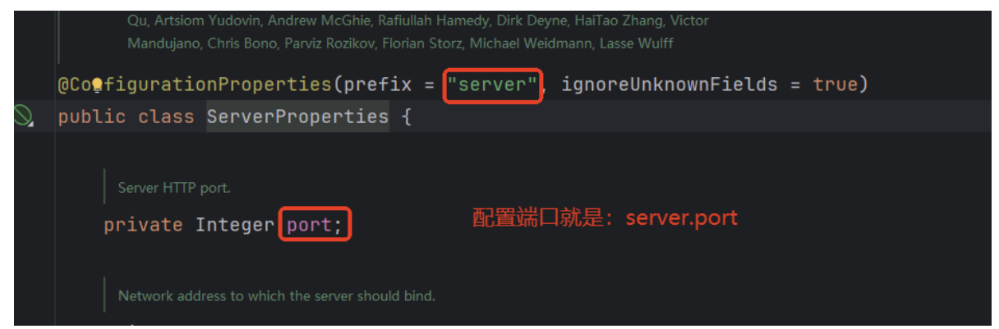

因此配置Tomcat服务器需要在`application.properties`文件中使用这样的前缀配置：`server.`

---

## 13.4 总结自动配置原理

1. 运行环境准备阶段
   1. 引入web启动器
   2. 最终传递引入了自动配置的jar包
   3. 自动配置的jar包中有152个自动配置类，到此运行环境准备完毕。
2. 运行阶段
   1. @EnableAutoConfiguration 启用自动配置，将152个自动配置类全部加载到IoC容器中，然后根据开发场景筛选出必须的自动配置类。
   2. 自动配置类加载了一堆组件。
   3. 每个组件需要的数据来自属性类。
   4. 属性类又和配置文件绑定在一起。
3. 因此，最终一句话：导入启动器，修改配置文件，就可以完成对应功能的开发。

