# 14. SpringBoot的web自动配置

## 14.1 web自动配置的依赖是如何传递的

1. 首先引入了`web启动器`，如下：

```xml
<dependency>
  <groupId>org.springframework.boot</groupId>
  <artifactId>spring-boot-starter-web</artifactId>
</dependency>
```

2. `web启动器`传递引入了`spring-boot-starter`，如下：

```xml
<dependency>
  <groupId>org.springframework.boot</groupId>
  <artifactId>spring-boot-starter</artifactId>
  <version>3.3.5</version>
  <scope>compile</scope>
</dependency>
```

3. `spring-boot-starter`会传递引入一个`spring-boot-autoconfigure`包，如下：

```xml
<dependency>
  <groupId>org.springframework.boot</groupId>
  <artifactId>spring-boot-autoconfigure</artifactId>
  <version>3.3.5</version>
  <scope>compile</scope>
</dependency>
```

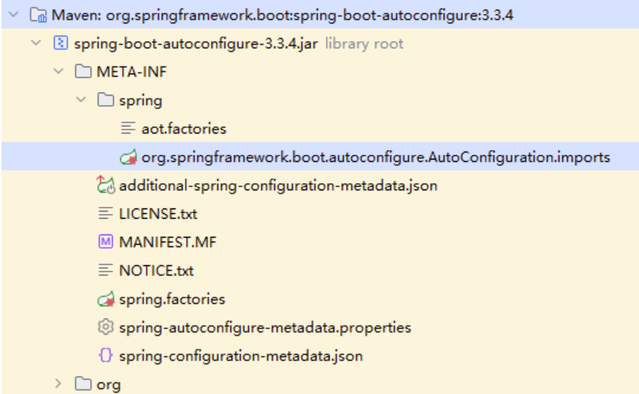

4. 在`spring-boot-autoconfigure`包中的`.imports`文件中罗列的需要导入的自动配置类，如下图：

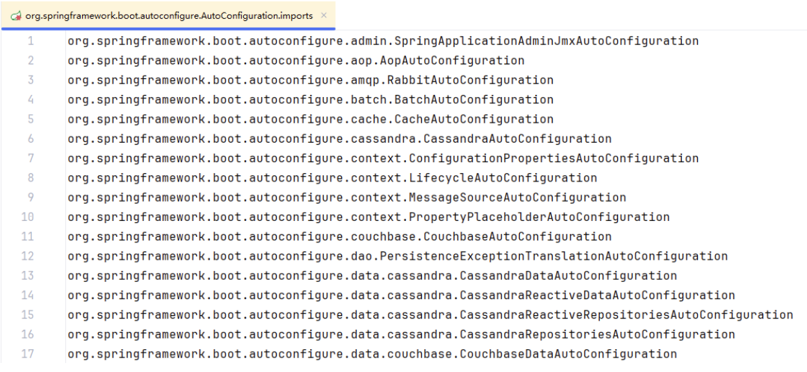

## 14.2 web自动配置的实现原理

1. 从入口程序开始：

```java
package com.powernode.sb309web;

import org.springframework.boot.SpringApplication;
import org.springframework.boot.autoconfigure.SpringBootApplication;

@SpringBootApplication
public class Sb309WebApplication {

    public static void main(String[] args) {
        SpringApplication.run(Sb309WebApplication.class, args);
    }
}
```

入口程序被`@SpringBootApplication`注解标注。

2. `@SpringBootApplication`注解被`@EnableAutoConfiguration`<font style="color:#080808;background-color:#ffffff;">注解标注。表示启用自动配置。</font>
3. `@EnableAutoConfiguration`<font style="color:#080808;background-color:#ffffff;">注解被</font>`@Import({AutoConfigurationImportSelector.class})`<font style="color:#080808;background-color:#ffffff;">注解标注。</font>
4. <font style="color:#080808;background-color:#ffffff;">因此</font>`AutoConfigurationImportSelector`<font style="color:#080808;background-color:#ffffff;">决定哪些自动配置类是需要导入的。</font>
5. `<font style="color:#080808;background-color:#ffffff;">AutoConfigurationImportSelector</font>`<font style="color:#080808;background-color:#ffffff;">底层实现步骤具体如下：</font>

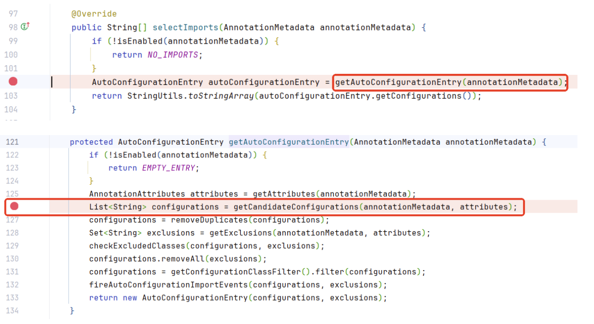

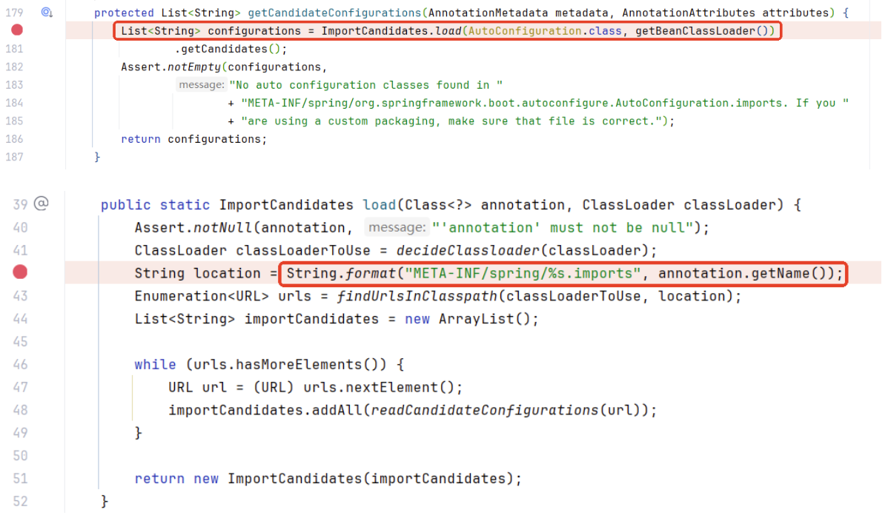

最终找的文件是：

`META-INF/spring/org.springframework.boot.autoconfigure.AutoConfiguration.imports`

**注意：任何jar包，包括第三方的依赖，自动配置类所在的路径以及文件名都是完全相同的，都是**

`META-INF/spring/org.springframework.boot.autoconfigure.AutoConfiguration.imports`

例如mybatis的自动配置类的列表文件也是这样，如下图：

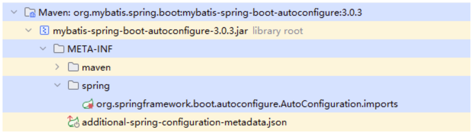

## 14.3 通过web自动配置类逆推web配置的prefix

在自动配置列表中找到web自动配置相关的类：

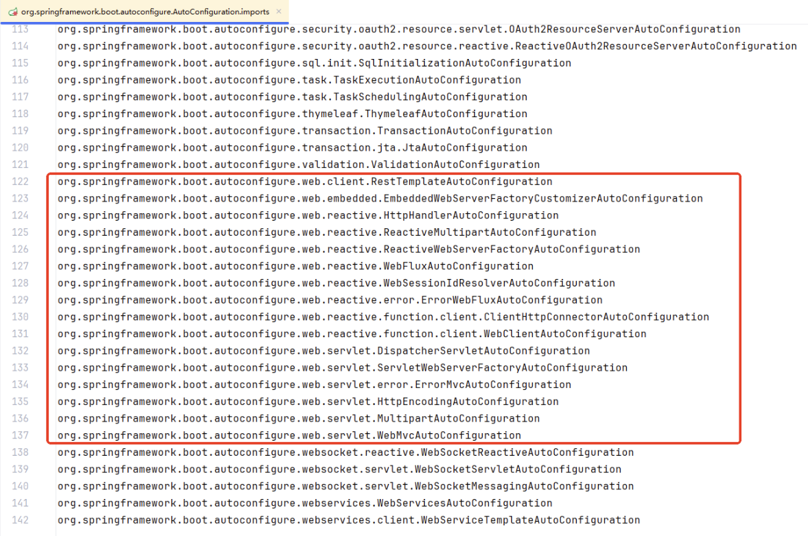

以下就是web自动配置类列表：

```java
org.springframework.boot.autoconfigure.web.client.RestTemplateAutoConfiguration
org.springframework.boot.autoconfigure.web.embedded.EmbeddedWebServerFactoryCustomizerAutoConfiguration
org.springframework.boot.autoconfigure.web.servlet.DispatcherServletAutoConfiguration
org.springframework.boot.autoconfigure.web.servlet.ServletWebServerFactoryAutoConfiguration
org.springframework.boot.autoconfigure.web.servlet.error.ErrorMvcAutoConfiguration
org.springframework.boot.autoconfigure.web.servlet.HttpEncodingAutoConfiguration
org.springframework.boot.autoconfigure.web.servlet.MultipartAutoConfiguration
org.springframework.boot.autoconfigure.web.servlet.WebMvcAutoConfiguration
```


通过web自动配置类的源码可以逆推web配置的prefix：

1. WebMvcAutoConfiguration

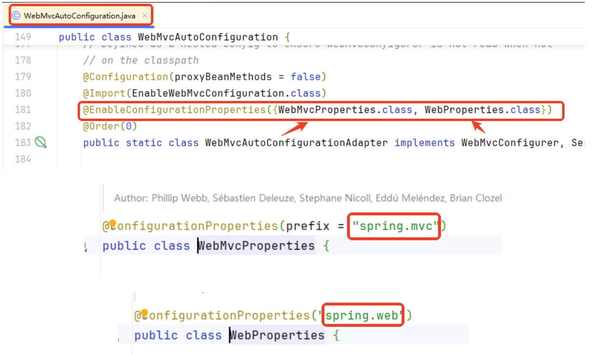

2. MultipartAutoConfiguration

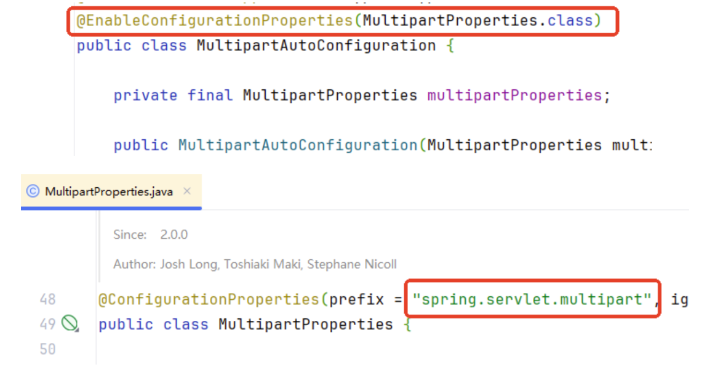

3. HttpEncodingAutoConfiguration

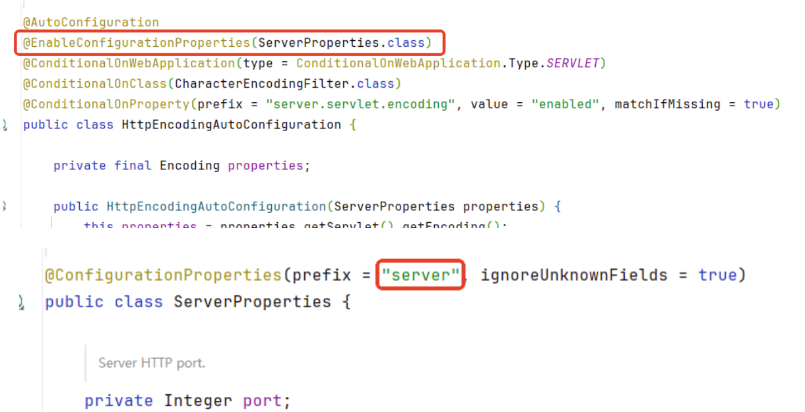

4. ErrorMvcAutoConfiguration
5. ServletWebServerFactoryAutoConfiguration
6. DispatcherServletAutoConfiguration
7. EmbeddedWebServerFactoryCustomizerAutoConfiguration
8. RestTemplateAutoConfiguration

通过查看源码，得知，web开发时，在`application.properties`配置文件中可以配置的前缀是：

```properties
# SpringMVC相关配置
spring.mvc.

# web开发通用配置
spring.web.

# 文件上传配置
spring.servlet.multipart.

# 服务器配置
server.
```

---

## 14.4 Web自动配置都默认配置了什么

查看官方文档：

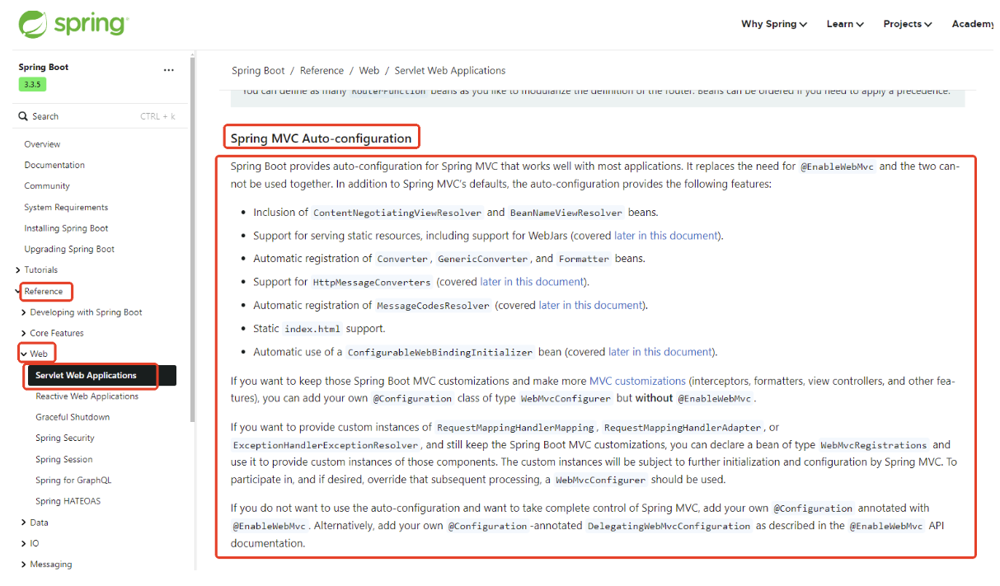

**翻译如下：**

Spring Boot 为 Spring MVC 提供了自动配置，这在大多数应用程序中都能很好地工作。除了已经实现了 Spring MVC 的默认功能外，自动配置还提供了以下特性：

+ 包括 `ContentNegotiatingViewResolver` 和 `BeanNameViewResolver` 的 Bean。
  - `ContentNegotiatingViewResolver` 自动根据HTTP请求头中Accept字段来选择合适的视图技术渲染响应。
  - `BeanNameViewResolver`<font style="color:rgb(44, 44, 54);"> 的作用是根据视图名称找到视图View对象。</font>
+ 支持提供静态资源，包括对 WebJars的支持。
  - 静态资源路径默认已经配置好了。默认会去static目录下找。
+ 自动注册 `Converter`、`GenericConverter` 和 `Formatter` 的 Bean。
  - `Converter`：转换器，做类型转换的，例如表单提交了用户数据，将表单数据转换成User对象。
  - `Formatter`：格式化器，做数据格式化的，例如将Java中的`日期类型对象`格式化为`特定格式的日期字符串`。或者将用户提交的日期字符串，转换为Java中的日期对象。
+ 支持 `HttpMessageConverters`。
  - 内置了很多的HTTP消息转换器。例如：`MappingJackson2HttpMessageConverter`可以将json转换成java对象，也可以将java对象转换为json字符串。
+ 自动注册 `MessageCodesResolver`。
  - SpringBoot会自动注册一个默认的`消息代码解析器`
  - 帮助你在表单验证出错时生成一些特殊的代码。这些代码让你能够更精确地定位问题，并提供更友好的错误提示。
+ 静态 `index.html` 文件支持。
  - Spring Boot 会自动处理位于项目静态资源目录下的 index.html 文件，使其成为应用程序的默认主页
+ 自动使用 `ConfigurableWebBindingInitializer` Bean。
  - 用它来指定默认使用哪个转换器，默认使用哪个格式化器。在这个类当中都已经配好了。

如果您不想使用自动配置并希望完全控制 Spring MVC，可以添加您自己的带有 `@EnableWebMvc` 注解的 `@Configuration`。

如果您希望保留这些 Spring Boot MVC 定制化设置并进行更多的 MVC 定制化（如拦截器、格式化程序、视图控制器等其他功能），可以添加您自己的类型为 `WebMvcConfigurer` 的 `@Configuration` 类。**<font style="color:#DF2A3F;">但不能使用</font>**`@EnableWebMvc`**<font style="color:#DF2A3F;">注解</font>**。

## 14.5 WebMvcAutoConfiguration原理

通过源码分析的方式，学习WebMvc的自动配置原理。

### 14.5.1 WebMvc自动配置是否生效的条件

```java
@AutoConfiguration(after = { DispatcherServletAutoConfiguration.class, TaskExecutionAutoConfiguration.class,
		ValidationAutoConfiguration.class })
@ConditionalOnWebApplication(type = Type.SERVLET)
@ConditionalOnClass({ Servlet.class, DispatcherServlet.class, WebMvcConfigurer.class })
@ConditionalOnMissingBean(WebMvcConfigurationSupport.class)
@AutoConfigureOrder(Ordered.HIGHEST_PRECEDENCE + 10)
@ImportRuntimeHints(WebResourcesRuntimeHints.class)
public class WebMvcAutoConfiguration {}
```

+ `@AutoConfiguration(after = { DispatcherServletAutoConfiguration.class, TaskExecutionAutoConfiguration.class,ValidationAutoConfiguration.class })`
  - **WebMvcAutoConfiguration自动配置类**加载顺序在以上自动配置类加载后加载。
+ `@ConditionalOnWebApplication(type = Type.SERVLET)`
  - **WebMvcAutoConfiguration自动配置类**只在servlet环境中生效。
+ `@ConditionalOnClass({ Servlet.class, DispatcherServlet.class, WebMvcConfigurer.class })`
  - 类路径中必须存在`Servlet.class``DispatcherServlet.class``WebMvcConfigurer.class`，**WebMvcAutoConfiguration自动配置类才会生效。**
+ `@ConditionalOnMissingBean(WebMvcConfigurationSupport.class)`
  - 类路径中不存在`WebMvcConfigurationSupport.class`时**WebMvcAutoConfiguration自动配置类才会生效。**
  - 注意：当使用@EnableWebMvc注解后，类路径中就会注册一个WebMvcConfigurationSupport这样的bean。
+ `@AutoConfigureOrder(Ordered.HIGHEST_PRECEDENCE + 10)` **不重要**
  - 指定**WebMvcAutoConfiguration自动配置类**的加载顺序
+ `@ImportRuntimeHints(WebResourcesRuntimeHints.class)` **不重要**
  - 运行时引入**WebResourcesRuntimeHints**这个类，这个类的作用是给JVM或者其他组件提示信息的，提示一下系统应该如何处理类和资源。


总结来说，`WebMvcAutoConfiguration`类将在以下条件下生效：

1. 应用程序是一个Servlet类型的Web应用；
2. 环境中有Servlet、DispatcherServlet和WebMvcConfigurer类；
3. 容器中没有WebMvcConfigurationSupport的bean。

如果这些条件都满足的话，那么这个自动配置类就会被激活，并进行相应的自动配置工作。

### 14.5.2 WebMvc自动配置生效后引入了两个Filter Bean

**引入了HiddenHttpMethodFilter Bean**

```java
@Bean
@ConditionalOnMissingBean(HiddenHttpMethodFilter.class)
@ConditionalOnProperty(prefix = "spring.mvc.hiddenmethod.filter", name = "enabled")
public OrderedHiddenHttpMethodFilter hiddenHttpMethodFilter() {
    return new OrderedHiddenHttpMethodFilter();
}
```

这个过滤器是专门处理Rest请求的。GET POST PUT DELETE请求。

**引入了FormContentFilter Bean**

```java
@Bean
@ConditionalOnMissingBean(FormContentFilter.class)
@ConditionalOnProperty(prefix = "spring.mvc.formcontent.filter", name = "enabled", matchIfMissing = true)
public OrderedFormContentFilter formContentFilter() {
    return new OrderedFormContentFilter();
}
```

OrderedFormContentFilter 是 Spring Boot 中用于处理 HTTP 请求的一个过滤器，特别是针对 PUT 和 DELETE 请求。这个过滤器的主要作用是在处理 PUT 和 DELETE 请求时，确保如果请求体中有表单格式的数据，这些数据会被正确解析并可用。

### 14.5.3 WebMvc自动配置生效后引入了WebMvcConfigurer接口的实现类

在SpringBoot框架的`WebMvcAutoConfiguration`类中提供了一个内部类：`WebMvcAutoConfigurationAdapter`

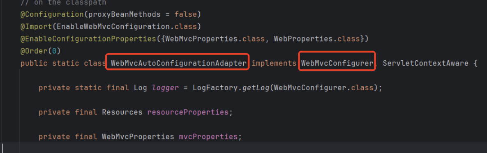

SpringBoot在这个类`WebMvcAutoConfigurationAdapter`中进行了一系列的Spring MVC相关配置。

**<font style="color:#DF2A3F;">我们开发中要对Spring MVC的相关配置进行修改，可以编写一个类继承</font>`WebMvcAutoConfigurationAdatper`<font style="color:#DF2A3F;">，然后重写对应的方法即可。</font>**

**<font style="color:#DF2A3F;">因此，通过对</font>`WebMvcAutoConfigurationAdapter`<font style="color:#DF2A3F;">类中的方法进行重写来</font><font style="color:#74B602;">修改</font><font style="color:#DF2A3F;">Web MVC的默认配置。</font>**


- **关于`WebMvcConfigurer`接口**

这个接口不是SpringBoot框架提供的，是Spring MVC提供的，在Spring框架4.3版本中引入的。这个接口的作用主要是**允许开发者通过实现这个接口来定制Spring MVC的行为**。

在这个接口中提供了很多方法，需要改变Spring MVC的哪个行为，则重写对应的方法即可，下面是这个接口中所有的方法，以及每个方法对应的Spring MVC行为的解释：

```java
public interface WebMvcConfigurer {
    // 用于定制 Spring MVC 如何匹配请求路径到控制器
    default void configurePathMatch(PathMatchConfigurer configurer) {}
    // 用于定制 Spring MVC 的内容协商策略，以确定如何根据请求的内容类型来选择合适的处理方法或返回数据格式
    default void configureContentNegotiation(ContentNegotiationConfigurer configurer) {}
    // 用于定制 Spring MVC 处理异步请求的方式
    default void configureAsyncSupport(AsyncSupportConfigurer configurer) {}
    // 用于定制是否将某些静态资源请求转发WEB容器默认的Servlet处理
    default void configureDefaultServletHandling(DefaultServletHandlerConfigurer configurer) {}
    // 用于定制 Spring MVC 解析视图的方式，以确定如何将控制器返回的视图名称转换为实际的视图资源。
    default void configureViewResolvers(ViewResolverRegistry registry) {}
    // 用于定制 Spring MVC 如何处理 HTTP 请求和响应的数据格式，包括 JSON、XML 等内容类型的转换
    default void configureMessageConverters(List<HttpMessageConverter<?>> converters) {}
    // 用于定制 Spring MVC 如何处理控制器方法中发生的异常，并提供相应的错误处理逻辑。
    default void configureHandlerExceptionResolvers(List<HandlerExceptionResolver> resolvers) {}

    // 用于定制 Spring MVC 如何处理数据的格式化和解析，例如日期、数值等类型的对象的输入和输出格式。
    default void addFormatters(FormatterRegistry registry) {}
    // 用于定制 Spring MVC 如何使用拦截器来处理请求和响应，包括在请求进入控制器之前和之后执行特定的操作。
    default void addInterceptors(InterceptorRegistry registry) {}
    // 用于定制 Spring MVC 如何处理静态资源（如 CSS、JavaScript、图片等文件）的请求。
    default void addResourceHandlers(ResourceHandlerRegistry registry) {}
    // 用于定制 Spring MVC 如何处理跨域请求，确保应用程序可以正确地响应来自不同域名的 AJAX 请求或其他跨域请求。
    default void addCorsMappings(CorsRegistry registry) {}
    // 用于快速定义简单的 URL 到视图的映射，而无需编写完整的控制器类和方法。
    default void addViewControllers(ViewControllerRegistry registry) {}
    // 用于定制 Spring MVC 如何解析控制器方法中的参数，包括如何从请求中获取并转换参数值。
    default void addArgumentResolvers(List<HandlerMethodArgumentResolver> resolvers) {}
    // 用于定制 Spring MVC 如何处理控制器方法的返回值，包括如何将返回值转换为实际的 HTTP 响应。
    default void addReturnValueHandlers(List<HandlerMethodReturnValueHandler> handlers) {}

    // 用于定制 Spring MVC 如何处理 HTTP 请求和响应的数据格式，允许你添加或调整默认的消息转换器，以支持特定的数据格式。
    default void extendMessageConverters(List<HttpMessageConverter<?>> converters) {}
    // 用于定制 Spring MVC 如何处理控制器方法中抛出的异常，允许你添加额外的异常处理逻辑。
    default void extendHandlerExceptionResolvers(List<HandlerExceptionResolver> resolvers) {}
}
```


- **`WebMvcConfigurer`接口的实现类`WebMvcAutoConfigurationAdapter`**

`WebMvcAutoConfigurationAdapter`是Spring Boot框架提供的，实现了Spring MVC中的`WebMvcConfigurer`接口，对Spring MVC的所有行为进行了默认的配置。

如果想要改变这些默认配置，应该怎么办呢？看源码：

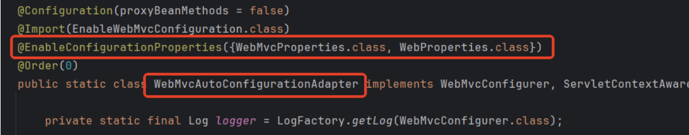

可以看到，该类上有一个注解`@EnableConfigurationProperties({ WebMvcProperties.class, WebProperties.class })`，该注解负责启用配置属性。会将配置文件`application.properties`或`application.yml`中的配置传递到该类中。因此可以通过`application.properties`或`application.yml`配置文件来改变Spring Boot对SpringMVC的默认配置。`WebMvcProperties`和`WebProperties`源码如下：

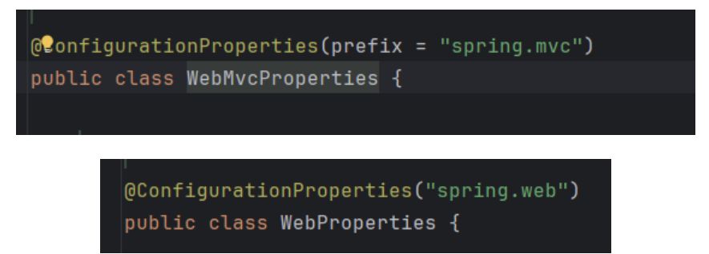

通过以上源码得知要改变SpringBoot对SpringMVC的默认配置，需要在配置文件中使用以下前缀的配置：

+ spring.mvc：<font style="color:rgb(44, 44, 54);">主要用于配置 Spring MVC 的相关行为，例如路径匹配、视图解析、静态资源处理等</font>
+ spring.web：通常用于配置一些通用的 Web 层设置，如资源处理、安全性配置等。


## 14.6 自动配置中的静态资源处理

web站点中的静态资源指的是：js、css、图片等。

### 14.6.1 静态资源处理源码分析

关于**SpringBoot对静态资源处理的默认配置**，查看`WebMvcAutoConfigurationAdapter`源码，核心源码如下：

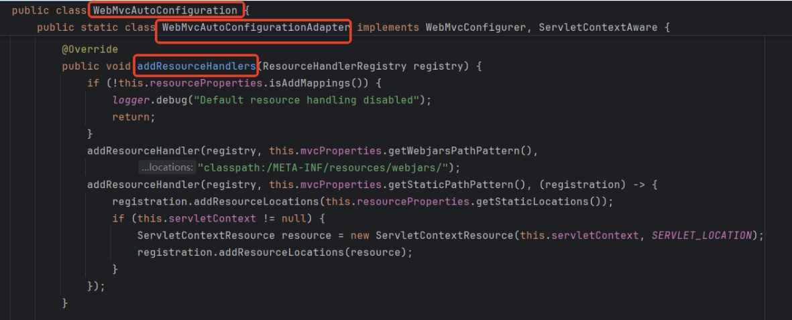

对以上源码进行解释：

```java
@Override
public void addResourceHandlers(ResourceHandlerRegistry registry) {

    // 检查 resourceProperties 中的 addMappings 属性是否为 false。如果为 false，则表示不启用默认的静态资源映射处理。
    // 在application.properties配置文件中进行`spring.web.resources.add-mappings=false`配置，可以将其设置为false。
    // 当然，如果没有配置的话，默认值是true。
    if (!this.resourceProperties.isAddMappings()) {
        logger.debug("Default resource handling disabled");
        return;
    }

    // 配置 WebJars 的静态资源处理。
    // this.mvcProperties.getWebjarsPathPattern()的执行结果是：/webjars/**
    // 也就是说，如果请求路径是 http://localhost:8080/webjars/** ，则自动去类路径下的 /META-INF/resources/webjars/ 目录中找静态资源。
    // 如果要改变这个默认的配置，需要在application.properties文件中进行这样的配置：`spring.mvc.webjars-path-pattern=...`
    addResourceHandler(registry, this.mvcProperties.getWebjarsPathPattern(),
            "classpath:/META-INF/resources/webjars/");

    // 配置普通静态资源处理
    // this.mvcProperties.getStaticPathPattern()的执行结果是：/**
    // this.resourceProperties.getStaticLocations()的执行结果是：{ "classpath:/META-INF/resources/","classpath:/resources/", "classpath:/static/", "classpath:/public/" }
    // 也就是说，如果请求路径是：http://localhost:8080/**，根据控制器方法优先原则，会先去找合适的控制器方法，如果没有合适的控制器方法，静态资源处理才会生效，则自动去类路径下的/META-INF/resources/、/resources/、/static/、/public/ 4个位置找。
    // 如果要改变这个默认的配置，需要在application.properties中进行如下的两个配置：
    // 配置URL：spring.mvc.static-path-pattern=...
    // 配置物理路径：spring.web.resources.static-locations=...,...,...,...
    addResourceHandler(registry, this.mvcProperties.getStaticPathPattern(), (registration) -> {
        registration.addResourceLocations(this.resourceProperties.getStaticLocations());
        if (this.servletContext != null) {
            ServletContextResource resource = new ServletContextResource(this.servletContext, SERVLET_LOCATION);
            registration.addResourceLocations(resource);
        }
    });
}
```

### 14.6.2 关于WebJars静态资源处理

默认规则是：当请求路径是`/webjars/**`，则会去`classpath:/META-INF/resources/webjars/`找。

**WebJars介绍**

WebJars 是一种将常用的前端库（如 jQuery、Bootstrap、Font Awesome 等）打包成 JAR 文件的形式，方便在 Java 应用程序中使用。WebJars 提供了一种标准化的方式来管理前端库，使其更容易集成到 Java 项目中，并且可以利用 Maven 的依赖管理功能。

**<font style="color:rgb(44, 44, 54);">WebJars在SpringBoot中的使用</font>**

WebJars官网：[https://www.webjars.org/](https://www.webjars.org/)

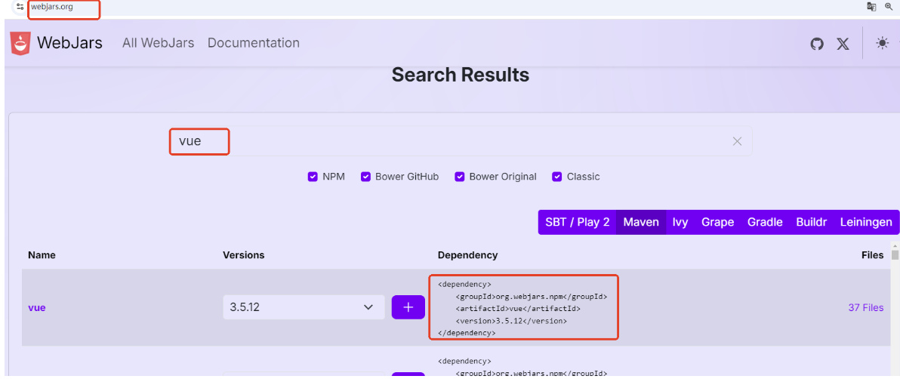

在官网上可以找到某个webjars的maven依赖，将依赖加入到SpringBoot项目中，例如我们添加vue的依赖：

```xml
<dependency>
    <groupId>org.webjars.npm</groupId>
    <artifactId>vue</artifactId>
    <version>3.5.12</version>
</dependency>
```

如下图表示加入成功：

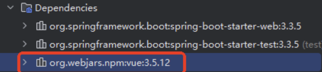

在jar包列表中也可以看到：

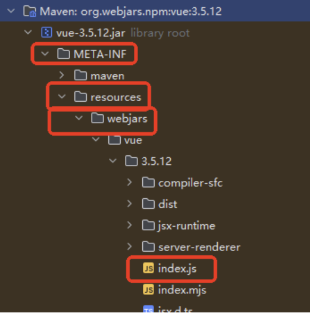

在SpringBoot中，对WebJars的默认访问规则是：当请求路径是`/webjars/**`，则会去`classpath:/META-INF/resources/webjars/`找。

因此我们要想访问上图的`index.js`，则应该发送这样的请求路径：`http://localhost:8080/webjars/vue/3.5.12/index.js`


启动服务器，打开浏览器，访问，测试结果如下：

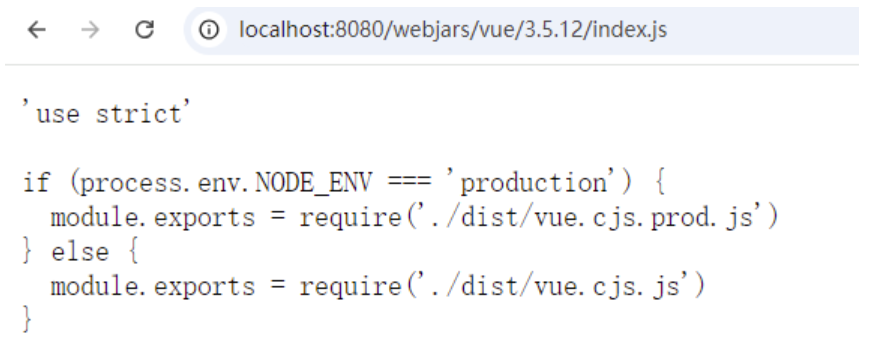

和IDEA中的文件对比一下，完全一样则表示测试成功：

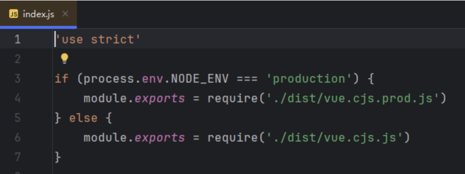

### 14.6.3 关于普通静态资源处理

SpringBoot对普通静态资源处理的规则是：

当请求路径是[http://localhost:8080/**](http://localhost:8080/**)，根据控制器方法优先原则，会先去找合适的控制器方法，如果没有合适的控制器方法，静态资源处理才会生效，则自动去类路径下的以下4个位置查找：

+ classpath:/META-INF/resources/
+ classpath:/resources/
+ classpath:/static/
+ classpath:/public/ 

我们可以在项目中分别创建以上4个目录，在4个目录当中放入静态资源，例如4张图片：

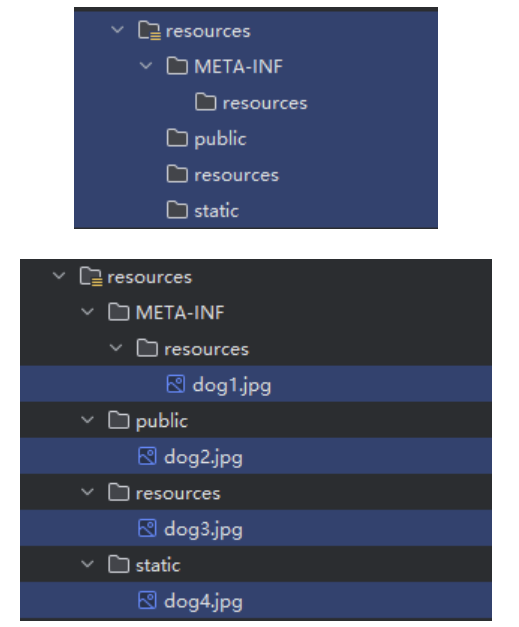

然后启动服务器，打开浏览器，访问，测试是否可以正常访问图片：

### 14.6.4 关于静态资源缓存处理

不管是webjars的静态资源还是普通静态资源，统一都会执行以下这个方法，这个方法最后几行代码就是关于静态资源的缓存处理方式。

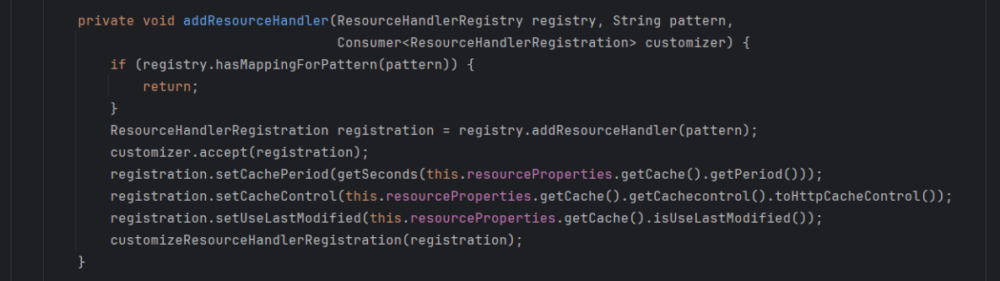

**什么是静态资源缓存，谁缓存，有什么用？**

静态资源缓存指的是浏览器的缓存行为，浏览器可以将静态资源（js、css、图片、声音、视频）缓存到浏览器中，只要下一次用户访问同样的静态资源直接从缓存中取，不再从服务器中获取，可以降低服务器的压力，提高用户的体验。而这个缓存策略可以在服务器端程序中进行设置，SpringBoot对静态资源缓存的默认策略就是以下这三行代码：

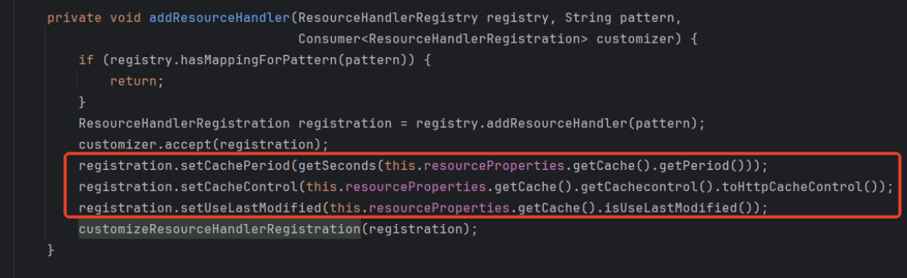

以上三行代码的解释如下：

+ `registration.setCachePeriod(getSeconds(this.resourceProperties.getCache().getPeriod()));`
  - 设置缓存的过期时间（如果没有指定单位，默认单位是秒）
  - 浏览器会**根据响应头中的缓存控制信息**决定是否从本地缓存中加载资源，而不是每次都从服务器重新请求。这有助于减少网络流量和提高页面加载速度。
  - 假设你配置了静态资源缓存过期时间为 1 小时（3600 秒），那么浏览器在首次请求某个静态资源后，会在接下来的一小时内从本地缓存加载该资源，而不是重新请求服务器。
  - 可以通过`application.properties`的来修改默认的过期时间，例如：`spring.web.resources.cache.period=3600`<font style="color:rgb(51, 51, 51);">或者</font>`spring.web.resources.cache.period=1h`
+ `registration.setCacheControl(this.resourceProperties.getCache().getCachecontrol().toHttpCacheControl());`
  - 设置静态资源的 Cache-Control HTTP 响应头，告诉浏览器如何去缓存这些资源。
  - `Cache-Control`<font style="color:rgb(44, 44, 54);"> HTTP 响应头   是HTTP响应协议的一部分内容。如下图响应协议的响应头信息中即可看到</font>`Cache-Control`<font style="color:rgb(44, 44, 54);">的字样：</font>

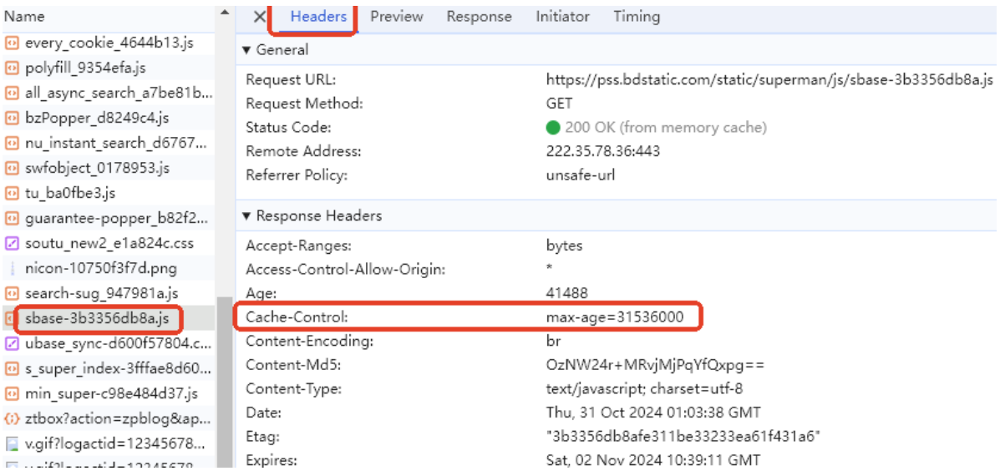

- 常见的 `Cache-Control` 指令包括：
    * `max-age=<seconds>`：表示响应在多少秒内有效。
    * `public`：表示响应可以被任何缓存机制（如代理服务器）缓存。
    * `private`：表示响应只能被用户的浏览器缓存。
    * `no-cache`：表示在使用缓存的资源之前必须重新发送一次请求进行验证。
    * `no-store`：表示不缓存任何响应的资源。
- 例如：`max-age=3600, public`：表示响应在 3600 秒内有效，并且可以被任何缓存机制缓存。
- 可以通过`spring.web.resources.cache.cachecontrol.max-age=3600`以及`spring.web.resources.cache.cachecontrol.cache-public=true`进行重新配置。


- `registration.setUseLastModified(this.resourceProperties.getCache().isUseLastModified());`

  - 设置静态资源在响应时，是否在响应头中添加资源的最后一次修改时间。SpringBoot默认配置的是：在响应头中添加响应资源的最后一次修改时间。

  - 浏览器发送请求时，会将缓存中的资源的最后修改时间和服务器端资源的最后一次修改时间进行比对，如果没有变化，仍然从缓存中获取。

  - 可以通过`spring.web.resources.cache.use-last-modified=false`来进行重新配置。

### 14.6.5 静态资源缓存测试

根据之前源码分析，得知`静态资源缓存`相关的配置应该使用`spring.web.resources.cache`：

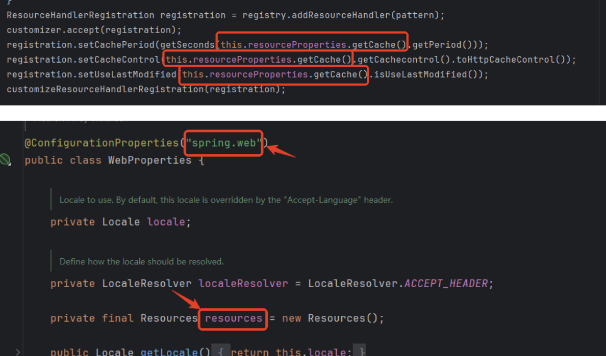

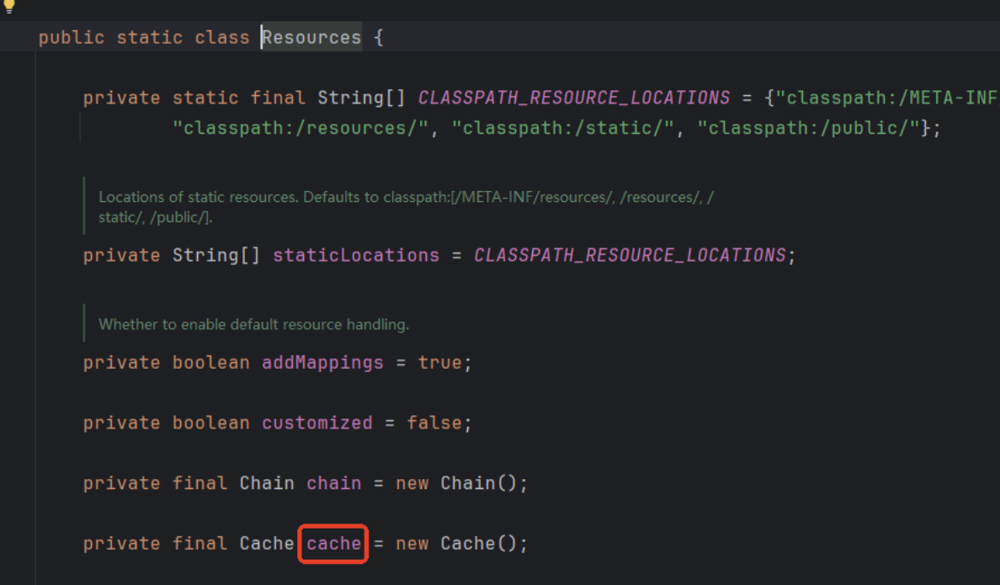

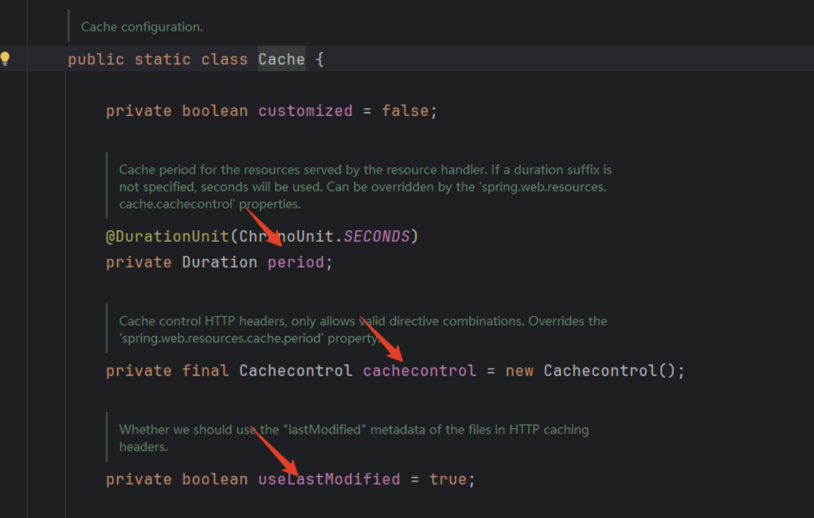

在`application.properties`文件中对缓存进行如下的配置：

```properties
# 静态资源缓存设置
# 1. 缓存有效期
spring.web.resources.cache.period=100
# 2. 缓存控制（cachecontrol配置的话，period会失效）
spring.web.resources.cache.cachecontrol.max-age=20
# 3. 是否使用缓存的最后修改时间（默认是：使用）
spring.web.resources.cache.use-last-modified=true
# 4. 是否开启静态资源默认处理方式（默认是：开启）
spring.web.resources.add-mappings=true
```


注意：`cachecontrol.max-age`配置的话，`period`会被覆盖。

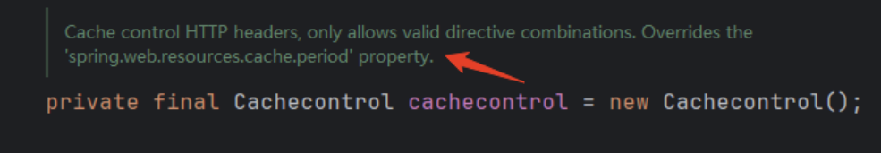

启动服务器测试：看看是否在20秒内走缓存，20秒之后是不是就不走缓存了

第一次访问：请求服务器

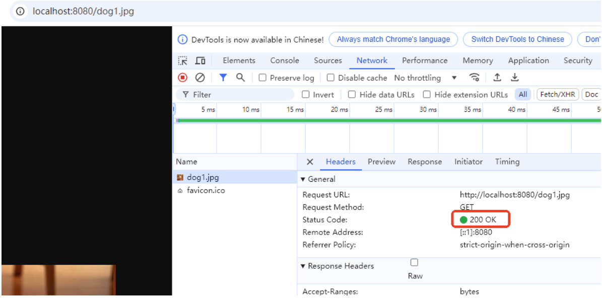

第二次访问：20秒内开启一个新的浏览器窗口，再次访问，发现走了缓存

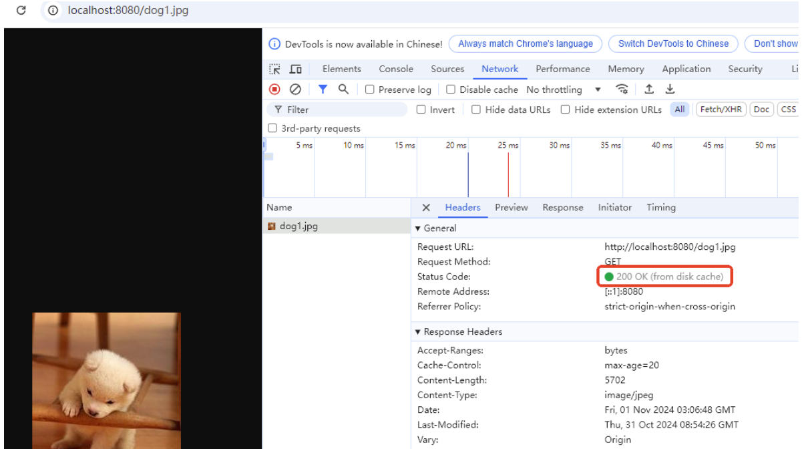

第三次访问：20秒后开启一个新的浏览器窗口，再次访问，发现重新请求服务器

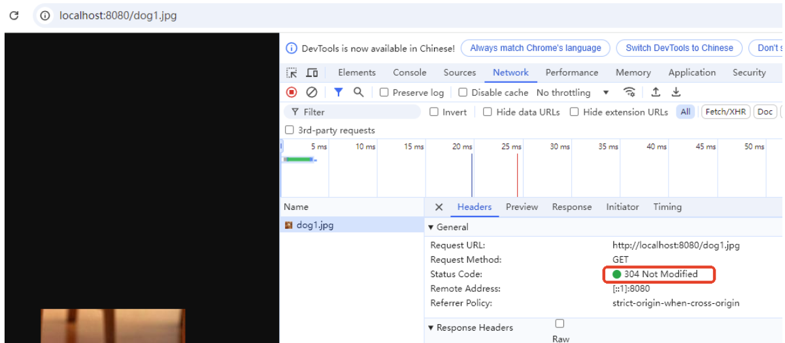

提示，为什么显示`304`，这是因为这个配置：`spring.web.resources.cache.use-last-modified=true`

### 14.6.6 web应用的欢迎页面

#### 1. 欢迎页测试

先说结论：只要在静态资源路径下提供`index.html`，则被当做欢迎页面。静态资源路径指的是之前的4个路径：

```plain
{ "classpath:/META-INF/resources/", "classpath:/resources/", "classpath:/static/", "classpath:/public/" }
```

测试一下，在`classpath:/static/`目录下新建`index.html`页面：

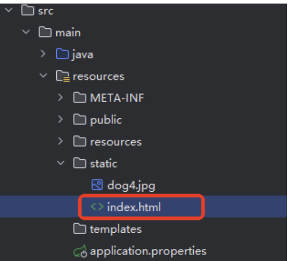


启动服务器，测试结果如下：

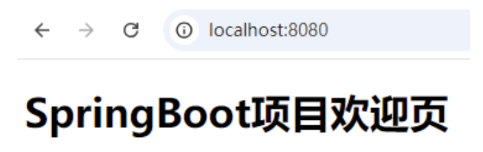

启动服务器，测试结果如下：

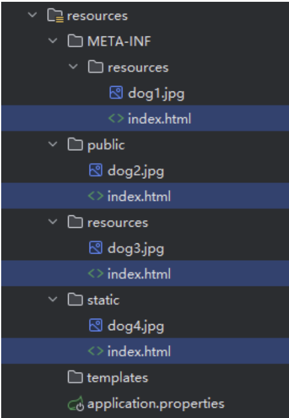

启动服务器，测试结果如下：

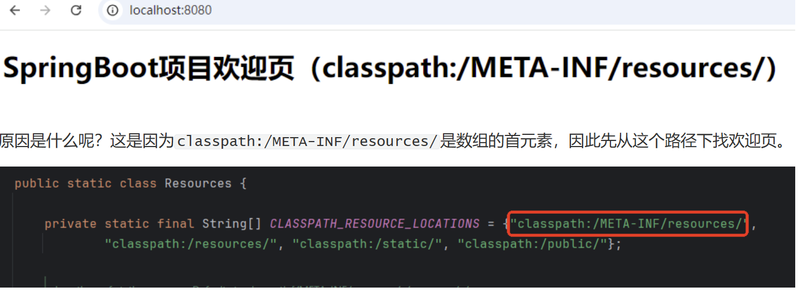

#### 2. 欢迎页源码分析

在`WebMvcAutoConfiguration`类中有一个内部类`EnableWebMvcConfiguration`，这个类中有这样一段代码：

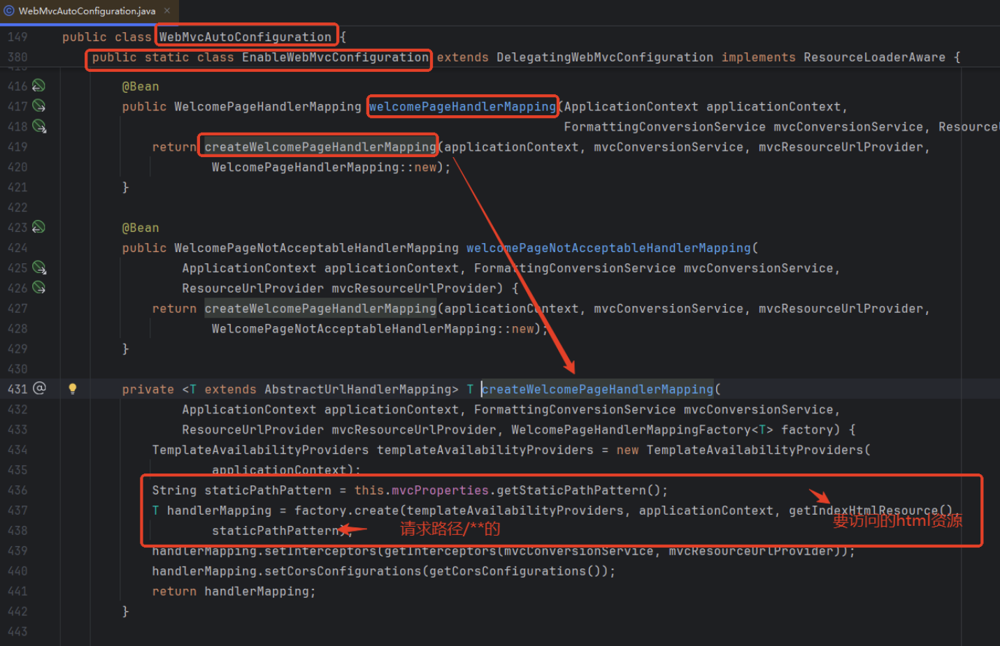

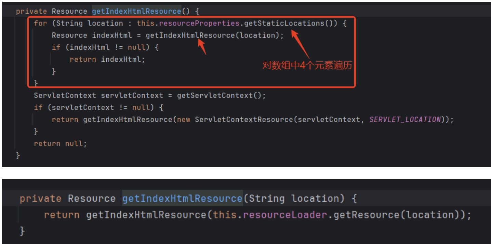

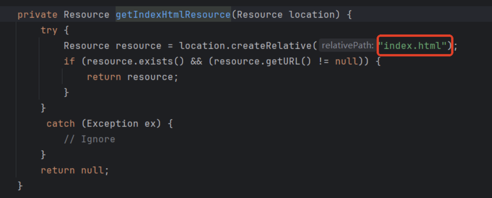

通过以上源码追踪，得出结论：只要请求路径是`/**`的，会依次去`{ "classpath:/META-INF/resources/", "classpath:/resources/", "classpath:/static/", "classpath:/public/" }`这四个位置找`index.html`页面作为欢迎页。

#### 3. 一个小小的疑惑

我们来看一下`WebMvcAutoConfiguration`的生效条件：

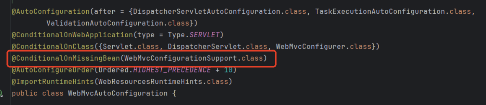

上图红框内表示，要求Spring容器中缺失`WebMvcConfigurationSupport`这个Bean，`WebMvcAutoConfiguration`才会生效。

但是我们来看一下`EnableWebMvcConfiguration`的继承结构：

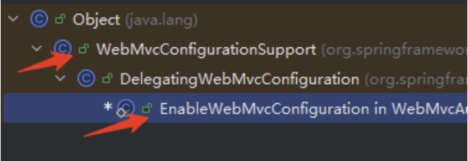

很明显，`EnableWebMvcConfiguration`就是一个`WebMvcConfigurationSupport`这样的Bean。

那疑问就有了：既然容器中存在`WebMvcConfigurationSupport`这样的Bean，`WebMvcAutoConfiguration`为什么还会生效呢？

原因是因为：`EnableWebMvcConfiguration`是`WebMvcAutoConfiguration`类的内部类。在`WebMvcAutoConfiguration`进行加载的时候，`EnableWebMvcConfiguration`这个内部类还没有加载。因此这个时候在容器中还不存在`WebMvcConfigurationSupport`的Bean，所以`WebMvcAutoConfiguration`仍然会生效。


**<font style="color:#DF2A3F;">以上所说的</font>**`WebMvcAutoConfiguration`**<font style="color:#DF2A3F;">类中的内部类</font>**`EnableWebMvcConfiguration`**<font style="color:#DF2A3F;">，是用来启用Web MVC默认配置的。</font>**

**<font style="color:#DF2A3F;">注意区分：WebMvcAutoConfiguration的两个内部类：</font>**

+ `WebMvcAutoConfigurationAdapter`作用是用来：修改配置的
+ `EnableWebMvcConfiguration`作用是用来：启用配置的

#### 4. favorite icon

favicon（也称为“收藏夹图标”或“网站图标”）是大多数现代网页浏览器的默认行为之一。当用户访问一个网站时，浏览器通常会尝试从该网站的根目录下载名为 favicon.ico 的文件，并将其用作标签页的图标。

如果网站没有提供 favicon.ico 文件，浏览器可能会显示一个默认图标，或者根本不显示任何图标。为了确保良好的用户体验，网站开发者通常会在网站的根目录下放置一个 favicon.ico 文件。

**Spring Boot项目中`favicon.ico`文件应该放在哪里呢？Spring Boot官方是这样说明的：**

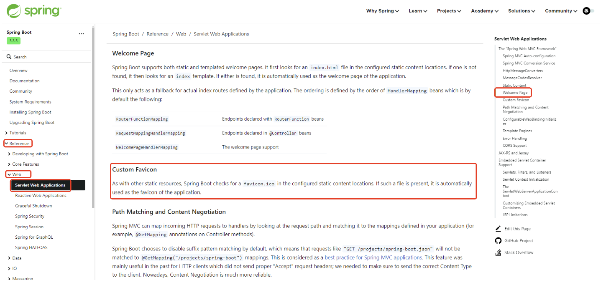

这段话翻译为：

与其他静态资源一样，Spring Boot 会在配置的静态内容位置检查是否存在 `favicon.ico`文件。如果存在这样的文件，它将自动作为应用程序的 favicon 使用。

以上官方说明的：将`favicon.ico`文件放到静态资源路径下即可。

web站点没有提供`favicon.ico`时：

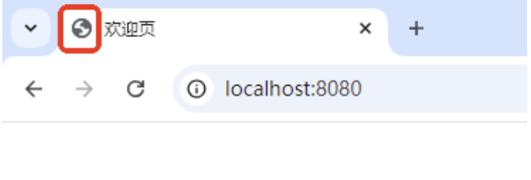

我们在[https://www.iconfont.cn/](https://www.iconfont.cn/) （阿里巴巴提供的图标库）上随便找一个图标，然后将图片名字命名为`favicon.ico`，然后将其放到SpringBoot项目的静态资源路径下：

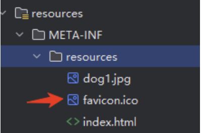

启动服务器测试：记住（ctrl + F5强行刷新一下，避免影响测试效果）

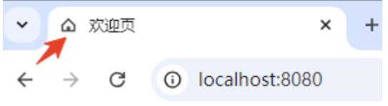

---

# 15. SpringBoot的web手动配置(静态资源处理)

如果你对SpringBoot默认的静态资源处理方式不满意。可以通过两种方式来改变这些默认的配置：

+ 第一种：配置文件方式
  - 通过修改`application.properties`或`application.yml`
  - 添加`spring.mvc`和`spring.web`相关的配置。

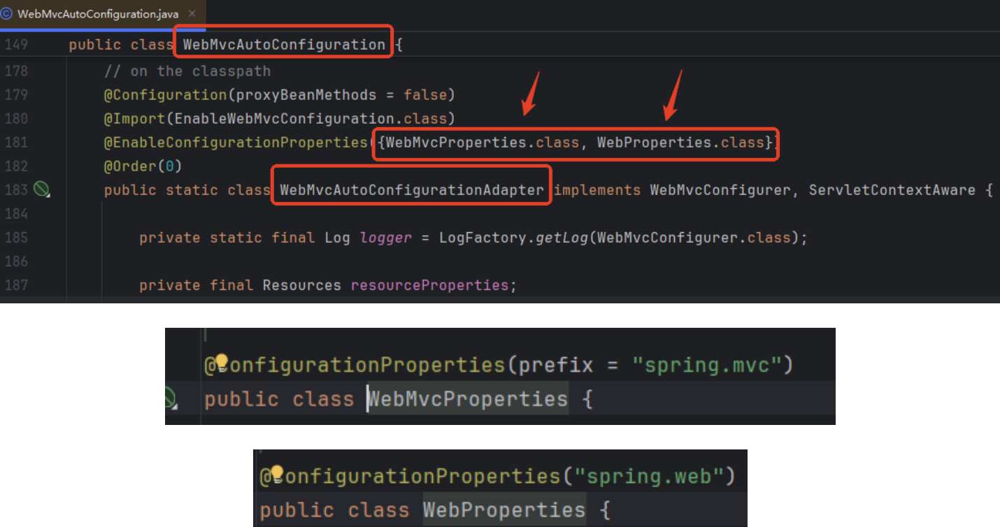

第二种：编写代码方式

- SpringMVC框架为我们提供了`WebMvcConfigurer`接口，需要改变默认的行为，可以`编写一个类`实现`WebMvcConfigurer`接口，并`对应重写`接口中的方法即可改变默认的配置行为。

## 15.1 配置文件方式

要修改`访问静态资源URL的前缀`，这样配置：

```properties
# Spring MVC的相关配置
# 1. 设置webjars静态资源的请求路径的前缀
spring.mvc.webjars-path-pattern=/wjs/**
# 2. 设置普通静态资源的请求路径的前缀
spring.mvc.static-path-pattern=/static/**
```

要修改`静态资源的存放位置`，这样配置：

```properties
spring.web.resources.static-locations=classpath:/static1/,classpath:/static2/
```

进行以上配置之后：

1. 访问webjars的请求路径应该是这样的：http://localhost:8080/wjs/....
2. 访问普通静态资源的请求路径应该是这样的：http://localhost:8080/static/....
3. 普通静态资源的存放位置也应该放到`classpath:/static1/,classpath:/static2/`下面，其他位置无效。

**访问webjars测试结果如下：**

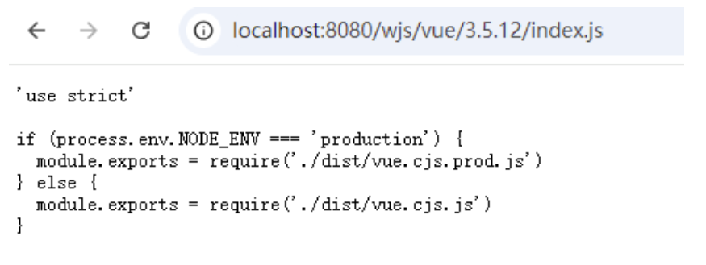

**访问普通静态资源测试结果如下：**

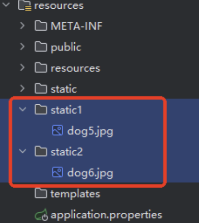

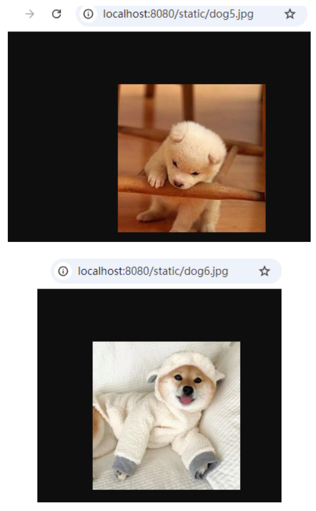

如果访问`dog2.jpg`，就无法访问了：

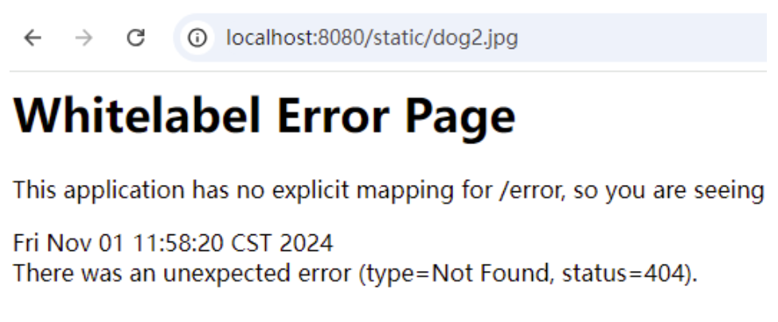

但是，存储在`classpath:/META-INF/resources/`目录下的`dog1.jpg`仍然是可以访问的：

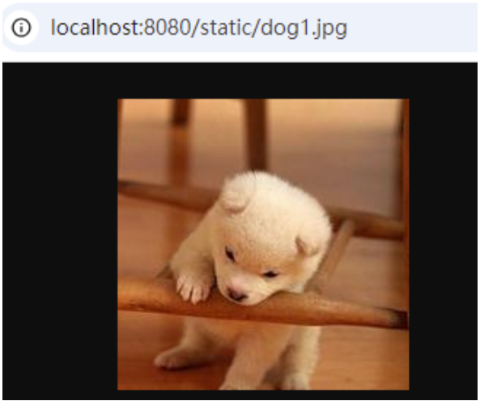

因此，存储在`classpath:/META-INF/resources/`位置的静态资源会被默认加载，不受手动配置的影响。

## 15.2 编写代码方式

我们在前面提到过，想要定制Spring MVC的行为，也可以编写类实现Spring MVC框架提供的一个接口`WebMvcConfigurer`，想定制哪个行为就重写哪个方法即可。

编写的类只要纳入IoC容器的管理。因此有以下两种实现方式：

+ 第一种：编写类实现`WebMvcConfigurer`接口，重写对应的方法。
+ 第二种：以组件的形式存在：编写一个方法，用`@Bean`注解标注。

### 15.2.1 第一种方式

编写配置类，对于`web`开发来说，配置类一般起名为：`WebConfig`。配置类一般存放到`config`包下，因此在SpringBoot主入口程序同级目录下新建`config`包，在`config`包下新建`WebConfig`类：

```java
// 使用该注解标注，表示该类为配置类。
@Configuration
public class WebConfig implements WebMvcConfigurer {
    @Override
    public void addResourceHandlers(ResourceHandlerRegistry registry) {
        registry.addResourceHandler("/static/**")
                .addResourceLocations("classpath:/static1/", "classpath:/static2/");
    }
}
```

注意：将`application.properties`文件中之前的所有配置全部注释掉。让其恢复到最原始的默认配置。

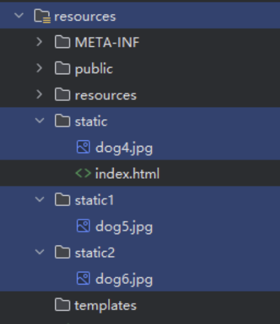

启动服务器进行测试：

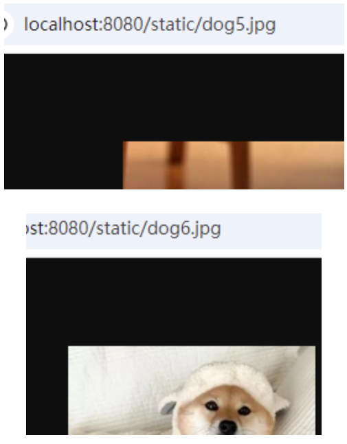

通过测试，我们的配置是生效的。

我们再来看看，默认的配置是否还生效？

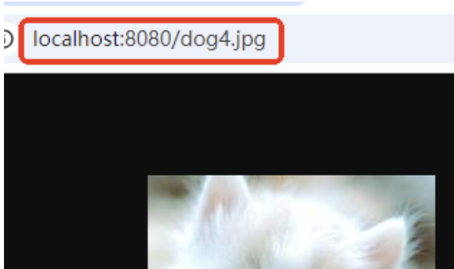

我们可以看到，Spring Boot对Spring MVC的默认自动配置是生效的。

**<font style="color:#DF2A3F;">因此，以上的方式只是在Spring MVC默认行为之外扩展行为。</font>**

如果你不想再继续使用SpringBoot提供的默认行为，可以使用`@EnableWebMvc`进行标注。例如：

```java
@EnableWebMvc
// 使用该注解标注，表示该类为配置类。
@Configuration
public class WebConfig implements WebMvcConfigurer {
    @Override
    public void addResourceHandlers(ResourceHandlerRegistry registry) {
        registry.addResourceHandler("/static/**")
                .addResourceLocations("classpath:/static1/", "classpath:/static2/");
    }
}

```

测试结果：

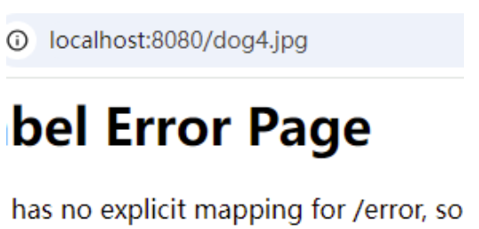

可以看到，默认配置已经不再生效。


再来看看，我们自己的配置是否仍然生效：

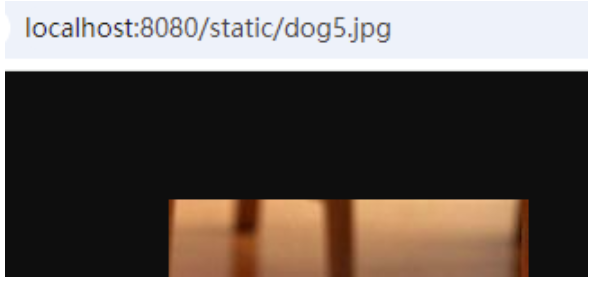

仍然生效。

### 15.2.2 第二种方式

采用`@Bean`注解提供一个`WebMvcConfigurer`组件，代码如下：

```java
@Configuration
public class WebConfig2 {

    @Bean
    public WebMvcConfigurer addResourceHandlers(){
        return new WebMvcConfigurer() {
            @Override
            public void addResourceHandlers(ResourceHandlerRegistry registry) {
                registry.addResourceHandler("/static/**")
                        .addResourceLocations("classpath:/static1/", "classpath:/static2/");
            }
        };
    }
}

```


测试结果如下：

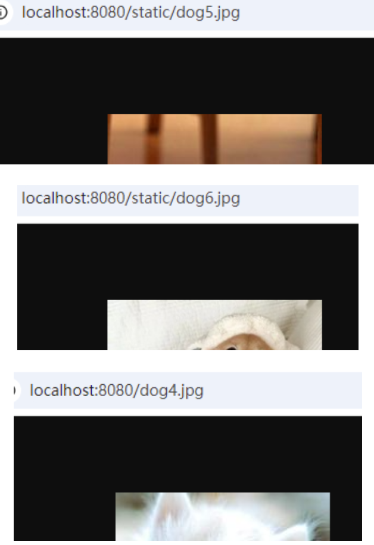

通过了测试，并且以上代码也是在原有配置基础上进行扩展。


如果要弃用默认配置，仍然使用`@EnableWebMvc`注解进行标注。自行测试！

### 15.2.3 其他配置也这样做即可

以上对`静态资源处理`进行了手动配置，也可以做其他配置，例如拦截器：

```java
@Configuration
public class WebConfig2 {

    @Bean
    public WebMvcConfigurer addResourceHandlers(){
        return new WebMvcConfigurer() {
            @Override
            public void addResourceHandlers(ResourceHandlerRegistry registry) {
                registry.addResourceHandler("/static/**")
                        .addResourceLocations("classpath:/static1/", "classpath:/static2/");
            }
        };
    }

    // 拦截器配置。
    @Bean
    public WebMvcConfigurer addInterceptor(){
        return new WebMvcConfigurer() {
            @Override
            public void addInterceptors(InterceptorRegistry registry) {
                registry.addInterceptor(new HandlerInterceptor() {
                    @Override
                    public boolean preHandle(HttpServletRequest request, HttpServletResponse response, Object handler) throws Exception {
                        System.out.println("Interceptor's preHandle......");
                        return true;
                    }

                    @Override
                    public void postHandle(HttpServletRequest request, HttpServletResponse response, Object handler, ModelAndView modelAndView) throws Exception {
                        System.out.println("Interceptor's postHandle......");
                    }

                    @Override
                    public void afterCompletion(HttpServletRequest request, HttpServletResponse response, Object handler, Exception ex) throws Exception {
                        System.out.println("Interceptor's afterCompletion......");
                    }
                });
            }
        };
    }
}

```

启动服务器，打开浏览器，发送请求[http://localhost:8080/static/dog5.jpg](http://localhost:8080/static/dog5.jpg)，后台执行结果如下：

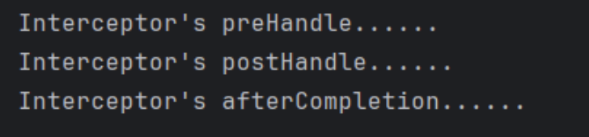

这说明拦截器生效。

### 15.2.4 为什么只要容器中有`WebMvcConfigurer`组件即可呢

源码分析：


`WebMvcAutoConfiguration`部分源码：

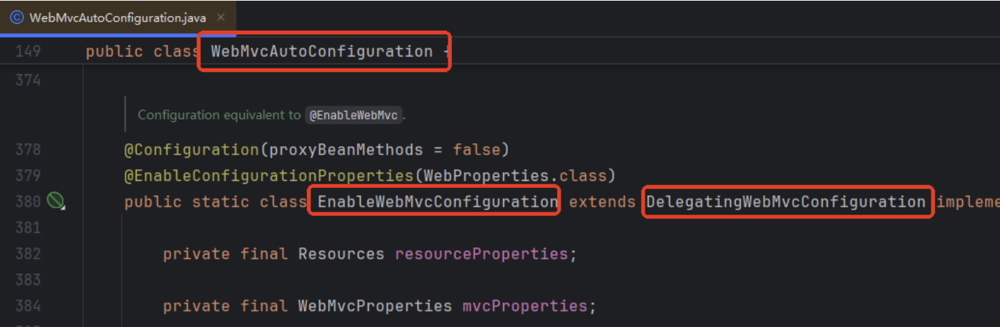

`WebMvcAutoConfiguration`类的内部类`EnableWebMvcConfiguration`，这个类继承了`DelegatingWebMvcConfiguration`（Delegating是委派的意思。）


`DelegatingWebMvcConfiguration`部分源码：

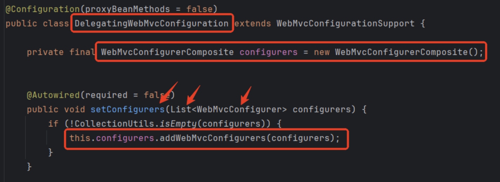

`DelegatingWebMvcConfiguration`中的`setConfigurers()`方法用来设置配置。而配置参数是一个List集合，这个List集合中存放的是`WebMvcConfigurer`接口的实例，并且可以看到这个方法上面使用了`@Autowired`进行了自动注入，这也就是说为什么只要是IoC容器中的组件就能生效的原因。

我们再次进入到`this.configurers.addWebMvcConfigurers(configurers);`方法中进一步查看源码：

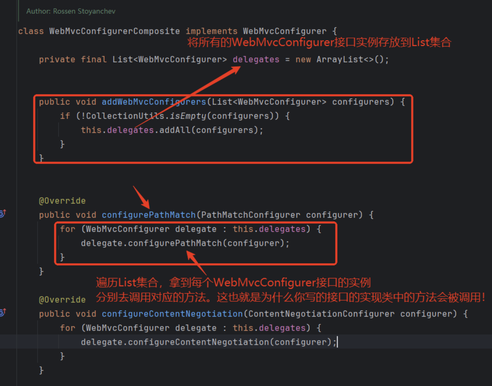

对于`WebMvcConfigurerComposite`类的代码来说，它是一个非常典型的`组合模式`。

组合模式的关键点：

1. 组合多个 WebMvcConfigurer 实例：WebMvcConfigurerComposite 通过 delegates 列表组合了多个 WebMvcConfigurer 实例。
2. 统一接口：WebMvcConfigurerComposite 实现了 WebMvcConfigurer 接口，因此可以像一个单一的 WebMvcConfigurer 一样被使用。
3. 代理调用：在实现 WebMvcConfigurer 接口的方法时，WebMvcConfigurerComposite 会遍历 delegates 列表，调用每个 WebMvcConfigurer 实例的相应方法。

总结：WebMvcConfigurerComposite 主要采用了组合模式的思想，将多个 WebMvcConfigurer 实例组合在一起，形成一个整体。

注意：组合模式是GoF 23种设计模式中的结构型设计模式。

# 16. web请求的路径匹配

我们在学习SpringMVC的时候，路径匹配规则中学习了`Ant`风格的路径匹配规则。大家可以翻看一下之前的Spring MVC视频。

在`Spring Boot3`中，对web请求的路径匹配提供了两种规则：

+ 第一种：AntPathMatcher（Ant风格）【**<font style="color:#DF2A3F;">较旧</font>**】
+ 第二种：PathPatternParser（从Spring5.3中引入的。在SpringBoot2.4中引入的。）【**<font style="color:#DF2A3F;">较新：效率高</font>**】
  - **<font style="color:#DF2A3F;">效率比Ant高，一般新项目中使用</font>**`PathPatternParser`

SpringBoot3中默认使用的是`PathPatternParser`，不需要任何配置。如果要使用`AntPathMatcher`，就需要进行如下的配置：

```properties
spring.mvc.pathmatch.matching-strategy=ant_path_matcher
```

## 16.1 AntPathMatcher

Ant风格的路径匹配规则回顾：

| 通配符 | 含义                                                   | 示例                                                         |
| ------ | ------------------------------------------------------ | ------------------------------------------------------------ |
| `*`    | 匹配任意长度的任意字符序列（**不包含路径分隔符 `/`**） | `/foo/*.html` 匹配 `/foo/bar.html`、`/foo/baz.html`          |
| `**`   | 匹配任意数量的目录层级，可跨多级路径                   | `/foo/**` 匹配 `/foo/bar`、`/foo/bar/baz`、`/foo/bar/baz/qux` |
| `?`    | 匹配任意**单个**字符                                   | `/foo?bar` 匹配 `/foobar`、`/fooxbar`                        |
| `[]`   | 匹配指定范围内的单个字符                               | `/foo[a-z]bar` 匹配 `/fooabar`、`/foobbar`                   |
| `{}`   | 路径变量，用于提取路径的一部分作为参数                 | `/users/{userId}` 匹配 `/users/123`，可提取 `userId=123`     |


如果在SpringBoot3中启用Ant风格，记得配置：

```properties
spring.mvc.pathmatch.matching-strategy=ant_path_matcher
```

如下代码：请分析以下路径匹配的是什么样的路径。

```java
@RestController
public class PathController {

    @GetMapping("/{path:[a-z]+}/a?/**/*.do")
    public String path(HttpServletRequest request, @PathVariable String path){
        return request.getRequestURI() + "," + path;
    }
}
```

启动服务器并测试路径：

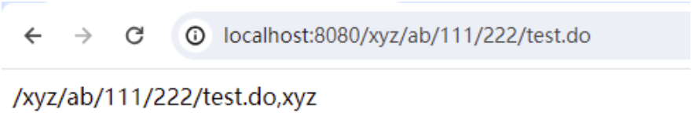

## 16.2 PathPatternParser

项目中不做配置，或者按照以下方式配置，都是`PathPatternParser`：

```properties
spring.mvc.pathmatch.matching-strategy=path_pattern_parser
```

`PathPatternParser`风格是兼容Ant风格的。只有一个地方`PathPatternParser`不支持，Ant支持。在Ant风格中，`**`可以出现在任意位置。在`PathPatternParser`中只允许`**`出现在路径的末尾。


可以测试一下，将配置文件中的Ant风格注释掉，采用`PathPatternParser`风格。然后控制器代码如下：

```java
@RestController
public class PathController {

    @GetMapping("/{path:[a-z]+}/a?/**/*.do")
    public String path(HttpServletRequest request, @PathVariable String path){
        return request.getRequestURI() + "," + path;
    }
}
```

启动服务器报错：

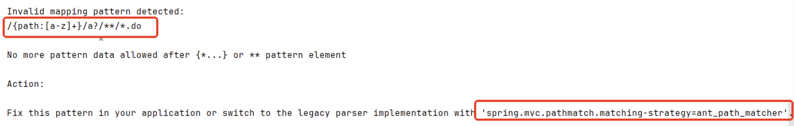

提示你，如果在路径当中出现了`**`，需要将路径匹配规则替换为Ant风格。因此路径当中如果出现`**`，那么必须使用Ant风格。除此之外，`PathPatternParser`均可用。


我们再来测试一下，`**`放到末尾，对于`PathPatternParser`是否可用？

```java
@GetMapping("/{path:[a-z]+}/a?/*.do/**")
public String path(HttpServletRequest request, @PathVariable String path){
    return request.getRequestURI() + "," + path;
}
```

启动服务器测试，可用：

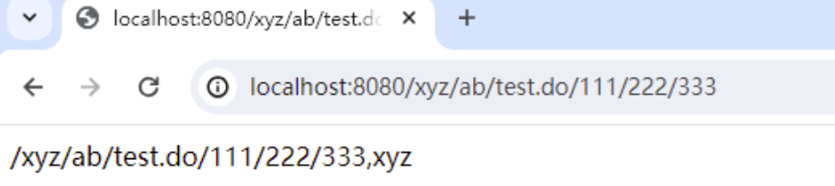

## 16.3 路径匹配相关源码

底层选择路径匹配规则的源码是：

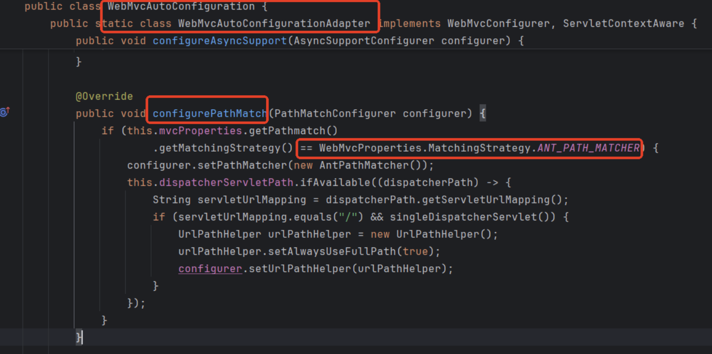

---

# 17. 内容协商

内容协商机制是Spring MVC框架提供的，接下来主要是学习在SpringBoot中是如何支持SpringMVC内容协商机制的。

## 17.1 对内容协商的理解

内容协商机制是指服务器根据客户端的请求来决定返回资源的最佳表示形式。

白话文描述：客户端要什么格式的数据，咱后端就应该返回什么格式的数据。

+ 客户端要JSON，咱就响应JSON。
+ 客户端要XML，咱就响应XML。
+ 客户端要YAML，咱就响应YAML。

你可能会有疑问：客户端接收数据时统一采用一种格式，例如JSON，不就行了吗。哪那么多事儿呀！！！

但在实际的开发中，不是这样的，例如：

+ 遗留的老客户端系统，仍然处理的是XML格式的数据。
+ 要求处理速度快的这种客户端系统，一般要求返回JSON格式的数据。
+ 要求安全性高的客户端系统，一般要求返回XML格式的数据。

因此，在现代的开发中，不同的客户端可能需要后端系统返回不同格式的数据。总之后端应该满足这种多样化的需求。

## 17.2 实现内容协商的两种方式

通常通过HTTP请求头（如 Accept）或请求参数（如 format）来指定客户端偏好接收的内容类型（如JSON、XML等）。服务器会根据这些信息选择最合适的格式进行响应。

### 17.2.1 通过HTTP请求头（如 Accept）

SpringBoot框架中，在程序员不做任何配置的情况下，优先考虑的是这种方式。

服务器会根据客户端发送请求时提交的请求头中的"Accept: application/json" 或 "Accept: application/xml" 或 "Accept: text/html"来决定响应什么格式的数据。


客户端发送请求给服务器的时候，如何设置请求头的`Accept`？有以下几种常见实现方式：

+ 写代码
  - fetch API
  - ajax的XMLHttpRequest
  - axios库
  - jQuery库......
+ 用工具
  - 接口测试工具，例如：Postman、Apifox等。
  - 命令行工具：curl

对于我们编写的以下Controller来说：

```java
@RestController
public class UserController {

    @Autowired
    private UserService userService;

    @GetMapping(value = "/detail")
    public User detail(){
        return userService.getUser();
    }
}
```

我们使用了`@RestController`，也就是使用了`@ResponseBody`。因此默认支持的是返回JSON数据。怎么才能支持返回XML格式的数据呢？需要做以下两步：

第一步：引入一个依赖

```xml
<dependency>
  <groupId>com.fasterxml.jackson.dataformat</groupId>
  <artifactId>jackson-dataformat-xml</artifactId>
</dependency>
```

第二步：在实体类上添加一个注解

```java
@JacksonXmlRootElement
@Data
@NoArgsConstructor
@AllArgsConstructor
public class User {
    private String name;
    private String password;
}
```


接下来，我们使用`curl`命令行工具，来模拟发送请求，并在请求头中设置`Accept`：

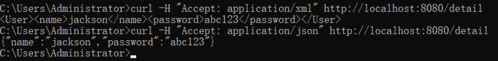

可以很清楚的看到，服务器根据不同的请求头返回了不同格式的数据。

+ `Accept: application/xml`则返回XML格式的数据
+ `Accept: application/json`则返回JSON格式的数据

### 17.2.2 通过请求参数（如 `format`）

接下来我们使用请求参数的方式，来测试一下服务器的响应，注意：默认的请求参数名为`format`。

我们仍然使用`curl`命令行工具进行测试：

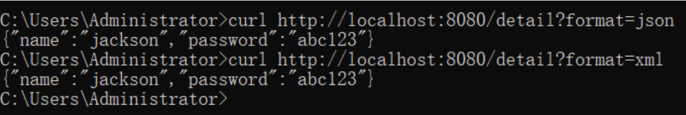

我们可以看到，并没有达到我们想要的效果，这是因为`SpringBoot优先考虑的不是通过请求参数format方式`。如何优先考虑使用`format`方式呢？做如下配置：

```properties
# 内容协商时，优先考虑请求参数format方式。
spring.mvc.contentnegotiation.favor-parameter=true
```

再次测试：

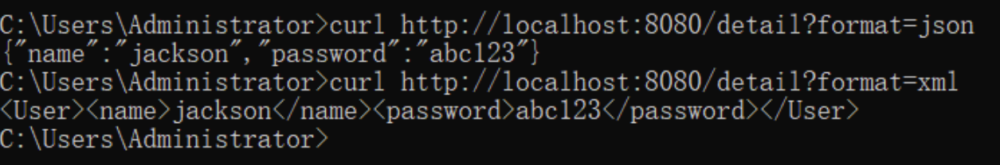

可以看到，现在SpringBoot已经优先考虑使用`请求参数format`方式了。


当然，请求参数的名字可以不使用`format`吗？支持定制化吗？答案是支持的，例如你希望请求参数的名字为`type`，可以做如下配置：

```properties
# 内容协商时，设置请求参数的名字，默认为format
spring.mvc.contentnegotiation.parameter-name=type
```

再次使用`curl`工具进行测试：

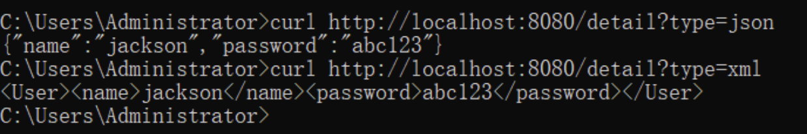

## 17.3 HttpMessageConverter接口

### 17.3.1 HttpMessageConverter的理解

`HttpMessageConverter`接口，对于这个接口来说，大家应该不陌生，在Spring MVC的课程当中咱们已经详细的学习过了。在这里简单回顾一下。

`HttpMessageConverter`接口被翻译为：`Http消息转换器`。它起到转换`Http消息`的作用。

什么是`Http消息`？所谓的`Http消息`本质上就是浏览器向服务器发送请求时提交的数据，或者服务器向浏览器响应的数据。

而`HttpMessageConverter`接口就是负责完成`请求/响应`时的数据格式转换的。

在Spring MVC中提供了很多`HttpMessageConverter`接口的实现类，不同的`Http消息转换器`具有不同的转换效果，有的负责将Java对象转换为JSON格式的字符串，有的负责将Java对象转换成XML格式的字符串。

### 17.3.2 常见的HttpMessageConverter

内置的常见的`HttpMessageConverter`的实现类包括：

+ <font style="color:#DF2A3F;">【请求】提交的表单（form）数据转换成Java对象的主要任务是由 FormHttpMessageConverter 消息转换器完成的</font>
+ <font style="color:#DF2A3F;">【请求】提交的JSON数据转换成Java对象的主要任务是由 MappingJackson2HttpMessageConverter 消息转换器完成的。（我们通常使用的</font>`@RequestBody`<font style="color:#DF2A3F;">注解）</font>
+ 【响应】将Java对象转换成JSON格式的数据，并将其写入HTTP响应体的任务是由 MappingJackson2HttpMessageConverter 消息转换器完成。（我们通常使用的`@ResponseBody`注解)
+ 【响应】将Java对象转换成XML格式的数据，并将其写入HTTP响应体的任务通常由 Jaxb2RootElementHttpMessageConverter 消息转换器完成。
+ 【响应】将 String 直接写入到响应体的任务是由 StringHttpMessageConverter 消息转换器完成。
+ ......

### 17.3.3 请求时通过哪些条件确定使用哪个转换器

请求时通常根据以下条件来确定使用哪个消息转换器：

1. 请求的 Content-Type 字段：

Spring MVC 会检查请求的 Content-Type 字段，以确定请求体的数据格式（例如 application/json、application/x-www-form-urlencoded、application/xml 等）。

2. 方法参数类型：

控制器方法中接收请求体的参数类型（例如 @RequestBody）。

### 17.3.4 响应时通过哪些条件确定使用哪个转换器

响应时通常根据以下条件来确定使用哪个消息转换器：

1. 请求提交时，请求头上的Accept字段 ：

Spring MVC 会检查客户端请求的 Accept 字段，以确定客户端期望的响应格式（例如 application/json、application/xml 等）。

2. 方法返回值类型：

控制器方法的返回值类型（例如 @ResponseBody）。

例如1：@ResponseBody + 控制器方法的返回值是String，则使用StringHttpMessageConverter转换器。（将字符串直接写入响应体）

例如2：@ResponseBody + 控制器方法的返回值是User，则使用MappingJackson2HttpMessageConverter转换器。（将java对象转换成json格式的字符串写入到响应体）

### 17.3.5 系统默认提供了哪些HttpMessageConverter

查看源码：

WebMvcAutoConfiguration.EnableWebMvcConfiguration extends DelegatingWebMvcConfiguration extends WebMvcConfigurationSupport

`WebMvcAutoConfiguration`内部类`EnableWebMvcConfiguration`

`EnableWebMvcConfiguration`继承了`DelegatingWebMvcConfiguration`

`DelegatingWebMvcConfiguration`继承了`WebMvcConfigurationSupport`


在`WebMvcConfigurationSupport`类中有这样一个方法：`addDefaultHttpMessageConverters()` 用来添加默认的`HttpMessageConverter`对象。

通过断点调试，可以发现默认支持6个HttpMessageConverter，如下：

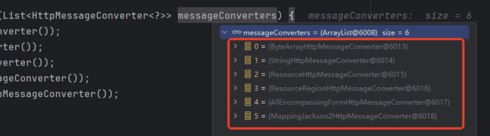

这6个`HttpMessageConverter`作用如下：

1. **ByteArrayHttpMessageConverter:**

用于将字节数组(byte[])与HTTP消息体之间进行转换。这通常用于处理二进制数据，如图片或文件。

2. **StringHttpMessageConverter:**

用于将字符串(String)与HTTP消息体之间进行转换。它支持多种字符集编码，能够处理纯文本内容。

3. **ResourceHttpMessageConverter:**

用于将Spring的Resource对象与HTTP消息体之间进行转换。Resource是Spring中表示资源的接口，可以读取文件等资源。这个转换器对于下载文件或发送静态资源有用。

4. **ResourceRegionHttpMessageConverter:**

用于处理资源的部分内容（即“Range”请求），特别是当客户端请求大文件的一部分时。这对于实现视频流媒体等功能很有用。

5. **AllEncompassingFormHttpMessageConverter:**

用于处理表单，是一个比较全面的form消息转换器。处理标准的application/x-www-form-urlencoded格式的数据，以及包含文件上传的multipart/form-data格式的数据。

6. **MappingJackson2HttpMessageConverter:**

使用Jackson库来序列化和反序列化JSON数据。可以将Java对象转换为JSON格式的字符串，反之亦然。


另外，通过以下源码，也可以看到SpringBoot是根据类路径中是否存在某个类，而决定是否添加对应的消息转换器的：

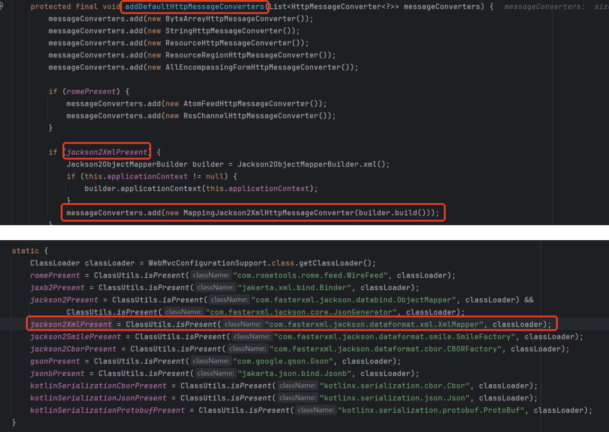

因此，我们只要引入相关的依赖，让类路径存在某个类，则对应的消息转换器就会被加载。

## 17.4 定义自己的HttpMessageConverter

可以看到以上6个消息转换器中没有yaml相关的消息转换器，可见，如果要实现yaml格式的内容协商，yaml格式的消息转换器就需要我们自定义了。

### 第一步：引入能够处理yaml格式的依赖

任何一个能够处理yaml格式数据的库都可以，这里选择使用`jackson`的库，因为它既可以处理json，xml，又可以处理yaml。

```xml
<dependency>
  <groupId>com.fasterxml.jackson.dataformat</groupId>
  <artifactId>jackson-dataformat-yaml</artifactId>
</dependency>
```


编写测试程序，简单测试一下这个库的用法：

```java
public class Jackson2YamlTest {
    public static void main(String[] args) throws JsonProcessingException {
        // 创建YAML工厂类
        YAMLFactory yamlFactory = new YAMLFactory().disable(YAMLGenerator.Feature.WRITE_DOC_START_MARKER); // 禁止使用文档头标记
        // 创建对象映射器
        ObjectMapper objectMapper = new ObjectMapper(yamlFactory);
        // 准备数据
        User user = new User("jackson", "jack123");
        // 将数据转换成YAML格式
        String s = objectMapper.writeValueAsString(user);
        System.out.println(s);
    }
}
```

执行结果如下：

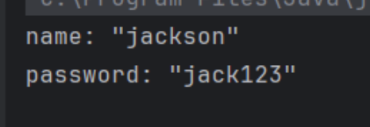

### 第二步：新增一种媒体类型yaml

默认支持xml和json两种媒体类型，要支持yaml格式的，需要新增一个yaml媒体类型，在springboot的配置文件中进行如下配置：

```properties
spring.mvc.contentnegotiation.media-types.yaml=text/yaml
```

注意，以上`types`后面的`yaml`是媒体类型的名字，名字随意，如果媒体类型起名为`xyz`，那么发送请求时的路径应该是这样的：http://localhost:8080/detail?format=xyz

### 第三步：自定义HttpMessageConverter

编写类`YamlHttpMessageConverter`继承`AbstractHttpMessageConverter`，代码如下：

```java
package com.powernode.springboot.config;

import com.fasterxml.jackson.databind.ObjectMapper;
import com.fasterxml.jackson.dataformat.yaml.YAMLFactory;
import com.fasterxml.jackson.dataformat.yaml.YAMLGenerator;
import com.powernode.springboot.bean.User;
import org.springframework.http.HttpInputMessage;
import org.springframework.http.HttpOutputMessage;
import org.springframework.http.MediaType;
import org.springframework.http.converter.AbstractHttpMessageConverter;
import org.springframework.http.converter.HttpMessageNotReadableException;
import org.springframework.http.converter.HttpMessageNotWritableException;

import java.io.IOException;
import java.nio.charset.Charset;

public class YamlHttpMessageConverter extends AbstractHttpMessageConverter<Object> {

    private ObjectMapper objectMapper = new ObjectMapper(new YAMLFactory().disable(YAMLGenerator.Feature.WRITE_DOC_START_MARKER));

    public YamlHttpMessageConverter() {
        // 让 消息转换器 和 媒体类型 application/yaml 绑定在一起。
        super(new MediaType("text", "yaml", Charset.forName("UTF-8")));
    }

    @Override
    protected boolean supports(Class<?> clazz) {
        // 表示User类型的数据支持yaml，其他类型不支持
        return User.class.isAssignableFrom(clazz);
    }

    // 处理 @RequestBody（将提交的yaml格式数据转换为java对象）
    @Override
    protected Object readInternal(Class<?> clazz, HttpInputMessage inputMessage) throws IOException, HttpMessageNotReadableException {
        return null;
    }

    // 处理 @ResponseBody（将java对象转换为yaml格式的数据）
    @Override
    protected void writeInternal(Object o, HttpOutputMessage outputMessage) throws IOException, HttpMessageNotWritableException {
        this.objectMapper.writeValue(outputMessage.getBody(), o);
        // 注意：spring框架会自动关闭输出流，无需程序员手动释放。
    }
}
```

### 第四步：配置消息转换器

重写`WebMvcConfigurer`接口的`configureMessageConverters`方法：

```java
package com.powernode.springboot.config;

import org.springframework.context.annotation.Configuration;
import org.springframework.http.converter.HttpMessageConverter;
import org.springframework.web.servlet.config.annotation.WebMvcConfigurer;

import java.util.List;

@Configuration
public class WebConfig implements WebMvcConfigurer {
    @Override
    public void configureMessageConverters(List<HttpMessageConverter<?>> converters) {
        converters.add(new YamlHttpMessageConverter());
    }
}
```

启动服务器并测试：http://localhost:8080/detail?type=yaml

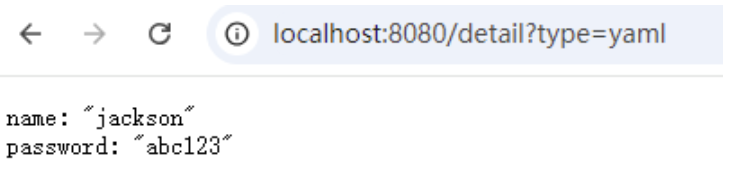

---