# 18. SpringBoot整合Thymeleaf

## 18.1 传统web应用和前后端分离

如果你是做前后端分离的项目，这一章节的内容将用不上。

现代开发大部分应用都会采用前后端分离的方式进行开发，前端是一个独立的系统，后端也是一个独立的系统，后端系统只给前端系统提供数据（JSON数据），不需要后端解析模板页面，前端系统拿到后端提供的数据之后，前端负责填充数据即可。因此这一章节内容作为了解。


传统的WEB应用（非前后端分离）：浏览器页面上展示成什么效果，后端服务器说了算，这是传统web应用最大的特点。

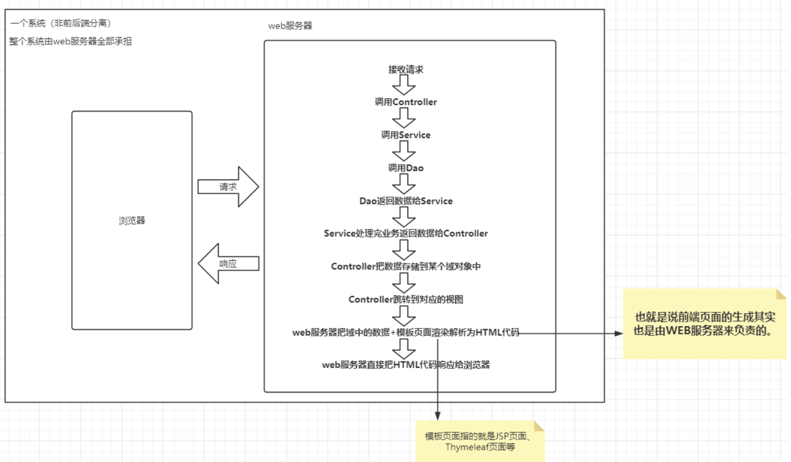

前后端分离的应用：前端是一个独立的系统，后端也是一个独立的系统，后端系统不再负责页面的渲染，后端系统只负责给前端系统提供开放的API接口，后端系统只负责数据的收集，然后将数据以JSON/XML等格式响应给前端系统。前端系统拿到接口返回的数据后，将数据填充到页面上。

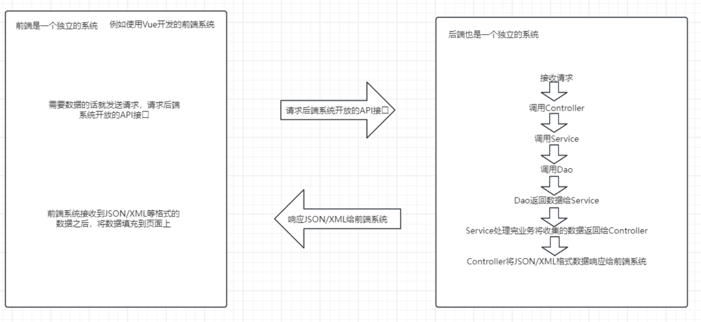

前后端分离的好处：

+ 职责清晰：前端专注于用户界面和用户体验，后端专注于业务逻辑和数据处理。
+ 开发效率高：前后端可以并行开发，互不影响，提高开发速度。
+ 可维护性强：代码结构更清晰，便于维护和扩展。
+ 技术栈灵活：前后端可以独立选择最适合的技术栈。
+ 响应式设计：前端可以更好地处理不同设备和屏幕尺寸。
+ 性能优化：前后端可以独立优化，提升整体性能。
+ 易于测试：前后端接口明确，便于单元测试和集成测试。


## 18.2 SpringBoot整合Thymeleaf

Java的模板技术有很多，SpringBoot支持以下的模板技术：

1. **Thymeleaf**：
   - **特点**：Thymeleaf 是一个现代的服务器端Java模板引擎，它支持HTML5，XML，TEXT，JAVASCRIPT，CSS等多种模板类型。它能够在浏览器中预览，这使得前端开发更加便捷。Thymeleaf 提供了一套强大的表达式语言，可以轻松地处理数据绑定、条件判断、循环等。
   - **优势**：**<font style="color:#DF2A3F;">与Spring框架集成良好，也是SpringBoot官方推荐的</font>**。
2. **FreeMarker**：
   - **特点**：FreeMarker 是一个用Java编写的模板引擎，主要用来生成文本输出，如HTML网页、邮件、配置文件等。它不依赖于Servlet容器，可以在任何环境中运行。
   - **优势**：模板语法丰富，灵活性高，支持宏和函数定义，非常适合需要大量定制化的项目。
3. **Velocity**：
   - **特点**：Velocity 是另一个强大的模板引擎，最初设计用于与Java一起工作，但也可以与其他技术结合使用。它提供了简洁的模板语言，易于学习和使用。
   - **优势**：轻量级，性能优秀，特别适合需要快速生成静态内容的应用。
4. **Mustache**：
   - **特点**：Mustache 是一种逻辑无感知的模板语言，可以用于多种编程语言，包括Java。它的设计理念是让模板保持简单，避免模板中出现复杂的逻辑。
   - **优势**：逻辑无感知，确保模板的简洁性和可维护性，易于与前后端开发人员协作。
5. **Groovy Templates**：
   - **特点**：Groovy 是一种基于JVM的动态语言，它可以作为模板引擎使用。Groovy Templates 提供了非常灵活的模板编写方式，可以直接嵌入Groovy代码。
   - **优势**：对于熟悉Groovy语言的开发者来说，使用起来非常方便，可以快速实现复杂逻辑。

这些模板技术各有千秋，选择哪一种取决于项目的具体需求和个人偏好。Spring Boot 对这些模板引擎都提供了良好的支持，通常只需要在项目中添加相应的依赖，然后按照官方文档配置即可开始使用。


<font style="color:#DF2A3F;">提醒：SpringBoot内嵌了Servlet容器（例如：Tomcat、Jetty等），使用SpringBoot不太适合使用JSP模板技术，因为SpringBoot项目最终打成jar包之后，放在jar包中的jsp文件不能被Servlet容器解析。</font>


要在SpringBoot中整合Thymeleaf，按照以下步骤操作：

**第一步：引入thymeleaf启动器**

```xml
<dependency>
  <groupId>org.springframework.boot</groupId>
  <artifactId>spring-boot-starter-thymeleaf</artifactId>
</dependency>
```

**第二步：编写配置文件，指定前缀和后缀（<font style="color:#DF2A3F;">默认不配置就是以下配置</font>）**

```properties
spring.thymeleaf.prefix=classpath:/templates/
spring.thymeleaf.suffix=.html
```

**第三步：编写控制器**

```java
package com.powernode.springboot.controller;

import org.springframework.stereotype.Controller;
import org.springframework.ui.Model;
import org.springframework.web.bind.annotation.GetMapping;
import org.springframework.web.bind.annotation.RequestParam;

// 不能使用 @RestController
@Controller
public class HelloController {

    @GetMapping("/h")
    public String helloThymeleaf(@RequestParam("name") String name, Model model) {
        // 将接收到的name数据存储到域对象中
        model.addAttribute("name", name);
        // 逻辑视图名
        return "hello"; // 最终的物理视图名：classpath:/templates/hello.html
    }
}
```


**第四步：编写thymeleaf模板页面**

```html
<!DOCTYPE html>
<html lang="en">
<head>
    <meta charset="UTF-8">
    <title>hello, thymeleaf</title>
</head>
<body>
<h1>hello,<span th:text="${name}"></span></h1>
</body>
</html>
```

启动服务器，测试地址为：http://localhost:8080/h


## 前后端分离, 先跳过了, 如果有需求再说

---

# 19. 异常处理

在controller层如果程序出现了异常，并且这个异常未被捕获，springboot提供的异常处理机制将生效。

Spring Boot 提供异常处理机制主要是为了提高应用的健壮性和用户体验。它的好处包括：

1. **统一错误响应**：可以定义全局异常处理器来统一处理各种异常，确保返回给客户端的错误信息格式一致，便于前端解析。
2. **提升用户体验**：能够优雅地处理异常情况，避免直接将技术性错误信息暴露给用户，而是显示更加友好的提示信息。
3. **简化代码**：开发者不需要在每个可能抛出异常的方法中重复编写异常处理逻辑，减少冗余代码，使业务代码更加清晰简洁。
4. **增强安全性**：通过控制异常信息的输出，防止敏感信息泄露，增加系统的安全性。

## 19.1 自适应的错误处理机制

springboot会根据请求头的Accept字段来决定错误的响应格式。

这种机制的好处就是：客户端设备自适应，提高用户的体验。

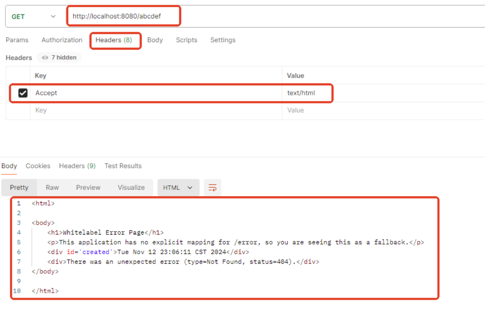


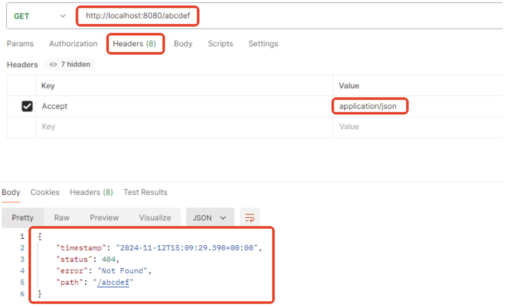

## 19.2 SpringMVC的错误处理方案

**<font style="color:#DF2A3F;">重点：如果程序员使用了SpringMVC的错误处理方案，SpringBoot的错误处理方案不生效。</font>**

### 19.2.1 局部控制 @ExceptionHandler

在控制器当中编写一个方法，方法使用@ExceptionHandler注解进行标注，凡是**这个控制器**当中出现了**对应的异常**，则走这个方法来进行异常的处理。局部生效。

```java
@RestController
public class UserController {

    @GetMapping("/resource/{id}")
    public String getResource(@PathVariable Long id){
        if(id == 1){
            throw new IllegalArgumentException("无效ID：" + id);
        }
        return "ID = " + id;
    }

    @ExceptionHandler(IllegalArgumentException.class)
    public String handler(IllegalArgumentException e){
        return "错误信息：" + e.getMessage();
    }
}

```

可以再编写一个OtherController，让它也发生`IllegalArgumentException`异常，看看它会不会走局部的错误处理机制。

```java
@RestController
public class OtherController {
    @GetMapping("/resource2/{id}")
    public String getResource(@PathVariable Long id){
        if(id == 1){
            throw new IllegalArgumentException("无效ID：" + id);
        }
        return "ID = " + id;
    }
}

```

通过测试，确实局部生效。

### 19.2.2 全局控制 @ControllerAdvice + @ExceptionHandler

也可以把以上局部生效的方法单独放到一个类当中，这个类使用@ControllerAdvice注解标注，凡是**任何控制器**当中出现了**对应的异常**，则走这个方法来进行异常的处理。全局生效。

将之前的局部处理方案的代码注释掉。使用全局处理方式，编写以下类：

```java
@ControllerAdvice
public class GlobalExceptionHandler {

    @ExceptionHandler(IllegalArgumentException.class)
    @ResponseBody
    public String handler(IllegalArgumentException e){
        return "错误信息：" + e.getMessage();
    }
}

```

通过测试，确实全局生效。

## 19.3 SpringBoot的错误处理方案

**<font style="color:#DF2A3F;">重点：如果SpringMVC没有对应的处理方案，会开启SpringBoot默认的错误处理方案。</font>**

SpringBoot默认的错误处理方案如下：

1. 如果客户端要的是json，则直接响应json格式的错误信息。
2. 如果客户端要的是html页面，则按照下面方案：

+ 第一步（精确错误码文件）：去`classpath:/templates/error/`目录下找`404.html, 500.html`等`精确错误码.html`文件。如果找不到，则去静态资源目录下的/error目录下找。如果还是找不到，才会进入下一步。
+ 第二步（模糊错误码文件）：去`classpath:/templates/error/`目录下找`4xx.html, 5xx.html`等`模糊错误码.html`文件。如果找不到，则去静态资源目录下的/error目录下找。如果还是找不到，才会进入下一步。
+ 第三步（通用错误页面）：去找`classpath:/templates/error.html`如果找不到则进入下一步。
+ 第四步（默认错误处理）：如果上述所有步骤都未能找到合适的错误页面，Spring Boot 会使用内置的默认错误处理机制，即 `/error` 端点。

## 19.4 如何在错误页获取错误信息

Spring Boot 默认会在模型Model中放置以下信息：

+ timestamp: 错误发生的时间戳
+ status: HTTP 状态码
+ error: 错误类型（如 "Not Found"）
+ exception: 异常类名
+ message: 错误消息
+ trace: 堆栈跟踪

在thymeleaf中使用 `${message}`即可取出信息。


注意：**<font style="color:#DF2A3F;">springboot3.3.5</font>**版本默认只向Model对象中绑定了`timestamp` ,`status`, `error`。如果要保存`exception`, `message`, `trace`，需要开启以下三个配置：

```plain
server.error.include-stacktrace=always
server.error.include-exception=true
server.error.include-message=always
```

## 19.5 前后端分离项目的错误处理方案

统一使用SpringMVC的错误处理方案，定义全局的异常处理机制：@ControllerAdvice + @ExceptionHandler

返回json格式的错误信息，其它的就不需要管了，因为前端接收到错误信息怎么处理是他自己的事儿。

## 19.6 服务器端负责页面渲染的项目错误处理方案

建议使用SpringBoot的错误处理方案：

1. 如果发生的异常是HTTP错误状态码：
   1. 建议常见的错误码给定`精确错误码.html`
   2. 建议不常见的错误码给定`模糊错误码.html`
2. 如果发生的异常不是HTTP错误状态码，而是业务相关异常：
   1. 在程序中处理具体的业务异常，自己通过程序来决定跳转到哪个错误页面。
3. 建议提供`classpath:/templates/error.html`来处理通用错误。

# 20. 国际化（了解）

在Spring Boot中实现国际化（i18n）是一个常见的需求，它允许应用程序根据用户的语言和地区偏好显示不同的文本。

## 20.1 实现国际化

### 第一步：创建资源文件

创建包含不同语言版本的消息文件。这些文件通常放在`src/main/resources`目录下，并且以`.properties`为扩展名。例如：

+ `messages.properties` (默认语言，如英语)
+ `messages_zh_CN.properties` (简体中文)
+ `messages_fr.properties` (法语)

每个文件都应包含相同的消息键，但值应对应于相应的语言。例如：

**messages.properties**:

```properties
welcome.message=Welcome to our application!
```

**messages_zh_CN.properties**:

```properties
welcome.message=欢迎来到我们的应用！
```

**messages_fr.properties**:

```properties
welcome.message=Bienvenue dans notre application !
```

### 第二步：在模板文件中取出消息

语法格式为：#{welcome.message}

```html
<!DOCTYPE html>
<html lang="en" xmlns:th="http://www.thymeleaf.org">
<head>
    <meta charset="UTF-8">
    <title>Title</title>
</head>
<body>
<h1 th:text="#{welcome.message}"></h1>
</body>
</html>
```

**测试1：浏览器默认的语言环境是中文时**


**测试2：将浏览器默认语言环境修改为法文**

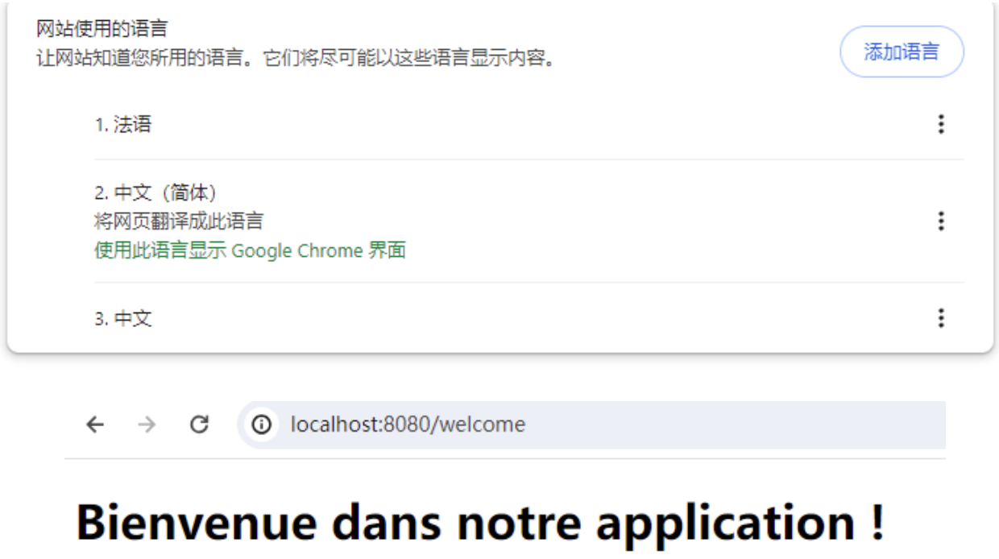

## 20.2 国际化实现原理

做国际化的自动配置类是：`MessageSourceAutoConfiguration`

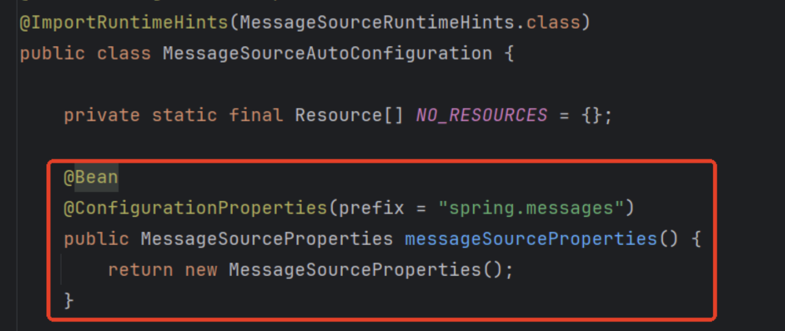

通过以上源码得知，国际化对应的配置前缀是：`spring.message`

例如在`application.properties`中进行如下配置：

```properties
# 配置国际化文件命名的基础名称
spring.messages.basename=messages

# 指定国际化信息的字符编码方式
spring.messages.encoding=UTF-8
```

注意：标准标识符：en_US 和 zh_CN 这样的标识符是固定的，不能更改。可以设置的是basename。

## 20.3 在程序当中如何获取国际化信息

在国际化自动配置类中可以看到这样一个Bean：MessageSource，它是专门用来处理国际化的。我们可以将它注入到我们的程序中，然后调用相关方法在程序中获取国际化信息。

```java
@Controller
public class MyController {

    @Autowired
    private MessageSource messageSource;

    @GetMapping("/test")
    @ResponseBody
    public String test(HttpServletRequest request){
        Locale locale = request.getLocale();
        String message = messageSource.getMessage("welcome.message", null, locale);
        return message;
    }
}
```

# 21. 定制web容器

## 21.1 web服务器切换为jetty

springboot默认嵌入的web服务器是Tomcat，如何切换到jetty服务器？

实现方式：排除Tomcat，添加Jetty依赖

**修改 **`pom.xml`**文件**：在 `pom.xml` 中，确保你使用 `spring-boot-starter-web` 并排除 Tomcat，然后添加 Jetty 依赖。

```xml
<!-- 排除 Tomcat -->
<dependency>
    <groupId>org.springframework.boot</groupId>
    <artifactId>spring-boot-starter-web</artifactId>
    <exclusions>
        <exclusion>
            <groupId>org.springframework.boot</groupId>
            <artifactId>spring-boot-starter-tomcat</artifactId>
        </exclusion>
    </exclusions>
</dependency>
<!-- 添加 Jetty 依赖 -->
<dependency>
    <groupId>org.springframework.boot</groupId>
    <artifactId>spring-boot-starter-jetty</artifactId>
</dependency>

```

## 21.2 web服务器切换原理

从哪里可以看出springboot是直接将tomcat服务器嵌入到应用中的呢？看这个类：`ServletWebServerFactoryAutoConfiguration`

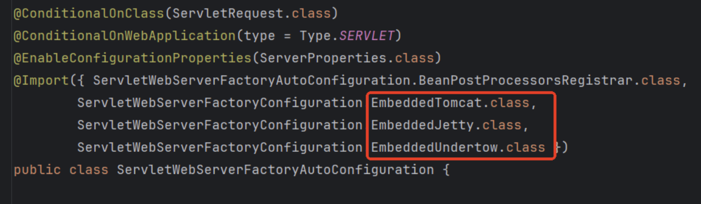

以上代码显示嵌入的是3个服务器。但并不是都生效，我们来看一下生效条件：

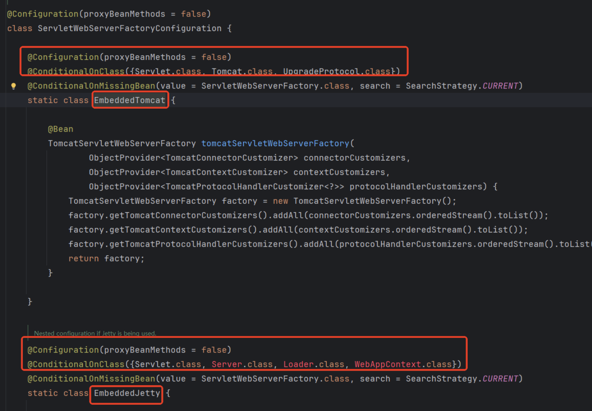

生效条件是，看类路径当中是否有对应服务器相关的类，如果有则生效。`spring-boot-web-starter`这个web启动器引入的时候，大家都知道，它间接引入的是tomcat服务器的jar包。因此默认Tomcat服务器被嵌入。如果想要切换web服务器，将tomcat相关jar包排除掉，引入jetty的jar包之后，jetty服务器就会生效，这就是切换web服务器的原理。

## 21.3 web服务器优化

通过以下源码得知，web服务器的相关配置和`ServerProperties`有关系：

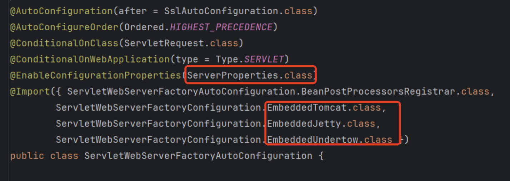

查看`ServerProperties`源码：

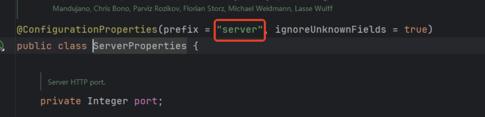

得知web服务器的配置都是以`server`开头的。


那么如果要配置tomcat服务器怎么办？要配置jetty服务器怎么办？请看一下源码

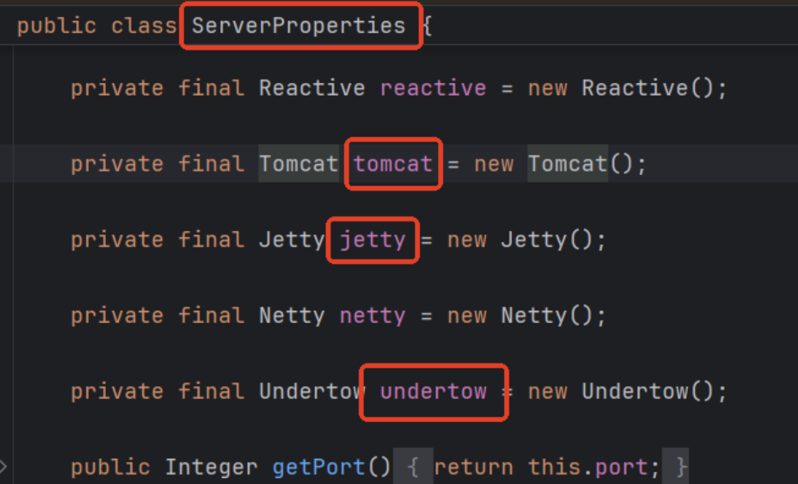

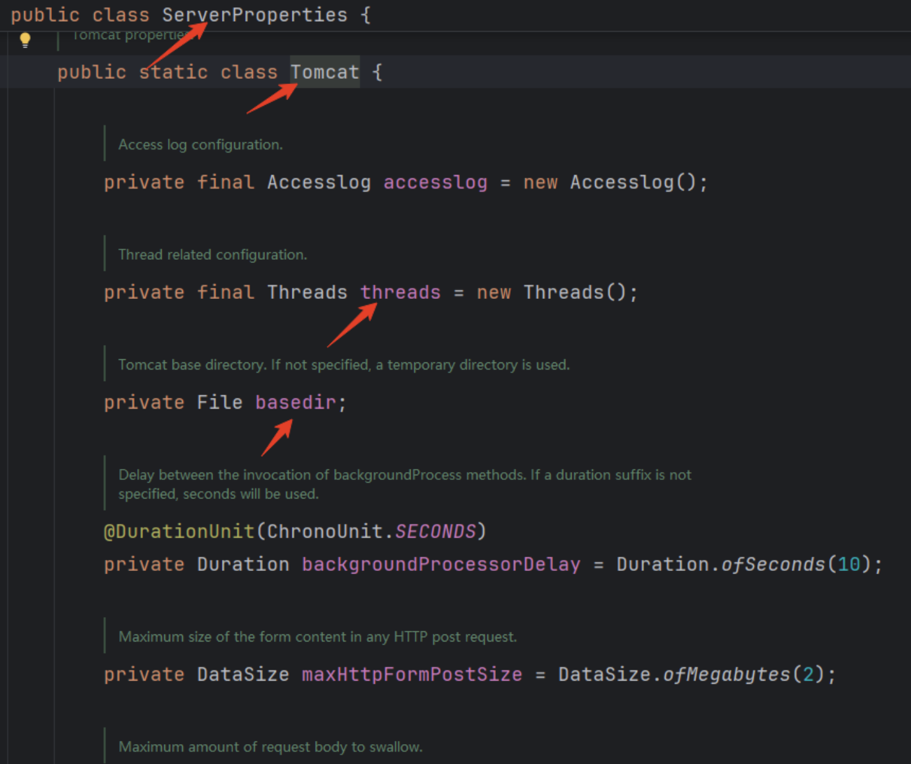

通过以上源码得知，如果要对tomcat服务器进行配置，前缀为：`server.tomcat`

如果要对jetty服务器进行配置，前缀为：`server.jetty`。


在以后的开发中关于tomcat服务器的常见优化配置有：

```properties
# 这个参数决定了 Tomcat 在接收请求时，如果在指定的时间内没有收到完整的请求数据，将会关闭连接。这个超时时间是从客户端发送请求开始计算的。
# 防止长时间占用资源：如果客户端发送请求后，长时间没有发送完所有数据，Tomcat 会在这个超时时间内关闭连接，从而释放资源，避免资源被长时间占用。
server.tomcat.connection-timeout=20000

# 设置 Tomcat 服务器处理请求的最大线程数为 200。
# 如果超过这个数量的请求同时到达，Tomcat 会将多余的请求放入一个等待队列中。
# 如果等待队列也满了（由 server.tomcat.accept-count 配置），新的请求将被拒绝，通常会返回一个“503 Service Unavailable”错误。
server.tomcat.max-threads=200

# 用来设置等待队列的最大容量
server.tomcat.accept-count=100

# 设置 Tomcat 服务器在空闲时至少保持 10 个线程处于活动状态，以便快速响应新的请求。
server.tomcat.min-spare-threads=10

# 允许 Tomcat 服务器在关闭后立即重新绑定相同的地址和端口，即使该端口还在 TIME_WAIT 状态
# 当一个网络连接关闭时，操作系统会将该连接的端口保持在 TIME_WAIT 状态一段时间（通常是 2-4 分钟），以确保所有未完成的数据包都能被正确处理。在这段时间内，该端口不能被其他进程绑定。
server.tomcat.address-reuse-enabled=true

# 设置 Tomcat 服务器绑定到所有可用的网络接口，使其可以从任何网络地址访问。
server.tomcat.bind-address=0.0.0.0

# 设置 Tomcat 服务器使用 HTTP/1.1 协议处理请求。
server.tomcat.protocol=HTTP/1.1

# 设置 Tomcat 服务器的会话(session)超时时间为 30 分钟。具体来说，如果用户在 30 分钟内没有与应用进行任何交互，其会话将被自动注销。
server.tomcat.session-timeout=30

# 设置 Tomcat 服务器的静态资源缓存时间为 3600 秒（即 1 小时），这意味着浏览器会在 1 小时内缓存这些静态资源，减少重复请求。
server.tomcat.resource-cache-period=3600

# 解决get请求乱码。对请求行url进行编码。
server.tomcat.uri-encoding=UTF-8

# 设置 Tomcat 服务器的基础目录为当前工作目录（. 表示当前目录）。这个配置指定了 Tomcat 服务器的工作目录，包括日志文件、临时文件和其他运行时生成的文件的存放位置。 生产环境中可能需要重新配置。
server.tomcat.basedir=.
```

# SpringBoot实用技术整合

# 22. logo设置

## 22.1 关闭logo图标

### 22.1.1 配置方式

```properties
spring.main.banner-mode=off
```

### 22.1.2 代码方式

第一种代码：

```java
@SpringBootApplication
public class Springboot322WebServerApplication {
    public static void main(String[] args) {
        SpringApplication springApplication = new SpringApplication(Springboot322WebServerApplication.class);
        springApplication.setBannerMode(Banner.Mode.OFF);
        springApplication.run(args);
    }
}
```

第二种代码：流式编程/链式编程

```java
new SpringApplicationBuilder()
                .sources(Springboot322WebServerApplication.class)
                .bannerMode(Banner.Mode.OFF)
                .run(args);
```

## 22.2 修改logo图标

在`src/main/resources`目录下存放一个`banner.txt`文件。文件名固定。

利用一些网站生成图标：

[https://www.bootschool.net/ascii](https://www.bootschool.net/ascii) （支持中文、英文）

[http://patorjk.com/software/taag/](http://patorjk.com/software/taag/) （只支持英文）

[https://www.degraeve.com/img2txt.php](https://www.degraeve.com/img2txt.php) （只支持图片）

获取图标粘贴到`banner.txt`文件中运行程序即可。

# 23. PageHelper整合

官网地址：[https://pagehelper.github.io/](https://pagehelper.github.io/)

## 23.1 引入依赖

```xml
<dependency>
    <groupId>com.github.pagehelper</groupId>
    <artifactId>pagehelper-spring-boot-starter</artifactId>
    <version>2.1.0</version>
</dependency>
```

## 23.2 编写代码

```java
@RestController
public class VipController {
    @Autowired
    private VipService vipService;
    
    @GetMapping("/list/{pageNo}")
    public PageInfo<Vip> list(@PathVariable("pageNo") Integer pageNo) {
        // 1.设置当前页码和每页显示的记录条数
        PageHelper.startPage(pageNo, Constant.PAGE_SIZE);
        // 2.获取数据（PageHelper会自动给SQL语句添加limit）
        List<Vip> vips = vipService.findAll();
        // 3.将分页数据封装到PageInfo
        PageInfo<Vip> vipPageInfo = new PageInfo<>(vips);
        return vipPageInfo;
    }
}
```

# 24. web层响应结果封装

对于前后端分离的系统来说，为了降低沟通成本，我们有必要给前端系统开发人员返回统一格式的JSON数据。多数开发团队一般都会封装一个`R`对象来解决统一响应格式的问题。

## 24.1 封装R对象

```java
@NoArgsConstructor
@AllArgsConstructor
@Data
@Builder
public class R<T> {

    private int code; // 响应的状态码
    private String msg; // 响应的消息
    private T data; // 响应的数据体

    // 用于构建成功的响应，不携带数据
    public static <T> R<T> OK() {
        return R.<T>builder()
                .code(200)
                .msg("成功")
                .build();
    }

    // 用于构建成功的响应，携带数据
    public static <T> R<T> OK(T data) {
        return R.<T>builder()
                .code(200)
                .msg("成功")
                .data(data)
                .build();
    }

    // 用于构建成功的响应，自定义消息，不携带数据
    public static <T> R<T> OK(String msg) {
        return R.<T>builder()
                .code(200)
                .msg(msg)
                .build();
    }

    // 用于构建成功的响应，自定义消息，携带数据
    public static <T> R<T> OK(String msg, T data) {
        return R.<T>builder()
                .code(200)
                .msg(msg)
                .data(data)
                .build();
    }

    // 用于构建失败的响应，不带任何参数，默认状态码为400，消息为"失败"
    public static <T> R<T> FAIL() {
        return R.<T>builder()
                .code(400)
                .msg("失败")
                .build();
    }

    // 用于构建失败的响应，自定义状态码和消息
    public static <T> R<T> FAIL(int code, String msg) {
        return R.<T>builder()
                .code(code)
                .msg(msg)
                .build();
    }
}

```

## 24.2 改进R对象

以上`R`对象存在的问题是，难以维护，项目中可能会出现很多这样的代码：R.FAIL(400, "修改失败")。


引入枚举类型进行改进：

```java
@NoArgsConstructor
@AllArgsConstructor
public enum CodeEnum {

    OK(200, "成功"),
    FAIL(400, "失败"),
    BAD_REQUEST(400, "请求错误"),
    NOT_FOUND(404, "未找到资源"),
    INTERNAL_ERROR(500, "内部服务器错误"),
    MODIFICATION_FAILED(400, "修改失败"),
    DELETION_FAILED(400, "删除失败"),
    CREATION_FAILED(400, "创建失败");

    @Getter
    @Setter
    private int code;
    @Getter
    @Setter
    private String msg;
}
```

改进R：

```java
@NoArgsConstructor
@AllArgsConstructor
@Data
@Builder
public class R<T> {

    private int code; // 响应的状态码
    private String msg; // 响应的消息
    private T data; // 响应的数据体

    // 用于构建成功的响应，不携带数据
    public static <T> R<T> OK() {
        return R.<T>builder()
                .code(CodeEnum.OK.getCode())
                .msg(CodeEnum.OK.getMsg())
                .build();
    }

    // 用于构建成功的响应，携带数据
    public static <T> R<T> OK(T data) {
        return R.<T>builder()
                .code(CodeEnum.OK.getCode())
                .msg(CodeEnum.OK.getMsg())
                .data(data)
                .build();
    }

    // 用于构建失败的响应，不带任何参数，默认状态码为400，消息为"失败"
    public static <T> R<T> FAIL() {
        return R.<T>builder()
                .code(CodeEnum.FAIL.getCode())
                .msg(CodeEnum.FAIL.getMsg())
                .build();
    }

    // 用于构建失败的响应，自定义状态码和消息
    public static <T> R<T> FAIL(CodeEnum codeEnum) {
        return R.<T>builder()
                .code(codeEnum.getCode())
                .msg(codeEnum.getMsg())
                .build();
    }
}

```

# 25. 事务管理

SpringBoot中的事务管理仍然使用的Spring框架中的事务管理机制，在代码实现上更为简单了。不需要手动配置事务管理器，SpringBoot自动配置完成了。我们只需要使用`@Transactional`注解标注需要控制事务的方法即可。另外事务的特性等仍然延用Spring框架。大家可以在老杜发布的Spring视频教程中详细学习事务管理机制。以下代码是在SpringBoot框架中进行的事务控制：

```java
@Transactional(rollbackFor = Exception.class, propagation = Propagation.REQUIRED)
@Service
public class AccountServiceImpl implements AccountService {

    @Autowired
    private AccountMapper accountMapper;

    @Override
    public void transfer(String fromActNo, String toActNo, double money) {
        Account fromAct = accountMapper.selectByActNo(fromActNo);
        if(fromAct.getBalance() < money){
            throw new TransferException("余额不足");
        }
        Account toAct = accountMapper.selectByActNo(toActNo);
        fromAct.setBalance(fromAct.getBalance() - money);
        toAct.setBalance(toAct.getBalance() + money);
        int count = accountMapper.update(fromAct);
        if(1 == 1){
            throw new TransferException("转账失败");
        }
        count += accountMapper.update(toAct);
        if(count != 2){
            throw new TransferException("转账失败！");
        }
    }
}
```

我们只需要在需要控制事务的方法上，或者类上，使用`@Transactional`注解进行标注即可。然后事务的特性和之前Spring中是完全相同的。最重要的是其他的配置我们一律是不需要的。

# 26. SpringBoot打war包

第一步：将打包方式设置为war

```xml
<packaging>war</packaging>
```

第二步：排除内嵌tomcat

```xml
<dependency>
    <groupId>org.springframework.boot</groupId>
    <artifactId>spring-boot-starter-web</artifactId>
    <!--内嵌的tomcat服务器排除掉-->
    <exclusions>
        <exclusion>
            <groupId>org.springframework.boot</groupId>
            <artifactId>spring-boot-starter-tomcat</artifactId>
        </exclusion>
    </exclusions>
</dependency>
```

第三步：添加servlet api依赖（引入tomcat，但scope设置为provided，这样这个tomcat服务器就不会打入war包了）

```xml
<!--额外添加一个tomcat服务器，实际上是为了添加servlet api。scope设置为provided表示这个不会被打入war包当中。-->
<dependency>
    <groupId>org.springframework.boot</groupId>
    <artifactId>spring-boot-starter-tomcat</artifactId>
    <scope>provided</scope>
</dependency>
```

第四步：修改主类

```java
@MapperScan(basePackages = "com.powernode.transaction.repository")
@SpringBootApplication
public class Springboot324TransactionApplication extends SpringBootServletInitializer{

    @Override
    protected SpringApplicationBuilder configure(SpringApplicationBuilder application) {
        return application.sources(Springboot324TransactionApplication.class);
    }

    public static void main(String[] args) {
        SpringApplication.run(Springboot324TransactionApplication.class, args);
    }

}
```

第五步：执行package命令打war包

第六步：配置tomcat环境，将war包放入到webapps目录下，启动tomcat服务器，并访问。

# 27. SpringBoot日志处理

## 27.1 日志概述

日志记录是一种关键的技术实践，用于捕捉软件运行时的信息、警告、错误以及其他重要数据。通过分析日志文件，开发人员、测试工程师和运维团队可以深入了解应用程序的行为，快速定位并解决出现的问题，同时对系统性能进行监控与优化。

虽然在开发初期或简单的应用场景下，使用 `System.out.println("记录日志...")` 这样的方式来输出信息非常直接且易于实现，但在生产环境中的大型或复杂应用中，这种方式存在诸多不足：

1. **性能问题：**频繁地调用 `System.out.println()` 会占用额外的CPU资源，尤其是在高并发场景下，可能会影响应用程序的性能。
2. **日志管理不便：**控制台输出的日志不易于长期保存和检索，也不便于与其他工具集成以进行更高级的日志分析。
3. **缺乏灵活性：**通过 `System.out.println()` 输出的信息通常难以调整其格式、级别（如DEBUG, INFO, WARN, ERROR）或输出目标（例如文件、数据库、远程服务器等）。
4. **安全性和隐私：**在某些情况下，直接打印敏感信息可能会泄露用户的个人数据或公司的商业秘密。

因此，在实际的线上项目中，推荐采用专业的日志框架，它们提供了更为强大和灵活的日志处理能力：

- 支持多种日志级别，允许开发者根据需要过滤日志信息。
- 可配置的日志输出格式，使日志更加规范易读。
- 支持将日志写入不同的目的地，如文件、数据库、网络服务等。
- 提供异步日志功能，减少日志记录对应用性能的影响。
- 能够与各种监控系统集成，支持实时告警和问题追踪。

## 27.2 Java中的日志框架

Java语言中存在多种日志框架，每种框架都有其特点和适用场景。

### 27.2.1 抽象的日志框架

什么是抽象的日志框架？编译阶段可以使用这些抽象的日志框架，能够正常编译通过，但运行阶段必须提供具体的日志框架，这样做的目的是：具体的日志框架可灵活切换。

- **SLF4J (Simple Logging Facade for Java)**
  - **简介：**SLF4J不是一个具体的日志实现，而是一个简单的抽象层，允许开发者在应用程序中使用统一的日志API，而实际的日志实现可以在部署时决定。
  - **特点：**提供了统一的日志记录接口，使得日志框架的选择更加灵活，易于切换不同的日志实现，减少了应用程序对特定日志框架的依赖。
  - **运行时可绑定的具体日志框架：**Log4j、Log4j2、Logback、JUL。
- **Commons Logging (Jakarta Commons Logging)**
  - **简介：**Commons Logging是Apache Jakarta项目的一部分。也是一种日志层面的抽象。
  - **特点：**允许在运行时动态选择日志实现，但因类加载机制的问题，有时会导致难以预料的行为，因此不如SLF4J受欢迎。
  - **运行时可绑定的具体日志框架：**Log4j、Log4j2、Logback、JUL。

### 27.2.2 具体的日志框架

- **Log4j**（太老，没人用了）
  - **简介：**Log4j是Apache软件基金会的一个开源项目，它提供了强大的日志记录功能，支持多种日志级别（如DEBUG, INFO, WARN, ERROR, FATAL）、灵活的日志输出格式和目的地配置。
  - **特点：**易于配置和使用，支持日志滚动策略，适用于中小规模的应用。
- **Log4j 2**
  - **简介：**Log4j 2是Log4j的下一代版本，旨在解决原版的一些性能瓶颈和设计缺陷。
  - **特点：**性能更优，支持插件化配置，增强了安全性，支持异步日志记录，减少了线程间的竞争，提高了日志记录的速度。
- **Logback**
  - **简介：**Logback是Log4j的创始人Ceki Gülcü开发的另一个日志框架，设计之初就考虑到了性能和可靠性。
  - **特点：**与SLF4J无缝集成，提供了比Log4j更好的性能表现，支持自动重载配置文件，具有更简洁的API和更少的bug。
- **JUL (Java Util Logging)**
  - **简介：**JUL是Java SE平台自带的日志框架，从Java 1.4版本开始提供。
  - **特点：**不需要额外的库文件，配置相对简单，适合小型应用。然而，相对于其他流行的日志框架，JUL的功能较为有限，配置不够灵活。

这些日志框架各有优势，选择哪一种取决于项目的具体需求、团队的偏好以及现有的技术栈。例如，对于需要高性能和灵活配置的应用，Logback或Log4j 2可能是更好的选择；而对于希望减少对外部库依赖的小型项目，JUL可能更为合适。

**SpringBoot框架默认使用的日志框架是：Logback。**

## 27.3 日志级别概述

在Java的日志框架中，日志级别（Log Level）是用来指定日志记录的严重程度的一个标准。不同的日志级别代表了不同的重要性和紧急程度，这有助于开发者根据实际需要来过滤和关注特定类型的日志信息。

常见的日志级别从低到高通常包括以下几种：

1. **TRACE**：这是最低级别的日志信息，用于记录最详细的信息，通常是在调试应用时使用。
2. **DEBUG**：用于记录程序运行时的详细信息，比如变量的值、进入或退出某个方法等，主要用于开发阶段的调试。
3. **INFO**：记录应用程序的一般信息，如系统启动、服务初始化完成等，表示程序运行正常。
4. **WARN**：警告信息，表示可能存在问题或者异常的情况，但是还不至于导致应用停止工作。
5. **ERROR**：错误信息，表示发生了一个错误事件，该错误可能会导致某些功能无法正常工作。

通过设置不同的日志级别，可以在生产环境中控制输出的日志量，从而减少对性能的影响。例如，

- 在生产环境中，我们可能会将日志级别设置为 `INFO` 或更高级别，以避免输出过多的调试信息；
- 而在开发或测试环境中，则可以将日志级别降低至 `DEBUG` 甚至 `TRACE`，以便于进行详细的错误追踪和调试。

**日志级别从低到高的排序是：TRACE < DEBUG < INFO < WARN < ERROR**

级别越低，打印的日志信息越多。**SpringBoot默认的日志级别是INFO。**

开发环境下可以打印多一些，一般是用INFO级别。

生产环境下要严格控制，因为日志级别越低，磁盘空间受不了。

SpringBoot默认将日志打印到控制台。（通过配置可以改变打印到日志文件）

## 27.4 更改日志级别

测试日志级别：使用Lombok的 `@Slf4j` 注解自动维护一个 `log` 对象：

```java
@Slf4j
@SpringBootApplication
public class TestApplication {

    public static void main(String[] args) {
        SpringApplication.run(TestApplication.class, args);
        log.trace("trace级别日志");
        log.debug("debug级别日志");
        log.info("info级别日志");
        log.warn("warn级别日志");
        log.error("error级别日志");
    }

}
```

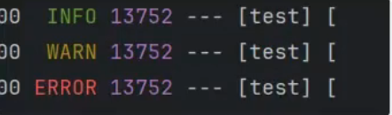

可以看到默认情况下，SpringBoot默认的日志隔离级别是INFO，因此：**INFO，WARN，ERROR**三个级别的日志都会打印。

调整日志级别只需要改配置信息就行

```properties
logging.level.root=DEBUG
```

## 27.5 丰富启动日志

```properties
trace=true
debug=true
```

这两个配置项主要影响Spring Boot框架本身的启动日志和跟踪信息，不影响你在应用程序中编写的日志记录。

- `debug=true`：启用Spring Boot的调试模式，增加启动日志的详细程度并显示自动配置报告。
- `trace=true`：启用Spring Boot的启动跟踪，生成包含启动信息的详细跟踪文件，内容是包含 `debug=true` 输出的内容的。

并且以上两个配置在SpringBoot框架启动完成之后，不再有任何作用。

## 27.6 日志的粗细粒度

```properties
# 设置根日志级别为 INFO (整个项目都使用INFO日志级别, 这是粗粒度的配置)
logging.level.root=INFO

# 为特定的包设置日志级别为 DEBUG
logging.level.com.powernode=DEBUG

# 为特定的类设置日志级别为 TRACE
logging.level.com.powernode.MyService=TRACE
```

怎么在项目中打印SQL语句？可以进行如下配置：

```properties
logging.level.root=INFO
logging.level.com.powernode.mapper=DEBUG
```

## 27.7 日志输出到文件

如果日志要输出文件，可以进行如下配置：

```properties
logging.file.path=./log/
```

以上配置表示将日志文件输出到当前工程根目录下的 `log` 目录当中，文件名默认叫做 `spring.log`。并且文件名不可设置。

```properties
logging.file.name=my.log
```

以上的配置表示在工程的根目录下直接生成 `my.log` 文件。并且路径不可设置。

**注意：以上两个配置同时存在时，只有 `logging.file.name` 生效。本质上两个配置不可共存。其实这是spring boot框架的一个小bug。**

## 27.8 滚动日志

滚动日志是一种日志管理机制，用于防止日志文件无限增长，通过将日志文件分割成多个文件，每个文件只包含一定时间段或大小的日志记录。滚动日志可以帮助你更好地管理和维护日志文件，避免单个日志文件过大导致难以处理。

```properties
# 日志文件达到多大时进行归档
logging.logback.rollingpolicy.max-file-size=100MB

# 所有的归档日志文件总共达到多大时进行删除，默认是0B表示不删除
logging.logback.rollingpolicy.total-size-cap=50GB

# 归档日志文件最多保留几天
logging.logback.rollingpolicy.max-history=60

# 启动项目时是否要清理归档日志文件
logging.logback.rollingpolicy.clean-history-on-start=false

# 归档日志文件名的格式
logging.logback.rollingpolicy.file-name-pattern=${LOG_FILE}.%d{yyyy-MM-dd}.%i.gz
```

## 27.9 日志框架切换

在实际开发中也可能会切换日志框架，按照如下配置进行切换：先排除掉，再添加

```xml
<dependency>
    <groupId>org.springframework.boot</groupId>
    <artifactId>spring-boot-starter-web</artifactId>
    <exclusions>
        <!--排除掉默认的日志依赖-->
        <exclusion>
            <groupId>org.springframework.boot</groupId>
            <artifactId>spring-boot-starter-logging</artifactId>
        </exclusion>
    </exclusions>
</dependency>

<!--使用Log4j2日志依赖-->
<dependency>
    <groupId>org.springframework.boot</groupId>
    <artifactId>spring-boot-starter-log4j2</artifactId>
</dependency>
```

**注意：一旦切换到Log4j2的日志框架，对于之前的配置来说，只有logback的滚动日志不再生效，其他配置仍然生效。如果要在log4j2中进行滚动日志，需要编写log4j2相关的xml配置文件，比较麻烦。**

